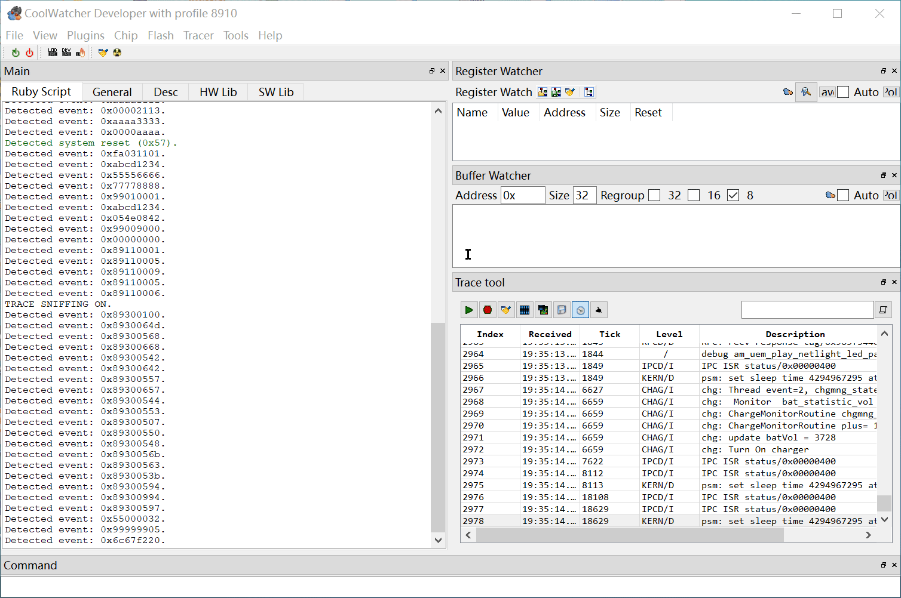
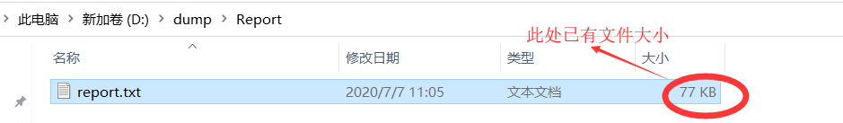
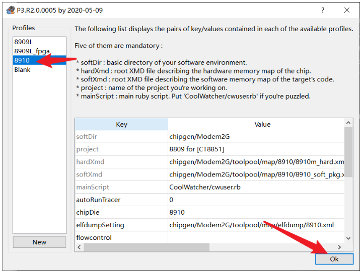

# 抓取底层日志方法

## 简介

抓取调试日志是最常用的调试手段之一，合宙Cat.1模块日志类型分为3种：

1. 应用层日志：用户应用脚本和lib的部分打印，主要用来调试业务层的一些问题。大部分可以由用户自行查看分析。
2. 底层AP日志：底包core层的调试日志，这个日志通常只能由官方技术人员来进行分析。
3. 底层CP日志：网络协议栈的调试日志，这个日志通常只能由官方技术人员来进行分析。

日志的输出接口可以由Cat.1模块的USB口，Hostuart口进行输出调试日志。抓日志的工具大部分情况下用luatool调试工具就可以。

## 利用Luatools_v2工具抓底层日志

合宙官方调试工具**Luatools_v2**，除了可以进行升级固件操作，还可以用来抓取底层的日志，详细操作如下：

1. 下载并安装[luatoolsV2](https://doc.openluat.com/wiki/27?wiki_page_id=3038)后打开，并且允许工具升级。

2. 安装[USB驱动](https://doc.openluat.com/wiki/27?wiki_page_id=3036)。

3. 用USB线直接连接模块的USB管脚到PC的USB接口。

4. 建议禁用电脑RNDIS，再打开luatools，勾选4G USB打印。

5. 给模块上的会自动有打印。

6. 在选项中做如下修改。

7. 在**luatool v2\log\4gdiag**目录下可以看到正在自动生成**.bin**和**.tra**文件，大小正在增加说明正在生成底层日志。
   需要停止，只需要关闭luatool即可（其中**.bin**为AP日志，**.tra**为CP日志）。

## 利用HOST UART接口抓AP日志

在一些应用场合，USB被占用了，无法通过USB在抓底层日志的情况下，还可以通过**HOST UART**接口抓取AP日志，步骤如下：

1. 下载[cooltool](http://openluat-erp.oss-cn-hangzhou.aliyuncs.com/erp_site_file/product_file/[非量产版本]sw_file_20210426163005_cooltools-win32_custom_2020-05-09-6c0c5e17.7z)工具

2. 用USB转TTL数据线连接模块的UART1管脚（用来发送AT命令打开HOST日志功能）

3. 模块开机后，通过串口工具发**AT^TRACECTRL=0,1,1**这个指令，将日志打开之后关机
   ==注意：**AT^TRACECTRL=0,1,1**是永久生效的，可以断电保存==
   **AT^TRACECTRL**的指令说明如下：
   

4. 用USB转TTL数据线连接模块的**HOST UART**管脚（抓取AP日志）

5. 打开**cooltool**

6. 打开trace栏

7. 模块开机，日志会在trace栏中打印出来

8. 抓到想要的日志后，点击保存即可

9. **coolwatcher** 保存日志为bin文件，再打开时间不对，trc格式文件正常，默认保存trc格式

## 利用ZSP_UART口抓取CP日志

在USB被占用的情况下同样可以通过**ZSP_UART**串口来抓取日志，步骤如下：

1. 准备工作：

- 高速串线，由于**ZSP_UART**固定波特率8000000，所以切记要选择高速的串口芯片，这里建议使用**FT4232**串口芯片。
- 抓日志的专用工具：[ArmTracer_V6.1.5_User.7z](https://cdn.openluat-luatcommunity.openluat.com/attachment/20201111155639752_ArmTracer_V6.1.5_User.7z)

2. 找到模块的**ZSP_UART_TXD**管脚，这个专门的CP日志输出串口，不能用于其他用处，只有TX，没有RX，但这就够了，管脚如下所示：

​	Air724UG:

3. 通过通用串口（可以是UART1或者USB虚拟的AT串口）发AT指令 **AT^TRACECTRL=1,1,0**

   ==注意：**AT^TRACECTRL=1,1,0**是永久生效的，可以断电保存==
   **AT^TRACECTRL**的指令说明如下：
   
4. 打开**ArmTracer **做如下设置

==注意：其他的设置保持不变==

5. 点击开始后，设置好日志保存路径

6. 点击OK后，会看到有日志打印出来

7. 保持运行，直到设备出现想要的异常现象后，点击停止打印，然后日志会自动保存在之前设置好的路径下面

# 死机dump数据方法

客户在使用8910系列模块开发调试中，有时候会遇到模块异常重启的问题，而客户无法根据现场日志信息解决异常时，可能需要dump异常现场数据给合宙技术人员分析。本章主要介绍一下如何dump现场数据。

## 代码准备工作

合宙官方对外正式发布的固件，无论是AT版本还是Lua版本， 默认配置为自动重启模式，意味着一旦出现异常，会自动重启。

在自动重启模式下，用户无法dump现场数据，所以首先要做的是：把固件配置为死机模式，配置为死机模式后，一旦再出现异常，不再自动重启，用户就有充足的时间来dump现场信息。

那么如何配置为死机模式呢，有如下两种方法：

（1）AT版本和Lua版本有稍许差别

AT版本：MCU通过4G模块的AT口发送**AT*EXASSERT=1**命令

Lua版本：在**main.lua**的**sys.init(…)**前增加一行代码**ril.request(“AT*EXASSERT=1”)**

（2）PC上通过串口工具向4G模块USB口映射出的**LUAT USB Device1 AT**口发送**AT*EXASSERT=1**命令

==注意：==

1. 无论使用何种方法，每次开机（无论是正常开机还是异常开机）都要重新配置一次，鉴于此，推荐使用第（1）种方法，可以在程序中自动处理
2. 为保证万无一失，配置后，PC上通过串口工具向4G模块USB口映射出的AT口发送**AT*EXASSERT?**命令查询是否配置成功，如果返回**EXASSERT: 1**表示配置成功
3. 问题解决之后，所用测试模块，一定要再次配置为自动重启模式，配置方法是发送**AT*EXASSERT=0**命令，配置后重启，发送**ATEXASSERT?**命令查询是否配置成功，如果返回**EXASSERT: 0**表示配置成功；为了防止遗忘，用户在正式发布的程序中，可以在开机初始化时发送**ATEXASSERT=0**命令

代码配置成功后，我们就可以使用模块的**host口（可以通过模块的硬件原理图查找具体位置飞线用串口线连接）**dump现场数据

==注：==连接host的串口线必须是FT232的串口线

## 使用coolwatcher工具dump现场数据

1. 下载**coolwatcher**工具

​	链接：https://pan.baidu.com/s/17sGt992xQ161bLvESeCyPQ

​	提取码：40ws

​	下载直接解压使用即可（无需安装）

2. 运行配置**coolwatcher**工具

   （1）解压下载下来的**coolwatcher**压缩包，并找到**coolwatcher.exe**文件

​	（2）双击运行后，按下图配置

​	（3） 点击ok，进入**coolwatcher**工作界面

​	（4）然后根据如下步骤配置

​	（5）这时会弹出配置窗口，配置如下：

​	==注：==elf文件在模块使用的固件版本对应的map文件中解压所得，

​	比如此处模块固件是**sw_file_20200622191350_Luat_V0016_RDA8910_TTS.pac**，找到对应的map文件下载解压即可，如图所示：

​	（6） 配置好后，点击start，开始dump数据，传输数据过程如下图所示（这个过程可能会持续7、8分钟，请耐心等待）

​	（7）当出现下图所示，说明数据dump完成

​	（8）此时，我们可以在上图中设置的**Output Directory**路径找到dump出来的数据，将全部文件打包压缩提供给技术人员分析就好，

​		我这里存放的路径是：D:\dump ,dump出来的数据如下图所示：

==注意：==打包发出去之后，将此目录下的这些文件删除，避免下次dump时，文件重名导致不必要的麻烦

## 补充说明

1. 当有的时候模块会因为内存不足出现死机问题时，我们不仅需要dump死机数据，还需要把内存数据也给同时导出来，如下图所示：

2. 操作步骤：

​	依次点开**Tools–>Heap Report(new)**打开配置界面，并按照下图配置，elf文件获取方式在上文已经提到，不在赘述。

​	点击start，即可以开始导出数据，当出现下图所示，表示导出完毕。

​	这时候，我们可以查看保存路径中的文件，如下图所示，已经导出成功。

# 通过AP日志分析网络交互数据方法

## 工具准备

- [LUA Tool下载链接](https://cdn.openluat-luatcommunity.openluat.com/attachment/20200808182655634_Luatools_v2.exe)
- [cool watcher下载链接](http://openluat-erp.oss-cn-hangzhou.aliyuncs.com/erp_site_file/product_file/[非量产版本]sw_file_20210426163005_cooltools-win32_custom_2020-05-09-6c0c5e17.7z)
- [wire shark下载链接](https://www.wireshark.org/download.html)

## 操作步骤

1. 以空中升级为例，分析模块空中升级的HTTP请求。
2. 打开**Luatools**软件并重启模块（为重新获取一次完整日志，问题复现后关闭**Luatools**，以避免产生干扰日志不方便查找）。
3. 资源管理器中进入**Luatools**所在目录，**->log->4gdiag**。找到最近一次**Luatools**保存的bin文件。
4. 打开**cool watcher**，选择8910。

5. **Plugins->Activate Tracer**

6. 设置日志自动保存，**Trace tool->set trace levels**

7. 勾选**Save Pcap**

8. 加载**Luatools**保存的日志文件

9. 选择打开，在**Luatools**所在的文件夹中**->log->4gdiag**保存的**.bin**文件

10. 加载完成后，可在**coolwatcher**的日志文件夹中找到**.cap**文件。**coolwatcher**所在文件夹**->logs->cap**

11. 使用**wireshark**即可以打开**cap**文件

