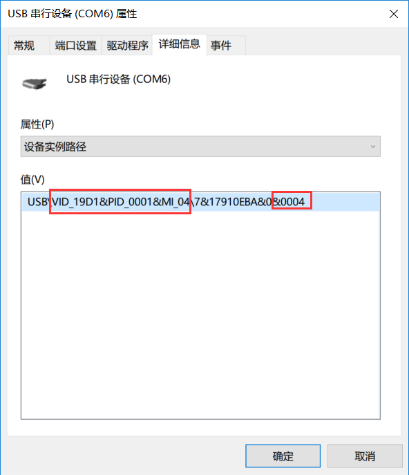
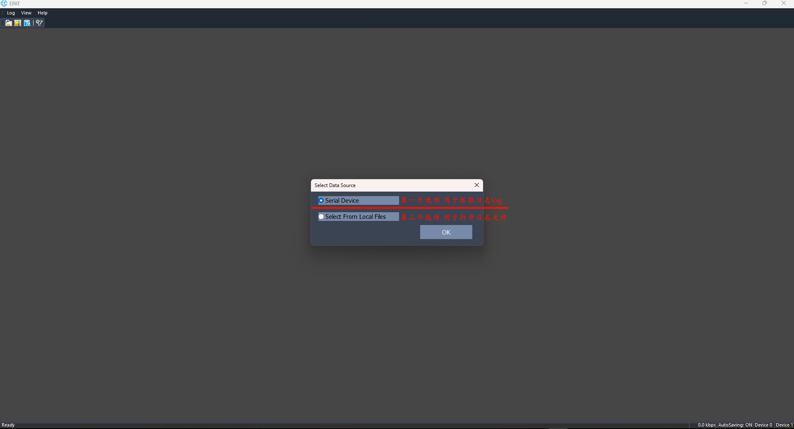
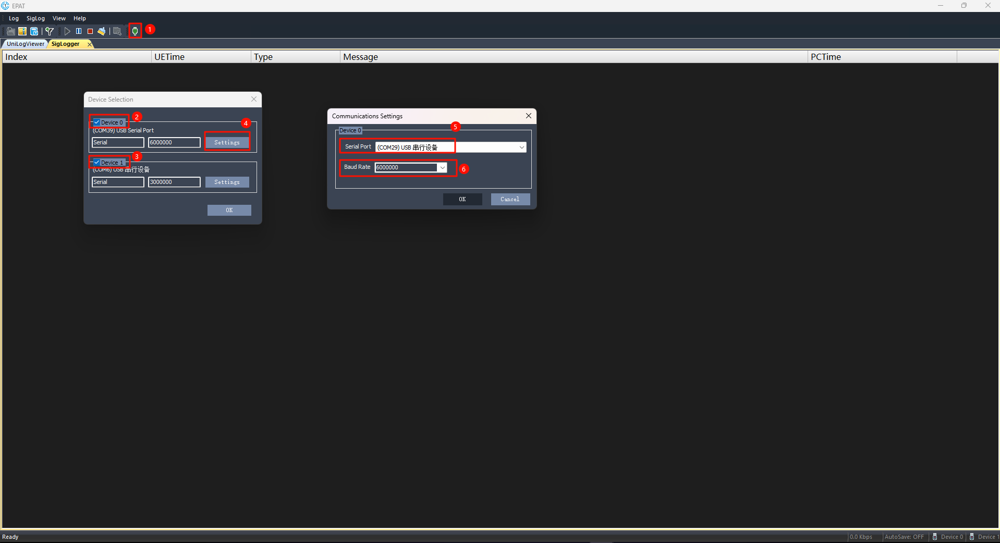
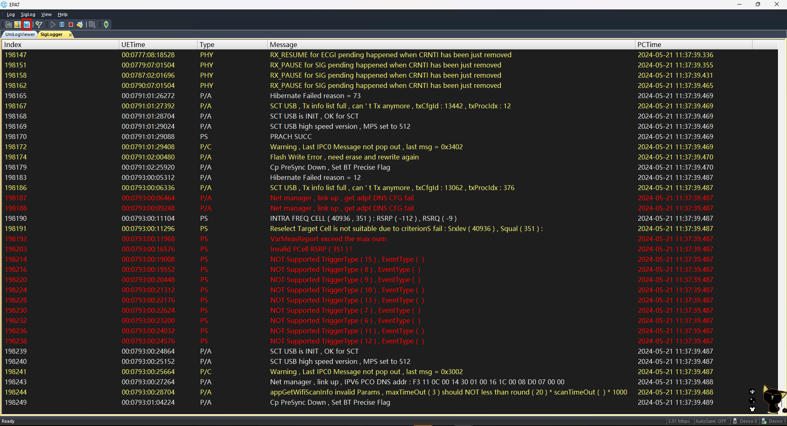
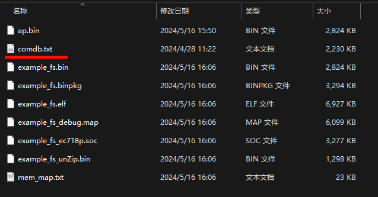
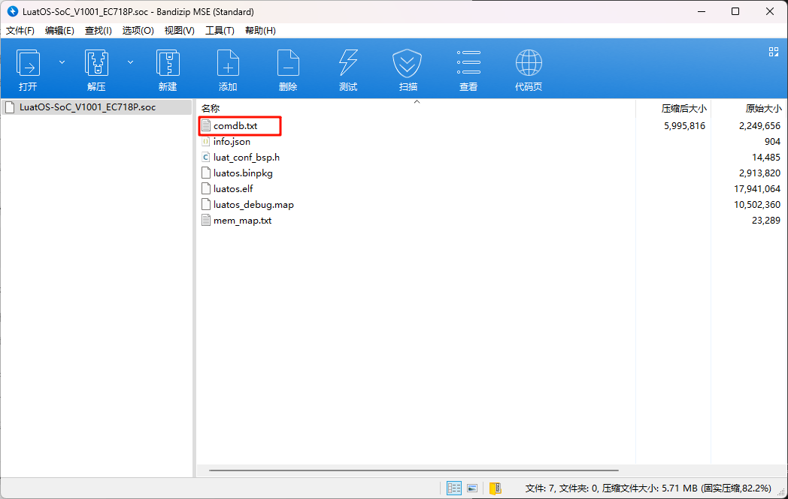
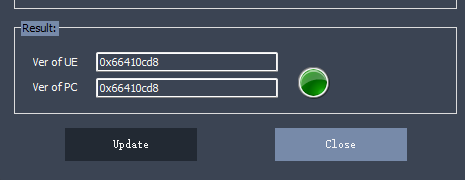
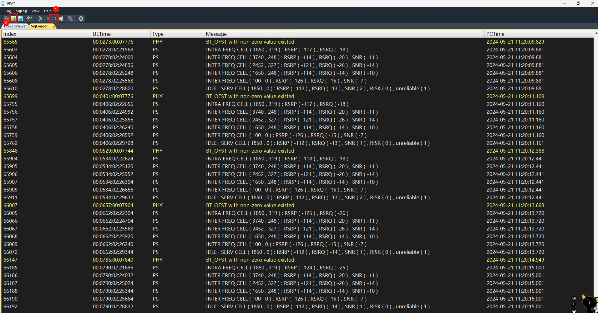

# 底层日志抓取调试工具

# 简介

>
> - 本文档适用于Air780E、Air780EP、Air780EQ、Air201
>
> - 工具下载地址
>     - [芯片原厂 EPAT log工具 EPAT_V1.3.262.573](https://cdn.openluat-luatcommunity.openluat.com/attachment/20240204134335482_EPAT_V1.3.262.573.zip)
>​ EPAT 原厂的工具使用教程在EPAT软件 **Manual** 目录中
>
>     - [trace32下载链接](https://repo.lauterbach.com/download_trace32.html)
>​ 用于查看死机**dump**信息；​如果是win64系统，可以直接点击链接下载：[TRACE32_R_2023_02.7z](https://cdn.openluat-luatcommunity.openluat.com/attachment/20231020110250237_TRACE32_R_2023_02.7z)
>

## 日志输出端口

1、USB的虚拟端口其中有一个为底层日志的输出端口。可从设备管理器端口属性中根据“设备实例路径”中的值锁定到底层日志输出端口。

**（建议使用USB来抓取日志，USB虚拟端口输出速率很高，所以基本不会出现丢日志的现象）**

2、模块 **DBG_UART**串口默认以**3M**波特率输出底层日志，输出的数据要通过原厂的EPAT工具解析展现。

## EPAT工具中图标功能

1. 打开日志文件，需要在打开EPAT工具时跳出的"**Select Data Source**"选择框中选择"**Select From Local Files**"，才能点击使用功能，可以打开ZIP压缩包和Bin格式的日志文件。
2.  保存日志，会将已抓取到的日志导出，以ZIP压缩包的方式保存，方便提供给技术同事或研发同事分析。
3.  更新解析日志的数据库文件，在抓日志的时候，可以不匹配，等在使用EPAT打开日志文件的时候再做匹配解析。
4.  筛选查看日志，如果不了解，用不到这个功能
5.  启动开始抓日志，如果没有日志出来，请检查日志端口有没有选择正确，有没有勾选打开；确认端口正确，也以勾选，还是没有日志出来，请尝试：
   1. 重启模块
   2. 勾选选择的端口从其他串口调试工具尝试打开是否可以正常输出数据（乱码）
   3. 如果使用AT固件，默认**DBG_UART**端口输出是**3M**波特率，可以通过**AT+ECPCFG=logBaudrate,6000000 **指令修改，波特率设置请不要低于**3M**，不然很容易出现丢日志、抓的不全。
6.  暂停日志
7.  停止抓日志，点击完停止后，就可以选择保存日志 发给技术/研发同事分析了。
8.  清除日志，建议每次正式准备抓日志前清理一下日志，这样保存出来的日志给技术同事分析会方便很多。
9.  搜索日志内容
10.  设备端口配置界面

## EPAT底层日志抓取方法

### 1、打开EPAT工具，抓日志选择第一项“Serial Device”

### 2、选择日志端口，准备抓取log

1. 打开设备端口配置界面
2. 关闭或打开端口，如果端口被占用，工具也不会提示"端口已被占用"，所以如果发现端口选择正确，并且日志还是没有出来的话，可以确认下日志端口是否有被占用，而导致EPAT没有打开日志端口。
3. 日志端口可以同时打开两个，一个用模块的**DBG_UART**端口打开，另一个使用USB的日志输出端口，AT固件需要设置**AT+ECPCFG=logPortSel,2（重启生效）**才能设置日志端口可以从USB和**DBG_UART**两个端口输出。
   好处是在进入休眠的时候，待USB断开，就会用DBG串口输出日志，等模块唤醒时就会重新虚拟出来USB端口，就会从USB的日志口抓取日志。这样抓取休眠中的程序日志 也基本上不会出现日志丢失的情况。
4. 打开日志输出端口和修改波特率的界面。
5. 选择日志输出端口。
6. USB的虚拟日志端口不用特意修改波特率。

​	**DBG_UART**端口默认为**3M**波特率输出，请不要随意更改，如果技术/研发同事发现日志丢失严重，可手动写入修改为**6000000（6M）**波特率。

### 3、抓取底层日志

如果输出的日志有乱码，先确认波特率是否有改动，是不是默认**3M**波特率抓取的，或确认串口线是否支持**3M**波特率输出。然后再点击上图红框中的图标匹配数据库**comdb**解析文件。

### 4、获取数据库db文件

**客户抓日志时可以不做数据库匹配，只需要把文件发给技术同事就可以了，但如果技术同事建议本地 先匹配数据库文件后再抓取，那优先保证日志可以正常输出出来，然后再匹配数据库文件**

#### CSDK开发的db文件获取

在编译CSDK项目成功后，在**.binpkg**固件输出同级目录下，也会有个**comdb.txt**的文件，在EPAT选择更新数据库文件的时候选择该文件，随后点击"**UPDATE**"，如果变为绿灯代表匹配成功；如果是还是红灯表示选择的db文件和现在模块中烧录的固件不匹配；

#### LuatOS开发的db文件获取

在底层**core .soc**后缀的固件中，通过解压缩工具打开该文件，可以看到里面会有一个**comdb.txt**文件，在EPAT选择更新数据库文件的时候选择该文件，随后点击"**UPDATE**"，如果变为绿灯代表匹配成功；如果是还是红灯表示选择的db文件和现在模块中烧录的固件不匹配；

#### AT开发的db文件获取

AT开发方式只能从技术同事中获取，一般AT的底层问题，不需要客户去看，所以一般不需要匹配数据库文件，抓取成功日志将zip日志压缩包和模块使用的AT固件完整版本号（发**ATI **指令查看版本号）发给技术同事，分析时自行匹配。

**更新成功 灯会变成绿色**

### 5、保存日志

1. 导出日志前，先停止打印。
2. 点击保存日志的图标

保存的日志文件不要以相同名称文件覆盖的形式保存，否则日志会保存失败，实际内容不会覆盖。

### 6、将保存出来的ZIP日志压缩包发给技术分析