# 工具下载

[耦合测试工具：Simba_R8.20.4502_ANT](https://cdn.openluat-luatcommunity.openluat.com/attachment/20210224145939372_Simba_R8.20.4502_ANT.rar)

# 合宙72XU系列产品产线整机性能测试方法

## 提供3种测试手段供客户选择

1. 用支持信令功能的 CMW500 通过信令的方式进行整机天线性能确认；
2. 通过 AT 命令强发的形式，利用频谱仪来确认整机天线性能；
3. 通过 USB 配合展锐产线测试工具配合 CMW500(支持非信令)/CMW100 综测仪进行整机天线性能确认；

**本文主要介绍第3种测试方式，其余2种方式后续会补充进来。**

## 环境搭建

通过 USB 配合展锐产线测试工具配合 CMW500(支持非信令)/CMW100 综测仪进行整机天线性能确认需要的仪器如下；

**需要仪器：**平板天线，CMW500/CMW100 非信令综测仪，GPIB_USB（驱动可联系我司支持人员），屏蔽箱，USB 线

**测试配套工具版本：**Simba_R8.0.0012；可和我司技术支持人员索取

## 环境确认

1. GPIB 驱动安装好后，在计算机管理界面会显示 GPIB 硬件设备

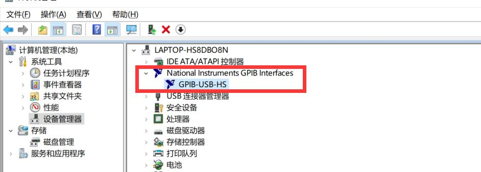

2. GPIB 硬件要接到 CMW500 面板后面 GPIB CH1 接口

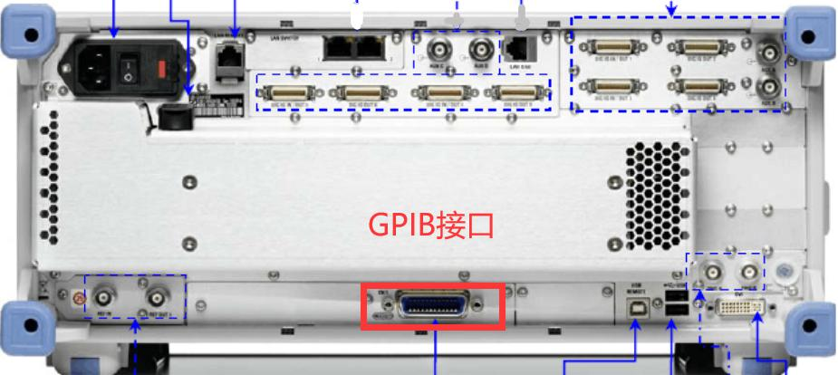

3. 将 CMW500 仪器开机，平板天线或者整机夹具放到屏蔽箱里，通过 RF CABLE 连接到仪器的 RF1 COM 端口，运行 Sinba 工具

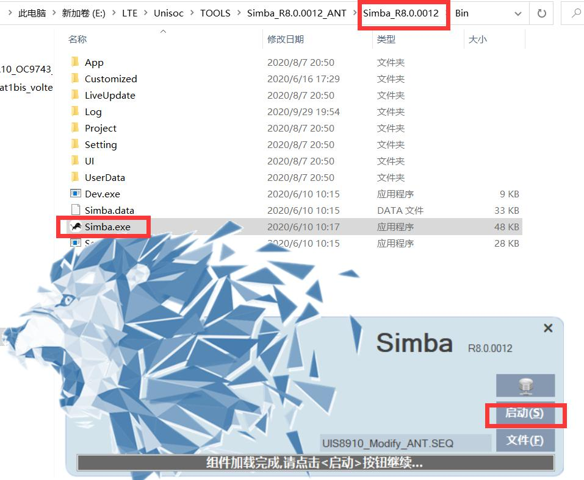

4. 工具配置，如下图。GPIB 地址一般仪器默认 CH1 是 20

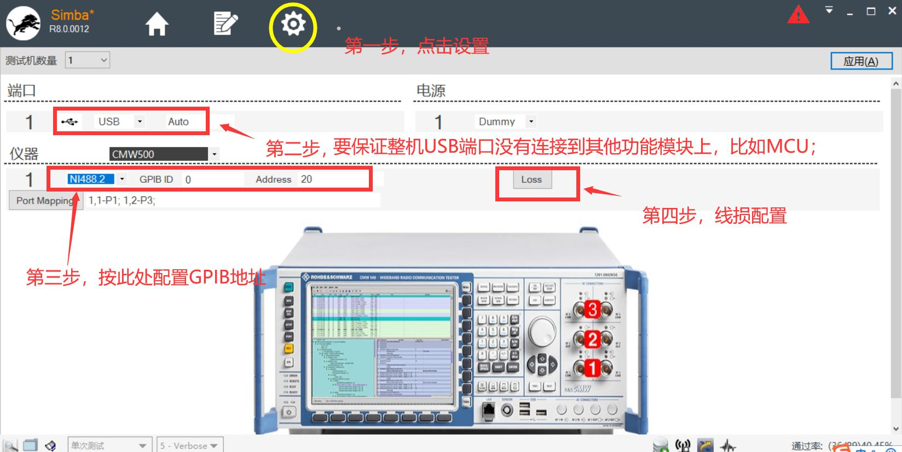

5. 线损设置如下图。由于整机测试是通过空间耦合的方式连接到综测仪的，所以线损一般设置的都比较大，推荐低频 B5/B8 等频段 LOSS 补 15dB，中频 B1/B3/B34/B39 等频段 LOSS 补偿 18dB，高频 B40/B38/B41等频段 LOSS 设置 20dB；具体请用天线厂调试好的性能 OK 的整机做为金机，确认好测试位置、线损、以及后面工具测量值的上限门限

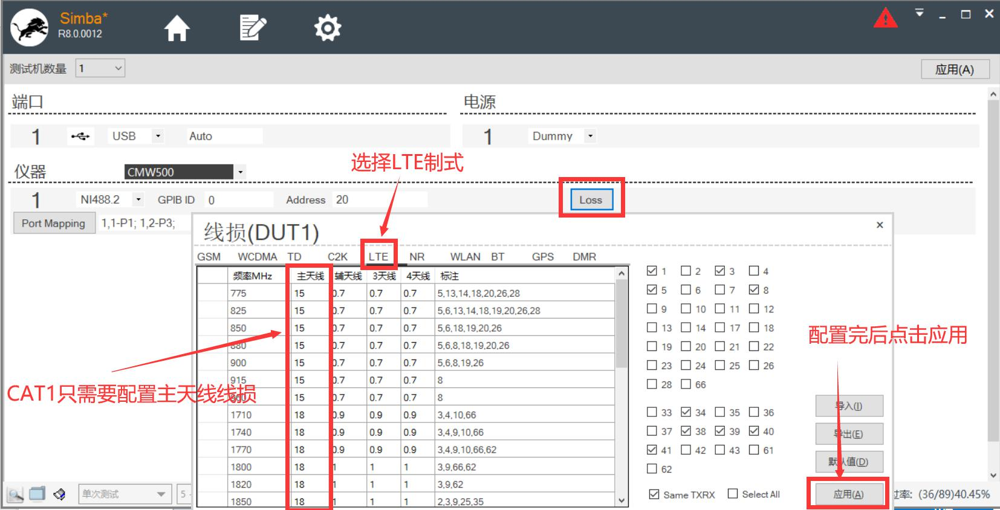

6. 配置好后点击应用，如果跳出如下图对话框则表明综测仪已经受控

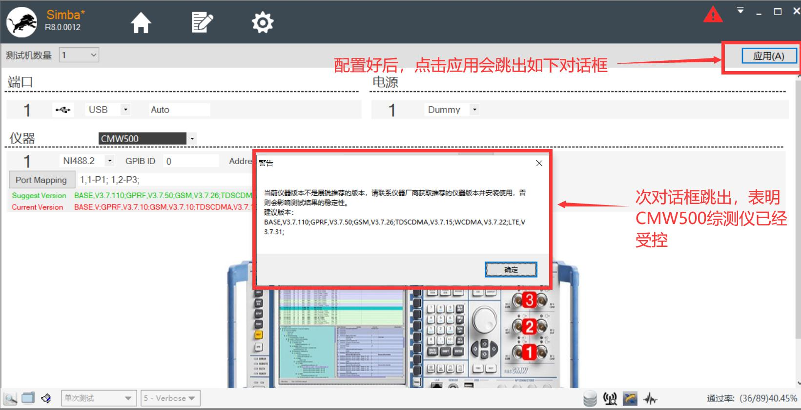

7. 如果出现如下图的 fail 字样，则需要用 NI 工具确认下 GPIB 是否不受控原因。必要的时候也可以找我们协助解决

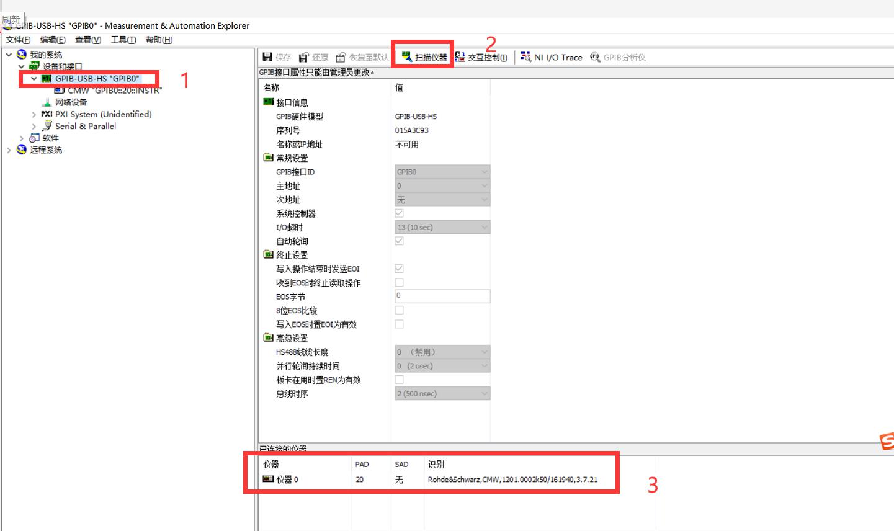

8. 测试的目的是为了确认天线是否装配好，所以可以选择 Manually，自由勾选需要测试的频段

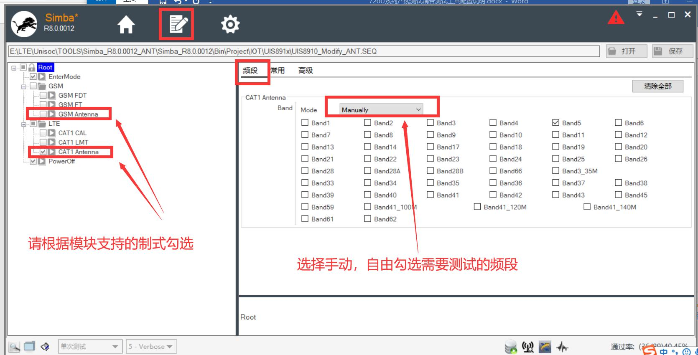

9. 功率门限配置。具体请用天线厂调试好的性能 OK 的整机做为金机，确认好测试位置、线损再多测试几次得到一个平均值，上下留 2dB 左右余量即可作为上下门限值。

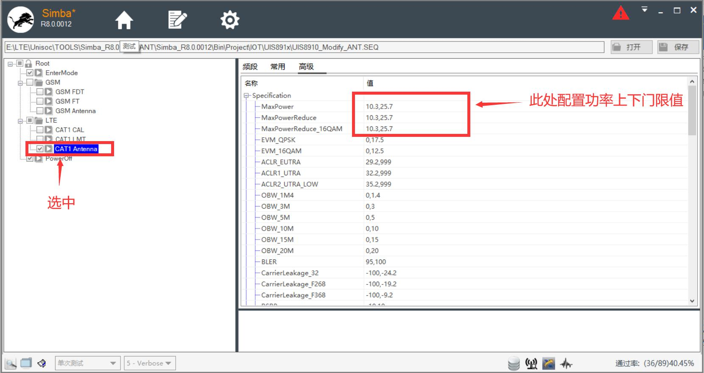

10. TX,RX 测试信道，带宽配置

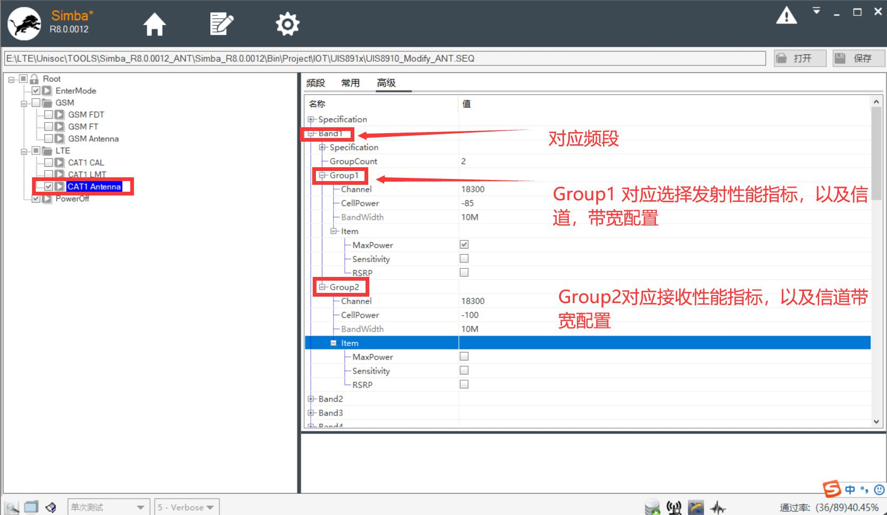

11. 测试项配置，可根据下图说明勾选需要的测试项；勾选好后请点击保存

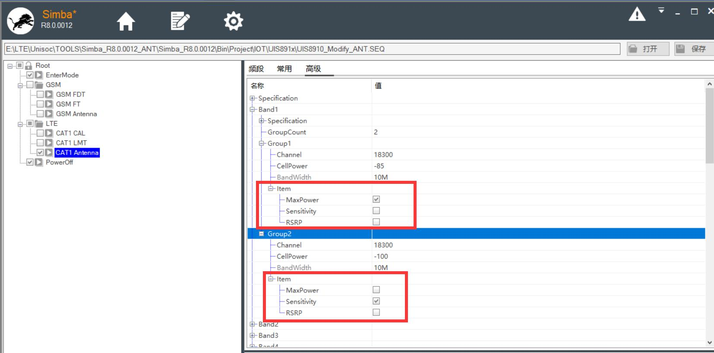

12. 回到测试页面，先点击开始再给模块上电即可开始测试

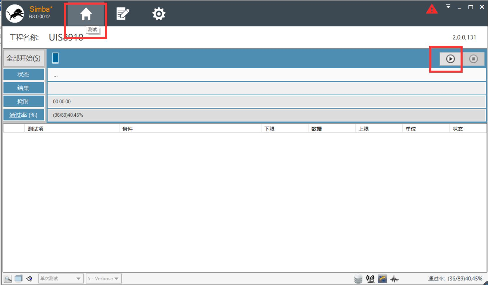