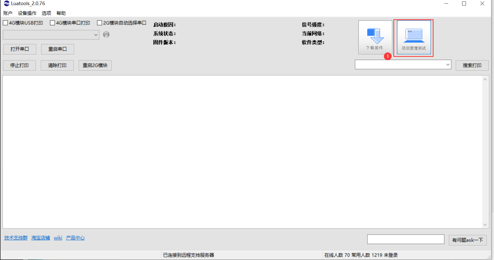
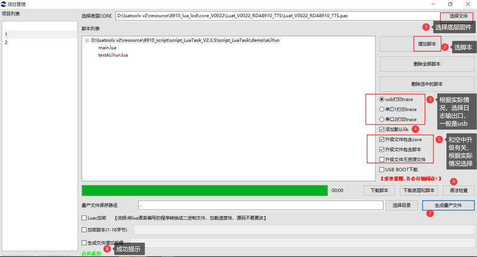
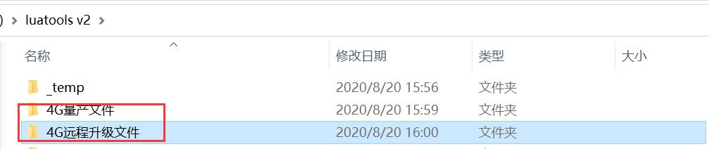
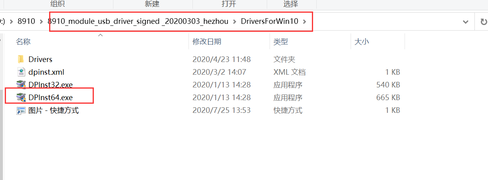
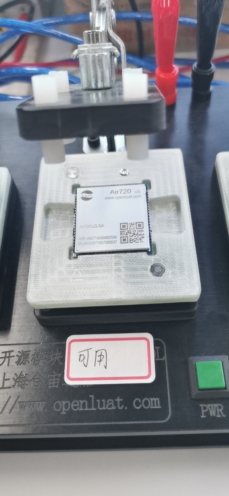
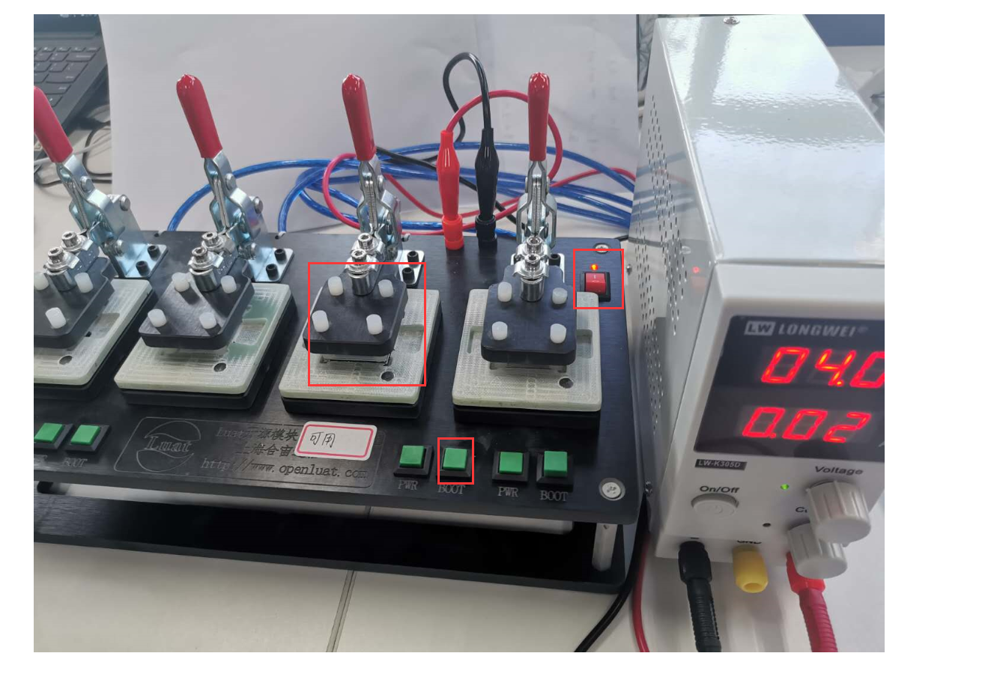
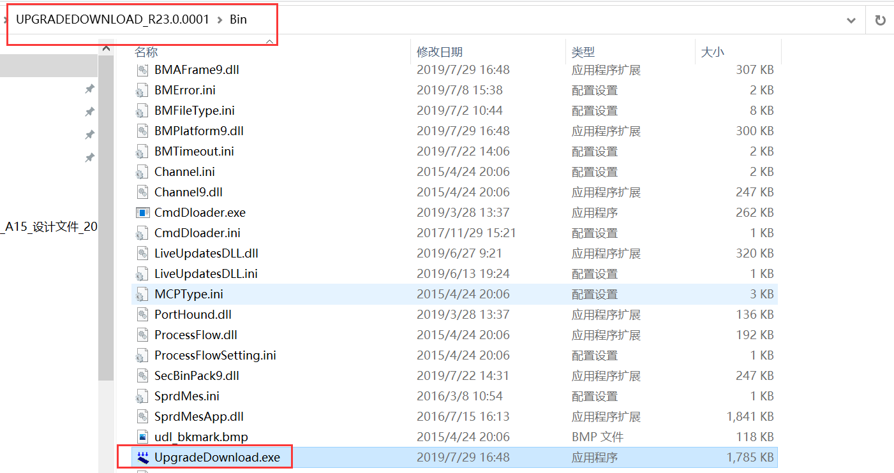
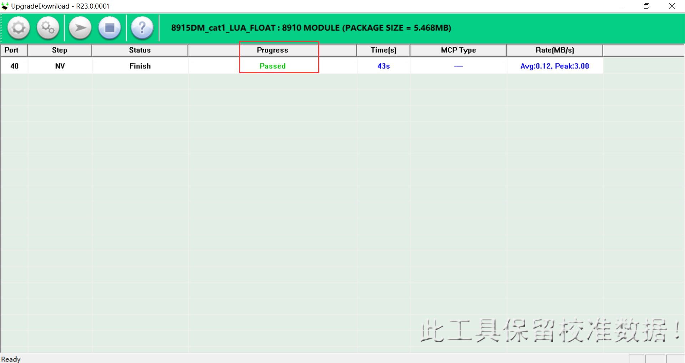

# 烧录前的准备

1. 一拖N量产夹具（带boot键）
2. 直流稳压源
3. 待烧录模块
4. [此处下载量产烧录工具](https://cdn.openluat-luatcommunity.openluat.com/attachment/20200808185432677_8910-UPGRADEDOWNLOAD_R23.0.0001.7z)
5. [此处下载固件合成工具Luatools_v2](https://cdn.openluat-luatcommunity.openluat.com/attachment/20200808182655634_Luatools_v2.exe)
6. [点此处下载usb驱动usb_driver.rar](https://cdn.openluat-luatcommunity.openluat.com/attachment/20201027170053121_8910_module_usb_driver.rar)

# 利用Luatools_v2软件生成量产文件

1. 下载软件工具luatoolsV2，并更新成最新版本
2. 参考以下图片所示，生成量产文件（pac和bin）。
   **注意：**二次开发才需要生成量产文件，AT固件直接从第三步开始烧录

**合成的固件默认保存在如下图所示的文件夹**

3. 以win10 电脑64位系统为例，双击对应文件安装驱动：

# 开始烧录

1. 下载软件工具**UPGRADEDOWNLOAD_R23.0.0001**

2. 硬件连接如下

   1. 模块正确摆放

      

   2. 稳压源给夹具供电（一般4V），USB接电脑，按下夹具上boot键，依次打开稳压源开关、夹具电源开关，观察电流，20mA左右正常，模块正常开机，设备管理器端口显示如下图，进入下载模式

      

   3. 硬件连接如图

      

3. 软件开始烧录

   1. 打开软件

      

   2. 加载固件，开始烧录

      

   3. 烧录成功提示

      

