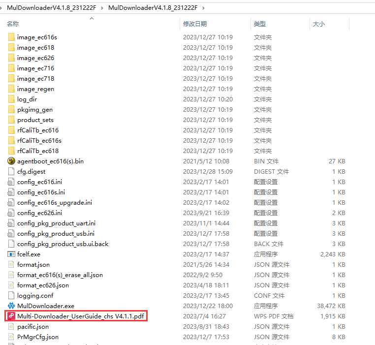
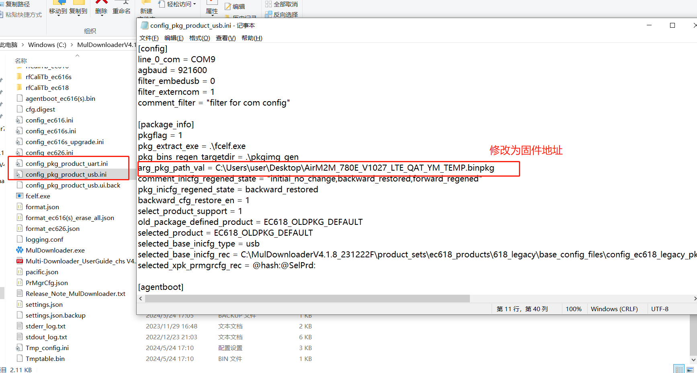
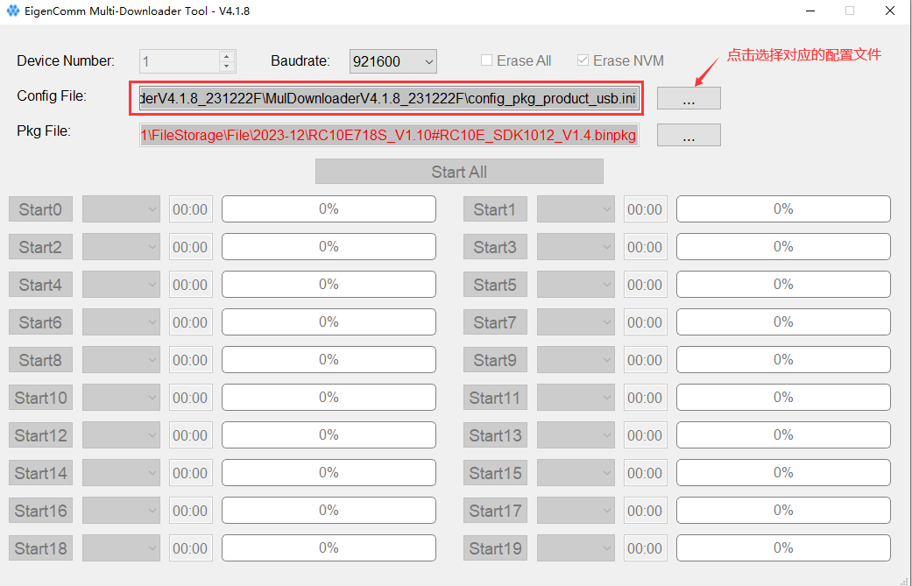
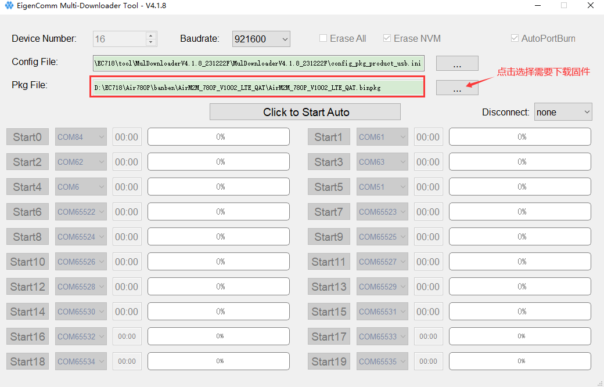
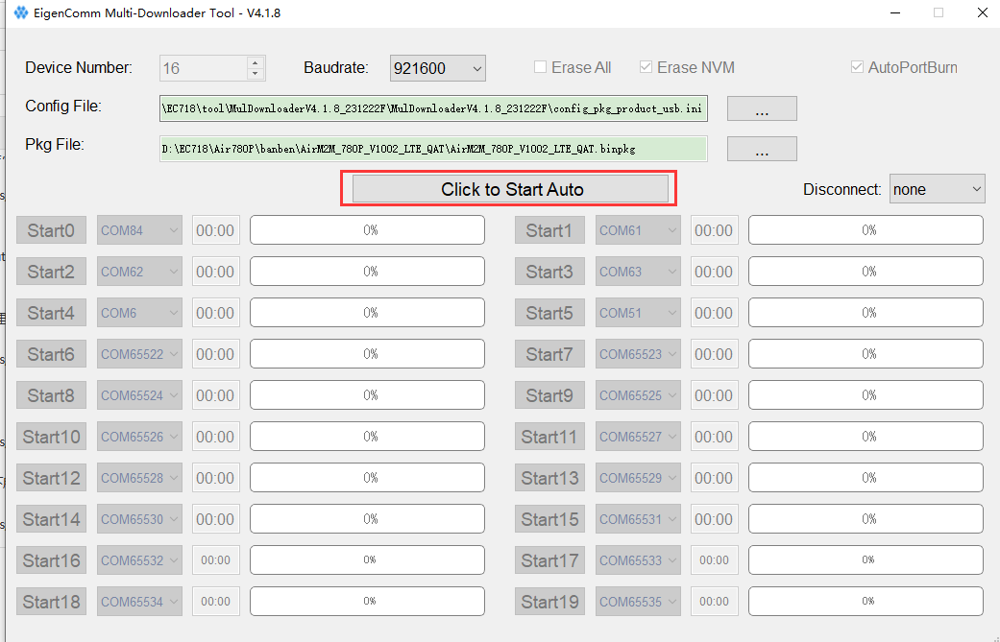
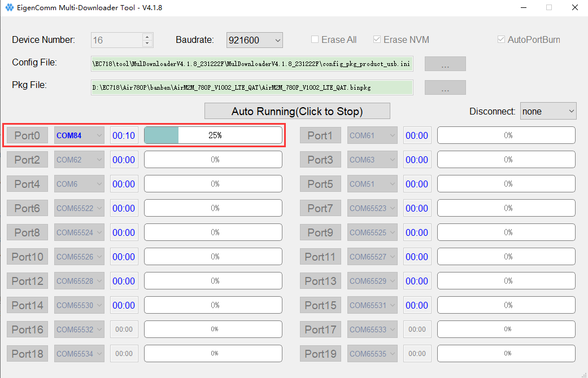
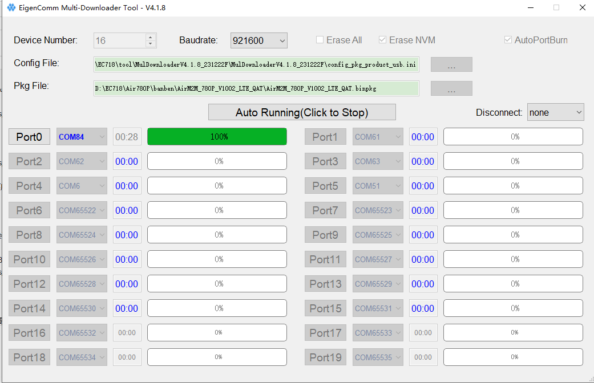
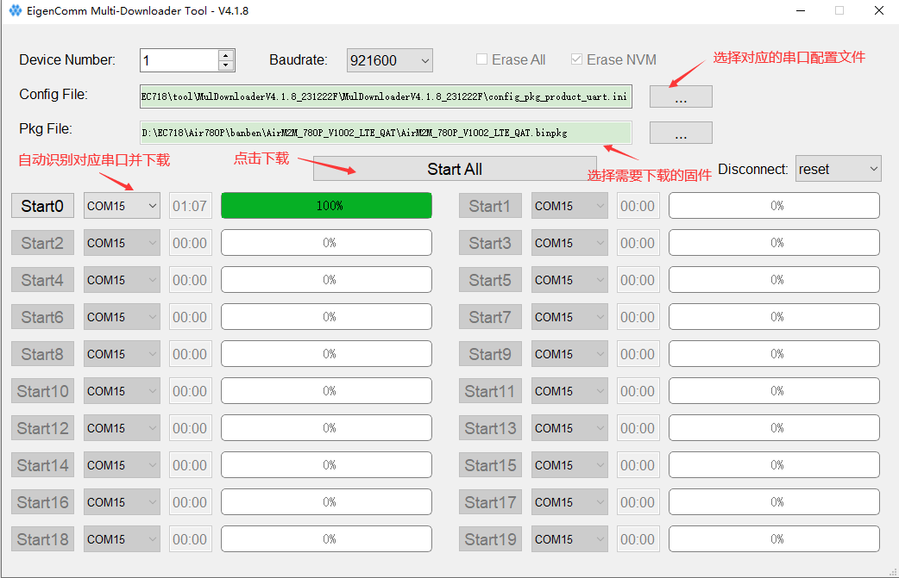

# 下载地址

[MulDownloaderV4.1.9_240511F.zip](https://cdn.openluat-luatcommunity.openluat.com/attachment/20240711135533529_MulDownloaderV4.1.9_240511F.zip)

注意：V4.1.9版本前的量产工具，可能无法下载最新**luatos_soc_2024**仓库编译的csdk固件。请下载最新的版本。

# 使用手册

下载上面的量产工具，解压后的**Multi-Downloader_UserGuide_chs V4.1.1.pdf**为使用说明，如下图所示。

# USB下载

注意：USB下载需要在BOOT模式下进行。

## 修改.ini配置文件（arg_pkg_path_val=固件地址）

注意：根据USB OR UART下载方式去选择修改

## 选择配置文件

点击**MulDownloader.exe**运行下载工具，选择对应配置文件。这里USB下载方式选择的配置文件为**config_pkg_product_usb.ini**如下图所示：

## 选择需要下载的固件

点击**Pkg File**后面的设置按钮，选择**Pkg File**文件及模块需要下载的固件，这里选择的固件是**AirM2M_780P_V1002_LTE_QAT.binpkg**。如下图所示：

## 下载

先按住BOOT键，点击**Click to Start Auto**，在按开机键（开机状态下按复位键）进行下载，如下所示。

工具会自动识别下载口进行下载，这里的下载端口为84。

下载过程会显示下载进度，如下所示。

下载完成会显示现在进度为100%，如下所示。

# 串口下载

可以用主串口来下载对应版本，这里需要选择文件为：**config_pkg_product_uart.ini**。选择需要下载的固件这里选择的固件是**AirM2M_780P_V1002_LTE_QAT.binpkg**。点击**Start ALL**后，重新上电开机就会开始下载。

这里的下载端口为15。

# 注意事项

**文件路径中不能有中文目录，否则会下载失败**

默认是如下配置，不需要去修改。

