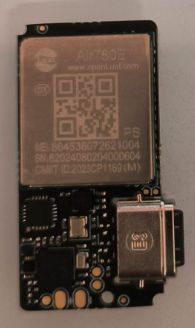
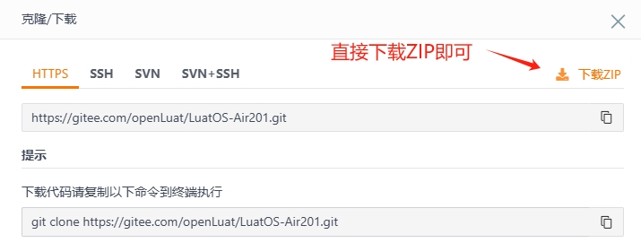
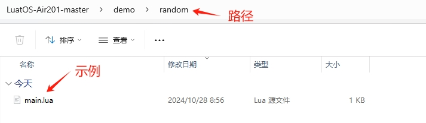
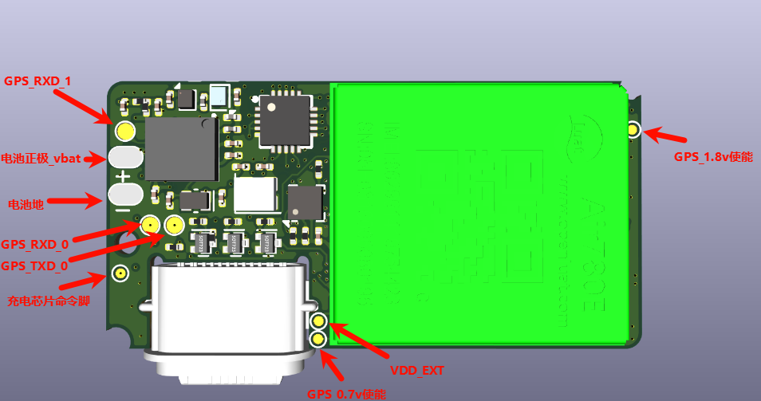
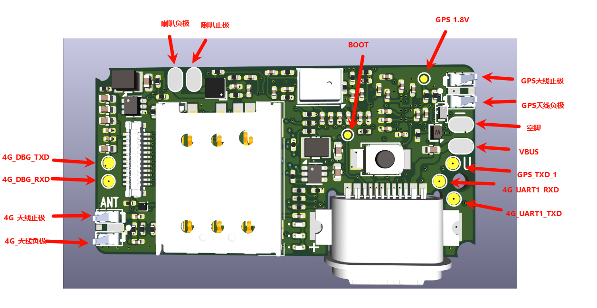
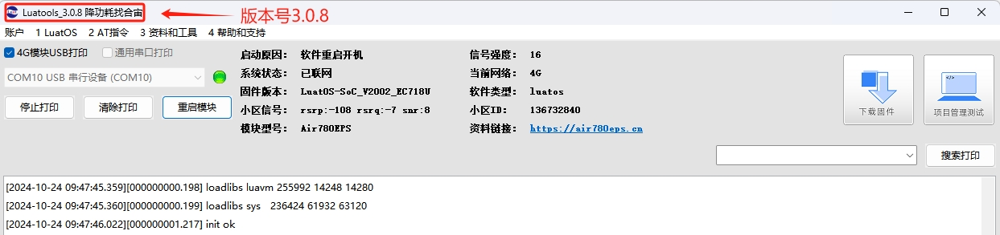
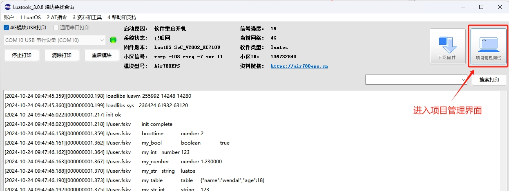
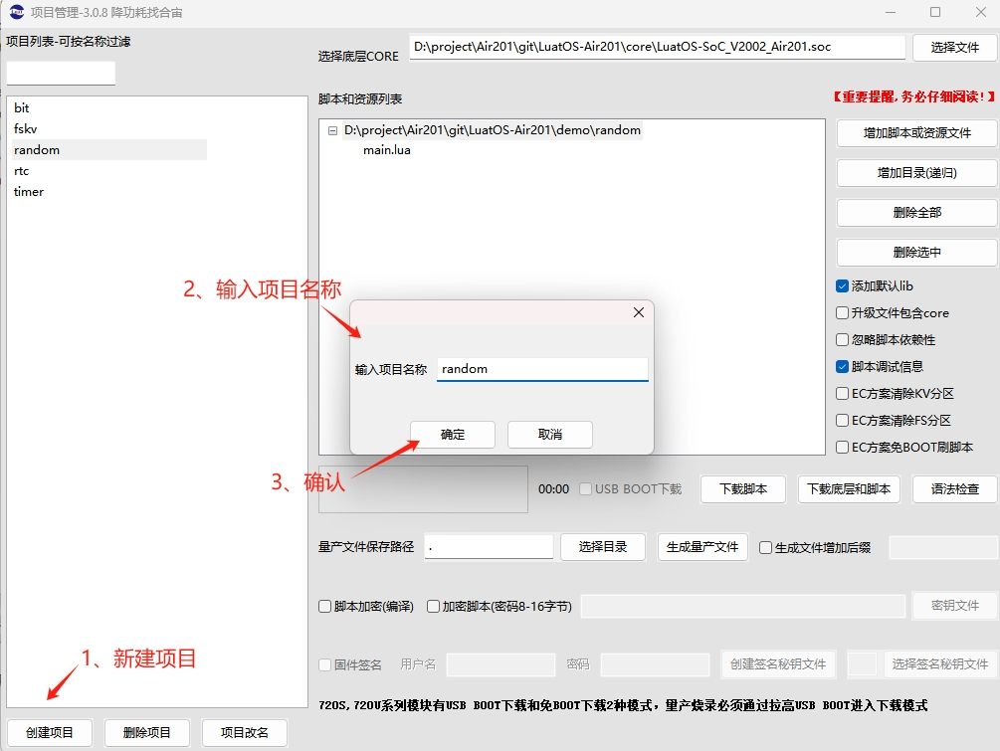
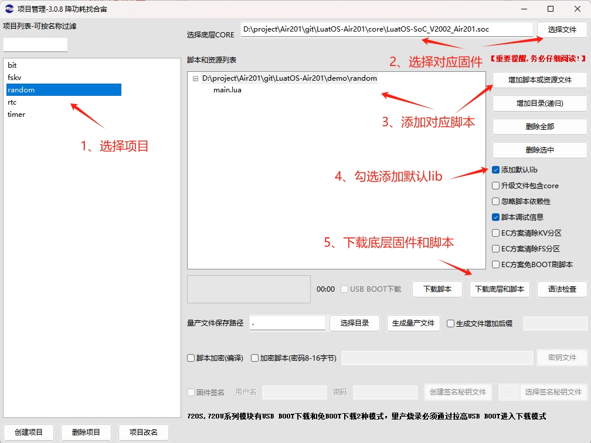

## 一、随机数概述

想要讨论随机数，首先应该明确一下随机数的定义.毕竟这个东西比较虚，并不像算法那样明确.在各大网上也没有给出很好的定义.

那...就不死抠定义了.

随机数一般来说符合下面这几个性质.

1. 它产生时后面那个数与前面的毫无关系
2. 给定样本的一部分和随机算法，无法推出样本的剩余部分
3. 其随机样本不可重现

另外还要说一下统计学伪随机数概念，**划重点:**

**统计学伪随机性.统计学伪随机性指的是在给定的随机比特流样本中，1 的数量大致等于 0 的数量，同理，“10”“01”“00”“11”四者数量大致相等.类似的标准被称为统计学随机性.满足这类要求的数字在人类 “一眼看上去” 是随机的.（摘自百度词条）**

实际上这也是在计算机中对伪随机数优劣的概念.

## 二、演示功能概述

本文章通过 Air201模组烧录底层固件(**LuatOS-SoC_V2002_Air201.soc**)和修改 LuatOS 示例代码([demo/random](https://gitee.com/openLuat/LuatOS-Air201/tree/master/demo/random)),来演示有关随机数的各种 API 的功能.

## 三、硬件准备

### 3.1 Air201 模组

使用 Air201 模组，如下图所示：



点击链接购买：[合宙Air201模组淘宝购买链接](https://item.taobao.com/item.htm?spm=a21xtw.29178619.product_shelf.10.10e111704zALy3&id=833290358010&pisk=faBjntwk7q0X5dV4OcEyOvLegLv_4NwUGctOxGHqXKpvWc_RXAHvXAd8ehKXDCLaiNO17aAO3KSVPmX5RAk4oSjtCdJT8yyULiqDIdUF4hFw1qx2vjeZHEnJDcNyayyULgsDIdUU8tk_KAx6YAp9MCIR2UxwXFQ9WuTJfHctkNQO2ut9Ym39DAL-2H-BBVLvkQeJjhcxWddA2utMyxh7dXx_hEsbqiUcZHw9MiLSdgXWD7TQKUHOpTKvGOIDP_5PFnOXJQxBhMBAzGBVnQV-NdjPON1OJzl2k6tCPB5bRx_CohI6XZwnAUBffTOcaDkCVCTfwtdSXAIdmsRR1ZajiECVPBxJwcwH4w8RmtC7j4IA8E9v2QyLAgdOatAh3zHXp6j231QLzj8AOhIPFv8B_ChsVBD6Ver7VfcgiPMFYx18UWRvqnt8VugfSIKkVer7VfcMM3xreuZSlNf..) ；

此模组的详细使用说明参考：[Air201 产品手册](https://docs.openluat.com/air201/product/) 。

### 3.2 SIM 卡

中国大陆环境下，可以上网的 sim 卡,一般来说，使用移动，电信，联通的物联网卡或者手机卡都行.

### 3.3 PC 电脑

WINDOWS 系统.

### 3.4 数据通信线

USB 数据线.

## 四、软件环境

### 4.1 Luatools 工具

要想烧录 LuatOS 固件到 4G 模组中，需要用到合宙的强大的调试工具：Luatools

详细使用说明参考：[Luatools 工具使用说明](https://docs.openluat.com/Luatools/) .

Luatools 工具集具备以下几大核心功能：

- 一键获取最新固件：自动连接合宙服务器，轻松下载最新的合宙模组固件.
- 固件与脚本烧录：便捷地将固件及脚本文件烧录至目标模组中.
- 串口日志管理：实时查看模组通过串口输出的日志信息，并支持保存功能.
- 串口调试助手：提供简洁的串口调试界面，满足基本的串口通信测试需求.

Luatools 下载之后， 无需安装， 解压到你的硬盘，点击 Luatools_v3.exe 即可运行.

### 4.2 准备需要烧录的代码

首先要说明一点： 脚本代码， 要和固件的 soc 文件一起烧录.

#### 4.2.1 **烧录的底层固件文件**

官网下载,底层 core 下载地址：[LuatOS 底层 core](https://gitee.com/openLuat/LuatOS-Air201/tree/master/core)   **注：**本 demo 使用如图所示固件


首先要下载 Air201 的 LuatOS 示例代码到一个合适的项目目录,示例代码网站: [LuatOS-Air201LuatOS源码](https://gitee.com/openLuat/LuatOS-Air201)

下载流程参考下图:




下载的文件解压,找到 LuatOS-Air201-master\demo\random\main.lua,如图:



## 五、API 说明

### 5.1 crypto.trng(len)

生成真随机数

**参数**

| **传入值类型**<br/> | **解释**<br/> |
| ------------------- | ------------- |
| int<br/>            | 数据长度<br/> |

**返回值**

| **返回值类型**<br/> | **解释**<br/>         |
| ------------------- | --------------------- |
| string<br/>         | 指定随机数字符串<br/> |

**例子**
```lua
-- 生成 32 位随机数 ir

local r = crypto.trng(4)

local _, ir = pack.unpack(r, "I")
```
---

### 5.2 math.random([n [,m]])

生成伪随机数

**参数**

| **传入值类型**<br/> | **解释**<br/>       |
| ------------------- | ------------------- |
| int<br/>            | 生成随机数范围<br/> |
| int<br/>            | 生成随机数范围<br/> |

**返回值**

| **返回值类型**<br/> | **解释**<br/> |
| ------------------- | ------------- |
| local<br/>          | 随机数字<br/> |

**例子**
```lua
--无参调用，产生[0, 1)之间的浮点随机数.

local num = math.random()

--一个参数 n，产生[1, n]之间的整数

local num = math.random(n)

--两个参数，产生[n, m]之间的整数.

local num = math.random(n,m)
```
---

### 5.3 math.randomseed(n)

用法：设置一个整数 n 作为随机序列的种子.

**参数**

| **传入值类型**<br/> | **解释**<br/> |
| ------------------- | ------------- |
| int<br/>            | 种子数据<br/> |

**返回值**

无

**例子**
```lua
--得到了正常的随机数

math.randomseed(os.time())

for i=0, 10 do

  local n = math.random(10)

end

--一系列相同的数,这种在一个 for 循环内设置随机数的写法 seed 几乎是一样导致.

for i=0, 10 do

  math.randomseed(os.time())

  local n = math.random(10)

end
```
## 六、功能演示

### 6.1 示例代码

示例代码为 LuatOS-Air201-master\demo\random\main.lua 脚本文件


示例代码:

```lua
-- LuaTools需要PROJECT和VERSION这两个信息
PROJECT = "cryptodemo"
VERSION = "1.0.0"

log.info("main", PROJECT, VERSION)


if wdt then
    --添加硬狗防止程序卡死，在支持的设备上启用这个功能
    wdt.init(9000)--初始化watchdog设置为9s
    sys.timerLoopStart(wdt.feed, 3000)--3s喂一次狗
end

sys.taskInit(function()

    sys.wait(1000)
    -- ---------------------------------------
    log.info("随机数测试")
    math.randomseed(os.time())
    for i=1, 10 do
         sys.wait(100)
         log.info("crypto", "真随机数",string.unpack("I",crypto.trng(4)))
         log.info("crypto", "伪随机数",math.random()) -- 输出的是浮点数,不推荐
         log.info("crypto", "伪随机数",math.random(100)) --输出1-100之间随机数
         log.info("crypto", "伪随机数",math.random(1, 65525)) -- 不推荐
    end
    log.info("crypto", "ALL Done")
    sys.wait(100000)
end)

-- 用户代码已结束---------------------------------------------
-- 结尾总是这一句
sys.run()
-- sys.run()之后后面不要加任何语句!!!!!
```

### 6.1 烧录固件

#### 6.1.1 **正确连接电脑和 4G 模组电路板**

使用带有数据通信功能的数据线，不要使用仅有充电功能的数据线.

#### 6.1.2 **识别 4G 模组的 boot 引脚**

Air201进入boot下载模式，烧录固件和程序，需要将预留的测试点（Air201板子 B面图） 的boot 上拉到vdd_ext（A面USB旁边），之后上电开机，即可进入下载模式，下载完程序后将boot脚悬空。

Air201板子 A面图



Air201板子 B面图



#### 6.1.3 **识别电脑的正确端口**

判断是否进入 BOOT 模式：模块上电，此时在电脑的设备管理器中，查看串口设备， 会出现一个端口表示进入了 boot 下载模式，如下图所示：


#### 6.1.4 用 Luatools 工具烧录

- 新建项目

首先，确保你的 Luatools 的版本，大于等于 3.0.6 版本的.

在 Luatools 的左上角上有版本显示的，如图所示：



Luatools 版本没问题的话， 就点击 LuaTools 右上角的“项目管理测试”按钮，如下图所示：



这时会弹出项目管理和烧录管理的对话框，可以新建一个项目,如下图：



- 开始烧录

选择 201 板子对应的底层 core 和刚改的 main.lua 脚本文件.下载到板子中.



点击下载后，我们需要进入 boot 模式才能正常下载.

如果没进入 boot 模式会出现下图情况:


进入 boot 模式下载,如图:


### 6.3 对应 Log

```
[2024-10-28 09:24:00.754] 工具提示: 用户log保存在D:\project\Air201\Luatools\log\trace_2024-10-28_092400.txt 如果有问题交给FAE
[2024-10-28 09:24:00.754][000000000.009] am_service_init 1061:Air780EPS_A13
[2024-10-28 09:24:00.759][000000000.009] am_get_chip_type 582:d926a8,15,5
[2024-10-28 09:24:00.760][000000000.017] BSP_CustomInit 509:io level 3
[2024-10-28 09:24:00.761][000000000.017] BSP_CustomInit 530:hardfault mode init 4
[2024-10-28 09:24:00.762][000000000.018] Uart_ChangeBR 1297:uart0, 6000000 6028985 26000000 69
[2024-10-28 09:24:00.762][000000000.038] poweron: Power/Reset
[2024-10-28 09:24:00.763][000000000.195] self_info 123:model Air780EPS_A13 imei 864536072621004
[2024-10-28 09:24:00.764][000000000.196] LuatOS@EC718U base 23.11 bsp V2002 32bit
[2024-10-28 09:24:00.765][000000000.196] ROM Build: Oct 10 2024 13:24:43
[2024-10-28 09:24:00.768][000000000.201] loadlibs luavm 255992 14248 14280
[2024-10-28 09:24:00.771][000000000.201] loadlibs sys   236424 61932 63120
[2024-10-28 09:24:00.773][000000000.207] I/user.main	rand_demo	1.0.0
[2024-10-28 09:24:01.444][000000001.218] I/user.随机数测试
[2024-10-28 09:24:01.538][000000001.328] I/user.random	真随机数	-136253621	5
[2024-10-28 09:24:01.540][000000001.328] I/user.random	伪随机数	0.6476606
[2024-10-28 09:24:01.541][000000001.329] I/user.random	伪随机数	62
[2024-10-28 09:24:01.543][000000001.329] I/user.random	伪随机数	13936
[2024-10-28 09:24:01.649][000000001.429] I/user.random	真随机数	391863238	5
[2024-10-28 09:24:01.653][000000001.430] I/user.random	伪随机数	0.2982042
[2024-10-28 09:24:01.654][000000001.438] I/user.random	伪随机数	87
[2024-10-28 09:24:01.655][000000001.439] I/user.random	伪随机数	49865
[2024-10-28 09:24:01.758][000000001.539] I/user.random	真随机数	1872880857	5
[2024-10-28 09:24:01.760][000000001.540] I/user.random	伪随机数	0.8115696
[2024-10-28 09:24:01.761][000000001.540] I/user.random	伪随机数	18
[2024-10-28 09:24:01.762][000000001.541] I/user.random	伪随机数	65282
[2024-10-28 09:24:01.867][000000001.650] I/user.random	真随机数	708504344	5
[2024-10-28 09:24:01.871][000000001.650] I/user.random	伪随机数	0.9412411
[2024-10-28 09:24:01.875][000000001.651] I/user.random	伪随机数	24
[2024-10-28 09:24:01.879][000000001.651] I/user.random	伪随机数	53549
[2024-10-28 09:24:01.962][000000001.751] I/user.random	真随机数	-957665666	5
[2024-10-28 09:24:01.967][000000001.752] I/user.random	伪随机数	0.6316060
[2024-10-28 09:24:01.972][000000001.761] I/user.random	伪随机数	15
[2024-10-28 09:24:01.975][000000001.762] I/user.random	伪随机数	54612
[2024-10-28 09:24:02.149][000000001.818] cid1, state0
[2024-10-28 09:24:02.155][000000001.819] bearer act 0, result 0
[2024-10-28 09:24:02.158][000000001.819] NETIF_LINK_ON -> IP_READY
[2024-10-28 09:24:02.164][000000001.862] I/user.random	真随机数	91708124	5
[2024-10-28 09:24:02.173][000000001.863] I/user.random	伪随机数	0.3641304
[2024-10-28 09:24:02.176][000000001.864] I/user.random	伪随机数	32
[2024-10-28 09:24:02.180][000000001.864] I/user.random	伪随机数	6820
[2024-10-28 09:24:02.197][000000001.979] I/user.random	真随机数	411734972	5
[2024-10-28 09:24:02.202][000000001.980] I/user.random	伪随机数	0.7507765
[2024-10-28 09:24:02.206][000000001.981] I/user.random	伪随机数	89
[2024-10-28 09:24:02.211][000000001.981] I/user.random	伪随机数	7965
[2024-10-28 09:24:02.215][000000001.982] TIME_SYNC 0
[2024-10-28 09:24:02.306][000000002.082] I/user.random	真随机数	-305197198	5
[2024-10-28 09:24:02.310][000000002.083] I/user.random	伪随机数	0.4773522
[2024-10-28 09:24:02.315][000000002.092] I/user.random	伪随机数	11
[2024-10-28 09:24:02.319][000000002.092] I/user.random	伪随机数	13405
[2024-10-28 09:24:02.416][000000002.193] I/user.random	真随机数	-916810188	5
[2024-10-28 09:24:02.423][000000002.194] I/user.random	伪随机数	0.3110049
[2024-10-28 09:24:02.427][000000002.194] I/user.random	伪随机数	61
[2024-10-28 09:24:02.432][000000002.195] I/user.random	伪随机数	48469
[2024-10-28 09:24:02.524][000000002.303] I/user.random	真随机数	190343018	5
[2024-10-28 09:24:02.528][000000002.304] I/user.random	伪随机数	0.8486532
[2024-10-28 09:24:02.533][000000002.304] I/user.random	伪随机数	45
[2024-10-28 09:24:02.537][000000002.305] I/user.random	伪随机数	48056
[2024-10-28 09:24:02.542][000000002.305] I/user.random	ALL Done

```

## 七、总结

通过本章内容的学习，你可以学习到有关随机数的函数，例如：crypto.trng(len)、math.random([n [,m]])、math.randomseed(n) 等函数.

## 八、扩展

### 8.1 **注意事项**

需要注意的是，Lua 中的随机数算法可能存在一些问题.例如，math.random(1, 3276700)返回的值最后两位必为 0，这是由于 Lua 本身的随机函数算法决定的.因此，在使用 Lua 生成随机数时，应当注意这些潜在的限制，并尽可能通过设置合适的随机种子来避免生成可预测的随机数序列.

通过以上方法，可以在 Lua 中有效地生成随机数，并确保每次运行程序时都能得到不同的随机数序列，从而满足各种需要随机性的应用场景.

### 8.2 **设置随机数种子**

为了确保每次运行程序时都能生成不同的随机数序列，需要使用math.randomseed来设置一个随机种子.通常，使用系统时间os.time()作为种子是一个简单而有效的方法：
```lua
math.randomseed(os.time())
```
然而，如果程序在很短的时间内多次运行，可能会发现生成的随机数序列几乎不变.这是因为os.time()返回的是秒级的时间戳，不够精确.为了解决这个问题，可以将时间戳转换为字符串，然后反转并截取高位数字作为种子：
```lua
math.randomseed(tonumber(tostring(os.time()):reverse():sub(1, 7)))
```
这种方法通过提高种子数值的变化量，使得即使在短时间内多次运行程序，也能产生更好的伪随机序列.
