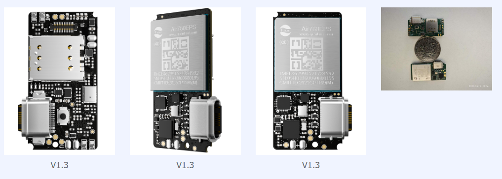
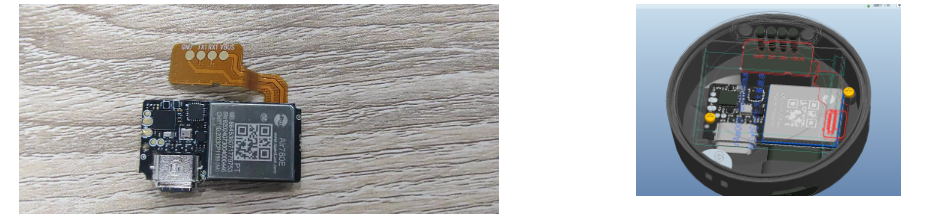
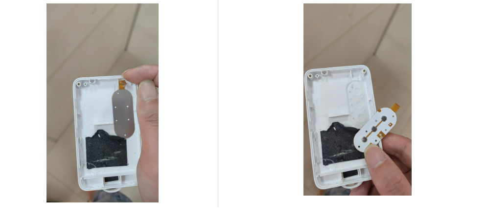

# **Air201 常见问题集合**

##  1. **市场相关**

**1.1，Air201 是什么？**

Air201资产定位模组,集成了 4G,数传,定位，通话，录音，播放，充电，wifi 扫描等功能的资产定位PCBA模组，定位准，体积小，功耗低，旨在帮助客户解决如下几种问题：

- 1，对功耗和产品一致性有极致要求

- 2，传统行业升级4G方案，缺少相关经验和技术

- 3，有软件开发能力，硬件设计能力缺乏

- 4， 需要测试新的行业机会，新投入硬件研发成本太高

- 5，项目周期紧张，对交付周期和质量要求

- 6，硬件研发能力较弱，但是对产品场景理解深入，希望做差异化产品

Air201 如下所示：
 
 

**1.2，Air201 有那些行业可以用**

Air201 定义为资产定位模组，凡是需要定位的场景，比如：

- 1，老人卡，

- 2，学生卡

- 3，宠物定位

- 4，冷链运输

- 5，牛羊定位

- 6，船舶定位

- 7，通话手表

等等，尤其是对低功耗要求比较高的场景最为合适。

**1.3，合宙可以提供那些服务**

Air201 面向的客户既可以是整机客户，也可以是方案商，所以合宙可以给客户提供如下服务：

**1.3.1，提供整机服务**

- i. 可以提供整机，pcba，后台，小程序等服务

**1.3.2，PCBA + 后台和小程序服务**

- i. 客户自己设计外壳

- ii. 我司提供 pcba，嵌入式软件，后台，小程序

**1.3.3，PCBA** 

- i. 我司提供 pcba

- ii. 提供板载驱动演示代码

- iii. 提供基础代码（支持二开）

**4，Air201 和780EPS 是什么关系，为何宣传资料上的201 图片上印着的是780EPS**

因为Air201 的设计初衷，就是超低功耗。所以我们在软硬件设计上，全是按照最低功耗设计的，所以在用电大户 4G 通信，以及GPS 都选用超低功耗物料。所以Air201 在4G 模组上使用780EPS 模块。

##  2. **电池相关**

 **2.1  充电电流能支持多大？**

充电IC 一般分为两种，1.开关充电方案，2. 线性充电方案。 开关充电方案的特点是电流大，但是相应的体积也大（我们的手机充电器一般采用此方案）。线性充电方案的充电电流小，但是体积也很小。Air201 的定位是小尺寸低功耗场景，所以决定了使用场景不会需要太大的电池，以及板子体积受限，所以我们选择了尽可能高的充电电流的线性充电方案，

  所以我们选用的IC 是线性充电方案，最大可以能支持**750ma**。

 **2.2  充电电压是多少，能否设置？**

Air201 的设计初衷是多种使用场景，那么考虑到终端产品的空间和成本限制，客户最终选择的电池电压不固定。比如有的设备空间很小，但是需要大容量电池，客户可能会考虑使用高压电池（比如4.45V）。

虽然一般的电池，都会默认带保护板，限制电压过充（过充可能引起爆炸，尤其需要注意），但是为了安全考虑Air201也支持设置最大充电电压，考虑到电池的不同，Air201 将此选择权交给客户，可以支持 **4V 到 4.5v 之间**的电压配置。

此处要注意，客户使用的电池一定要判断是否使用

 **2.3  是否具备电压采集功能?** 

常用的电池电压检测，都是使用ADC(ADC，Analog-Digital Converter，模拟数字转换器)的方式进行检测，电池电压检测的精度，受限于分辨率，模拟值输入范围，输入电压纹波，分压电阻精度差异等影响。

Air201支持12位的ADC 检测，在硬件设计阶段解决电压的纹波问题，配合产线上进行电阻值校准，所以可以**精确的检测电池电压**，并且在充电器插入和未插入都可以精确的采集实时电压。

 **2.4  是否支持防止电池的过冲过放？**

电池的过充，是指电池充电电压超过电池设计的范围，此时有可能会导致电池永久性的伤害，设置发生爆炸。

电池的过放，是指电池电量耗尽，频繁过放会导致电池循环寿命下降，同时过放会导致设备无法开机。

Air201 支持软件设置最低电压，**防止过放**，低于此电压，则开始保护电池，进行关机。

   Air201 也支持最高电压设置，**防止电池过充**。

同时Air201 支持路径管理，在电池没电的情况下，插入充电器，可以直接使用充电器的电源，给客户使用的时候，可以提供很好的体验。

 **2.5 充电是否支持那些充电 ?**

Air201设计考虑了多种充电场景，比如**太阳能充电，磁吸充电，USB 充电**等。

我们预留了3对充电口，既可以通过板载插入USB 充电，也可以通过接太阳能充电板充电，又可以通过BTB 外扩IO实现磁吸充电。

 **2.6  是否支持电源路径管理?**

电源路径管理(Dynamic Power Path Management)又叫动态电源路径管理，比如您的设备没电的情况，使用充电器进行充电，如果不支持电源路径管理，那么就会默认给电池充电，导致需要等待电池冲到开机电压才能开机，这将是一个非常不好的体验。

**Air201 支持动态电源路径管理**，可以直接给设备供电，同时将余量供给电池充电。

**2.7 市面上有众多的快充充电器，用他们对Air201充电，会不会损坏201**

快充充电器，会先输出5V ，然后进行cc配对，如果配对成功才会输出更高电压。 Air201 不支持CC 配对，所以快充充电器就**不会**损坏Air201

 

**2.8 怎么读取电池电压**

**2.9 怎么设置充电截止电压**

**2.10 怎么设置充电截止电压**

**2.10 怎么使用BTB 连接器给电池充电**

Air201 的BTB 连接器上的**23**管脚，可以当作中断唤醒脚，也可以外部输入5v,给23管脚,通过充电ic再给电池充电。

## 3. **定位相关**

**3.1，定位精度能做到多少？**

Air201采用高精度低功耗12nm 的GPS 芯片，可以实现在空旷地带（实测）静止状态 **2.08 米**，运动状态 5 米的定位精度。

**3.2，定位成功需要多长时间？**

初始条件不同，会造成定位成功的时间不一样，一般来说定位初始条件分为如下几种：

- 1. 冷启动：是指完全没有星历信息的情况下，打开GPS ，此时定位需要3秒

- 2. 温启动：距离上次定位的时间超过两个小时的启动，此时定位需要2秒。

- 3. 热启动(又称重捕获)：距离上次定位的时间小于两个小时的启动,此时定位需要1秒。

**3.3，支持那些星系，可以在国外使用吗？**

此处的星系，是指卫星定位系统。

Air201默认版本支持北斗，GPS,伽利略，GLONASS的星系，可以在国外使用。

**3.4，支持单北斗吗？**

单北斗是指，只支持北斗卫星导航，常用于对安全要求高的场景。

通用版本不支持，需要向产品负责人申请，生产的时候是按需生产。

**3.5，GPS各阶段功耗如何？**

Air201立项的重要目标是给客户超低功耗体验，无论是4G 还是GPS ，我们都以市面上最低功耗的方案设计。一般的方案提供商，会给出单GPS ，没有增加外围器件的功耗数据。实际客户使用下来，功耗远超宣传的指标，究其原因是由于GPS 不可能单独工作，收到外围的LDO，LAN, 主控工作逻辑限制。

Air201 在这方面花费了很大精力，最终在两个重点工况做出较好的工作水平：

a. 4G模块处于在线状态下捕获功耗为44mw(3.7V 约为11mA,含4G 模块功耗)，此工况适合定时定位上报的场景。

b. 4G模块处于在线追踪功耗为28mw(3.7V 约为7.5mA,含4G 模块功耗)，此工况适合快速追踪终端的情况。

**3.6 GPS灵敏度能达到多少？**

灵敏度越高，GPS的恶劣的环境下，定位成功的概率越高，Air201在设计的时候尽量提高了GPS 的灵敏度，灵敏度如下：

   1，热启动：-155

2，跟踪：  -165

**3.7 支持RTK 吗？**

RTK(Real Time Kinematic ),是指利用定位基站，通过平台计算相对位置，并且最终得到厘米级别的位置。

目前软件上还不支持，规划中是支持的，敬请期待

**3.8 支持那些定位方式？**

   Air201支持三种定位，分别是LBS定位，WIFI定位，GPS定位。

其中GPS 定位是使用卫星定位系统定位，WIFI 定位是指通过搜索周围的WIFI 信号，最终通过大数据平台计算出较为精准的位置，LBS 是指通过上报基站ID 到大数据获取位置信息，一般分为单点基站，和多点基站。

定位准确度：GPS>WIFI>LBS

## 4. **音频相关**

**4.1，是否支持通话？**

支持VOLTE通话（暂未开放）

**4.2，使用的是那家mic？**

 MSM421A3729H9-C     敏芯微

**4.3，能支持多大功率的喇叭？**

支持4欧2w或者8欧1w

**4.4，支持降噪吗？**

支持

**4.5，支持TTS 播放吗？**

TTS 是Text To Speech的缩写，意思是 “从文本到语音”，是人机对话的一部分，让机器能够说话。

Air201 **支持**中文，英文多种语音发音

**4.6，支持TTS 切换男声女声切换吗？**

支持

**4.7，支持录音吗？**

Air201 内置codec,**支持**本地录音和播放

**4.8，支持什么格式的录音，默认编码是多少位？**

默认使用**amr 格式**，此格式具有音质较好，但是空间占用很小的特点，默认编码使用**8位**编码方式

**4.9，录音1秒，大概会占用多大的flash,我需要评估空间是否够用？**

Air201 采用Amr 的 8位编码，大约1秒1.28K 的占用，录制30秒，约为39k

## 5. **天线相关**

**5.1， 支持那几种天线安装？**

Air201 有LTE和GPS两个天线。支持弹片天线，和ipex4代接线两种方式。

**5.2， 天线建议的安装方式有哪些？**

GPS天线看使用场景，如果客户的使用场景是戴在身上，摆放角度不固定，建议使用FPC 天线，如果位置固定，建议使用陶瓷天线

**5.3， Air201 支持有源天线吗？**

有源天线是指有额外的供电给天线，Air201 不支持有源天线。

详细的天线参数，请看[Air201 硬件手册](https://l0x5bk8xnyd.feishu.cn/docx/QXOBdK9I5oEQtCxAUAzcg5y6nUq) 文档

**6. 震动传感器相关**

**6.1  是否支持计步**

支持计步

**6.2  是否支持震动阈值设置**

支持

**6.3  是否支持震动触发唤醒**

支持

**6.3  振动监测的功耗是多少**

低于100微安

## 7. **结构相关**

**7.1  我们的外壳已经做好了，Air201 怎么使用？**

Air201 考虑到这一点，所以做的很小，体积和1元硬币类似，适合放到现有的外壳上，如果遇到如下几个问题，我们给出一些解决方案：

 1， 外壳很大，但是充电口是防水的，而且此位置201 无法固定

我们建议是按照之前的版型将充电口位置单独做成一个供电板，Air201 使用散热胶粘在底部，此供电板主要作用就是将供电传到底部的Air201

2， 外壳一般，但是充电方案采用磁吸方案，201 没有相关接口

可以使用外扩磁吸拓展方案，如图所示

 
 

3， 外壳很小，Air201 无法放置在内

建议3D 打印外壳，尽快测试市场

**7.2 结构堆叠图有没有？**

[HZ201P_10.8.wrl](https://docs.openluat.com/air201/luatos/hardware/design/file/HZ201P_10.8.wrl)

## 8. **外扩功能相关**

**8.1 SOS按键工作原理，是否支持一键呼救（业务层面），（开机长按（多少秒）为SOS，3s关机）**  

 支持，软件内，可以控制多种工作方式

**8.2  是否可以外扩储存容量，提供外扩方式与对应芯片或模块**  

 可以支持外扩flash，fpc 外扩接口可以实现，请看

**8.3，24Pin BTB 外扩接口既有Camer 又有LCD，能够同时使用吗？**

可以共同使用

**8.4，我要外扩3个按键，3个灯，怎么处理？**

  可以使用FPC 连接器（超薄，外形可定制），插入BTB(24pin )作为小板实现扩展方案

 
 

## 9. **功耗相关**

 

## 10. **产测相关**

 

## 11. **其他问题**

**11.1 提供一些测试程序（如录音、播放、按键操作、数据上报等）** 

请看 [Air201 的 LuatOS快速入门](https://docs.openluat.com/air201/luatos/quickstart/)

 