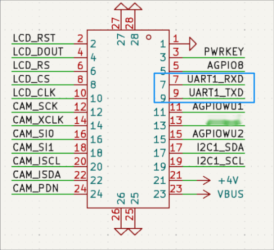

# BTB扩展接口

通过BTB连接器，可以扩展使用 pwrkey引脚控制开关机，一路UART1串口接口连接外设，4路模拟IO口，2路带唤醒功能的wakeup引脚，一路I2C接口。同时CAM_SCK、CAM_XCLK、I2C1_SCL、I2C1_SDA于模组的SPI接口复用，支持Flash等SPI外设，另外引出2路电压一路电池电压、一路USB电压。

## BTB扩展接口
[扩展IO的功能映射表](./file/Air201_gpio_config.xlsx)

注意事项：											
- 1	休眠情况下，中断可唤醒的IO 有**4**个，另外还支持UART 数据唤醒										
- 2	休眠情况下，可对外输出的IO口总计**3**个										
- 3	USP 支持复用I2S,LCD_SPI,CAMER_SPI 三种通讯接口，详情请看本表格USP部分工作表部分										
- 4	AONGPIO(5,11,15)管脚休眠模式下可保持，保持高或低。										
- 5	输出高电平，只支持**1.8V**，如果要驱动外部3.3V 外设，需要搭个电平转换电路										
- 6	WAKEUP(11,15,23)管脚固定电平1.8V，由于内部分压，内部上拉电平测量在1.1V左右										
- 7	WAKEUP(11,15,23)管脚内部上下拉非常弱，驱动能力<30uA.										
- 8	系统休眠后外部只能通过WAKEUP(11,15,23)管脚或者LPUART(7,9)串口唤醒，AONGPIO(5,11,15)虽然在休眠下不掉电，但是无法触发中断。										
- 9	普通GPIO在休眠后均会处于高阻状态。										
- 10	"板载的DBG_TX、DBG_RX默认功能为系统底层日志口，进行模块硬件设计时，在剩余功能引脚充足的前提下，避免使用DBG_TX和DBG_RX。
如果将此引脚复用为其他功能，则无法从DBG_TX和DBG_RX抓取系统日志。
在某些场景下，如果模块出现异常，无法抓到问题日志，只能通过硬件改版，引出DBG_TX、DBG_RX，抓取日志再进行分析。
包括但不限于以下两种场景：

    **1、低功耗场景：**

    在低功耗场景下，USB无法使用，只能通过DBG_TX、DBG_RX来抓取日志。

    **2、非低功耗场景：**

    模块接入USB时，工作正常，未接入USB时，工作异常的情况，只能通过DBG_TX、DBG_RX来抓取日志。"		

- 11	"所有GPIO和wakeuppad都支持双边沿中断；
可以复用为wakeup的io，休眠以及唤醒状态下都能使用；
其余io唤醒状态下可用，休眠状态下不能使用；
wakeup io可以唤醒休眠，其余GPIO都不可以。"										

- 12	Air201 的BTB 连接器上的**23**管脚，可以当作中断唤醒脚，也可以外部输入5v,给23管脚,通过充电ic再给电池充电。

## BTB扩展板

为方便用户更快上手，进行软件开发和调试，最新制作了搭配Air201_BTB接口的扩展板，上面已把所有扩展的io接了出来，并且挂载了flash，预留出lcd、camera的接口。

|  |  |
| ------------------------------------------------------------ | ------------------------------------------------------------ |

**装配图：**

[Air201_BTB扩展板_装配图v1.0.pdf](https://internal-api-drive-stream.feishu.cn/space/api/box/stream/download/all/Trdub8xPiox72mxTVPEcOJrunui/?mount_node_token=ARtkdVNBvogt3WxnNe5cDye0nXf&mount_point=docx_file)

## LCD 扩展

 扩展接口支持一路LCD专用SPI接口，用于驱动SPI LCD屏幕，不能作为通用SPI使用 **特性：**

1. 最大支持480*320分辨率，30帧
2. 仅支持SPI接口 LCD屏幕

**管脚定义****（"/"后面的管脚号是指模块对应的****PIN脚****）****：**

| **管脚名** | **管脚** | **I/O** | **管脚描述**          | **默认状态**         |
| ---------- | -------- | ------- | --------------------- | -------------------- |
| LCD_RST    | 2/49     | GPIO36  | SPI LCD 复位信号      | 上电状态默认下拉输入 |
| LCD_DOUT   | 4/50     | GPIO37  | SPI LCD 数字输出信号  | 上电状态默认下拉输入 |
| LCD_RS     | 6/51     | GPIO38  | SPI LCD 命令/数据标志 | 上电状态默认下拉输入 |
| LCD_CS     | 8/52     | GPIO35  | SPI LCD 片选          | 上电状态默认下拉输入 |
| LCD_CLK    | 10/53    | GPIO34  | SPI LCD 时钟信号      | 上电状态默认下拉输入 |

可用的供电脚：BTB扩展接口引出的 AGPIO8和AGPIO5 可用于供电1.8V，+4V位置可供3.7V。

[Air201_LCD接口.pdf](https://internal-api-drive-stream.feishu.cn/space/api/box/stream/download/all/NqZAbBJeLo2UbJxHO4mcmY3Xnld/?mount_node_token=CJBadWzhOoaPnnxtx5NcFsa9nMg&mount_point=docx_file)

## Camera 扩展

可支持一路摄像头接口。可以用于扫码，拍照应用。

**特性：**

1. 仅支持SPI接口的摄像头
2. 最高支持30W像素

**管脚定义****（"/"后面的管脚号是指模块对应的****PIN脚****）****：**

| **管脚名** | **管脚** | **复用**          | **I/O** | **管脚描述**        | **默认状态**         |
| ---------- | -------- | ----------------- | ------- | ------------------- | -------------------- |
| CAM_SCK    | 12/80    | SPI0_SCLKI2C1_SDA | GPIO4   | SPI Camera 时钟输入 | 上电状态默认下拉输入 |
| CAM_XCLK   | 14/54    | SPI0_MISO         | GPIO3   | Camera 基准时钟     | 上电状态默认下拉输入 |
| CAM_SI0    | 16/55    | UART2_RX          | GPIO6   | SPI Camera数据输入0 | 上电状态默认下拉输入 |
| CAM_SI1    | 18/56    | UART2_TX          | GPIO7   | SPI Camera数据输入1 | 上电状态默认下拉输入 |
| CAM_ISCL   | 20/57    | I2C0_SCL          | GPIO15  | Camera I2C 时钟信号 | 上电状态默认下拉输入 |
| CAM_ISDA   | 22/58    | I2C0_SDA          | GPIO14  | Camera I2C 数据信号 | 上电状态默认下拉输入 |
| CAM_PDN    | 24/81    | I2C1_SCL          | GPIO5   | 关闭Camera          | 上电状态默认下拉输入 |

可用的供电脚：BTB扩展接口引出的 AGPIO8和AGPIO5 可用于供电1.8V，+4V位置可供3.7V。

[Air201_摄像头接口.pdf](https://internal-api-drive-stream.feishu.cn/space/api/box/stream/download/all/QhYobDymBo195qxdg1wcUUXCndh/?mount_node_token=U6rmdaqClok1CwxS2yHcqLoGnCb&mount_point=docx_file)

## Uart

Air201一共最多支持4路UART，UART0（DBG_UART）和UART1（MAIN_UART）板子上预留有测试点，如果需要使用UART2和UART3，要通过其他功能管脚复用。

### UART0（DBG_UART）

DBG_TX、DBG_RX 默认功能为系统底层日志口。 

如果将此引脚复用为其他功能，则无法从 DBG_TX 和 DBG_RX 抓取系统日志。 

在某些场景下，如果模块出现异常，无法抓到问题日志，只能引出 DBG_TX、 DBG_RX，抓取日志再进行分析。 包括但不限于以下两种场景： 

1、低功耗场景： 在低功耗场景下，USB 无法使用，只能通过 DBG_TX、DBG_RX 来抓取日志。 

2、非低功耗场景： 模块接入 USB 时，工作正常，未接入 USB 时，工作异常的情况，只能通过 DBG_TX、DBG_RX 来抓取 日志。 

**管脚定义：**

| **管脚名**   | **管脚** | **复用** | **I/O** | **管脚描述**           |
| ------------ | -------- | -------- | ------- | ---------------------- |
| DBG_UART_TXD | 39       | I2C0_SCL | GPIO17  | 调试串口，输出AP log   |
| DBG_UART_RXD | 38       | I2C0_SDA | GPIO16  | 调试串口，接收调试指令 |

UART0在Air201板子上可直接连接测试点（图片左侧）。由于底层日志输出对速率要求很高，所以该串口默认以6M波特率输出模块底层日志，需要配合EPAT工具+高速串口线（能支持6M波特率，例如ch343、ft4232），来抓取日志。[抓取日志教程](https://doc.openluat.com/wiki/61?wiki_page_id=5243)

## UART1（MAIN_UART）

对于二次开发方式，UART1可通过串口配置的API接口，对波特率、数据位、校验位、停止位按需设置。

**管脚定义****（"/"后面的管脚号是指模块对应的****PIN脚****）****：**

| **管脚名**    | **管脚** | **I/O** | **管脚描述** |
| ------------- | -------- | ------- | ------------ |
| MAIN_UART_TXD | 7/18     | GPIO19  | 发送数据     |
| MAIN_UART_RXD | 9/17     | GPIO18  | 接收数据     |

UART1管脚预留位置在BTB扩展接口上面，详细位置看下图（蓝色标记）

### 485串口扩展

RS485 是一种工业控制环境中常用的通讯协议，其中RS 是 Recommended Standard 的缩写。

RS485 可以进行 半双工异步 串行通信。可使用BTB接口板中的UART1扩展、

**特点：**

1. 支持多节点：一般最大支持 32 个节点。
2. 传输距离远：最远通讯距离可达1200米。
3. 抗干扰能力强：差分信号传输。
4. 连接简单：只需要两根信号线（A+和B-）就可以进行正常的通信。

[Air201_rs485接口.pdf](https://internal-api-drive-stream.feishu.cn/space/api/box/stream/download/all/WIK7bl8emoSRXaxWUGYcsGdOnZf/?mount_node_token=O9RCdh1J4oIq3fxp18EcS8Zhnhg&mount_point=docx_file)

### 低功耗蓝牙（BLE）扩展

BLE通常适用于低功耗、轻量级的应用，例如穿戴设备、传感器网络等。而SPP适用于需要大容量数据传输的应用，例如音频设备、文件传输等。在Air201核心板上，也可以通过BTB接口实现外扩蓝牙功能，以下是参考的设计原理图。

[Air201_蓝牙模块接口板.pdf](https://internal-api-drive-stream.feishu.cn/space/api/box/stream/download/all/BGlBbmDoroAIi6xvX1rc1IxdnVb/?mount_node_token=QLmjdZEr7oNq1PxsynjcLYT1nte&mount_point=docx_file)

## SPI

SPI接口可以通过CAM_SCK、CAM_XCLK、I2C1_SCL、I2C1_SDA 四个引脚的功能复用为SPI0来使用。其中 CAM_SCK 和 CAM_XCLK 需要通过0欧姆的电阻进行切换，I2C1_SCL 和 I2C1_SDA需要软件复用为alt func0来作为SPI0的功能。

**管脚定义（"/"后面的管脚号是指模块对应的****PIN脚****）：**

| **管脚名** | **管脚** | **复用**  | **I/O** | **复用SPI管脚描述** |
| ---------- | -------- | --------- | ------- | ------------------- |
| CAM_XCLK   | 14/54    | SPI0_MISO | GPIO3   | SPI 接收数据        |
| CAM_SCK    | 12/80    | SPI0_SCLK | GPIO4   | SPI 时钟同步线      |
| I2C1_SCL   | 17/85    | SPI0_MOSI | GPIO9   | SPI 发送数据        |
| I2C1_SDA   | 19/83    | SPI0_CS   | GPIO8   | SPI 片选引脚        |

## IIC（I2C）

**管脚定义（"/"后面的管脚号是指模块对应的****PIN脚****）：**

| **管脚名** | **管脚** | **复用**  | **I/O** | **管脚描述** |
| ---------- | -------- | --------- | ------- | ------------ |
| I2C1_SCL   | 19/85    | SPI0_MOSI | GPIO9   | I2C 时钟线   |
| I2C1_SDA   | 17/83    | SPI0_CS   | GPIO8   | I2C 数据线   |

I2C管脚预留位置在BTB扩展接口上面，详细位置看下图（蓝色标记）

## 按键

**管脚定义（"/"后面的管脚号是指模块对应的****PIN脚****）：**

| **管脚名** | **管脚** | **管脚描述**           |
| ---------- | -------- | ---------------------- |
| PWRKEY     | 3/7      | 控制模块电源，开机关机 |

上图该按键连接的管脚是PWRKEY，电源开关机的功能。在BTB扩展接口处也有预留PWRKEY的管脚（下图蓝色标记），客户可按照业务需求设计按键位置。

## 休眠中可保持电平的GPIO

**管脚定义（"/"后面的管脚号是指模块对应的****PIN脚****）：**

| **管脚名** | **管脚** | **I/O** | **管脚描述**           |
| ---------- | -------- | ------- | ---------------------- |
| AGPIO5     | 13/106   | GPIO25  | 休眠电平保持，普通GPIO |
| AGPIO8     | 5/78     | GPIO28  | 休眠电平保持，普通GPIO |

- AGPIO虽然在休眠下不掉电，但是无法触发中断

## 休眠唤醒管脚

**管脚定义（"/"后面的管脚号是指模块对应的****PIN脚****）：**

|  **管脚**| **管脚名** | **I/O** | **管脚描述**                          |
| ---------- | -------- | ------- | ------------------------------------- |
| 11   |  AGPIOWU1  | GPIO20  | 休眠电平保持，可作为唤醒脚（WAKEUP3） |
| 15   |   AGPIOWU2  | GPIO21  | 休眠电平保持，可作为唤醒脚（WAKEUP4） |
| 3   |  POWERKEY  | 无  | 不可作为GPIO使用，可作为唤醒脚（powerkey） |
| 23   | vbus(WAKEUP1)    | 无  | 不可作为GPIO使用，可作为唤醒脚（WAKEUP1）,可对电池进行充电 |
- 7，9 管脚，可以作为UART 数据唤醒
- AGPIO虽然在休眠下不掉电，但是无法触发中断，系统休眠后外部只能通过WAKEUP管脚或者LPUART串口唤醒。

## 注意事项

1. AGPIO5管脚目前被内部音频占用
