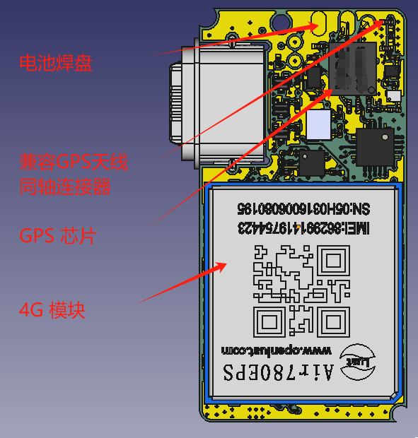
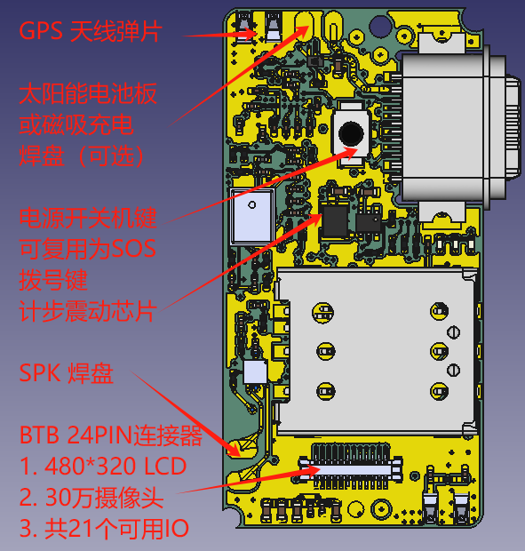

# 典型硬件设计指南

- [简介](index.md)
- [USB Boot烧录](usb_boot.md)
- [BTB扩展接口](btb.md)
- [休眠](sleep.md)
- [4G天线调试:](4g_ant.md)
- [GNSS天线调试](gnss_ant.md)
- [设计音频注意事项](audio.md)
- [调试音频方法](audio_debug.md)

Air201板子设计精致小巧，整板大小只有33mm×16.5mm，厚度0.8mm，这块板子上承载了4G通讯模块、GPS芯片、同轴连接器、预留电池焊盘、4G天线、GPS天线、音频解码芯片、喇叭焊盘、按钮、加速度传感器、自弹式SIM卡座、TYPE-C接口，还有BTB 24PIN连接器，可用于再扩展连接LCD、Camera、Uart、I2C等通讯外设。

## GPIO 复用表格

[GPIO复用表格.pdf](https://cdn.openluat-luatcommunity.openluat.com/attachment/20240415144933952_Air780EP&Air780EPV_GPIO_table_20240415.pdf)

## 板子主要接口分布图

## 堆叠图

[扩展IO的功能映射表](./file/HZ201P_10.8.wrl)

