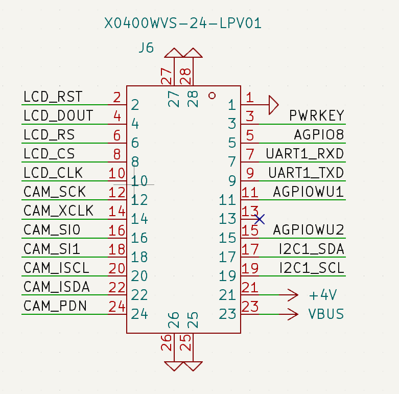

# 硬件资料

## 一、堆叠图

[Air201 堆叠图](./design/file/HZ201P_10.8.wrl)

## 二、外扩功能框位图

 

## 三、外扩功能映射表

[外扩功能映射表 ](./design/file/Air201_gpio_config.xlsx)

## 四、板对板连接器资料

[板对板连接器](./design/file/Air201_gpio_config.xlsx)

## 五、测试点介绍

