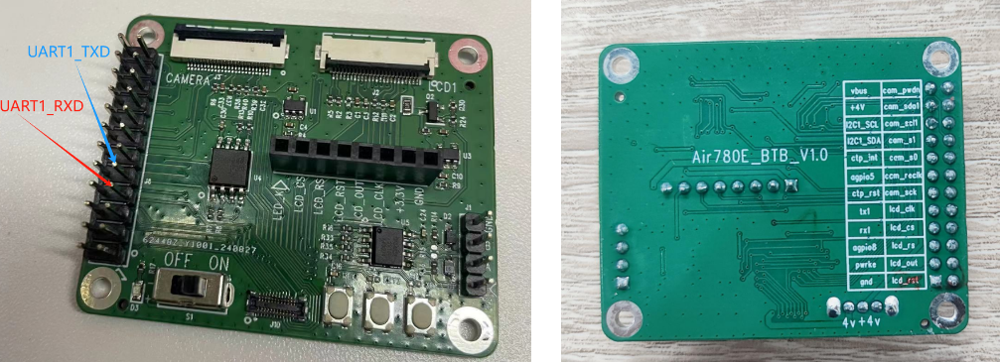
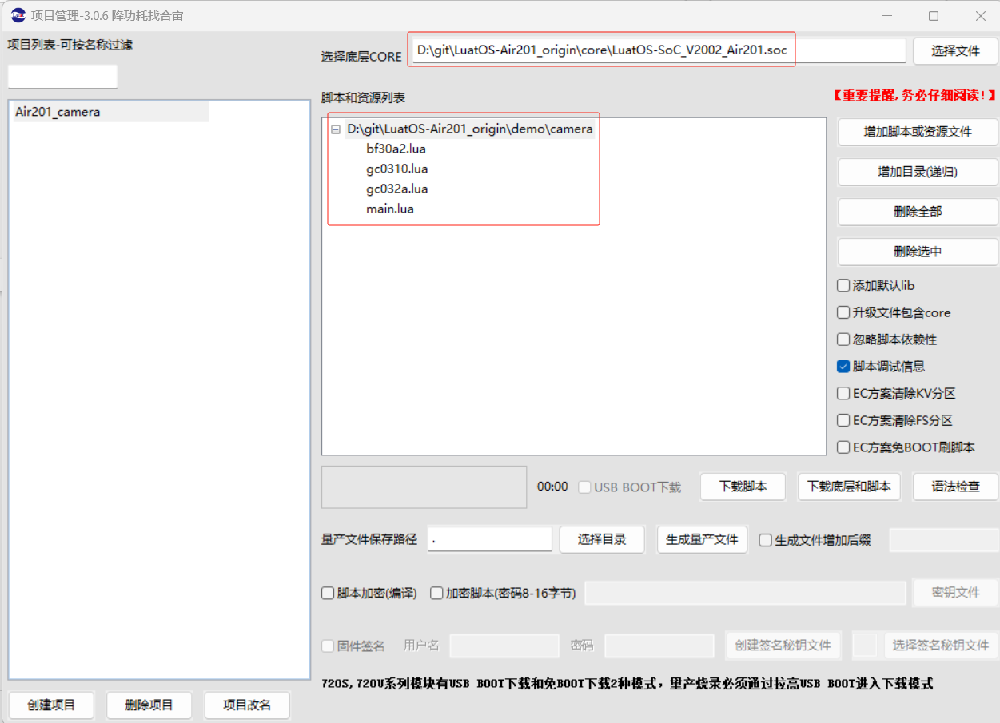
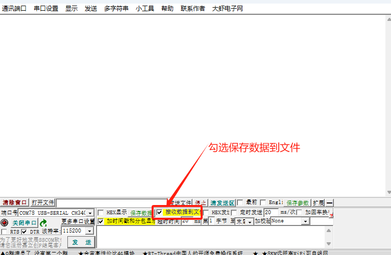
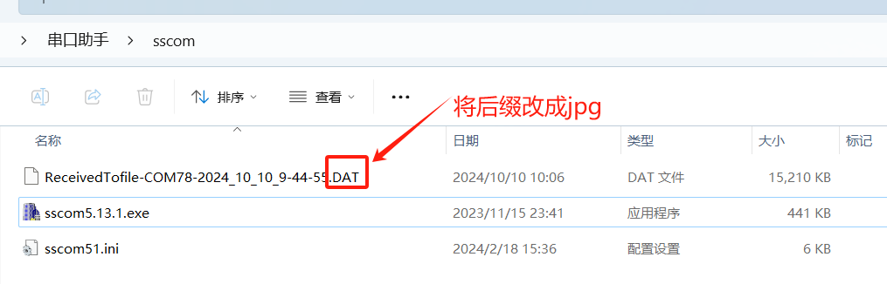
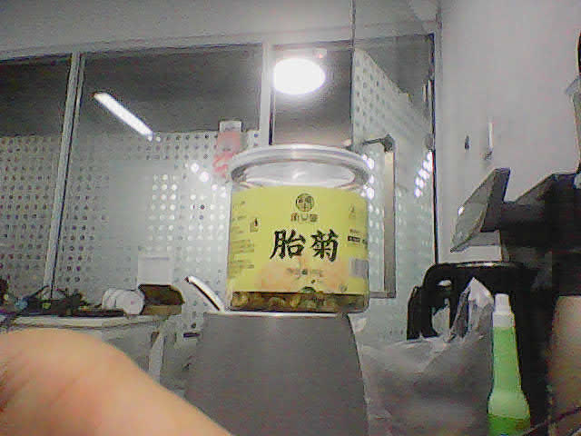

# 使用Air201做camera拍照的功能
Air201+扩展板+摄像头，可以实现拍照的功能，并且将照片保存到文件系统中，下面我们将开始帮助您如何从零上手，实现拍照的功能。

## 1, 搭建环境

在Luatools项目管理中新建一个项目，重新选择底层CORE和脚本。

### 1.1 **获取软件资料**

> 支持camera的固件：LuatOS-SoC_V2002_Air201.soc

   固件链接：https://gitee.com/openLuat/LuatOS-Air201/tree/master/core

   脚本链接：https://gitee.com/openLuat/LuatOS-Air201/tree/master/demo/camera

### 1.2 硬件资料
Air201开发板一块，扩展板一个，30W摄像头一个(驱动芯片：GC032A)

 
 

## 2, 调试代码

> **使用克隆的代码中 LuatOS-Air201\demo\record 的代码测试**

### 2.1 注册camera事件回调

```Lua
-- camera事件回调
camera.on(0, "scanned", function(id, str)
    if type(str) == 'string' then
        log.info("扫码结果", str)
    elseif str == false then
        log.error("摄像头没有数据")
    else
        log.info("摄像头数据", str)
        sys.publish("capture done", true)
    end
end)

```

### 2.2 初始化uart,后续可以通过串口将图片导出到电脑

```Lua
-- 注册串口
local uartid = 1 -- 根据实际设备选取不同的uartid
-- 初始化
local result = uart.setup(uartid, -- 串口id
115200, -- 波特率
8, -- 数据位
1 -- 停止位
)
```

### 2.3 完整例程展示

```Lua
PROJECT = "camerademo"
VERSION = "1.0.0"
-- 实际使用时选1个就行
-- require "bf30a2"
-- require "gc0310"
require "gc032a" -- 导入GC032A摄像头驱动库
sys = require("sys")
log.style(1)

--添加硬狗防止程序卡死
if wdt then
    wdt.init(9000)--初始化watchdog设置为9s
    sys.timerLoopStart(wdt.feed, 3000)--3s喂一次狗
end

pm.ioVol(pm.IOVOL_ALL_GPIO, 3300)

-- 注册串口
local uartid = 1 -- 根据实际设备选取不同的uartid
-- 初始化
local result = uart.setup(uartid, -- 串口id
115200, -- 波特率
8, -- 数据位
1 -- 停止位
)

-- camera事件回调
camera.on(0, "scanned", function(id, str)
    if type(str) == 'string' then
        log.info("扫码结果", str)
    elseif str == false then
        log.error("摄像头没有数据")
    else
        log.info("摄像头数据", str)
        sys.publish("capture done", true)
    end
end)

-- 初始化LCD，供后续将拍照的图片显示在LCD上，预览使用
lcd.init("st7735",{port = lcd.HWID_0,pin_dc = 0xff, pin_pwr = 0xff, pin_rst = 36,direction = 0,w = 128,h = 160,xoffset = 0,yoffset = 0})

sys.taskInit(function()
    io.mkdir("/photo/") -- 创建文件夹存放拍照图片
    local path = "/photo/capture.jpg"
    log.info("摄像头启动")
    local cspiId, i2cId = 1, 0
    local camera_id
    i2c.setup(i2cId, i2c.FAST)
    gpio.setup(5, 0) -- PD拉低

    -- camera_id = bf30a2Init(cspiId,i2cId,25500000,0,0)
    -- camera_id = gc0310Init(cspiId, i2cId, 25500000, 0, 0)
    camera_id = gc032aInit(cspiId,i2cId,24000000,0,0)
    camera.stop(camera_id)
    -- camera.preview(camera_id, true) -- 开启预览

    local rawbuff = zbuff.create(60 * 1024, 0, zbuff.HEAP_AUTO)
    while 1 do
        sys.wait(5000)
        log.debug("摄像头捕获图像")
        camera.capture(camera_id, path, 1) -- jpeg压缩质量，1最差，占用空间小，3最高，占用空间最大而且费时间，默认1
        result, data = sys.waitUntil("capture done", 30000)
        camera.stop(camera_id)
        local f = io.open(path, "r")
        if f then
            f:fill(rawbuff) --读取文件并填充到zbuff内
            f:close() -- 关闭文件
        end
        -- os.remove(path)

        -- 如需提取图片，则需将下面两行打开，通过串口保存文件在电脑查看
        uart.write(uartid, rawbuff) --找个能保存数据的串口工具保存成文件就能在电脑上看了, 保存文件后改后缀为JPG查看
        sys.wait(1000)
        rawbuff:resize(60 * 1024) -- 重新调整zbuff大小
        log.info(rtos.meminfo("sys"))
        log.info(rtos.meminfo("psram"))
    end
end)
```

## 3、烧录程序
开始下载
 

## 4，展示效果
> 本例展示拍照后将文件数据通过串口传到电脑，串口传送使用的UART1，故需要一个串口板连接扩展板的tX1、rX1,硬件连接见下图

 

> 同时还需找个能保存数据的串口工具保存成文件，本例使用的是SSCOM，默认保存文件到sscom文件夹内

 

> 烧录代码运行后，即可在sscom文件夹内看到拍的照片，记得将后缀改成.jpg

 

> 双击打开，效果如下

 
