# fota升级（远程升级）
通过前面从gitee仓库下拉后的代码文件中找到本次需要使用到的fota脚本，位置位于`\LuatOS-Air201\demo\fota`文件夹中，若没有找到该脚本，可能代码并非最新，请根据前面教学重新拉取。

本教程是通过使用`\LuatOS-Air201\demo\fota`下的fota脚本代码对Air201模块进行远程升级操作。操作分为通过合宙iot平台或者通过第三方自建服务器进行远程升级。升级文件可以仅升级脚本文件（script），也可以仅升级底层固件（core），以及脚本文件+底层固件同时升级。

> 固件地址：https://gitee.com/openLuat/LuatOS-Air201/tree/master/core
>
> 脚本地址：https://gitee.com/openLuat/LuatOS-Air201/tree/master/demo/fota

## 1，搭建环境

在Luatools工具项目管理中新建项目，重新选择底层固件和脚本文件。

也可以在原有项目下通过删除旧脚本、添加新脚本的方式进而实现不同功能。

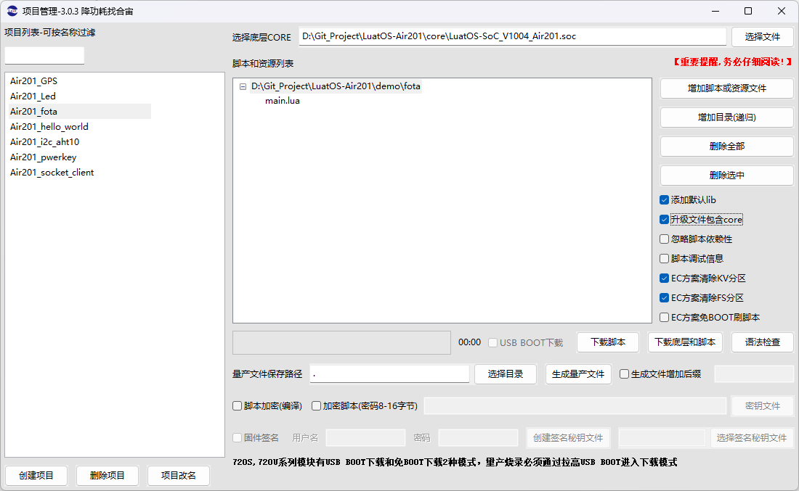 

## 2，通过合宙iot平台进行script+core升级

###  2.1 在iot平台创建项目

登录[合宙云平台](https://iot.openluat.com/cloud/main)如果没有账号，创建账号新建项目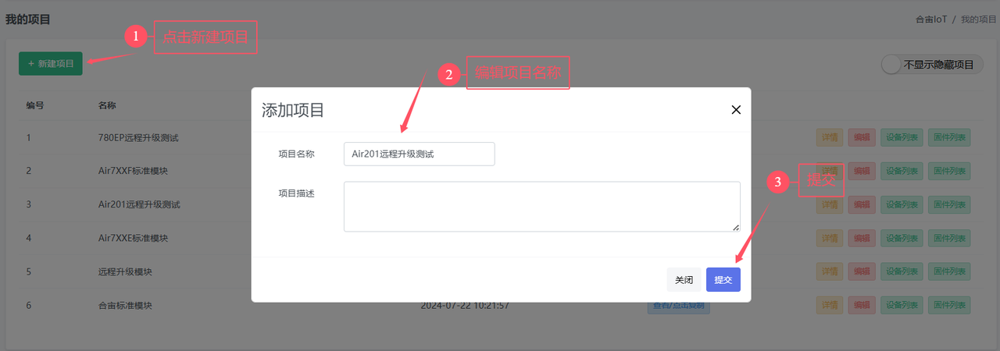 复制对应项目的PRODUCT_KEY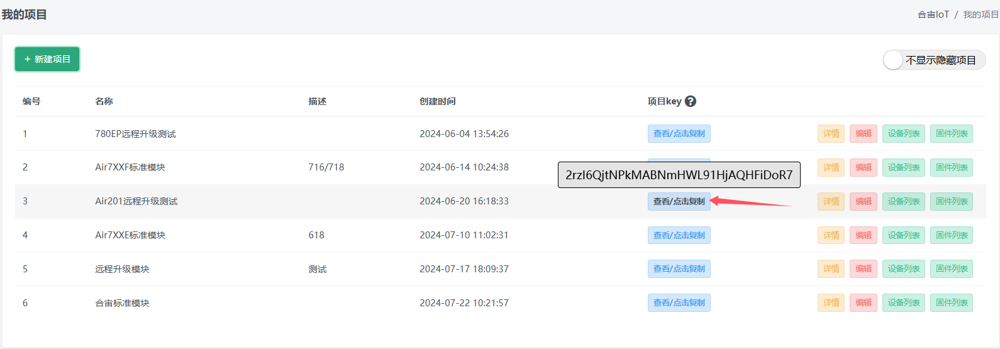

###  2.2 修改脚本，生成升级文件core说明

| core |         旧版本core          |           新版本core           |
| ---: | :-------------------------: | :----------------------------: |
| 例子 | LuatOS-SoC_V1003_EC718U.soc | socLuatOS-SoC_V1004_Air201.soc |
| 要求 | 1、大于等于旧版本core版本号 | 2、新旧版本core支持的功能相同  |

|     script  main.lua     | 旧版本 （模块端本地烧录的） | 新版本 （生成的量产文件，远程升级包） |                    要求                     |
| :---------------------------: | :------------------------------: | :----------------------------------------: | :-----------------------------------------: |
|   PROJECT （项目名称）   |             fotademo             |                  fotademo                  |              新旧版本保持一致               |
|  VERSION （软件版本号）  |              1.0.0               |                   1.0.1                    |            大于等于旧版本VERSION            |
| PRODUCT_KEY （项目密钥） | 2rzI6QjtNPkMABNmHWL91HjAQHFiDoR7 |      2rzI6QjtNPkMABNmHWL91HjAQHFiDoR7      | 和iot平台创建的产品 ProductKey保持一致 |

###  2.3 按照新版本需求，修改main.lua

 如下图所示，PROJECT和PRODUCT_KEY保持不变，PRODUCT_KEY需和服务器保持一致，VERSION修改为1.0.1

> 注意事项：
>
> 1. main.lua 内填写版本号要符合 x.y.z 形式, 其中 x/y/z 均为数值, 不限于个位数；
> 1. 若fota使用合宙iot平台, 版本号中的 y 会被忽略, 推荐写0, 务必留意

###  2.4 使用Luatools工具生成bin文件差分包

**注意：只有Luatools版本2.1.89以上支持生成bin文件差分包，低版本仅支持生成sota文件只升级脚本时的差分包制作流程   修改好main.lua后，根据下方图示生成量产文件，其中就包含了bin文件差分包!**

点击生成量产文件后，Luatools工具会根据你选择的目录下自动创建`\SOC量产及远程升级文件\Air201` ，bin文件差分包便在此文件夹里面。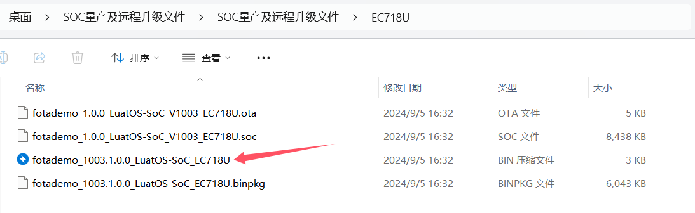
  如果你是只打算进行脚本升级，那么下方固件升级便不用再看了，直接跳转到2.5节即可。需要升级底层固件的差分包制作教程生成新版本的量产固件
根据新旧固件生成bin文件差分包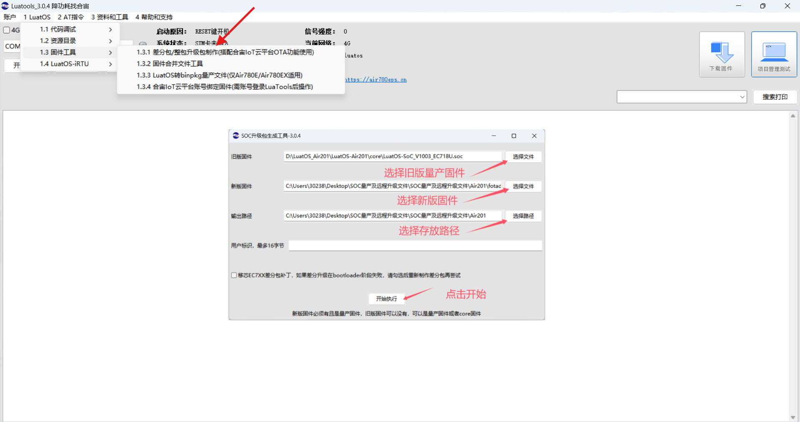    箭头所指即为生成的bin文件差分包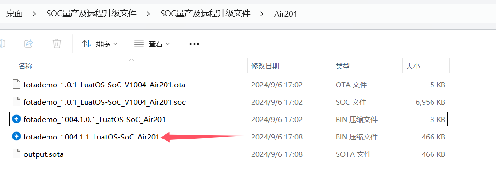

###  2.5 在iot平台配置升级包

进入iot平台，打开我的项目->固件列表->创建固件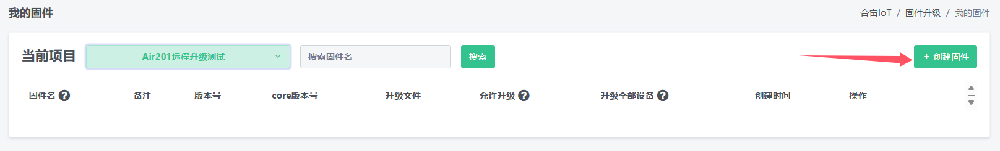选择新固件升级文件   注意：此时的固件名要与模块现在上电后的固件名保持一致，否则会导致远程升级不通过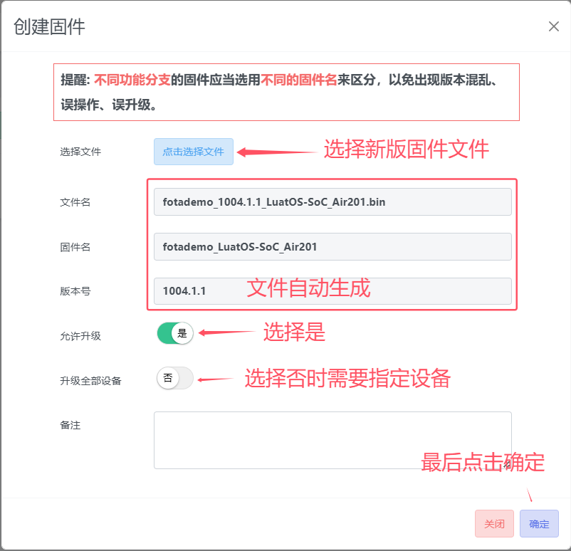如果升级全部设备选项选择的是否，则需要添加指定设备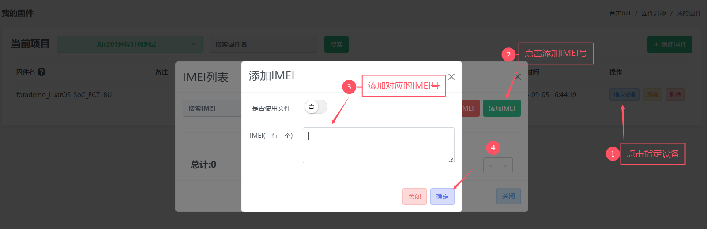

###  2.6 模块开机，完成升级
## 3，通过第三方自建服务器进行升级

###  3.1 准备模块中使用的旧版本core升级文件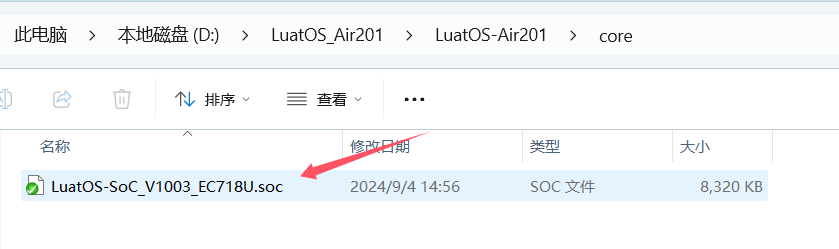
3.2 使用Luatools分别生成新旧版本的升级包  点击生成量产文件后，Luatools工具根据你选择的目录下自动创建`\SOC量产及远程升级文件\Air201` ，生成的升级包便在此文件夹里面。

###  3.3 使用Luatools工具生成差分文件  

使用luatools生成升级文件，无论core是否需要升级，升级文件必须包含core，因为差分会用到，使用luatools内的soc差分工具生成即可。  生成对应差分包如下图所示，注意差分包大小不能超过480k。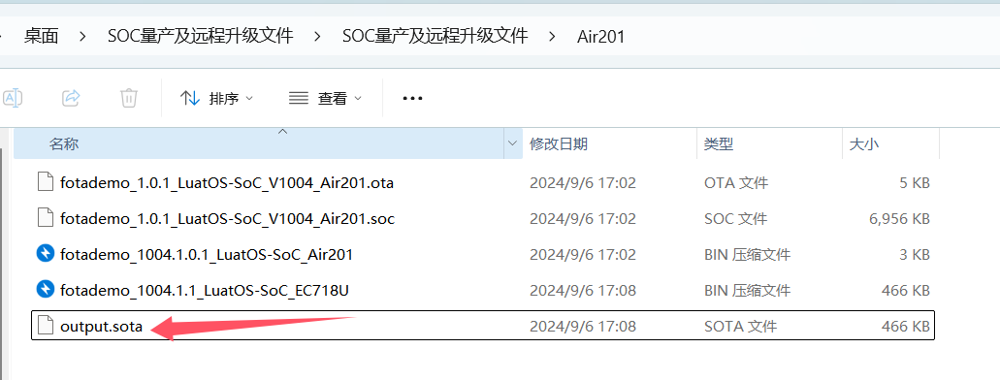

###  3.4 差分包上传到第三方自建服务器 

 lua固件默认支持HTTP获取升级包  在main.lua中做如下修改，打开使用自建服务器进行升级部分代码，填写对应的url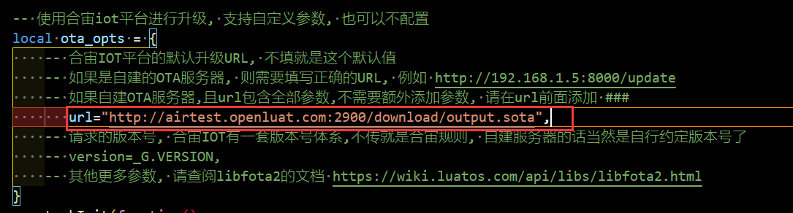

###  3.5 使用其他协议实现自建服务器远程升级

   参考脚本库中配置。无论使用哪种协议，远程升级的关键是获取正确的升级固件包。
