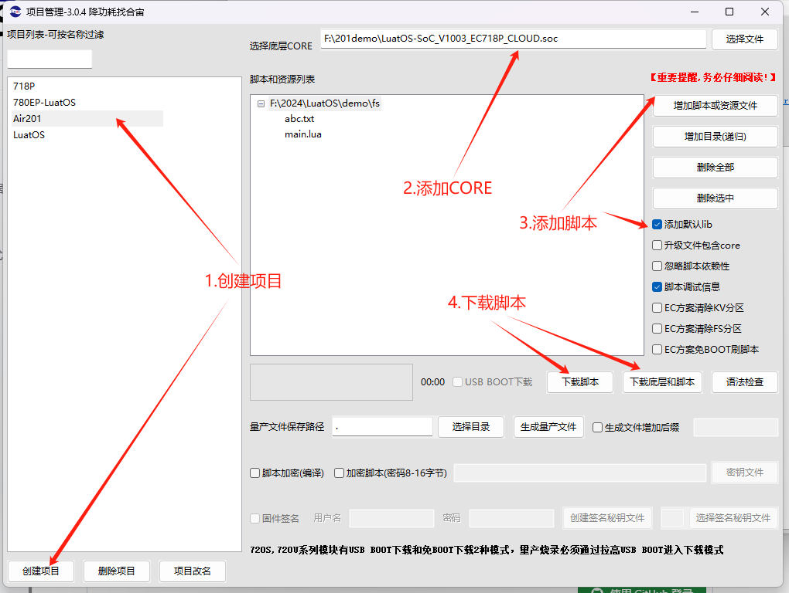

# Air201文件系统的使用方法
### 1.文件系统是为了解决什么问题产生的?

Cat.1通讯模块的文件系统是为了支持数据存储与管理、支持远程管理和配置以及保障数据安全性而产生的

### 2.现在有哪几种文件系统，优缺点是啥

在嵌入式系统和物联网设备中，常见的文件系统类型包括FAT（File Allocation Table）、YAFFS（Yet Another Flash File System）、JFFS2（Journaling Flash File System version 2）以及专为嵌入式系统设计的文件系统如SquashFS和Littlefs等。

以下是对这些文件系统类型在Cat.1通讯模块中可能应用的简要概述及其优缺点：

1. FAT（File Allocation Table）

优点：

- 广泛兼容性：FAT文件系统在各种操作系统和设备上都具有很高的兼容性。
- 简单易用：文件管理和访问相对简单，易于理解和实现。

缺点：

- 文件系统开销大：对于嵌入式系统和小型存储设备来说，FAT的文件系统开销可能较大，包括空间占用和访问速度。
- 不支持高级特性：如日志记录、权限管理等高级文件系统特性。

1. YAFFS/YAFFS2（Yet Another Flash File System）

优点：

- 专为闪存设计：优化了闪存的使用，减少了写操作对闪存的损耗。
- 高效性能：在读写速度上通常优于FAT，特别是在嵌入式系统中。

缺点：

- 兼容性较差：相比FAT，YAFFS的兼容性较差，可能不是所有操作系统都支持。
- 复杂度高：实现和维护相对复杂，需要更多的技术支持。

1. JFFS2（Journaling Flash File System version 2）

优点：

- 日志记录：通过日志记录机制，提高了文件系统的可靠性和数据一致性。
- 高效管理：针对闪存设备进行了优化，提高了数据访问和管理效率。

缺点：

- 复杂度高：与YAFFS类似，JFFS2的实现和维护也较为复杂。
- 资源占用：相比其他文件系统，JFFS2可能会占用更多的系统资源。

1. SquashFS

优点：

- 高度压缩：SquashFS是一种高度压缩的文件系统，可以显著减少存储空间的需求。
- 只读访问：由于其只读特性，使得系统更加稳定和安全。

缺点：

- 只读限制：无法对文件系统进行写操作，限制了其在需要频繁修改数据的场景中的应用。
- 兼容性：虽然在一些嵌入式系统中得到应用，但并非所有环境都支持SquashFS。

1. LittleFS

优点：

- 轻量级和高效：LittleFS设计时考虑了8位和16位MCU，对RAM和ROM的需求都非常低，能够在极小型设备上运行。

1. 它的日志结构化设计最小化了写入放大，从而提高了闪存的使用寿命。

- 错误处理和恢复：内置CRC校验机制，确保数据的完整性，即使在电源突然断电或硬件故障的情况下也能保持数据安全。

  - 1.  支持掉电恢复，即在写入时即使复位或掉电也能恢复到上一个正确的状态。

缺点:

性能和磨损均衡的权衡：

- LittleFS的磨损均衡策略在延长闪存寿命的同时，可能需要在性能和磨损分布之间做出权衡。较大的磨损均衡值可以提高性能，但可能导致磨损分布不均匀

### 3.合宙选择的文件系统优势是啥

合宙选择LittleFS作为主文件系统, 并通过VFS扩展支持其他文件系统

LittleFS文件系统是由ARM公司（特别是其mbedOS团队）开发的一款专为微控制器（MCU）和物联网（IoT）设备设计的轻量级、健壮的文件系统。它针对资源受限的环境进行了优化，提供了多种优势和一定的劣势。

### 优势

1. 轻量级和高效：
   1. LittleFS设计时考虑了8位和16位MCU，对RAM和ROM的需求都非常低，能够在极小型设备上运行。
   2. 它的日志结构化设计最小化了写入放大，从而提高了闪存的使用寿命。
2. 闪存友好：
   1. LittleFS通过日志结构和Wear-Leveling（磨损均衡）策略，有效降低了对闪存的擦写次数，延长了存储设备的寿命。
   2. 适用于如W25QXX系列的SPI接口flash等存储设备。
3. 错误处理和恢复：
   1. 内置CRC校验机制，确保数据的完整性，即使在电源突然断电或硬件故障的情况下也能保持数据安全。
   2. 支持掉电恢复，即在写入时即使复位或掉电也能恢复到上一个正确的状态。
4. 易用性和可移植性：
   1. LittleFS使用C语言编写，遵循BSD许可，可以在多个平台和操作系统上轻松移植。
   2. 提供POSIX兼容API，使得开发者可以用熟悉的编程风格来操作文件系统，降低了学习曲线。
5. 无序文件操作：
   1. 允许随机读写，而无需预先知道文件的大小或位置，这在嵌入式系统中非常有用。
6. 可定制性：
   1. LittleFS支持高度定制，可以适应各种大小的闪存块和扇区，以及不同的页面大小。

### 劣势

1. 与Windows的不兼容性：
   1. LittleFS目前不兼容Windows操作系统，这可能在某些应用场景下造成不便。
2. 性能和磨损均衡的权衡：
   1. LittleFS的磨损均衡策略在延长闪存寿命的同时，可能需要在性能和磨损分布之间做出权衡。较大的磨损均衡值可以提高性能，但可能导致磨损分布不均匀。
      - 

Air201的文件系统分区存储方式使用Block的存储策略：将文件分割成多个数据块（blocks）,每个块是4k字节，每个数据块可以独立存储和处理。

Air201默认分配的文件系统分区大小为 512KB字节，在代码中也可通过 fs.fsstat("/") 实时获取文件系统的空间大小。

```Lua
log.info("fsstat", fs.fsstat("/"))

-- 返回结果：
--打印举例：      获取结果   总block数量  已使用block数量   block分配大小   文件系统类型
 I/user.fsstat   true       128         4                4096          lfs
 
 总block数量*单个block的大小 = 文件系统总空间 128 * 4k = 512k
 已使用block数量*单个block的大小 = 文件系统已使用的空间 4 * 4k = 16k
 (总block数量-已使用的block数量)*单个block的大小 = 未使用的空间 (128-4)*4k = 496k
```

## 1，环境搭建

###  1.1 创建项目



## 2，编写代码

###  2.1 代码基本配置

我们在编写一个新脚本的时候，首先应该做的操作就是把框架搭好，有一个合理的框架才能编写出完美的代码。

以下这段代码对脚本做了命名、添加使用库、创建任务线程等操作：

```Lua
-- LuaTools需要PROJECT和VERSION这两个信息
PROJECT = "fsdemo"
VERSION = "1.0.0"

log.info("main", PROJECT, VERSION)

-- sys库是标配
_G.sys = require("sys")

-- ...
-- local function fs_test() 
-- ...
-- 编写代码操作
-- ...
-- end
-- ...

sys.taskInit(function()
    -- 为了显示日志,这里特意延迟一秒
    -- 正常使用不需要delay
    sys.wait(1000)
    fs_test()
end)

-- 用户代码已结束---------------------------------------------
-- 结尾总是这一句
sys.run()
-- sys.run()之后后面不要加任何语句!!!!!
```

### 2.2 添加看门狗

注意：我们在进行文件系统的操作，可能会出现空间不足死机的情况，我们可以添加看门狗，来避免程序卡死：

```Lua
--添加硬狗防止程序卡死
if wdt then
    wdt.init(9000)--初始化watchdog设置为9s
    sys.timerLoopStart(wdt.feed, 3000)--3s喂一次狗
end
```

### 2.3 读写操作

这段代码对文件进行了打开读取内容和写入内容的操作，以便于我们更好的了解文件系统的读写操作。

```Lua
-- 根目录/是可写
    local f = io.open("/boot_time", "rb") -- 首先尝试以二进制读模式（"rb"）打开文件
    local c = 0
    if f then -- 如果文件成功打开
        local data = f:read("*a") -- 读取文件全部内容到 data 变量中
        log.info("fs", "data", data, data:toHex()) -- 以十六进制打印文件内容
        c = tonumber(data) -- 将其内容转换为数字后存入c中
        f:close() -- 关闭文件
    end
    log.info("fs", "boot count", c) -- 打印c当前的值，也就是重启次数
    c = c + 1 -- 增加c数值
    f = io.open("/boot_time", "wb") -- 再以二进制写模式（"rw"）打开文件
    --if f ~= nil then
    log.info("fs", "write c to file", c, tostring(c))
    f:write(tostring(c)) -- 再以字符串形式将c的值写回文件
    f:close()
    --end

    -- 将"ABCDEFG"写入"abc.txt"文件中，并打印出结果
    log.info("io.writeFile", io.writeFile("/abc.txt", "ABCDEFG")) 

    -- 读取 "abc.txt"中文件并打印结果
    log.info("io.readFile", io.readFile("/abc.txt"))
    local f = io.open("/abc.txt", "rb") -- 以二进制读模式（"rb"）打开文件
    local c = 0
    if f then -- 如果文件成功打开
        local data = f:read("*a") -- 读取文件全部内容到 data 变量中
        log.info("fs", "data2", data, data:toHex()) -- 以十六进制打印文件内容
        f:close() -- 关闭文件
    end
```

运行这段代码得到的结果如下图打印


### 2.4 文件seek操作

下面为大家演示seek的操作

```Lua
-- seek测试
    local f = io.open("/123.txt", "rb") -- 以二进制读模式（"rb"）打开文件
    if f then
        local data = f:read("*a")
        log.info("fs", "123.txt data", data, data:toHex())
        f:close()
    end

    local f = io.open("/123.txt", "wb") -- 以二进制写模式（"wb"）打开文件
    if f then
        f:write("ABCDEFG") -- 写入ABCDEFG
        f:seek("set", 0)  -- 将文件指针移动到文件开头
        f:write("12345")  -- 写入新数据
        f:seek("end", 0)  -- 将文件指针移回到文件结尾
        f:write("hello")  -- 写入新数据
        f:close()  -- 关闭文件
    end
```

如果没有加入seek的操作，这段代码运行结果应该是"ABCDEFG12345hello"，但是因为seek将文件指针移动，导致结果输出不同


## 3，课后习题

好，给您留一个课后习题：如何将TCP得到的数据存到文件系统呢？ 
