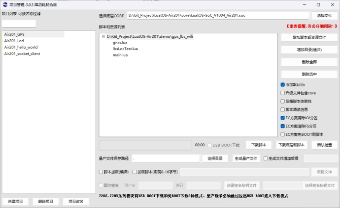

# 使用Air201的定位功能
## 1, 搭建环境

和上面的教程步骤一样，可以在Luatools项目管理中新建一个项目，重新选择底层CORE和脚本

或者在原有项目的基础上，不更换CORE，将原来的脚本删除，添加为demo/gps_lbs_wifi的脚本。
源码demo：[合宙Luat/LuatOS-Air201/gps_lbs_wifi](https://gitee.com/openLuat/LuatOS-Air201/tree/master/demo/gps_lbs_wifi)

 

## 2, 定位介绍

Air201支持三种定位，分别是LBS定位，WIFI定位，GPS定位


## 3, GPS定位

###  3.1 搭建环境

使用Air201开发板和一个开通有流量的sim卡。

注意：室内没有信号，无法成功定位！！！

###  3.2 写代码

（1） 打开gps的供电和复位引脚
```Lua
local function gnssPower(onoff)  
    gpio.setup(26, onoff and 1 or 0)   
    gpio.setup(25, onoff and 1 or 0)  end
```
（2）开机后初始化一些gps和打印数据的端口，清空一下历史定位数据，设置端口参数，更新星历，绑定端口
```Lua
Lua sys.taskInit(function()   
    log.info("GPS", "start")   -- 开启gps的供电引脚   
    gnssPower(isOn);    
    local uartId = 2   
    libgnss.clear() -- 清空数据,兼初始化   
    -- 设置端口2波特率为115200   
    uart.setup(uartId, 115200)    
    sys.wait(200) -- GPNSS芯片启动需要时间   
    -- 更新星历，使用agps辅助定位功能   
    gnss.agps()    -- 调试日志,可选   
    libgnss.debug(true)   -- 绑定读取gnss数据的端口   
    libgnss.bind(2) 
    end)

```
（3） 订阅gnss状态，gnss有两种状态，FIXED-定位成功和LOSE-定位丢失。

```Lua 
    -- 订阅GNSS状态编码
    sys.subscribe("GNSS_STATE", function(event, ticks)   
    -- event取值有    
    -- FIXED 定位成功   
    -- LOSE  定位丢失   
    -- ticks是事件发生的时间,一般可以忽略   
    log.info("gnss", "state", event, ticks)   
    if event == "FIXED" then     
    -- 当定位成功时，打印位置字符串     
        local locStr = libgnss.locStr()     
        log.info("gnss", "locStr", locStr)     
        isFix = true  
     elseif event == "LOSE" then     
     -- 当定位失败时，打印个日志提示一下     
     log.info("gnss", "no fix")   
     end 
end)
```
（4） 写入星历，即apgs辅助定位。

```Lua 
local function doAgps()
    -- 首先, 发起位置查询
    local lat, lng
    if mobile then
        -- 查询基站信息
        mobile.reqCellInfo(6)
        -- 等待基站数据已更新的消息，超时时间6秒
        sys.waitUntil("CELL_INFO_UPDATE", 6000)
        -- 包含一下lbsLoc2库
        local lbsLoc2 = require("lbsLoc2")
        -- 执行定位请求，返回坐标的纬度和精度
        lat, lng = lbsLoc2.request(5000)
        log.info("lbsLoc2", lat, lng)
        if lat and lng then
            -- 确保lat和lng是数字
            lat = tonumber(lat)
            lng = tonumber(lng)
            log.info("lbsLoc2", lat, lng)
        end
    end
    if not lat then
        log.info("not lat")
        -- 获取最后的本地位置
        local locStr = io.readFile("/hxxtloc")
        if locStr then
            local jdata = json.decode(locStr)
            if jdata and jdata.lat then
                lat = jdata.lat
                lng = jdata.lng
            end
        end
    end
    -- 然后, 判断星历时间和下载星历
    local now = os.time()
    local agps_time = tonumber(io.readFile("/hxxt_tm") or "0") or 0
    log.info("now-->",now,"---agps_time-->",agps_time)
    if now - agps_time > 3600 then
        -- local url = "http://download.openluat.com/9501-xingli/HXXT_GPS_BDS_AGNSS_DATA.dat" -- GPS和北斗
        local url = "http://download.openluat.com/9501-xingli/HXXT_ALL_AGNSS_DATA.dat"        -- 全星历

        local code = http.request("GET", url, nil, nil, {
            dst = "/hxxt.dat"
        }).wait()
        if code and code == 200 then
            log.info("下载星历成功", url)
            io.writeFile("/hxxt_tm", tostring(now))
        else
            log.info("下载星历失败", code)
        end
    else
        log.info("星历不需要更新", now - agps_time)
    end
    -- 写入星历
    local agps_data = io.readFile("/hxxt.dat")
    if agps_data and #agps_data > 1024 then
        log.info("写入星历数据", "长度", #agps_data)
        for offset = 1, #agps_data, 512 do
            log.info("gnss", "AGNSS", "write >>>", #agps_data:sub(offset, offset + 511))
            sys.wait(100) -- 等100ms反而更成功
        end
    else
        log.info("没有星历数据")
        isFix = false
        return
    end

    -- 写入参考位置
    -- "lat":23.4068813,"min":27,"valid":true,"day":27,"lng":113.2317505
    if not lat or not lng then
        -- lat, lng = 23.4068813, 113.2317505
        log.info("没有GPS坐标", lat, lng)
        isFix = false
        return -- TODO 暂时不写入参考位置
    end
    if socket.sntp then
        --时间同步
        socket.sntp()
        --等待时间同步成功消息
        sys.waitUntil("NTP_UPDATE", 1000)
    end
    --获取日期函数，参数1是格式化字符串
    local date = os.date("!*t")
    if date.year >= 2024 then
        local str = string.format("$AIDTIME,%d,%d,%d,%d,%d,%d,000", date["year"], date["month"], date["day"], date["hour"], date["min"], date["sec"])
        log.info("参考时间", str)
        sys.wait(20)
    end

    local str = string.format("$AIDPOS,%.7f,%s,%.7f,%s,1.0\r\n", lat > 0 and lat or (0 - lat), lat > 0 and 'N' or 'S', lng > 0 and lng or (0 - lng), lng > 0 and 'E' or 'W')
    log.info("写入AGPS参考位置", str)
    sys.wait(200)
    local times = 0
    while times < 120 do
        if isFix then
            break
        end
        times = times + 1
        sys.wait(1000)
    end
    sys.wait(6000)
    isFix = false
    -- 两小时更新一次星历吧
    sys.timerStart(gnss.agps, 2 * 60 * 60 * 1000)
end

local agpsTaskHandle

-- 下载并写入星历
function gnss.agps()
    if not agpsTaskHandle or coroutine.status(agpsTaskHandle) == "dead" then
        agpsTaskHandle = sys.taskInit(doAgps)
    end
end
```

###  3.3 展示效果

定位成功后，获取位置字符串。

 

## 4, LBS+wifi定位

###  4.1 初始化

等待联网，初始化wlan，查询基站信息，等待基站数据更新，扫码wifi频段

```Lua 
sys.taskInit(function()
    sys.waitUntil("IP_READY", 30000)
    wlan.init()
    while 1 do
        --发起基站信息查询,含临近小区
        mobile.reqCellInfo(15)
        -- 等待基站数据已更新的消息，超时时间3秒
        sys.waitUntil("CELL_INFO_UPDATE", 3000)
        -- 扫描wifi频段
        wlan.scan()
        sys.wait(60000)
    end
end)
```
###  4.2 wifi定位

 ```Lua 
-- 注意, 免费版的基站+wifi混合定位,大部分情况下只会返回基站定位的结果
-- 收费版本请咨询销售
-- 订阅WLAN扫描成功的消息
sys.subscribe("WLAN_SCAN_DONE", function ()
    -- 获取wlan扫描结果
    local results = wlan.scanResult()
    log.info("scan", "results", #results)
    if #results > 0 then
        local reqWifi = {}
        --wlan扫描成功，打印扫描结果
        for k,v in pairs(results) do
            log.info("scan", v["ssid"], v["rssi"], v["bssid"]:toHex())
            local bssid = v["bssid"]:toHex()
            bssid = string.format ("%s:%s:%s:%s:%s:%s", bssid:sub(1,2), bssid:sub(3,4), bssid:sub(5,6), bssid:sub(7,8), bssid:sub(9,10), bssid:sub(11,12))
            reqWifi[bssid]=v["rssi"]
        end
        -- 发送基站定位请求
        lbsLoc.request(getLocCb,nil,nil,nil,nil,nil,nil,reqWifi)
    else
        -- 没有wifi数据,进行基站定位
        lbsLoc.request(getLocCb) 
    end
end)
 ```
###  4.3 基站定位

 ```Lua 
-- 功能:获取基站对应的经纬度后的回调函数
-- 参数:-- result：number类型，0表示成功，1表示网络环境尚未就绪，2表示连接服务器失败，3表示发送数据失败，4表示接收服务器应答超时，5表示服务器返回查询失败；为0时，后面的5个参数才有意义
-- lat：string类型，纬度，整数部分3位，小数部分7位，例如031.2425864
-- lng：string类型，经度，整数部分3位，小数部分7位，例如121.4736522
-- addr：目前无意义
-- time：string类型或者nil，服务器返回的时间，6个字节，年月日时分秒，需要转为十六进制读取
    -- 第一个字节：年减去2000，例如2017年，则为0x11
    -- 第二个字节：月，例如7月则为0x07，12月则为0x0C
    -- 第三个字节：日，例如11日则为0x0B
    -- 第四个字节：时，例如18时则为0x12
    -- 第五个字节：分，例如59分则为0x3B
    -- 第六个字节：秒，例如48秒则为0x30
-- locType：numble类型或者nil，定位类型，0表示基站定位成功，255表示WIFI定位成功
local function getLocCb(result, lat, lng, addr, time, locType)
    log.info("testLbsLoc.getLocCb", result, lat, lng)
    -- 获取经纬度成功
    if result == 0 then
        log.info("服务器返回的时间", time:toHex())
        log.info("定位类型,基站定位成功返回0", locType)
    end
    -- 广播给其他需要定位数据的task
    -- sys.publish("lbsloc_result", result, lat, lng)
end
 ```
###  4.4 展示效果

因为使用的免费版，所以只返回的基站定位结果，

基站定位成功后，会返回经纬度和服务器返回时间

 

## 5, 课后习题

好，给您留一个课后习题：怎么将定位的数据，通过TCP上传到服务器呢？

 
