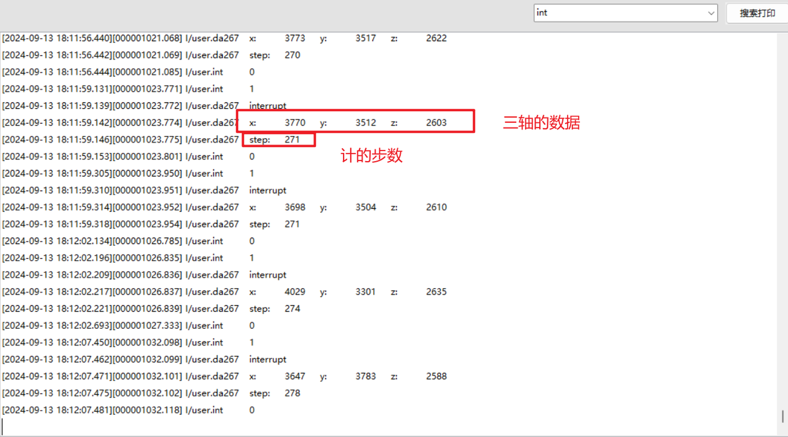

# Air201的gsensor传感器
## 1, 搭建环境
此时也可以在Luatools项目管理中新建一个项目，重新选择底层CORE和脚本
或者在原有项目的基础上，不更换CORE，将原来的脚本删除，添加为demo/da267的脚本。
### 1.1 软件资料
   固件链接：https://gitee.com/openLuat/LuatOS-Air201/tree/master/core
   源码脚本链接：https://gitee.com/openLuat/LuatOS-Air201/tree/master/demo/da267
### 1.2硬件资料
Air201开发板一块即可。
## 2，编写代码
### 2.1 main.lua文件说明
除了常规配置外，就增加了打开gsensor传感器的供电引脚和添加了da267库。
 ```Lua 
-- Luatools需要PROJECT和VERSION这两个信息
PROJECT = "Air201_da267"
VERSION = "1.0.0"
log.info("main", PROJECT, VERSION)
-- 引入必要的库文件(lua编写), 内部库不需要require
sys = require "sys"
sysplus = require("sysplus")

-- gnss的备电 和 gsensor的供电
local vbackup = gpio.setup(24, 1)

require "da267"

da267 = require "da267"

--起一个task，读取da267的数据
sys.taskInit(function()
    da267.da267Data()
end)

-- 用户代码已结束---------------------------------------------
-- 结尾总是这一句
sys.run()
 ```
### 2.2 da267.lua文件说明
初始化da267，通过给它发指令来设置它的i2c配置，测量分辨率、范围、模式和中断配置等。然后根据中断引脚来读取数据。
 ```Lua 
local da267 = {}

local i2cId = 1
local da267Addr = 0x26
local intPin = 39
local function ind()
    --打印管脚电平
    log.info("int", gpio.get(intPin))
    --如果检测到管脚电平为1，则触发中断
    if gpio.get(intPin) == 1 then
        log.info("da267", "interrupt")
        --读取x，y，z轴的数据
        i2c.send(i2cId, da267Addr, 0x02, 1)
        local data = i2c.recv(i2cId, da267Addr, 6)
        if data and #data == 6 then
            local xl, xm, yl, ym, zl, zm = string.byte(data, 1, 1), string.byte(data, 2, 2), string.byte(data, 3, 3), string.byte(data, 4, 4), string.byte(data, 5, 5), string.byte(data, 6, 6)
            local x, y, z = (xm << 8 | xl ) >> 4, (ym << 8 | yl) >> 4, (zm << 8 | zl ) >> 4
            log.info("da267", "x:", x, "y:", y, "z:", z)
        else
            sys.publish("RESTORE_GSENSOR")
        end
        --读取计步的数据
        i2c.send(i2cId, da267Addr, 0x0D, 1)
        local data = i2c.recv(i2cId, da267Addr, 2)
        if data and #data == 2 then
            local xl, xm = string.byte(data, 1, 1), string.byte(data, 2, 2)
            local step = ((xl << 8) + xm) // 2
            log.info("da267", "step:", step)
            sys.publish("STEP_COUNTER", step)
        else
            sys.publish("RESTORE_GSENSOR")
        end
    end
end
gpio.setup(intPin, ind)

--初始化da267
local function init()
    --关闭i2c
    i2c.close(i2cId)
    --重新打开i2c,i2c速度设置为低速
    i2c.setup(i2cId, i2c.SLOW)
    --设置传感器的i2c配置
    i2c.send(i2cId, da267Addr, {0x00, 0x24}, 1)
    sys.wait(20)
    --设置芯片的分辨率、测量范围、和模式等。
    i2c.send(i2cId, da267Addr, {0x0F, 0x00}, 1)
    i2c.send(i2cId, da267Addr, {0x11, 0x34}, 1)
    i2c.send(i2cId, da267Addr, {0x10, 0x07}, 1)

    sys.wait(50)

    -- int set1，设置INT_SET1
    i2c.send(i2cId, da267Addr, {0x16, 0x87}, 1)

    -- init active interrupt
    i2c.send(i2cId, da267Addr, {0x38, 0x03}, 1)
    i2c.send(i2cId, da267Addr, {0x39, 0x05}, 1)
    i2c.send(i2cId, da267Addr, {0x3A, 0x05}, 1)
    i2c.send(i2cId, da267Addr, {0x3B, 0x05}, 1)
    i2c.send(i2cId, da267Addr, {0x19, 0x04}, 1)

    -- enable active
    i2c.send(i2cId, da267Addr, {0x11, 0x30}, 1)

    -- init step counter
    i2c.send(i2cId, da267Addr, {0x33, 0x80}, 1)
end

--读取da267的数据
function da267.da267Data()
    --[[io外设功能复用选择
        @param1 将I2C功能
        @param2 复用到总线序号为i2cId
        @param3 pad号为23
        @param4 复用功能序号为2
        @param5 不是输入功能
    ]]
    mcu.altfun(mcu.I2C, i2cId, 23, 2, 0)
    mcu.altfun(mcu.I2C, i2cId, 24, 2, 0)
    while true do
        init()
        while true do
            --等待da267传感器数据不正确，复位的消息
            local result = sys.waitUntil("RESTORE_GSENSOR", 60 * 1000)
            --如果接收到了复位消息，则跳出读取数据的循环，重新执行init()函数
            if result then
                break
            end
            --读取da267传感器的型号值，默认是0x13，如果读取错误则跳出循环重新初始化
            i2c.send(i2cId, da267Addr, 0x01, 1)
            local data = i2c.recv(i2cId, da267Addr, 1)
            if not data or data == "" or string.byte(data) ~= 0x13 then
                break
            end
        end
    end
end

return da267
 ```
## 3，示例效果
 
