# hello world教程
本章节教你怎么用简单的几个步骤，就可以完成一个helloworld项目，让合宙的4G模组，轻松打印hello world！

要达到这个目标， 你只需要学会用一个名字叫做 Luatools 的PC工具，往模组烧录固件和脚本，并用这个同样的 Luatools， 可以查看模组的打印日志。

一切就是这么的简单！

## 1, 必须先要告诉你的一些废话

这里，先要告诉你一些前提条件，虽然听着像是废话， 但是如果你不知道的话，可能后面会比较懵逼，所以还是希望你能够认真看一看这一节。

这个项目的产品定义是：  模组每隔3秒，就往串口输出一次  “ hello world” 字符串。

要想达到这个目的， 这里有必要先介绍一下 LuatOS 在合宙4G模组的运行原理：

合宙的 4G模组， 除了运行4G协议栈之外， 还植入了5.3版本的Lua虚拟机，以及内置的一个脚本代码区。 

4G模组上电之后， 虚拟机会去代码区读取脚本代码的main入口， 并执行这个 main入口函数。

你只需要用 Lua 脚本改写 main 入口函数，并把这个脚本烧录到模组的正确位置，就可以正确运行脚本的代码。

幸运的是， 你只需要用合宙的 Luatools 工具烧录脚本， 就一定能保证脚本烧录到正确的位置。

在完成这个初始项目之前， 你还需要准备好一套合适的硬件。

合适的硬件是什么呢？ 

是合宙的能运行LuatOS脚本的4G模组。

怎么知道合宙的哪些 4G模组能运行LuatOS 呢？

要想知道答案，你一定要记住一个网址：

https://gitee.com/openluat

打开这个代码仓库的网址， 你会看到合宙的公开的一系列代码仓库。

合宙不仅仅公开了每个模组的示例代码， 还把缺陷跟踪也公开了，真是绝对自信！

进入这个网址后，你看到如下的以 LuatOS 开头的代码仓库，就是可以支持LuatOS 开发的型号：

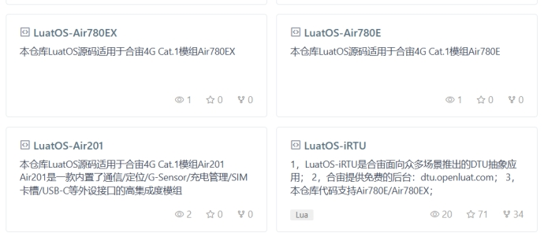 

如上图， Air201P，Air780E，都是能够运行LuatOS 的模组型号。

你要想运行哪个模组的软件， 就在合宙淘宝店购买对应的模组开发板， 然后进入对应的代码仓库，就可以开发了！

今天，我们用 LuatOS-Air201 这个仓库作为例子。

所以，我已经事先准备好了 Air201 开发板，你准备好了吗？

| 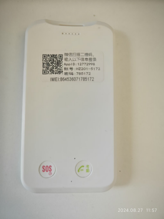 Air201 整机形态，也可以直接用Air201 PCBA 调试 | 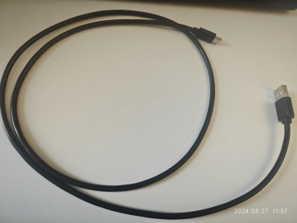 USB2.0 转  typec 线，用于调试 |
| ------------------------------------------------------------ | ------------------------------------------------------------ |
|                                                              |                                                              |

## 2, 下载模组的示例代码

  下载示例代码到一个合适的项目目录。

###   2.1 在https://gitee.com/ 注册账户

###   2.2 下载git

**[Git-2.46.0-64-bit.exe]**

  一路默认安装

### 2.3下载git 管理工具TortoiseGit

**[TortoiseGit-2.12.0.0-64bit (3).msi]**

  一路默认安装

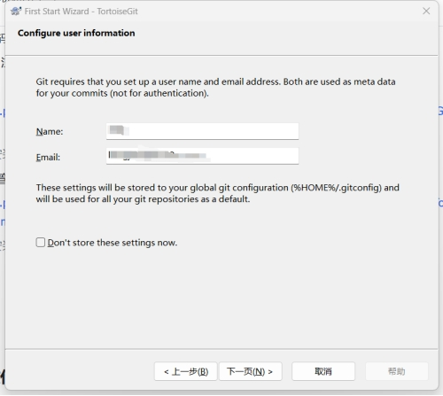 

此处填写第一步在gitee 上注册的名称，和email

### 2.4 下拉代码

| 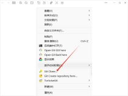 1.在桌面空白处右击鼠标选择更多选项   选择Git Clone | 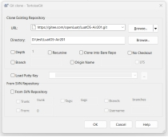 2.下载对应的仓库（https://gitee.com/openLuat/LuatOS-Air201.git） | 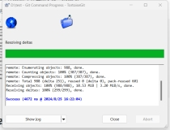 3.下拉代码成功 |
| ------------------------------------------------------------ | ------------------------------------------------------------ | ------------------------------------------------------------ |
|                                                              |                                                              |                                                              |

如果觉得git不太会用，可以直接下载源码文件**[LuatOS-Air201.7z]**

## 3, 修改代码

   用编辑器**打开**你下载下来的 **LuatOS-Air201/demo/hello_world/main.lua** 文件。

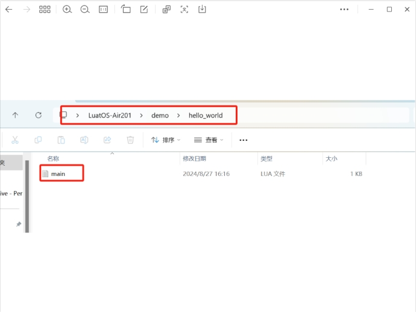 

我是习惯用 vscode，后面的例子都用 vscode 做演示了。

可以点击此处下载VSCode  **[VSCodeUserSetup-x64-1.92.2.exe]**

 如果你是用其他的编辑器， 也差不多类似。

打开main.lua， 是这个样子的代码：


```Lua 
-- Luatools需要PROJECT和VERSION这两个信息
PROJECT = "helloworld"
VERSION = "1.0.0"

-- 引入必要的库文件(lua编写), 内部库不需要require
sys = require("sys")


print(_VERSION)

sys.timerLoopStart(function()
    print("hi, LuatOS")    --  此处打印日志
    print("mem.lua", rtos.meminfo())       --  打印lua 剩余空间
    print("mem.sys", rtos.meminfo("sys"))  --  打印sys 剩余空间 
end, 3000)


-- 用户代码已结束---------------------------------------------
-- 结尾总是这一句
sys.run()
-- sys.run()之后后面不要加任何语句!!!!!

```

这个代码， 第12行打印了 “hi, LuatOS”， 而不是 hello world， 这就给你留下了发挥的空间。

你把这段代码稍作修改后，改为这样：

```Lua 
-- Luatools需要PROJECT和VERSION这两个信息
PROJECT = "helloworld"
VERSION = "1.0.0"

-- 引入必要的库文件(lua编写), 内部库不需要require
sys = require("sys")

print(_VERSION)

sys.timerLoopStart(function()
    print("hello world")
    print("mem.lua", rtos.meminfo())
    print("mem.sys", rtos.meminfo("sys"))
end, 3000)


-- 用户代码已结束---------------------------------------------
-- 结尾总是这一句
sys.run()
-- sys.run()之后后面不要加任何语句!!!!!
```

然后保存，代码修改工作就大功告成了！

是不是炒鸡简单？

## 4, 烧录代码到硬件

  烧录代码， 需要进行如下几步：

### 4.1 下载和安装合宙调试工具 

  LuatTools（需要升级到最新版本）

  要想烧录代码， 先要下载合宙的强大的调试工具： Luatools。

  如果你已经安装使用过 Luatools， 可以直接跳到下个小节： 烧录代码。

  Luatools 的最新版本的工具介绍和下载地址为：

  https://doc.openluat.com/wiki/52?wiki_page_id=5071

  或者可以直接下载下面的工具

**[Luatools_v2.exe]**

  Luatools 工具主要有如下几个功能：

  （1）自动从合宙服务器获取最新的合宙模组固件；

  （2）烧录固件和脚本；

  （3）查看和保存模组的串口输出日志；

  （4）简单的串口调试；

Luatools 下载之后， 无需安装， 解压到你的硬盘，点击 Luatools_v2.exe 运行，出现如下界面，就代表 Luatools 安装成功了：

  

### 4.2 烧录代码

  首先要说明一点：  脚本代码， 要和Core文件一起烧录。Core 固件是代码路径下的core 文件夹下，可以理解为运行环境，脚本会在Core 上运行，所以两个都要下载

**（1）正确连接电脑和4G模组电路板**

  使用带有数据通信功能的数据线，不要使用仅有充电功能的数据线；

**（2）新建项目**

  首先，确保你的 Luatools 的版本，上大于 3.0.0 版本的()。

  在 Luatools 的左上角上有版本显示的，如图所示：

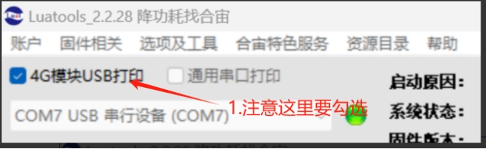 

Luatools 版本没问题的话， 就点击 Luatools 右上角的“项目管理测试”按钮，如下图所示：

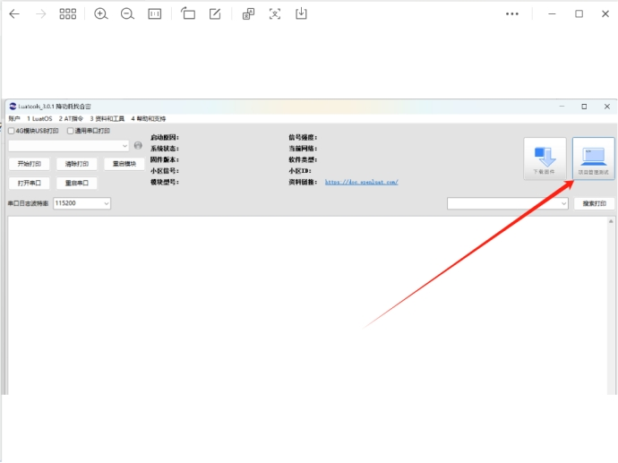 

这时会弹出项目管理和烧录管理的对话框，如下图：

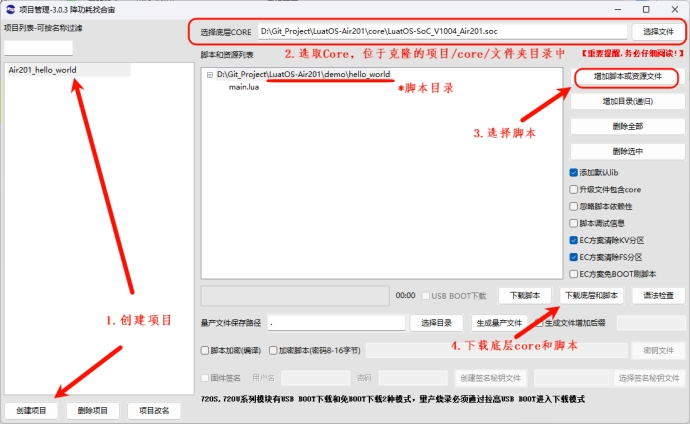 

​          下载过程如果出现找不到端口,注意看下线链接的是否有问题

 

**（4)开始烧录**

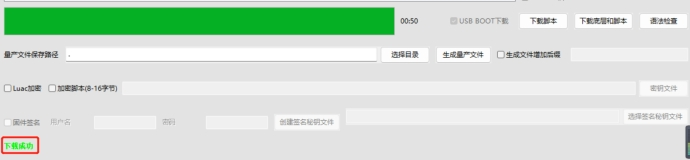 

### 4.3 烧录问题排查

  如果你在烧录过程中遇到了问题， 请点击如下链接，进行烧录的问题排查。

  [**详细的烧录操作步骤参考此处**](https://doc.openluat.com/wiki/52?wiki_page_id=5071#_23)

## 5, 验证功能

烧录完成后，会自动开机，此时电脑的设备管理器中会虚拟出三个端口表示正常开机

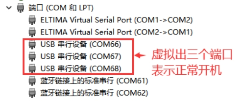 

Luatools会自动抓取应用日志和系统日志，并且在主界面解析显示应用日志，如下图所示

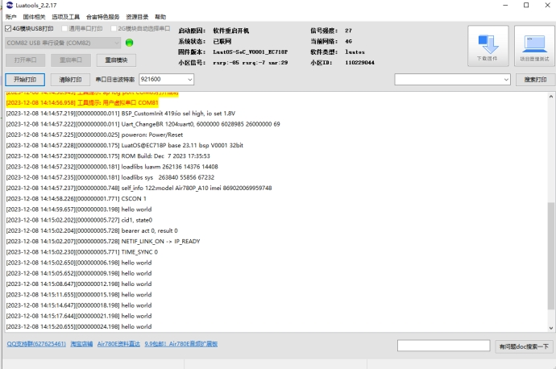 

从打印的日志可以看到，这个4G开发板，在不断的打印 hello world。

你太棒了！ 你成功了  ！
