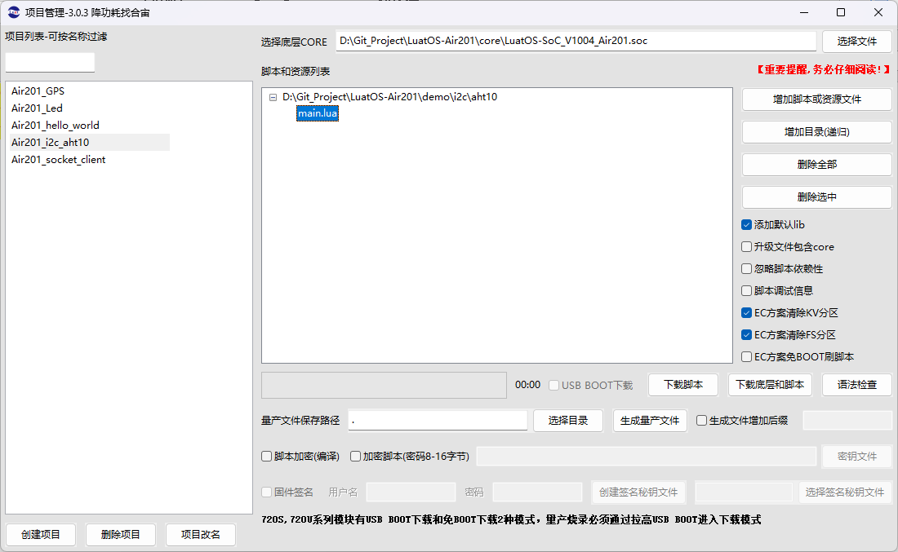
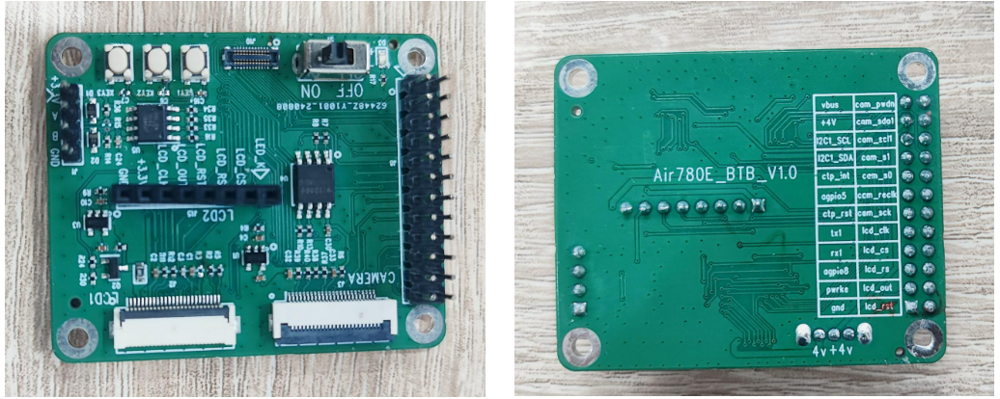
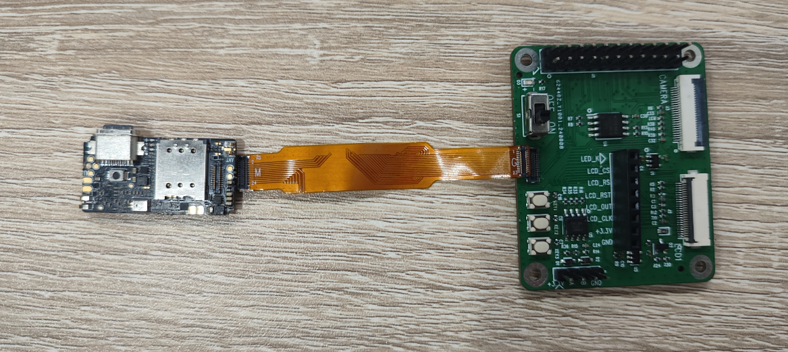
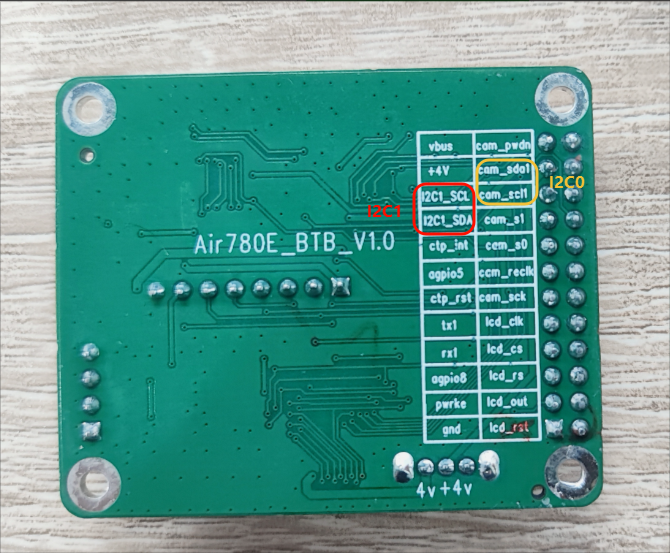
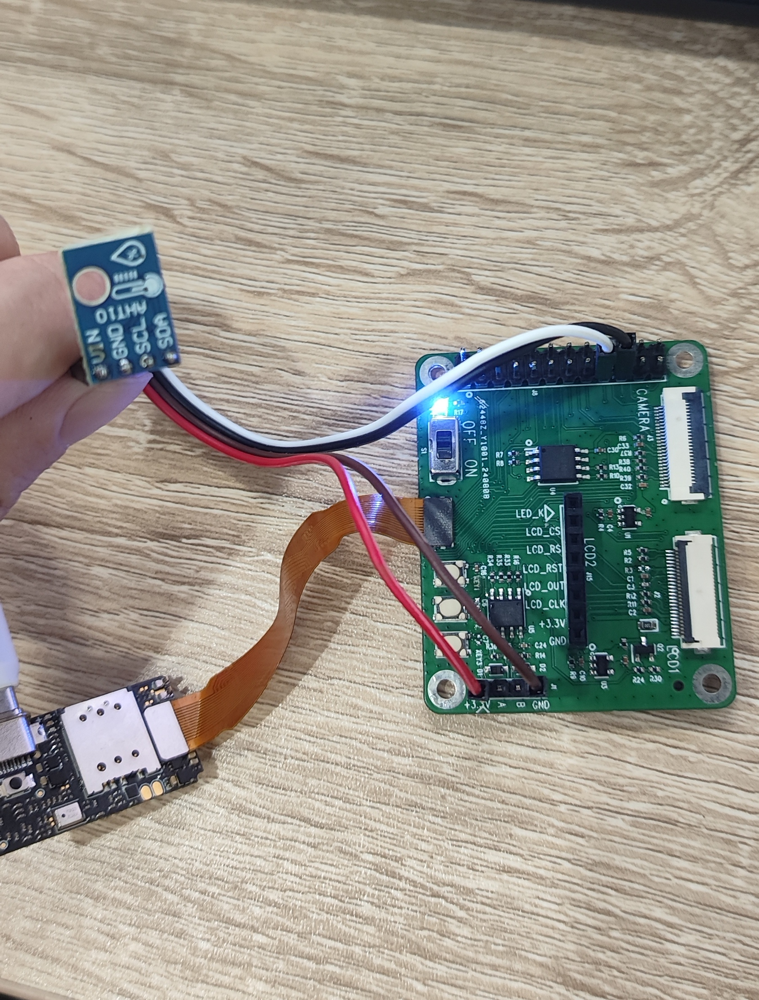
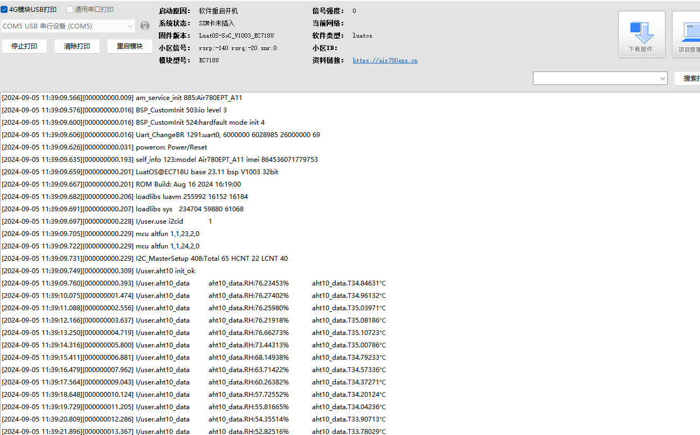

# 使用Air201的I2C驱动ATH10温湿度传感器
## I2C协议介绍

 

I2C是一种串行通信协议，通常用于连接低速设备，如传感器、存储器和其他外设。它使用两根线（SCL和SDA）来实现双向通信，具有地址定向性和主从模式。

**优点：**

- 多设备支持：I2C支持多个设备连接到同一总线上，每个设备都有唯一的地址。
- 简单：I2C协议相对简单，易于实现和调试。
- 低功耗：在空闲状态时，I2C总线上的器件可以进入低功耗模式，节省能量。

**缺点：**

- 速度较慢：I2C通信速度较低，适用于低速设备。
- 受限制：I2C的总线长度和设备数量受到限制，过长的总线可能导致通信问题。
- 冲突：当多个设备尝试同时发送数据时，可能会发生冲突，需要额外的冲突检测和处理机制。

> 参考原文：[逼真动画展示I2C、SPI、UART的通信过程](https://mp.weixin.qq.com/s/d-BkHdBCnMH0uGmXF1r0xg)

## 1, 搭建环境

此时也可以在Luatools项目管理中新建一个项目，重新选择底层CORE和脚本

或者在原有项目的基础上，不更换CORE，将原来的脚本删除，添加为demo/i2c/aht10的脚本。

 

由于Air201设计的很小巧，没有将所有的引脚测试点都预留到Air201的板子上，我们可以通过BTB连接器将一些引脚扩展出来，这里搭配使用了BTB扩展板。

 
 
 


## 2, 调试代码

> **使用克隆的代码中 LuatOS-Air201\demo\i2c\aht10 的代码测试**

###  2.1 引入aht10的扩展库

```Lua
-- 引入aht10的扩展库
local aht10 = require "aht10"
```

###   2.2 选择使用的i2cid并且接线

 

```Lua
-- 使用i2c0 接线为：VIN --> 3.3v，GND --> GND，SCL --> cam_scl1，SDA --> cam_sda1
-- 使用i2c1 接线为：VIN --> 3.3v，GND --> GND，SCL --> I2C1_SCL，SDA --> I2C1_SDA
i2cid = 1
i2c_speed = i2c.FAST    -- i2c.FAST 高速，i2c.SLOW 低速
```

 示例这里使用的是I2C1作为演示，所以参考I2C1的接线方式：

 VIN --> 3.3v | GND --> GND | SCL --> I2C1_SCL | SDA --> I2C1_SDA 

 


###  2.3 初始化i2c

```Lua
-- 如果使用的是i2c1，需要用下面的配置将I2C1_SCL/I2C1_SDA复用功能打开
if i2cid == 1 then
    mcu.altfun(mcu.I2C, i2cid, 23, 2, 0)
    mcu.altfun(mcu.I2C, i2cid, 24, 2, 0)
end
i2c.setup(i2cid, i2c_speed)
```

###  2.4 初始化AHT10传感器

```Lua
aht10.init(i2cid)   --初始化,传入i2c_id
```

###  2.5 读取AHT10数据

```Lua
while 1 do
    local aht10_data = aht10.get_data()
    log.info("aht10_data", "aht10_data.RH:"..(aht10_data.RH*100).."%","aht10_data.T"..(aht10_data.T).."℃")
    sys.wait(1000)
end
```

##  3, 展示效果

 
