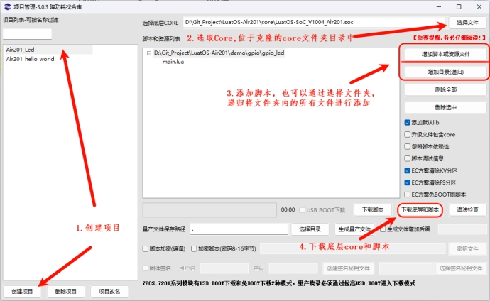
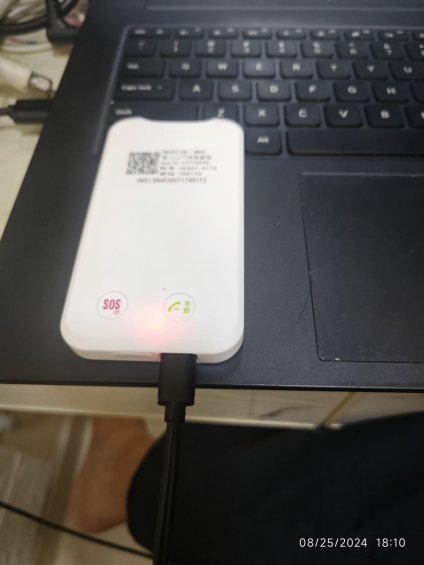

# 用Air201本地脚本控制灯的亮和灭
## 1, 搭建环境

 

注意到有什么变化没？

对了，此时只需要下载脚本，因为您的设备的Core ( Core 可以理解为基础固件，咱们的Luatos 就是在上面运行的，所以Core  不变就不需要重新下载 )是一样的，选择下载脚本下载后，下载速度会飞快，帮您节约大量的调试时间

## 2, 调试代码

**使用克隆的代码中 LuatOS-Air201\demo\gpio\gpio_led 代码测试**

###  2.1 初始化LED灯


```Lua
local blueLedPin = 1
local redLedPin = 16

-- 两个led灯，一个蓝灯，一个红灯，初始化为低电平
local blueLed = gpio.setup(blueLedPin, 0)
local redLed = gpio.setup(redLedPin, 0)
```

###  2.2 控制GPIO

```Lua
sys.taskInit(function()
    local level = 0
    while true do
        level = (level + 1) % 2  -- 更改此次循环是亮灯还是灭灯，如果是0 就是灭灯
        blueLed(level)    -- 控制蓝色Led 灯
        sys.wait(500)     -- 等待500ms
        redLed(level)     -- 控制红色Led 灯
        sys.wait(500)     -- 等待500ms 进入下一个循环
    end
end)
```

  此段程序用了一个task ,LuatOS允许多个task (支持并发),在程序进入sys.wait 时候，其他的task 可以运行

  通过**level = (level + 1) % 2** 来不断将**level**  设置为0或者1 ，来控制灯闪烁

  下载运行，您可以看到蓝灯，红灯，依次亮起，灭掉

 

  到此，您已经完成点灯仪式了。

## 3, 课后习题

*好，留给您一个课后习题：红灯，蓝灯同时亮起，间隔500ms 同时灭灯，再间隔500ms 同时亮起，如此循环。*
