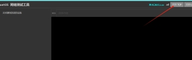
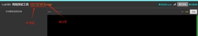
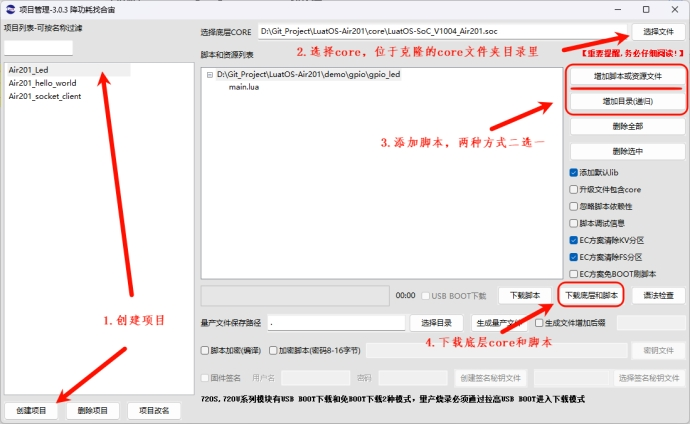
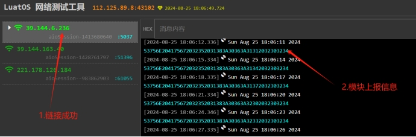
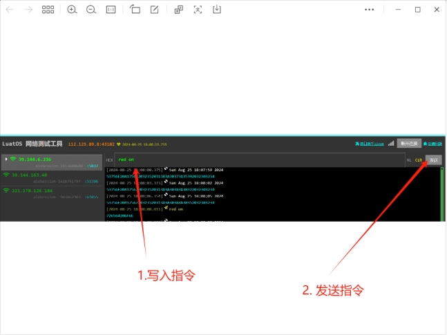
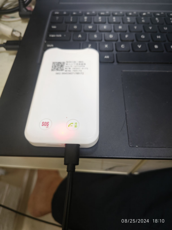

# 用电脑浏览器通过Air201控制灯的亮和灭
**1, 搭建环境**

**1.1 建立远程服务**

为了客户调试方便，我们制作了一个远程测试网页

请先打开网页https://netlab.luatos.com/

|  打开远程服务器 |  打开远程服务器成功，出现IP 地址，以及端口号      （注意端口号，等会要用） |
| ------------------------------------------------------------ | ------------------------------------------------------------ |
|                                                              |                                                              |

**1.2 创建项目**

 

**2, 写代码**

**2.1 初始化Led**

Lua -- 初始化GPIO local blueLedPin = 1 local redLedPin = 16  -- ledTest  Air201 有两个led灯，一个蓝灯，一个红灯 local blueLed = gpio.setup(blueLedPin, 0) local redLed = gpio.setup(redLedPin, 0) 

**2.2 通过字符串控制Led**

这里，我们简单通过 blue on，blue off,redLed on,redLed on, 来控制蓝灯，红灯的亮灭

SQL local function LEDSet(s)   -- Led 灯设置     if string.find(s, "blue on") then  --      blueLed(1)   elseif string.find(s, "blue off") then       blueLed(0)   elseif  string.find(s, "red on") then     redLed(1)   elseif  string.find(s, "red off") then     redLed(0)   end   log.info("LEDSet", s) end 

**2.3 设置服务器接口**

SQL -- 测试网站 https://netlab.luatos.com/ 点击 打开TCP 获取测试端口号 -- 要按实际情况修改 local host = "112.125.89.8" -- 服务器ip或者域名, 都可以的 local port = *43102*     -- **服务器端口号，此处需要修改** local is_udp = false     -- 如果是UDP, 要改成true, false就是TCP local is_tls = false     -- 加密与否, 要看服务器的实际情况

注意： **port 需要修改**，根据建立远程服务器时候产生的Port 修改，如果连不上服务器，多关注这个参数

**2.4  链接服务器**

Lua -- 演示task local function sockettest()   -- 等待联网   sys.waitUntil("IP_READY")  -- 会在此处等待，直到IP_READY（注册基站成功）消息过来，才会向下走    socket.sntp()  --  同步时间    -- 开始正在的逻辑, 发起socket链接,等待数据/上报心跳   -- 详见demo代码逻辑   sysplus.taskInitEx(sockettask, taskName, netCB, taskName, txqueue, topic) -- 初始化socket   while 1 do        local result, tp, data = sys.waitUntil(topic, 30000)    --- 等待网络消息     log.info("event", result, tp, data)     if not result then       -- 等很久了,没数据上传/下发, 发个日期心跳包吧       table.insert(txqueue, os.date())       sys_send(taskName, socket.EVENT, 0)     elseif tp == "uplink" then       -- 上行数据, 主动上报的数据,那就发送呀       table.insert(txqueue, data)       sys_send(taskName, socket.EVENT, 0)     elseif tp == "downlink" then       -- 下行数据,接收的数据, 从ipv6task来的       -- 其他代码可以通过 sys.publish()       LEDSet(data)         -- **此处为收到的消息，我们可以根据消息内容来控制灯**       log.info("socket", "收到下发的数据了", #data)     end   end end  function sockettask(d1Name, txqueue, rxtopic)   -- 打印准备连接的服务器信息   .........  -- 详见demo代码逻辑 end sys.taskInit(sockettest)  -- 初始化sockettest task

**2.5 增加定时上报消息到服务器**

一直上报时间，增加上行互动

SQL sys.taskInit(function()   sys.wait(5000)   while 1 do     sys.publish("sc_txrx", "uplink", os.date())     sys.wait(3000)   end end)

**3, 调试代码**

**3.1  下载**

 直接下载demo 到air201

**3.2  网页显示**

如果显示下图，则表示链接成功，并且一直上报数据

 

**3.3  下发指令**

 

**3.4  Air201 展示效果**

 

**4, 课后习题**

*好，留给您一个课后习题：怎么远程关闭红灯尼？*

 
