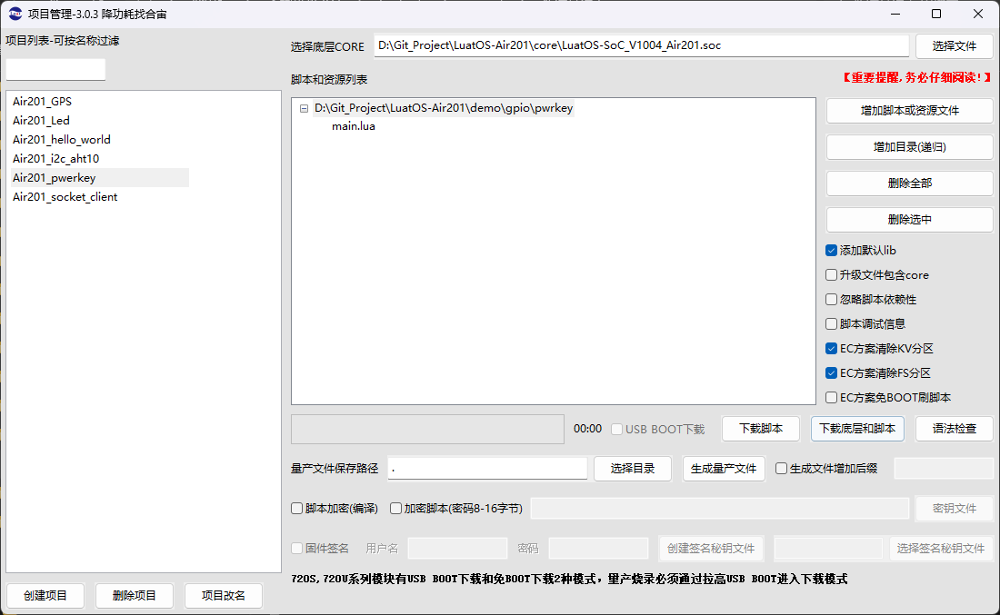

# Air201的PWRKEY按键控制
PWRKEY为Air201的开关机控制管脚，关机状态下将PWRKEY管脚拉低1.5s可以将模块开机。但是在开机状态下却不能以相同拉低的方式将模块关机。

那现在就介绍怎么通过使用GPIO控制，实现Air201预留的PWRKEY按键，长按关机的功能。

## 1, 搭建环境

**1.1** **准备一个201开发板、一根type-c数据线**

**1.****2** **下载****[Luatools烧录调试工具](https://gitee.com/openLuat/luatos-doc-pool/blob/master/doc/开发工具及使用说明/Luatools下载调试工具.md)**

**1.3** **代码下载**

   选择对应固件 链接：https://gitee.com/openLuat/LuatOS-Air201/tree/master/core

   选择脚本 链接：https://gitee.com/openLuat/LuatOS-Air201/tree/master/demo/gpio/pwrkey

## 2, 代码展示

```Lua
-- Luatools需要PROJECT和VERSION这两个信息
PROJECT = "pwrkey_demo"
VERSION = "1.0.0"

log.info("main", PROJECT, VERSION)

-- sys库是标配
_G.sys = require("sys")

local powerkey_pin = 46    -- 赋值powerkey引脚编号

-- local count=0    -- 五秒内短按三次关机
-- local function pwrkeycb() 
--     log.info("pwrkey", gpio.get(powerkey_pin))
--     if gpio.get(powerkey_pin) == 0 then
--         count=count+1
--         sys.timerStart(function()
--             log.info("计数归零")
--             count=0
--         end, 5000)
--         if count>=3 then
--             pm.shutdown() 
--         end
--     end
-- end

function pwroff()
    log.info("power off!!")
    pm.shutdown() 
end

local function pwrkeycb()    --长按五秒关机
    log.info("pwrkey", gpio.get(powerkey_pin))
    if gpio.get(powerkey_pin) == 1 then
        sys.timerStop(pwroff)
    else
        sys.timerStart(pwroff, 5000)
    end
end

if powerkey_pin ~= 255 then
    gpio.setup(powerkey_pin, pwrkeycb, gpio.PULLUP,gpio.BOTH)
else
    log.info("bsp not support")
end
-- 用户代码已结束---------------------------------------------
-- 结尾总是这一句
sys.run()
-- sys.run()之后后面不要加任何语句!!!!!
```

## 3, 烧录程序

开始下载

 


## 4, 展示效果

### 4.**1** **长按五秒关机功能**

 


### 4.**2** **五秒内短按三次关机功能**

 
