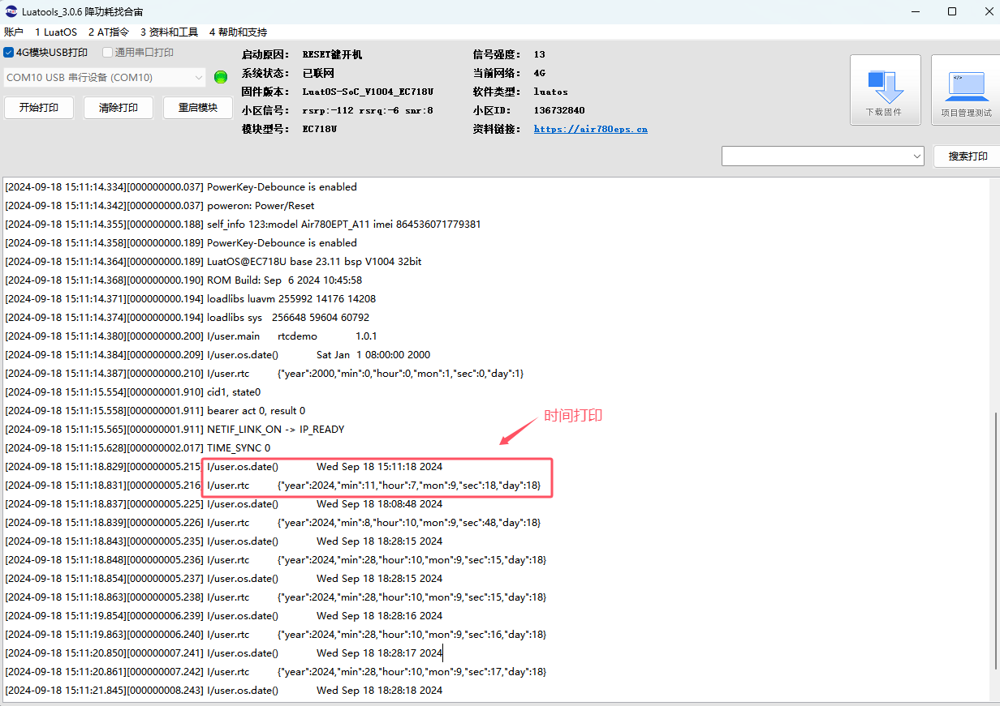

# Air201的RTC使用方法
  RTC （Real-Time Clock）实时时钟可以提供精确的实时时间，它可以用于产生年、月、日、时、分、秒等信息。晶体振荡器是最常用的时钟源，因为它具有高精度和稳定性。有些时钟芯片为了在主电源掉电时还可以工作，会外加电池供电，使时间信息一直保持有效。
  东八区（UTC/GMT+08:00）是比世界协调时间（UTC）/格林尼治时间（GMT）快8小时的时区，理论上的位置是位于东经112.5度至127.5度之间，在此15度的范围内，统一采用以东经120度中心线的地方时间为准。是东盟标准的其中一个候选时区。当格林尼治标准时间为00:00时，东八区的标准时间为08:00。

## 1, 搭建环境 

  Luatools烧录调试工具
  可以在Luatools项目管理中新建一个项目，重新选择底层CORE和脚本，或者在原有项目的基础上，不更换CORE，将原来的脚本删除，添加为demo/rtc的脚本。
### 1.1 软件资料
     固件链接：https://gitee.com/openLuat/LuatOS-Air201/tree/master/core
     源码脚本链接：https://gitee.com/openLuat/LuatOS-Air201/tree/master/demo/rtc
### 1.2硬件资料
  Air201开发板一块即可。
## 2，编写代码
main.lua文件说明
```Lua
     --打印os.date时间
    log.info("os.date()", os.date()) 
     
    -- 获取rtc时间     
    local t = rtc.get()   
    
    -- 打印rtc时间                   
    log.info("rtc", json.encode(t))          

    --table方式设置时间
    rtc.set({year=2024,mon=9,day=18,hour=10,min=8,sec=48})
    
    --时间戳方式设置时间(2024-9-18 18:18:15)
    rtc.set(1726655295)    
```

## 3，示例效果
  rtc.get/set总是UTC时间，os.date为北京时间（东八区时间）。
  
   
  
