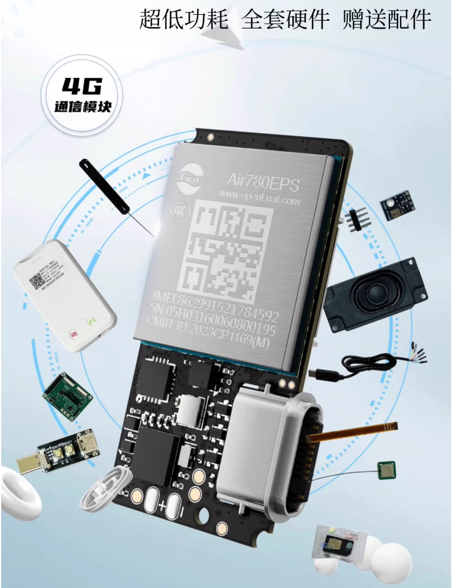
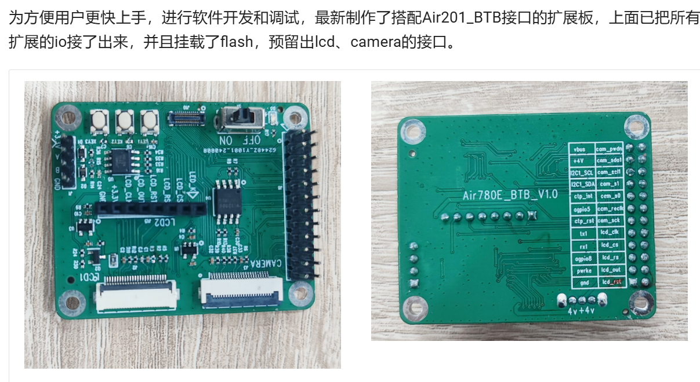
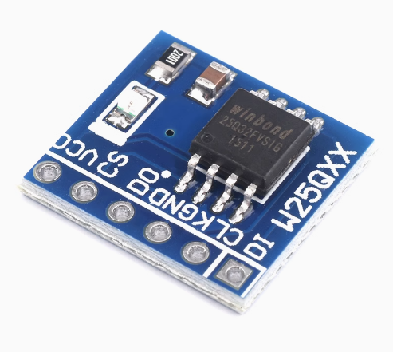
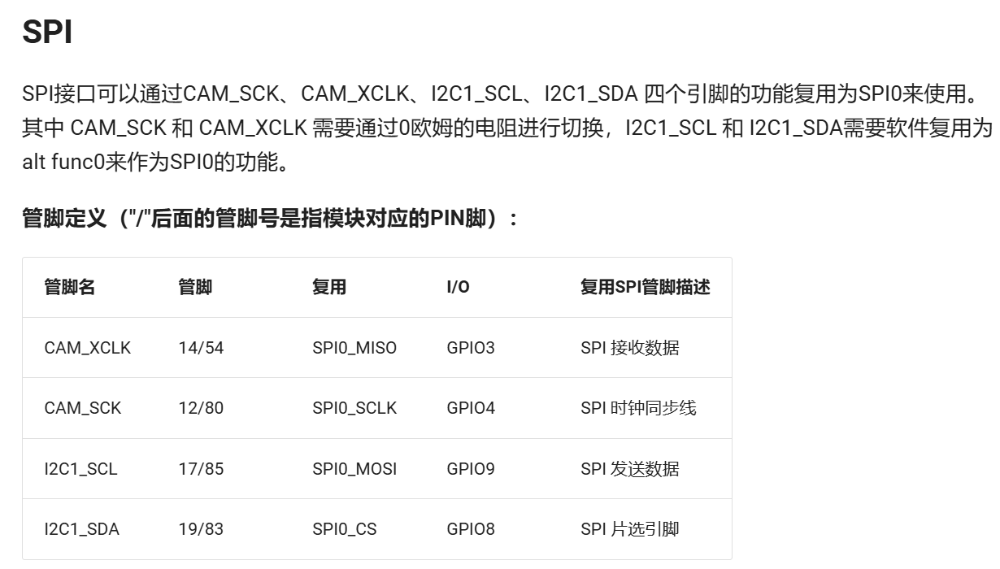
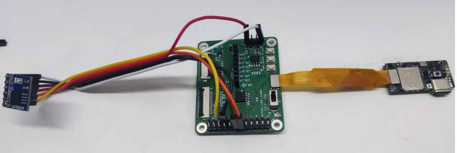
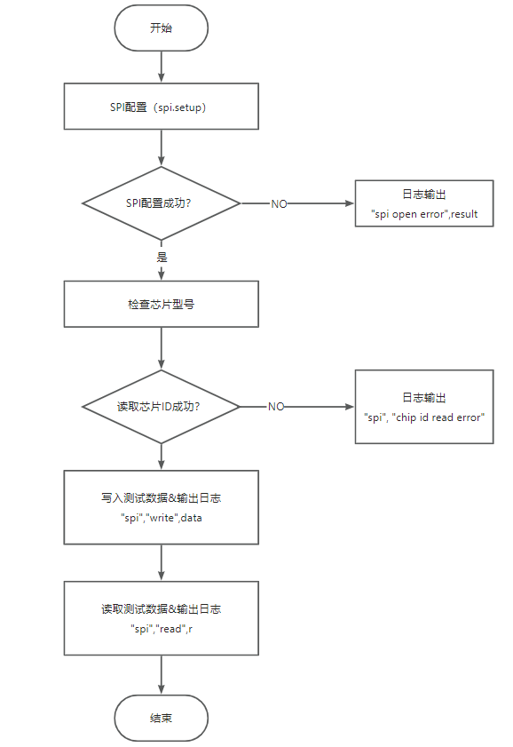
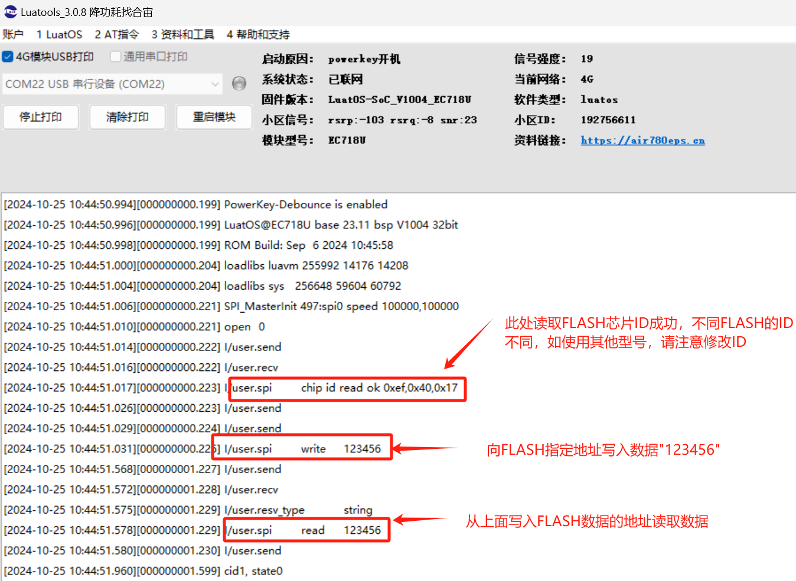

# Air201-LuatOS-如何使用SPI读写外部Flash

## 一、SPI 概述

SPI（Serial Peripheral Interface）是一种同步串行通信协议，广泛应用于微控制器和外围设备之间的数据传输。它由摩托罗拉公司开发，具有全双工通信能力，即可以同时进行数据的发送和接收。
SPI 通信通常涉及四条信号线：

1. **MOSI（Master Out Slave In）**：主设备发送数据，外设接收数据。
2. **MISO（Master In Slave Out）**：外设发送数据，主设备接收数据。
3. **SCLK（Serial Clock）**：由主设备生成的时钟信号，用于同步数据传输。
4. **CS/SS（Choose/Slave Select）**：选择特定的从设备进行通信。

SPI 的优点包括简单的硬件连接、高速数据传输和全双工通信。其缺点是通常需要更多的引脚，尤其是在多个从设备的情况下，每个从设备需要一个独立的 CS 引脚。此外，SPI 没有标准化的协议层，因此设备间的兼容性需要仔细管理。

## 二、演示功能概述

本文通过 Air201+ 扩展板读写外部flash来演示 SPI 的使用

## 三、准备硬件环境

### 3.1  Air201 模组

使用 Air201 开发套件，如下图所示：



淘宝购买链接：[Air201 开发套件淘宝购买链接](https://item.taobao.com/item.htm?ft=t&id=833290358010&pisk=fjeBr00ooeYI3vcpguIZGB7Sfkk7Ay6VO3i8mupe2vHdVLUzDbpPtvlSFP3aL2rEpTN7orTrw8uzFH2_lLJF-6qJFYkRuZWV3kxnEYQVol48SemEvLBrJ4pORL07vZWV3l9_dZ25uJy7ZfGj4YnKw4nOf0ik9YhK9hIs208Ky2U8XE55sdYwpk76IdRgeuk-F38yzRiOrqEQFcmaCSGKkX0MelysAXgYvJXSi3iTQRGq_3SKBoVaJcMfdEmQ6oMKV8jvN4G7KAi8RtxjWJZ7CXVw0KZsN2NTpftJekH-JrP7RwOnJWzsich9VtmauVE3p5skWkUqRvnt_tIbXbIr2Kub84OWfjvSfqS1fQAu6z1v-XdNBGhKjDGNfGTLZXnifqS1fQAo9cmI0Gs6J7f..&scene=taobao_shop&skuId=5748222642595&spm=a1z10.1-c-s.w4024-24640132990.1.4a3d1170MYyw0g) ；

此开发套件的详细使用说明参考：[Air201 产品手册](https://docs.openluat.com/air201/product/) 中的 [Air201 硬件手册](https://docs.openluat.com/air201/luatos/hardware/) 和 [Air201 的 LuatOS 快速入门](https://docs.openluat.com/air201/luatos/quickstart/)。

### 3.2 SIM 卡

请准备一张可正常上网的 SIM 卡，该卡可以是物联网卡或您的个人手机卡。

**特别提醒：**请确保 SIM 卡未欠费且网络功能正常，以便顺利进行后续操作。

### 3.3 PC 电脑

WINDOWS 系统，其他暂无特别要求；

### 3.4 数据通信线

USB 数据线（其一端为 Type-C 接口，用于连接 Air201）。

### 3.5 BTB 扩展板



### 3.6 FLASH 模块

本文采用 W25Q 系列 spi flash



## 四、准备软件环境

### 4.1 下载调试工具

使用说明参考：[Luatools 下载和详细使用](https://docs.openluat.com/Luatools/)

### 4.2 源码及固件

- Air201 模组使用固件：[core/LuatOS-SoC_V1004_Air201.soc](https://gitee.com/openLuat/LuatOS-Air201/blob/master/core/LuatOS-SoC_V1004_Air201.soc)，本 demo 使用的固件版本是：LuatOS-SoC_V1004_Air201.soc
- 本教程使用的 demo：[https://gitee.com/openLuat/LuatOS-Air201/tree/master/demo/spi_flash](https://gitee.com/openLuat/LuatOS-Air201/tree/master/demo/spi_flash)
- 源码和固件已打包，如下所示：

> 注：缩包中 core 文件夹存放固件，code 文件夹存放 demo

[右键点我,另存为,下载完整压缩文件包](file/spi_flash.zip){:target="_blank"}

## 五、软硬件资料

### 5.1 API 接口介绍

本教程使用 api 接口为:[https://wiki.luatos.com/api/spi.html?highlight=spi](https://wiki.luatos.com/api/spi.html?highlight=spi)

### 5.2 硬件安装与连接

#### 5.2.1 SPI 管脚定义

SPI 管脚定义请参考 [Air201 产品手册](https://docs.openluat.com/air201/product/) 中的 [Air201 硬件资料](https://docs.openluat.com/air201/luatos/hardware/) 中的 [Air201 硬件说明](https://docs.openluat.com/air201/luatos/hardware/design/) 中的 BTB 扩展接口的 SPI 接口说明



#### 5.2.2 实物连接图

Air201 通过 FPC 线连接 BTB 扩展板，BTB 扩展板再连接 FLASH 模块，接线如下所示：

| BTB 扩展板<br/> | FLASH 模块<br/> |
| --------------- | --------------- |
| cam_reclk<br/>  | DO<br/>         |
| cam_sck<br/>    | CLK<br/>        |
| I2C1_SCL<br/>   | DI<br/>         |
| I2C1_SDA<br/>   | CS<br/>         |
| +3.3V<br/>      | VCC<br/>        |
| GND<br/>        | GND<br/>        |


完整接线如下图所示：



## 六、代码示例介绍

### 6.1 程序流程图



### 6.2 代码介绍

#### 6.2.1 初始化配置

SPI 使用的是 SPI0，CS 使用的 GPIO8，同时先把 CS 片选脚拉高，收发数据时，都需要先把 CS 片选脚拉低再拉高，如下代码所示：

```lua
--spi编号，请按实际情况修改！
local spiId = 0
--cs脚，请按需修改！
local cs = 8
local cspin = gpio.setup(cs, 1)

--收发数据
local function sendRecv(data,len)
    local r = ""
    cspin(0)
    if data then spi.send(spiId,data) end
    if len then r = spi.recv(spiId,len) end
    cspin(1)
    return r
end
```

#### 6.2.2 向 FLASH 写入数据

查看 W25QX 系列 FLASH 模块数据手册的命令集，先写使能命令 0x06，再写页数据到地址 0x000001

```lua
local data = "123456"
--enable write
sendRecv(string.char(0x06))
--写页数据到地址0x000001
sendRecv(string.char(0x02,0x00,0x00,0x01)..data)
log.info("spi","write",data)
```

#### 6.2.3 从 FLASH 读取数据

查看 W25QX 系列 FLASH 模块数据手册的命令集，使用 0x03 命令，读取 0x000001 地址的数据，完成操作后关闭 SPI

```lua
--读数据
local r = sendRecv(string.char(0x03,0x00,0x00,0x01),data:len())
log.info("spi","read",r)

--disable write
sendRecv(string.char(0x04))

spi.close(spiId)
```

### 6.3 完整程序清单

注：完整复制后保存为 main.lua，可直接使用

```lua
-- LuaTools需要PROJECT和VERSION这两个信息
PROJECT = "w25q_spi_demo"
VERSION = "1.0.1"

sys = require("sys")

--spi编号，请按实际情况修改！
local spiId = 0
--cs脚，请按需修改！
local cs = 8
local cspin = gpio.setup(cs, 1)

--收发数据
local function sendRecv(data,len)
    local r = ""
    cspin(0)
    if data then spi.send(spiId,data) end
    if len then r = spi.recv(spiId,len) end
    cspin(1)
    return r
end

sys.taskInit(function()

    local result = spi.setup(
        spiId,--串口id
        nil,
        0,--CPHA
        0,--CPOL
        8,--数据宽度
        100000--,--频率
        -- spi.MSB,--高低位顺序    可选，默认高位在前
        -- spi.master,--主模式     可选，默认主
        -- spi.full--全双工       可选，默认全双工
    )
    print("open",result)
    if result ~= 0 then--返回值为0，表示打开成功
        print("spi open error",result)
        return
    end

    --检查芯片型号
    local chip = sendRecv(string.char(0x9f),3)
    if chip == string.char(0xef,0x60,0x17) then
        log.info("spi", "chip id read ok 0xef,0x60,0x17")
    else
        log.info("spi", "chip id read error")
        for i=1,#chip do
            print(chip:byte(i))
        end
        return
    end

    local data = "123456"

    --enable write
    sendRecv(string.char(0x06))

    --写页数据到地址0x000001
    sendRecv(string.char(0x02,0x00,0x00,0x01)..data)
    log.info("spi","write",data)

    sys.wait(500)--等写入操作完成

    --读数据
    local r = sendRecv(string.char(0x03,0x00,0x00,0x01),data:len())
    log.info("spi","read",r)

    --disable write
    sendRecv(string.char(0x04))

    spi.close(spiId)
end)

-- 结尾总是这一句哦
sys.run()
```

### 6.4 运行结果展示



## 七、总结

至此，我们已经使用 Air201 的 SPI 接口成功完成了对 W25Q64 Flash 存储器的读写操作。本教程的目的是展示如何使用 Air201 连接和操作 SPI 外设，而不局限于使用 Flash 存储器。这一过程为您提供了一个清晰的示范，帮助您理解和应用 SPI 接口的使用方法。
