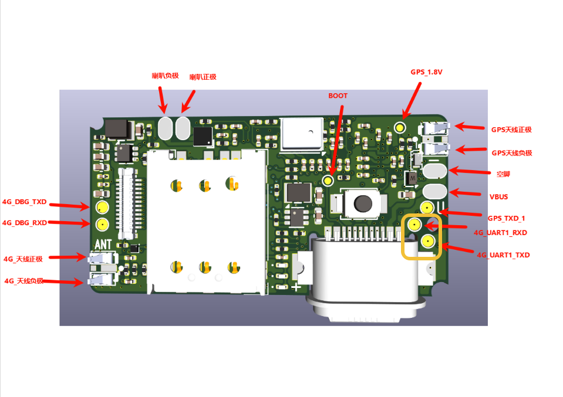
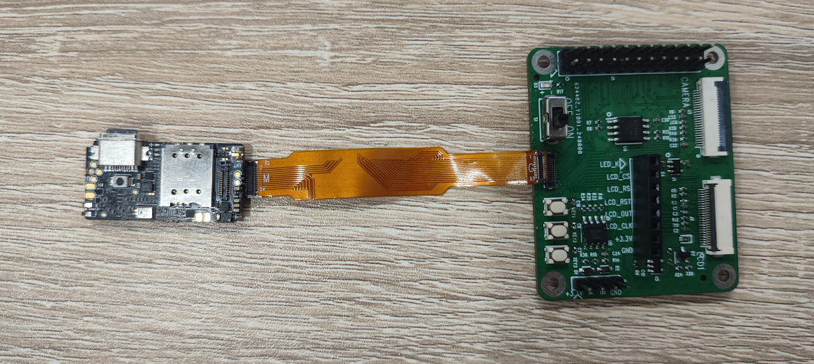
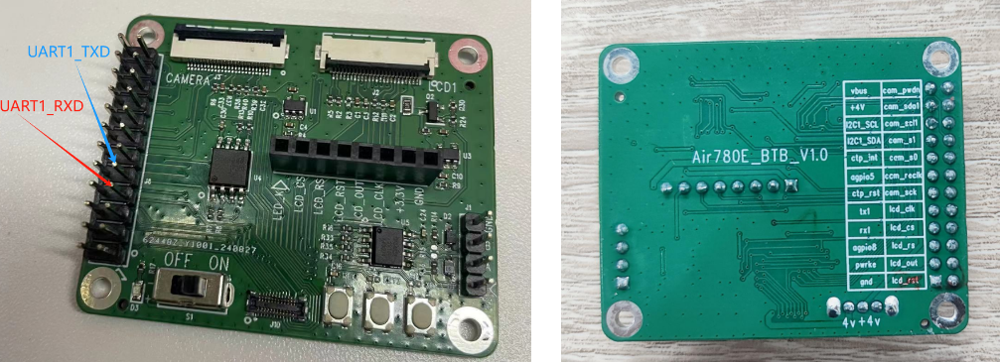
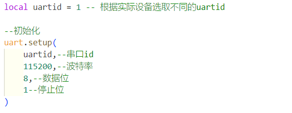
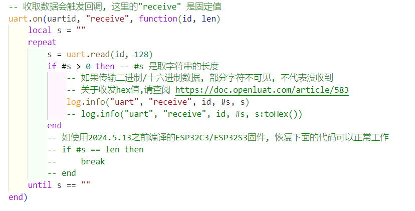
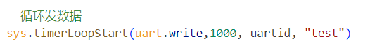
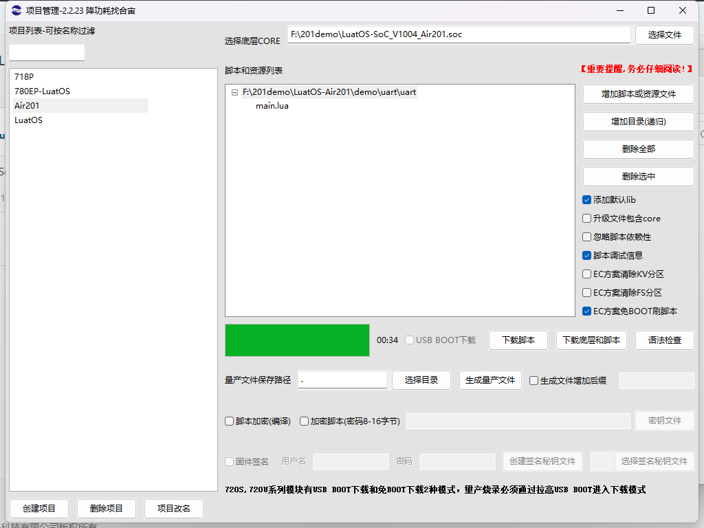
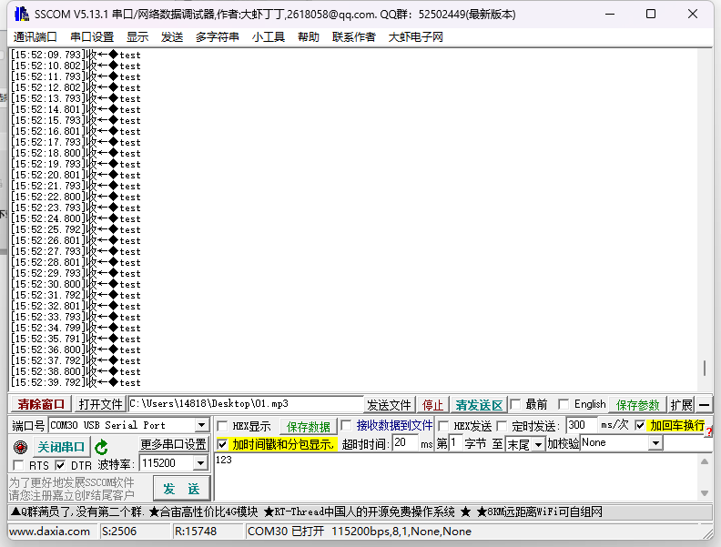
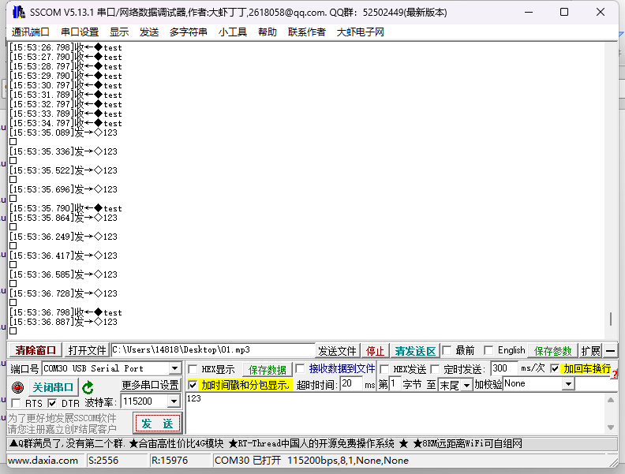
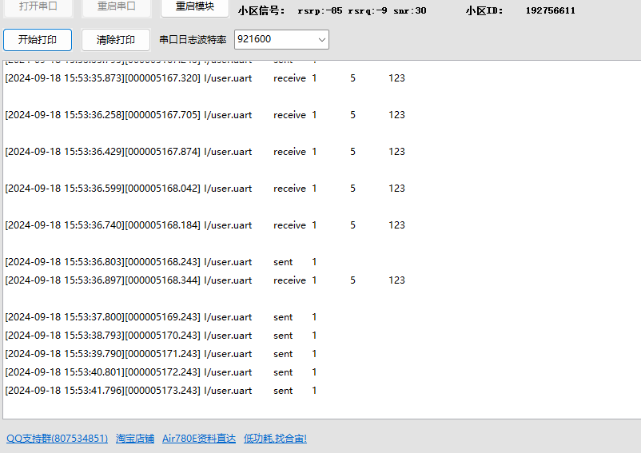

# Air201的uart使用方法
## 1.UART介绍
 
UART（通用异步接收器/发送器）是一种串行通信协议，因其多功能性和简单性而被广泛使用。与 I2C 和 SPI 不同，UART 只需要两条线即可运行：TX（发送）和 RX（接收）。该协议允许异步通信，也就是说发送器和接收器之间无需共享时钟。数据被组织成数据包，每个数据包包含一个起始位、5 到 9 个数据位、一个可选的奇偶校验位和一个或两个停止位。
优点：
- 简单：UART通信协议相对简单，易于实现和调试。
- 适用性广泛：UART被广泛应用于各种设备之间的通信，具有较好的兼容性。
- 距离：UART通信距离较远，适用于需要长距离传输的场景。
缺点：
- 速度较低：UART通信速度相对较低，不适用于对速度要求较高的应用。
- 双工：UART通信是双工的，可以进行低速双工传输数据，进行数据的发送和接收。
- 不可靠：由于UART是异步通信，可能会受到噪声和干扰的影响，导致数据传输不可靠。
参考原文：逼真动画展示I2C、SPI、UART的通信过程
## 2, 搭建环境
此时也可以在Luatools项目管理中新建一个项目，重新选择底层CORE和脚本
或者在原有项目的基础上，不更换CORE，将原来的脚本删除，添加为demo/uart的脚本。
注：本文内容使用main_uart进行交互
 
如上图所示，如果直接使用201上的main_uart串口，需要在圈起来的4G_UART1_RXD和4G_UART1_TXD处引出来线
也可以连接扩展板，直接接入板子上的main_uart串口
 
 
 
### 2.1 软件资料
   固件链接：https://gitee.com/openLuat/LuatOS-Air201/tree/master/core
   源码脚本链接：https://gitee.com/openLuat/LuatOS-Air201/tree/master/demo/uart/uart
### 2.2 硬件资料
Air201开发板一块即可。
## 3, 调试代码
使用克隆的代码中 LuatOS-Air201\demo\uart\uart 的代码测试
3.1 初始化uart
使用MAIN_UART(uart1)串口
 
3.2 注册接收数据的回调函数
 
3.3 发送数据
循环发送字符串"test"
 
3.4 完整例程展示
```Lua
-- LuaTools需要PROJECT和VERSION这两个信息
PROJECT = "uart_irq"
VERSION = "1.0.0"

log.info("main", PROJECT, VERSION)

-- 引入必要的库文件(lua编写), 内部库不需要require
sys = require("sys")

if wdt then
    --添加硬狗防止程序卡死，在支持的设备上启用这个功能
    wdt.init(9000)--初始化watchdog设置为9s
    sys.timerLoopStart(wdt.feed, 3000)--3s喂一次狗
end

log.info("main", "uart demo")

local uartid = 1 -- 根据实际设备选取不同的uartid

--初始化
uart.setup(
    uartid,--串口id
    115200,--波特率
    8,--数据位
    1--停止位
)

--循环发数据
sys.timerLoopStart(uart.write,1000, uartid, "test")
-- 收取数据会触发回调, 这里的"receive" 是固定值
uart.on(uartid, "receive", function(id, len)
    local s = ""
    repeat
        s = uart.read(id, 128)
        if #s > 0 then -- #s 是取字符串的长度
            -- 如果传输二进制/十六进制数据, 部分字符不可见, 不代表没收到
            -- 关于收发hex值,请查阅 https://doc.openluat.com/article/583
            log.info("uart", "receive", id, #s, s)
            -- log.info("uart", "receive", id, #s, s:toHex())
        end
    until s == ""
end)

-- 并非所有设备都支持sent事件
uart.on(uartid, "sent", function(id)
    log.info("uart", "sent", id)
end)

-- sys.taskInit(function()
--     while 1 do
--         sys.wait(500)
--     end
-- end)

-- 用户代码已结束---------------------------------------------
-- 结尾总是这一句
sys.run()
-- sys.run()之后后面不要加任何语句!!!!!
```

## 4，烧录程序
开始下载
 
## 5，展示效果
### 5.1 串口接收展示
 
### 5.2 串口发送展示
 
