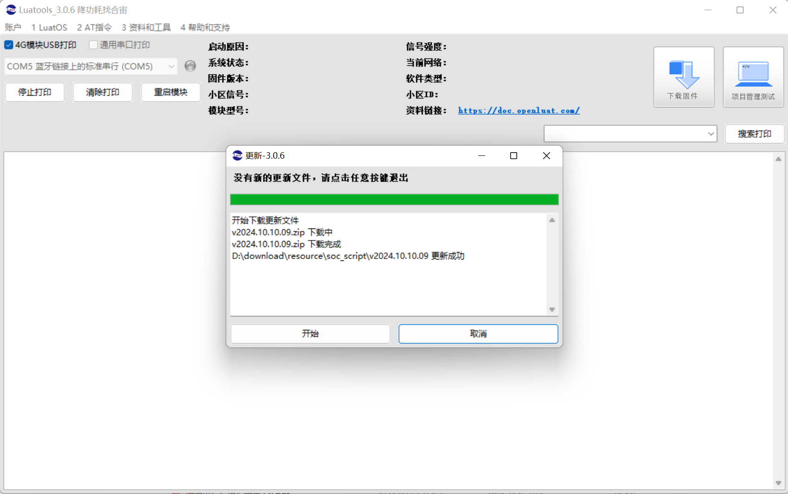
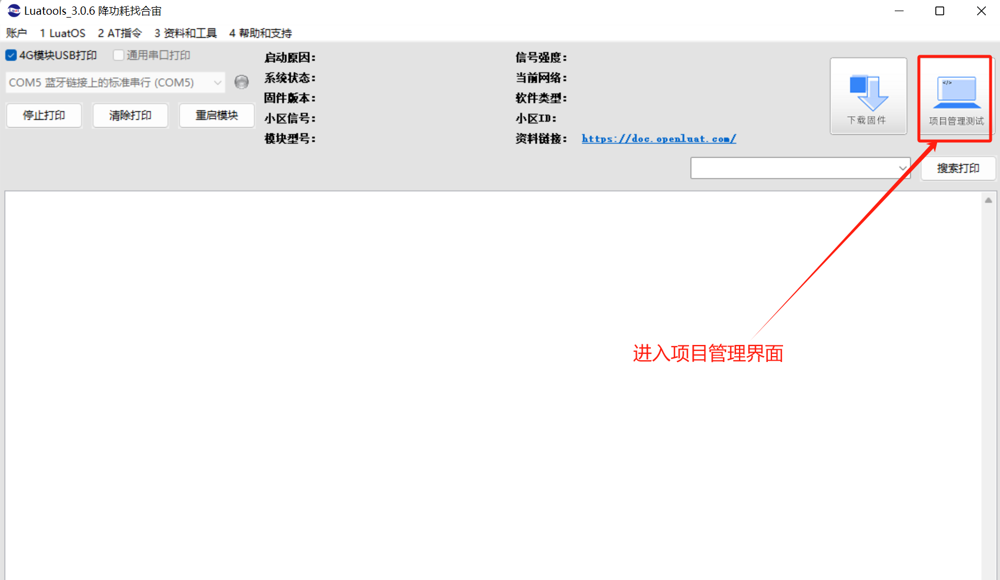

## **一、音频应用-音频播放概述**

Air724UG-LuatOS 支持多种音频格式的播放，如 MP3、AMR 等。通过 LuatOS 提供的 API 接口，用户可以轻松实现音频文件的播放、停止、暂停、恢复以及音量调节等操作。

## 二、准备硬件环境

“古人云：‘工欲善其事，必先利其器。’在深入介绍本功能示例之前，我们首先需要确保以下硬件环境的准备工作已经完成。”

### 2.1  Air724UG 开发板

本 demo 使用的是 Air724UG_A14 开发板，如下图所示：


点击链接购买：[EVB_Air724UG_A14 开发板淘宝购买链接](https://item.taobao.com/item.htm?spm=a1z10.1-c-s.w5003-23813349255.25.43af346aVmYQNY&id=614125604268&scene=taobao_shop) ；

此开发板的详细使用说明参考：[Air724UG 产品手册](https://docs.openluat.com/air724ug/product/)中的开发板硬件资料中《EVB_Air724UG_A14 开发板使用说明.pdf》；开发板使用过程中遇到任何问题，可以直接参考这份使用说明 pdf 文档。

### 2.2 SIM 卡

请准备一张可正常上网的 SIM 卡，该卡可以是物联网卡或您的个人手机卡。

**特别提醒：**请确保 SIM 卡未欠费且网络功能正常，以便顺利进行后续操作。

### 2.3 PC 电脑

请准备一台配备 USB 接口且能够正常上网的电脑。

### 2.4 数据通信线

请准备一根用于连接 EVB_Air724UG_A14 开发板和 PC 电脑的数据线，该数据线将实现业务逻辑的控制与交互。

- USB 数据线：此数据线不仅用于为测试板供电，还用于查看数据日志。其一端为 Micro-B 接口（俗称老安卓口），用于连接 EVB_Air724UG_A14 开发板；另一端为标准 USB 接口，连接 PC 电脑。


### 2.5 组装硬件环境

#### 2.5.1 请按 SIM 卡槽指示方向正确插入 SIM 卡，避免插反损坏

通常，插入 SIM 卡的步骤如下：

- 将 SIM 卡的金属卡槽下滑打开。
- 平稳地将 SIM 卡放入卡槽。
- 上滑关闭卡槽。


#### 2.5.2 USB 数据线，连接电脑和 EVB_Air724UG_A14 开发板，如下图所示：


## 三、准备软件环境

“凡事预则立，不预则废。”在详细阐述本功能示例之前，我们需先精心筹备好以下软件环境。

### 3.1 Luatools 工具

要想烧录 AT 固件到 4G 模组中，需要用到合宙的强大的调试工具：Luatools；

下载地址：[Luatools v3 下载调试工具](https://luatos.com/luatools/download/last)。

Luatools 工具集具备以下几大核心功能：

- 一键获取最新固件：自动连接合宙服务器，轻松下载最新的合宙模组固件。
- 固件与脚本烧录：便捷地将固件及脚本文件烧录至目标模组中。
- 串口日志管理：实时查看模组通过串口输出的日志信息，并支持保存功能。
- 串口调试助手：提供简洁的串口调试界面，满足基本的串口通信测试需求。

Luatools 下载之后， 无需安装， 解压到你的硬盘，点击 Luatools_v3.exe 运行，出现如下界面，就代表 Luatools 安装成功了：



### 3.2 烧录代码

首先要说明一点： 脚本代码， 要和固件的 LuatOS-Air_V4030_RDA8910_BT_TTS_FLOAT.pac（注：此固件支持 LCD,字库，图片，扫码，生成二维码，摄像头，TTS,WIFI Scan，蓝牙，SD 卡，FLOAT） 文件一起烧录。

**整体压缩文件：内含有 六个文件，四个视频文件，如图所示。**


#### 3.2.1 **压缩文件：完整文件包**
[右键点我,另存为,下载完整压缩文件包](file/音频播放.rar){:target="_blank"}
#### 3.2.2 **找到烧录的固件文件**

官网下载,底层 core 下载地址：[LuatOS 底层 core](https://docs.openluat.com/air724ug/luatos/firmware/)     **注：**本 demo 使用如图所示固件


#### 3.2.3 **正确连接电脑和 4G 模组电路板**

使用带有数据通信功能的数据线，不要使用仅有充电功能的数据线；

#### 3.2.4 **识别 4G 模组的 boot 引脚**

在下载之前，要用模组的 boot 引脚触发下载， 也就是说，要把 4G 模组的 boot 引脚拉到 1.8v，或者直接把 boot 引脚和 VDD_EXT 引脚相连。我们要在按下 BOOT 按键时让模块开机，就可以进入下载模式了。

具体到 EVB_Air724UG_A14 开发板，

- 当我们模块没开机时，按着下载模式键然后长按开机键开机。
- 当我们模块开机时，按着下载模式键然后点按重启键即可。


#### 3.2.5 **识别电脑的正确端口**

判断是否进入 BOOT 模式：

- 模块上电，此时在电脑的设备管理器中，查看串口设备，如下图：


- 先按下载模式在按一下重启，会出现一个端口表示进入了 boot 下载模式，如下图所示：


- 这时候， 硬件连接上就绪状态，恭喜你，可以进行烧录了！

#### 3.2.6 **新建项目**

首先，确保你的 Luatools 的版本大于或者等于 3.0.6 版本.

在 Luatools 的左上角上有版本显示的，如图所示：


Luatools 版本没问题的话， 就点击 Luatools 右上角的“项目管理测试”按钮，如下图所示：



这时会弹出项目管理和烧录管理的对话框，如下图：


#### 3.2.7 **开始烧录**

- 选择 Air724ug 开发板对应的底层 core 和刚改的 main.lua 脚本文件。下载到板子中。


- 一直按下载模式按键，在按一下重启，然后点击下载底层和脚本，如图所示：


- 出现如图所示，表示已进入 boot 模式，可以松开下载模式按键，等待下载完成。


- 下载完成，如图所示


## 四、音频应用基本用法

### 4.1 本教程实现的功能定义：

- audio 库在 EVB_Air724UG_A14-LuatOS 系统中提供了一种高效、灵活且易用的音频播放解决方案。此次 demo 旨在帮助开发者快速熟悉并掌握 API 接口，以便进行音频文件的音频管理操作。

### 4.2 文章内容引用

- EVB_Air724UG_A14 开发板软硬件资料 ： [EVB_Air724UG_A14 产品手册 ](https://docs.openluat.com/air724ug/product/)
- 以下接口函数不做详细介绍，可通过此链接查看具体介绍：[audio_API](https://doc.openluat.com/wiki/21?wiki_page_id=2327#API_9)

### 4.3 API 接口详解

#### 4.3.1 audio.play(priority, type, path, vol, cbFnc, dup, dupInterval)

解说：

`audio.play` 是一个用于音频播放的 API 接口，它允许开发者在应用程序中播放指定的音频文件或 TTS（Text To Speech，文字转语音）内容。该接口提供了多个参数，以便开发者可以根据需要定制音频播放的行为。

- priority：音频播放的优先级。这是一个数值参数，数值越大表示优先级越高。当存在多个播放请求时，优先级高的播放请求会优先播放，并可能终止优先级低的播放请求。如果优先级相同，则播放策略可以通过 `audio.setStrategy` 接口进行设置。
- type：音频的类型。目前支持的类型包括"FILE"和"TTS"。"FILE"表示播放指定的音频文件，"TTS"表示播放 TTS 生成的语音。
- path：音频文件的路径或 TTS 要播放的文本内容。当 `type` 为"FILE"时，`path` 表示音频文件的路径；当 `type` 为"TTS"时，`path` 表示要播放的 UTF8 编码格式的文本数据。
- vol：播放音量。这是一个可选参数，默认为 4。音量的取值范围为 0 到 7，其中 0 表示静音。
- cbFnc：音频播放结束时的回调函数。这是一个可选参数，默认为 nil。当音频播放结束时，会调用此回调函数，并传入一个表示播放结果的参数。
- dup：是否循环播放。这是一个布尔值参数，默认为 nil。如果设置为 true，则音频会循环播放；如果设置为 false 或 nil，则不循环播放。
- dupInterval：循环播放间隔。这是一个可选参数，默认为 0。当 `dup` 为 true 时，此参数表示循环播放的间隔时间（单位毫秒）。
- 返回值

result，bool 或者 nil 类型，同步调用成功返回 true，否则返回 false

举例：

```lua
--播放指定路径的音频文件，默认音量，不循环播放：
audio.play(0, "FILE", "/lua/call.mp3")
--播放指定路径的音频文件，最大音量，循环播放，间隔时间为2000毫秒：
audio.play(0, "FILE", "/lua/call.mp3", 7, nil, true, 2000)
--播放TTS生成的语音，中等音量，不循环播放：
audio.play(0, "TTS", "你好!", 4)
--播放音频文件，并设置播放结束时的回调函数：
local function playbackFinished(result)  
    if result == 0 then  
        print("播放成功结束")  
    elseif result == 1 then  
        print("播放出错")  
    -- 处理其他播放结果...  
end  
audio.play(0, "FILE", "/lua/call.mp3", 4, playbackFinished)
```

总结：

`udio.play` 是一个功能强大的音频播放 API 接口，它允许开发者在应用程序中灵活地播放音频文件和 TTS 内容。通过调整接口的参数，开发者可以控制音频播放的优先级、类型、路径、音量、是否循环播放以及循环播放的间隔时间等。此外，通过设置回调函数，开发者还可以在音频播放结束时执行特定的操作。这使得 `audio.play` 接口在音频播放相关的应用程序开发中具有广泛的应用价值。

#### 4.3.2 audio.stop(cbFnc)

解说：

`audio.stop` 是一个用于停止当前音频播放的 API 接口。在音频播放过程中，如果需要提前结束播放，可以调用此接口。该接口接受一个可选的回调函数 `cbFnc` 作为参数，用于在音频停止播放后执行特定的操作。

- cbFnc：停止音频播放的回调函数。这是一个可选参数，默认为 nil。当音频停止播放时，会调用此回调函数，并传入一个表示停止结果的参数。这个参数是一个数字，通常 0 表示停止成功。
- 返回值

nil

举例：

```lua
--直接停止当前音频播放，不执行回调函数：
audio.stop()
--停止当前音频播放，并在停止后执行回调函数：
local function stopCallback(result)  
    if result == 0 then  
        print("音频停止播放成功")  
    else  
        print("音频停止播放失败")  
    end  
end  
audio.stop(stopCallback)
```

总结：

在上面的示例中，当调用 `audio.stop(stopCallback)` 时，如果音频成功停止播放，则会执行 `stopCallback` 函数，并打印“音频停止播放成功”。如果停止播放失败，则会打印“音频停止播放失败”。

`audio.stop` 是一个简单而实用的 API 接口，用于停止当前正在播放的音频。通过传入一个可选的回调函数，开发者可以在音频停止播放后执行特定的操作，如更新 UI、释放资源等。这使得 `audio.stop` 接口在音频播放控制相关的应用程序开发中具有广泛的应用价值。无论是在需要用户交互的场景中，还是在需要自动控制的场景中，`audio.stop` 都能提供灵活且可靠的音频停止功能。

#### 4.3.3 audio.setVolume(vol)

解说：

`audio.setVolume(vol)` 是一个用于设置音频播放音量的 API 接口。通过调用此接口，开发者可以调整当前音频播放的音量大小。该接口接受一个参数 `vol`，用于指定新的音量值。

- vol：音量值为 0-7，0 为静音。
- 返回值

bool result，设置成功返回 true，失败返回 false

举例：

```lua
--将音量设置为最大：
audio.setVolume(7)
--将音量设置为静音：
audio.setVolume(0)
```

总结：

`audio.setVolume(vol)` 是一个用于设置音频播放音量的 API 接口，它允许开发者根据需要调整当前音频播放的音量大小。通过传入一个音量值作为参数，开发者可以灵活地控制音频的音量。需要注意的是，在使用此接口时，应参考具体设备的文档或 API 说明，以确保音量值的取值范围正确无误。此外，合理设置音量不仅可以提供更好的用户体验，还可以避免对用户的听力造成损害。

#### 4.3.4 audio.getVolume()

解说：

`audio.getVolume()` 是一个用于获取当前音频播放音量的 API 接口。通过调用此接口，开发者可以获取当前音频播放的音量大小，以便进行进一步的处理或显示给用户。该接口不接受任何参数，并返回一个数值，表示当前的音量值。

返回值：喇叭音量等级

举例：

```lua
--获取当前音量并打印出来：
local currentVolume = audio.getVolume()  
print("当前音量:", currentVolume)
```

总结：

`audio.getVolume()` 是一个用于获取当前音频播放音量的 API 接口，它允许开发者获取当前的音量大小，以便进行进一步的处理或显示给用户。通过调用此接口，开发者可以灵活地获取音量信息，并根据需要进行相应的操作。需要注意的是，在使用此接口时，应参考具体设备的文档或 API 说明，以确保对音量值的解释正确无误。此外，获取当前音量可以帮助开发者实现音量调节的 UI 反馈，从而提升用户体验。

#### 4.3.5 audio.setStrategy(strategy)

解说：

`audio.setStrategy(strategy)` 是一个用于设置音频播放策略的 API 接口。通过调用此接口，开发者可以指定音频播放时的行为策略，如当多个音频同时播放时如何处理、音频播放的优先级管理等。该接口接受一个参数 `strategy`，用于指定新的播放策略。

- strategy：优先级相同时的播放策略；0：表示继续播放正在播放的音频，忽略请求播放的新音频；1：表示停止正在播放的音频，播放请求播放的新音频

举例：

```lua
--设置音频播放策略为“只播放最高优先级的音频”：
-- 假设"PRIORITY_ONLY"是表示“只播放最高优先级的音频”的策略值  
audio.setStrategy("PRIORITY_ONLY")
```

总结：

`audio.setStrategy(strategy)` 是一个用于设置音频播放策略的 API 接口，它允许开发者指定音频播放时的行为策略，如处理多个音频同时播放的情况、管理音频播放的优先级等。通过调用此接口，开发者可以灵活地控制音频播放的行为，以适应不同的应用场景和用户需求。需要注意的是，在使用此接口时，应参考具体设备的文档或 API 说明，以确保对策略值的解释和选择正确无误。此外，合理设置音频播放策略可以提高音频播放的效率和用户体验。

#### 4.3.6 audio.setTTSSpeed(speed)

解说：

`audio.setTTSSpeed(speed)` 是一个用于设置文本转语音（TTS）朗读速度的 API 接口。通过调用此接口，开发者可以调整 TTS 播放时的语速，以满足不同的应用场景和用户需求。该接口接受一个参数 `speed`，用于指定新的朗读速度。

- speed：速度范围为 0-100，默认 50
- 返回值

bool result，设置成功返回 true，失败返回 false

举例：

```lua
--将TTS朗读速度设置为中等速度：
audio.setTTSSpeed(50)
```

总结：

`audio.setTTSSpeed(speed)` 是一个用于设置文本转语音（TTS）朗读速度的 API 接口，它允许开发者调整 TTS 播放时的语速，以适应不同的应用场景和用户需求。通过调用此接口，开发者可以灵活地控制 TTS 的朗读速度，提高用户体验。需要注意的是，在使用此接口时，应参考具体设备的文档或 API 说明，以确保对速度值的解释和选择正确无误。此外，合理设置 TTS 朗读速度可以提高语音的可听性和用户的满意度。

#### 4.3.7 audio.setChannel(output, input)

解说：

`audio.setChannel(output, input)` 是一个用于设置音频输出和输入通道的 API 接口。通过调用此接口，开发者可以指定音频数据应该通过哪些通道进行播放和录制。该接口通常接受两个参数：`output` 和 `input`，分别用于指定输出通道和输入通道。

- output：可选参数，默认为 `2`，output，输出通道，0：earphone 听筒 1：headphone 耳机 2：speaker 喇叭。
- input：可选参数，默认为 `0`，input，输入通道，0：主 mic 3：耳机 mic

举例：

```lua
--将音频输出设置为扬声器，输入设置为内置麦克风：
-- 假设"SPEAKER"和"MICROPHONE"分别是扬声器和内置麦克风的标识符  
audio.setChannel("SPEAKER", "MICROPHONE")
```

总结：

`audio.setChannel(output, input)` 是一个用于设置音频输出和输入通道的 API 接口，它允许开发者指定音频数据应该通过哪些通道进行播放和录制。通过调用此接口，开发者可以灵活地控制音频的输入输出通道，以适应不同的应用场景和用户需求。需要注意的是，在使用此接口时，应参考具体设备的文档或 API 说明，以确保对通道标识符的解释和选择正确无误。此外，合理设置音频通道可以提高音频播放和录制的效率和质量。

## 五、音频应用整体演示

### 5.1 MP3 **成果演示与深度解析：视频 + 图文全面展示**


#### 5.1.1 **成果运行精彩呈现**
<video controls src="file/MP3_demo.mp4"></video>
#### 5.1.2 **完整实例深度剖析**

```lua
-- main.lua文件

-- LuaTools需要PROJECT和VERSION这两个信息
PROJECT = "audio_MP3_demo"
VERSION = "1.0.0"
--require"record"
require"audio"
require"common"

--播放音频文件测试接口，每次打开一行代码进行测试
local function testPlayFile()
    --单次播放来电铃声，默认音量等级
    --audio.play(0,"FILE","/lua/call.mp3")
    --单次播放来电铃声，音量等级7
    --audio.play(0,"FILE","/lua/call.mp3",7)
    --单次播放来电铃声，音量等级7，播放结束或者出错调用testcb回调函数
    --audio.play(0,"FILE","/lua/call.mp3",7,testCb)
    --循环播放来电铃声，音量等级5，没有循环间隔(一次播放结束后，立即播放下一次)
    audio.play(0,"FILE","/lua/call.mp3",5,nil,true)
    --循环播放来电铃声，音量等级7，循环间隔为2000毫秒
    --audio.play(0,"FILE","/lua/call.mp3",7,nil,true,2000)
end

sys.timerStart(testPlayFile,5000)

-- 用户代码已结束---------------------------------------------
-- 结尾总是这一句
sys.run()
-- sys.run()之后后面不要加任何语句!!!!!
```

### 5.2 音频播放 AMR 成**果演示与深度解析：视频 + 图文全面展示**


#### 5.2.1 **成果运行精彩呈现**
<video controls src="file/AMR_demo.mp4"></video>
#### 5.2.2 **完整实例深度剖析**

```lua
-- main.lua文件

-- LuaTools需要PROJECT和VERSION这两个信息
PROJECT = "audio_AMR_demo"
VERSION = "1.0.0"
--require"record"
require"audio"
require"common"

--播放音频文件测试接口，每次打开一行代码进行测试
local function testPlayFile()
    --单次播放来电铃声，默认音量等级
    --audio.play(0,"FILE","/lua/alipay.amr")
    --单次播放来电铃声，音量等级7
    --audio.play(0,"FILE","/lua/alipay.amr",7)
    --单次播放来电铃声，音量等级7，播放结束或者出错调用testcb回调函数
    --audio.play(0,"FILE","/lua/alipay.amr",7,testCb)
    --循环播放来电铃声，音量等级5，没有循环间隔(一次播放结束后，立即播放下一次)
    audio.play(0,"FILE","/lua/alipay.amr",5,nil,true)
    --循环播放来电铃声，音量等级7，循环间隔为2000毫秒
    --audio.play(0,"FILE","/lua/alipay.amr",7,nil,true,2000)
end

sys.timerStart(testPlayFile,5000)

-- 用户代码已结束---------------------------------------------
-- 结尾总是这一句
sys.run()
-- sys.run()之后后面不要加任何语句!!!!!
```

### 5.3 音频播放 TTS 成**果演示与深度解析：视频 + 图文全面展示**


#### 5.3.1 **成果运行精彩呈现**
<video controls src="file/TTS_demo.mp4"></video>
#### 5.3.2 **完整实例深度剖析**

```lua
-- main.lua文件

-- LuaTools需要PROJECT和VERSION这两个信息
PROJECT = "audio_TTS_demo"
VERSION = "1.0.0"
--require"record"
require"audio"
require"common"

--播放tts测试接口，每次打开一行代码进行测试
--audio.play接口要求TTS数据为UTF8编码，因为本文件编辑时采用的是UTF8编码，所以可以直接使用ttsStr，不用做编码转换
--如果用户自己编辑脚本时，采用的不是UTF8编码，需要调用common.XXX2utf8接口进行转换
local ttsStr = "上海合宙通信科技有限公司欢迎您"
local function testPlayTts()
    --单次播放，默认音量等级
    --audio.play(0,"TTS",ttsStr)
    --单次播放，音量等级7
    --audio.play(0,"TTS",ttsStr,7)
    --单次播放，音量等级7，播放结束或者出错调用testcb回调函数
    --audio.play(0,"TTS",ttsStr,7,testCb)
    --循环播放，音量等级7，没有循环间隔(一次播放结束后，立即播放下一次)
    --audio.play(0,"TTS",ttsStr,7,nil,true)
    --循环播放，音量等级7，循环间隔为2000毫秒
    audio.play(0,"TTS",ttsStr,7,nil,true,4000)
end

--检查固件是否支持TTS
if string.match(rtos.get_version(),"TTS") then
    sys.timerStart(testPlayTts,5000)
    --如果要测试tts播放时，请求播放新的tts，打开下面这段代码
    --sys.timerLoopStart(tesTtsNew,5000)
else
    log.info("此固件不支持 TTS 功能")
end

-- 用户代码已结束---------------------------------------------
-- 结尾总是这一句
sys.run()
-- sys.run()之后后面不要加任何语句!!!!!
```

### 5.4 音频播放冲突测试成**果演示与深度解析：视频 + 图文全面展示**


#### 5.4.1 **成果运行精彩呈现**
<video controls src="file/冲突测试.mp4"></video>
#### 5.4.2 **完整实例深度剖析**

```lua
-- main.lua文件
-- LuaTools需要PROJECT和VERSION这两个信息
PROJECT = "音频播放冲突_demo"
VERSION = "1.0.0"
--require"record"
require"audio"
require"common"

--音频播放优先级，对应audio.play接口中的priority参数；数值越大，优先级越高，用户根据自己的需求设置优先级
--CALL：来电铃声
--TTS：TTS播放
CALL,TTS = 4,2

local ttsStr = "上海合宙通信科技有限公司欢迎您"
--播放冲突测试接口，每次打开一个if语句进行测试
local function testPlayConflict()
    --循环播放TTS
    if string.match(rtos.get_version(),"TTS") then
        audio.play(TTS,"TTS",ttsStr,7,nil,true)
        --5秒钟后，循环播放开机铃声
        sys.timerStart(audio.play,5000,CALL,"FILE","/lua/call.mp3",7,nil,true,5000)  
    else
        log.info("此固件不支持 TTS 功能")
        
    end
--[[
    CALL = 1
    --循环播放TTS
    --改变优先级，call将不再播放
    if string.match(rtos.get_version(),"TTS") then
        audio.play(TTS,"TTS",ttsStr,7,nil,true)
        --10秒钟后，循环播放开机铃声
        sys.timerStart(audio.play,5000,CALL,"FILE","/lua/call.mp3",7,nil,true,10000)  
    else
        log.info("此固件不支持 TTS 功能")
    end
]]

end

sys.timerStart(testPlayConflict,5000)

-- 用户代码已结束---------------------------------------------
-- 结尾总是这一句
sys.run()
-- sys.run()之后后面不要加任何语句!!!!!
```

## 六、总结

这些音频 API 接口共同构成了音频控制的核心功能，使开发者能够灵活地管理音频播放、停止、音量调节、策略设置以及通道选择。通过合理使用这些接口，开发者可以创建出具有丰富音频体验的应用程序，满足用户的不同需求。同时，也需要注意接口之间的协同作用，以确保音频功能的稳定性和可靠性。

## 七、常见问题

- 音频播放无声：这可能是由于音量设置为 0、音频文件损坏、音频设备未正确连接或配置错误等原因造成的。解决方法包括检查音量设置、验证音频文件的完整性、确保音频设备正确连接并配置为默认设备。
- 音频播放卡顿或延迟：这可能是由于音频缓冲区大小不足、设备性能不足或网络延迟等原因造成的。解决方法包括增加音频缓冲区大小、优化设备性能或在网络条件允许的情况下降低音频质量。
- 音频文件无法加载：这可能是由于文件路径错误、文件权限不足或文件格式不受支持等原因造成的。解决方法包括检查文件路径和权限、确保文件格式与设备兼容。
- 多个音频同时播放时的冲突：这可能是由于未正确设置音频播放策略造成的。解决方法包括使用 `audio.setStrategy` 接口设置合适的播放策略，如“只播放最高优先级的音频”或“同时播放但降低音量”。

## 八、扩展

播放多 arm 文件方式：

```lua
local multiFile = {"/lua/alipay.amr","/lua/10.amr","/lua/2.amr","/lua/yuan.amr"}
 audio.play(1,"FILE",multiFile,7)
```

## 给读者的话

> 本篇文章由`永仔`开发；
>
> 本篇文章描述的内容，如果有错误、细节缺失、细节不清晰或者其他任何问题，总之就是无法解决您遇到的问题；
>
> 请登录[合宙技术交流论坛](https://chat.openluat.com/)，点击[文档找错赢奖金-Air724UG-LuatOS-软件指南-音频应用-音频播放](https://chat.openluat.com/#/page/matter?125=1850349116719235074&126=%E6%96%87%E6%A1%A3%E6%89%BE%E9%94%99%E8%B5%A2%E5%A5%96%E9%87%91-Air724UG-LuatOS-%E8%BD%AF%E4%BB%B6%E6%8C%87%E5%8D%97-%E9%9F%B3%E9%A2%91%E5%BA%94%E7%94%A8-%E9%9F%B3%E9%A2%91%E6%92%AD%E6%94%BE&askid=1850349116719235074)；
>
> 用截图标注+文字描述的方式跟帖回复，记录清楚您发现的问题；
>
> 我们会迅速核实并且修改文档；
>
> 同时也会为您累计找错积分，您还可能赢取月度找错奖金！