## 一、简介

ADC 通常指模拟/数字转换器。是指将连续变量的模拟信号转换为离散的数字信号的器件。本文介绍如何用 Air724 开发板，和 PC 端搭建一个 ADC 电压采集的功能演示。

## 二、演示功能概述

本教程教你如何使用开发板 ADC 功能。

功能定义：

1. 使用 ADC 引脚读取电压值
2. 读取供电电压
3. 读取模块温度

## 二、准备硬件环境

### 2.1 开发板准备

使用 Air724UG-NFM 开发板，如下图所示：

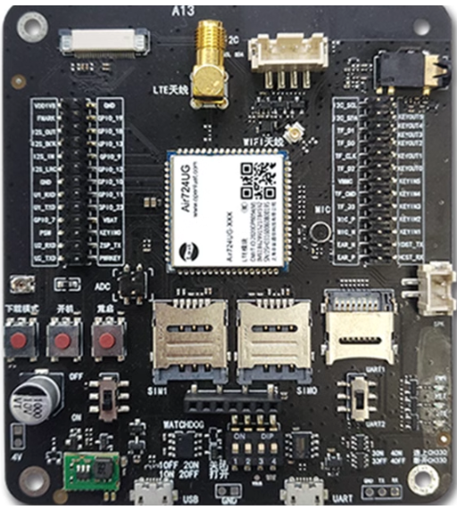

淘宝购买链接：[Air724UG-NFM 开发板淘宝购买链接](https://item.taobao.com/item.htm?id=614077856538&pisk=fliezCgRrHKeY5RClWrz399HDhZLAodXU0N7EYDudWVnNJZzE5kDpWTJJbuZZfUQtW9L4zcotzc7Nv6KWjMcADTLVgrL2uAXGntfpvE8qeHl-l1dI82vVwqutHtLvKdXGntPbFd0mIGI4pMNR8PgK8VuZdzgpJquK7VHQ52zH7jnZuYWol5WiUapixFiPWEh80XknSSlqDx88SyNPgSzbJ4EDvVaCRiaLyP05f0fODcsEDiLWHsL2Agqa4cD1wNnu-lal2RVYjlLEf2iOL_8Q4koDkUdegh4YbzmxPWl0xqnJlyimL_Y1cPIZDzMhiz7jma0xVT9OzZU3bmKTTSoigkVwRfI_03FZaz3BRPXQd8vULWW-_YfbaQ8SoeaGpwCyaU3BRPXQd7RyPVTQS9Qd&skuId=4862577940947&spm=a1z10.3-c-s.w4002-24045920836.10.292c6ee5wTkgXN) ；

此开发板的详细使用说明参考：[Air724UG 产品手册](https://docs.openluat.com/air724ug/product/) 中的 << EVB_Air724UG_AXX 开发板使用说明 >>，写这篇文章时最新版本的使用说明为：EVB_Air724UG_A14 开发板使用说明；开发板使用过程中遇到任何问题，可以直接参考这份使用说明文档。

### 2.2 数据通信线

USB 数据线或者 USB 转 TTL 数据线使用普通的就行，暂无特别要求；

### 2.3 PC 电脑

WINDOWS 系统，其他暂无特别要求；

### 2.4 直流稳压电源准备

在需要直流稳压电源的场景（例如 adc 测量外部输入的模拟电压），使用合宙功耗分析仪 Air9000P，如下图所示：

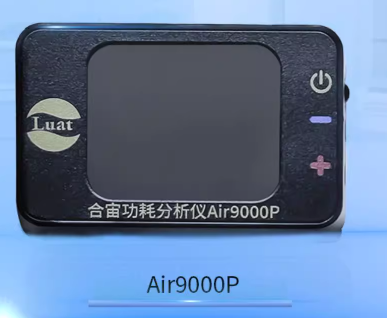

淘宝购买链接：[Air9000P 淘宝购买链接](https://item.taobao.com/item.htm?id=820017234108&pisk=fZtD-X9JpE7XT4Vcd4jjSKL432u8cSs1uCEO6GCZz_55Xr3f6UXw6QMshipNsCARNCbsh1CNsCpwkYnKvK9ffGRi9DnLx3qMOCXV7OorQ9XF_EWBTxpffGlMuFtPhKOF04S5INkl4OXUbG7NguklBOCNbs7aaLWNa18R2J2WgWt-nwC3MeN3z0g9J6JVgKpv4XQ4lKfkPUKPnKCX3VZab3XcohBmhLJckFJCRndIjusvKUSPIhMUS1bH7nIy0boFPN8M_TTSsPfH7KLB2aeauLxGiw-VrJqyUK6w_NYStkBcDUbHmEM_aKRdieSXBJcvEwYlRT7zIrSrMzzUVpr1UAKz5P_VFTfLnXsAwY2cJLDoEygfuT6x9YDu5P_VFTfKEY4Q1ZW5HXC..&spm=a1z10.1-c-s.w4004-24087196161.6.255c1170QukeFS&skuId=5695681155123) ；

## 三、准备软件环境

### 3.1 源码和工具

- 724UG 模块使用固件为 [LuatOS-Air_V4030_RDA8910_TTS_NOLVGL_FLOAT.pac](https://docs.openluat.com/air724ug/luatos/firmware/)
- 本教程使用的 demo：[https://gitee.com/openLuat/LuatOS-Air724UG/tree/master/script_LuaTask/demo/adc](https://gitee.com/openLuat/LuatOS-Air724UG/tree/master/script_LuaTask/demo/adc)
- 将固件和脚本烧录到模块中，使用说明参考：[Luatools 下载和详细使用](https://docs.openluat.com/Luatools/)
  源码和固件已打包，如下所示：
  [右键点我,另存为,下载完整压缩文件包](file/adc-demo.zip){:target="_blank"}

### 3.2 烧录代码

首先，确保你的 Luatools 的版本大于或者等于 3.0.6 版本.

在 Luatools 的左上角上有版本显示的，如图所示：

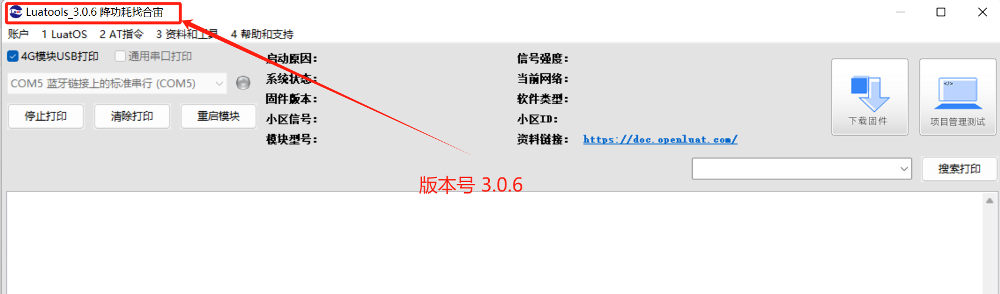

Luatools 版本没问题的话， 就点击 Luatools 右上角的“项目管理测试”按钮，如下图所示：


这时会弹出项目管理和烧录管理的对话框，如下图：

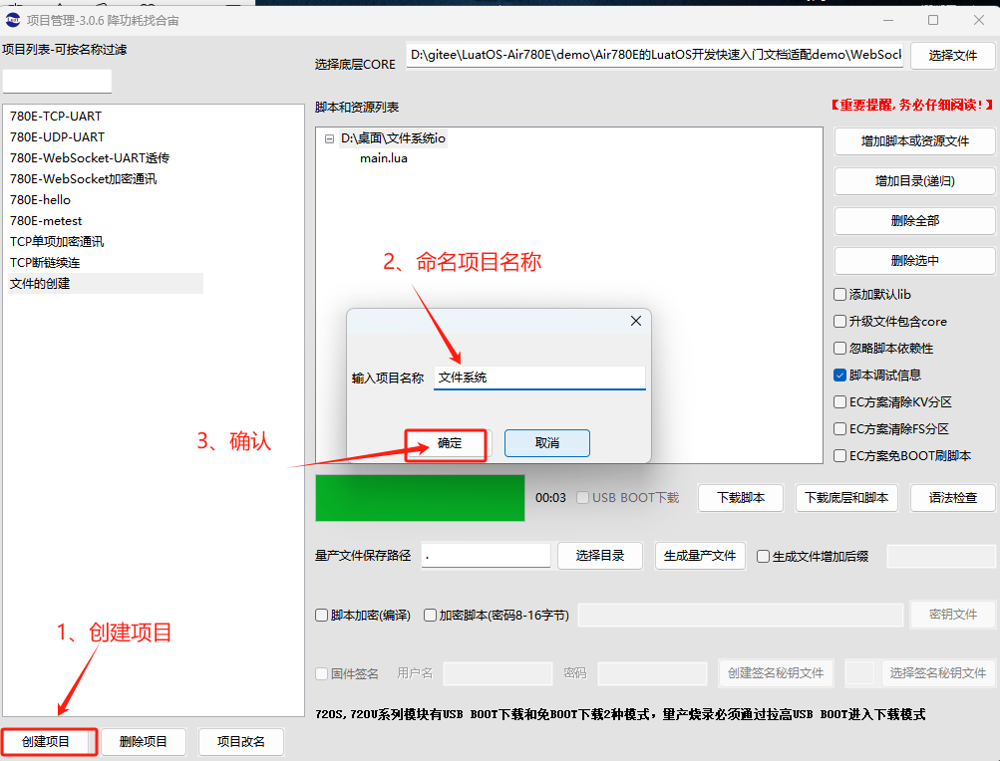

选择对应的项目烧录代码。

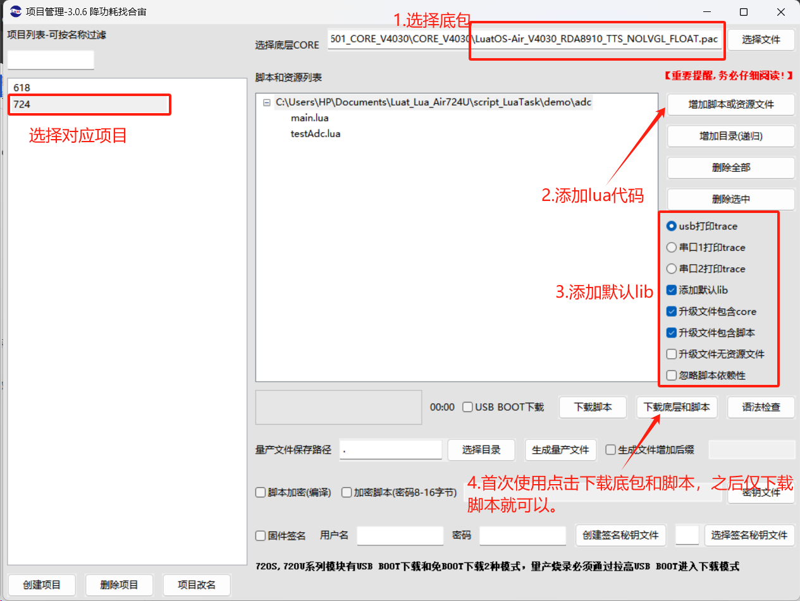

## 四、ADC 功能软硬件资料

### 4.1 首先了解一下开发板上 ADC 采集电压电路的设计

当前 Air724UG 模块以及开发板上预留了两路外置 ADC 供客户调试使用，分别是 ADC2 和 ADC3，其中 ADC2 采集的电压为一个 10K 的普通电阻和一个 10K 的 NTC 热敏电阻将 1.8V 电压分压所得的电压，ADC3 采集的电压为一个 10K 的普通电阻和一个 10K 的电位器将 1.8V 电压分压所得的电压：

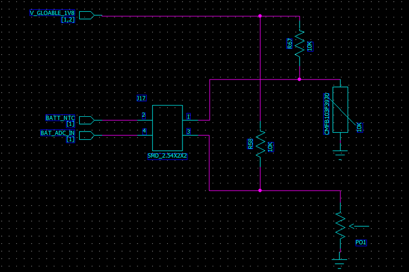

### 4.2 相关 API 介绍

ADC 相关 API: [https://doc.openluat.com/wiki/31?wiki_page_id=3909](https://doc.openluat.com/wiki/31?wiki_page_id=3909)

获取供电电压，模块温度相关 API: [https://doc.openluat.com/wiki/31?wiki_page_id=3953](https://doc.openluat.com/wiki/31?wiki_page_id=3953)

## 五、功能示例

### 5.1 核心代码

```lua
--- ADC读取测试
-- @return 无
-- @usage read2()
local function read2()
    --ADC2接口用来读取电压
    local ADC_ID = 2
    -- 读取adc
    -- adcval为number类型，表示adc的原始值，无效值为0xFFFF
    -- voltval为number类型，表示转换后的电压值，单位为毫伏，无效值为0xFFFF
    local adcval,voltval = adc.read(ADC_ID)
    log.info("testAdc2.read",adcval,voltval)
end

-- 开启对应的adc通道
adc.open(2)

-- 定时每秒读取adc值
sys.timerLoopStart(read2,1000)
```

### 5.2 效果展示

烧录代码后通过 ADC 引脚读取电压

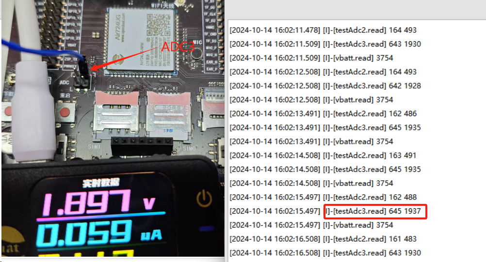
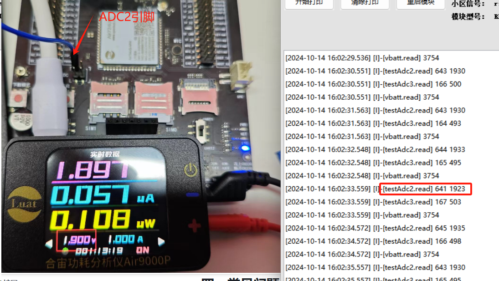

### 5.3 读取供电电压

```lua
-- 读取VBAT供电电压, 单位为mV
log.info("vbatt.read",misc.getVbatt())
```

### 5.4 读取模块温度

```lua
local function logtemp(res)
    log.info("getTemperature",res)
end

require"misc"
sys.timerLoopStart(function ()
    misc.getTemperature(logtemp) --通过传入回调函数获取温度值
end,1000)
```

### 5.5 输入电压范围

724UG 的 ADC 输入范围为 0-5V，调用 adc.open(id,scale)时，使用 scale 参数可以调整范围。

| scale<br/> | number<br/> | 设置 adc 检测的范围<br/> | adc.SCALE_1V250<br/>adc.SCALE_2V444<br/>adc.SCALE_3V233<br/>adc.SCALE_5V000<br/> |
| ---------- | ----------- | ------------------------ | -------------------------------------------------------------------------------- |

## 六、总结

本教程简单举例了如何读取 adc 输入电压、读取供电电压、读取 CPU 温度，除此之外，adc 可以将各种连续变化的模拟信号（如温度、湿度、压力、电压、电流等）转换为离散的数字信号，本模块内部 ADC 精度 12bits,对许多应用已经足够，如温湿度传感器、压力传感器、音频信号处理等，然而对于需要更高精度的应用，可以外挂更高精度的 ADC,如 16 位，24 位等。使用过程中需注意量程范围，不可超出量程。

## 七、常见问题

1. ADC 测量电压来回跳变，为什么？

答：看外部输入电压是否与模块共地，保持参考电压一致。

1. 为什么用合宙开发板测试打印出来的电压值与实际用万用表测量的电压值误差较大?

答：由于标准开发板设计目的主要为了方便功能性演示，内部还没有做有相应的优化处理，需要客户在使用时，按照实际的板子走线，阻抗，以及压降等添加相应的压差补偿。

## 八、扩展

### 8.1 使用跳线帽获取开发板电位器和热敏电阻电压

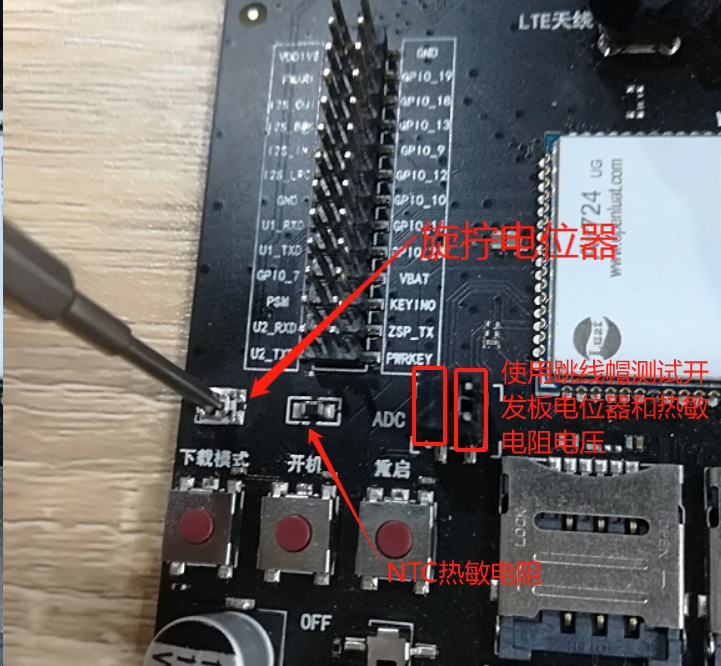
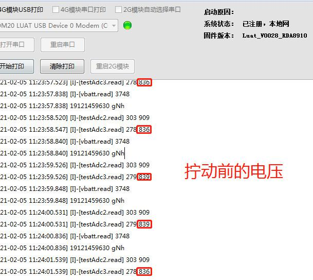

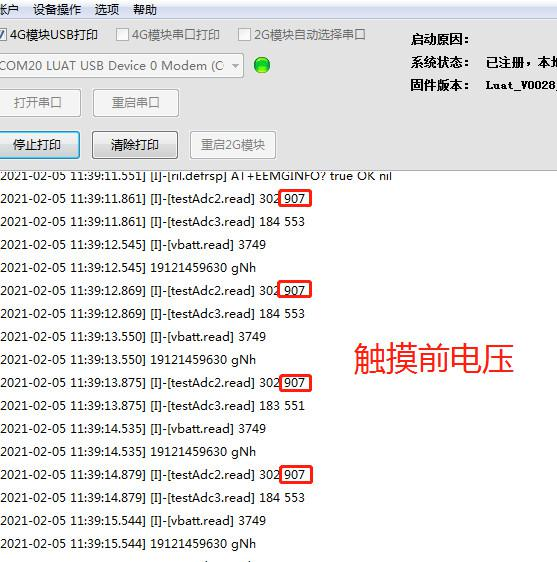
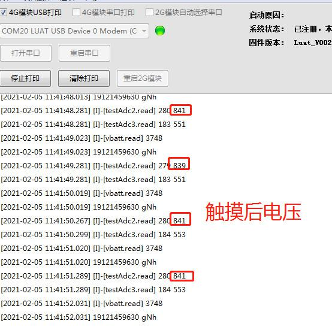

## 给读者的话

> 本篇文章由`魏健强`开发；
>
> 本篇文章描述的内容，如果有错误、细节缺失、细节不清晰或者其他任何问题，总之就是无法解决您遇到的问题；
>
> 请登录[合宙技术交流论坛](https://chat.openluat.com/)，点击[文档找错赢奖金-Air724UG-LuatOS-软件指南-硬件驱动-ADC](https://chat.openluat.com/#/page/matter?125=1848964810272800769&126=%E6%96%87%E6%A1%A3%E6%89%BE%E9%94%99%E8%B5%A2%E5%A5%96%E9%87%91-Air724UG-LuatOS-%E8%BD%AF%E4%BB%B6%E6%8C%87%E5%8D%97-%E7%A1%AC%E4%BB%B6%E9%A9%B1%E5%8A%A8-ADC&askid=1848964810272800769)；
>
> 用截图标注+文字描述的方式跟帖回复，记录清楚您发现的问题；
>
> 我们会迅速核实并且修改文档；
>
> 同时也会为您累计找错积分，您还可能赢取月度找错奖金！