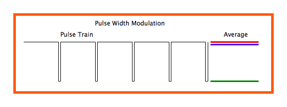
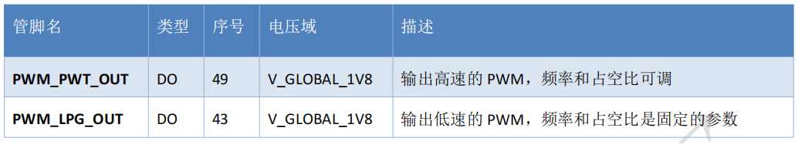
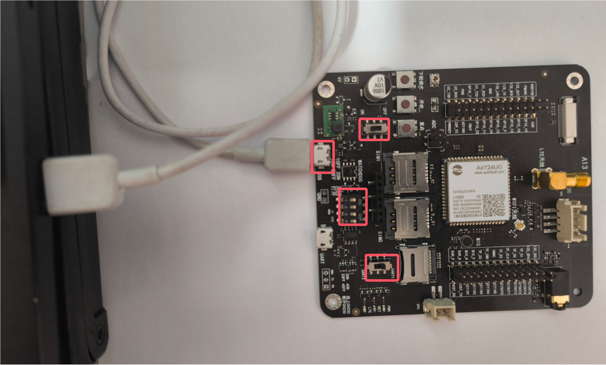
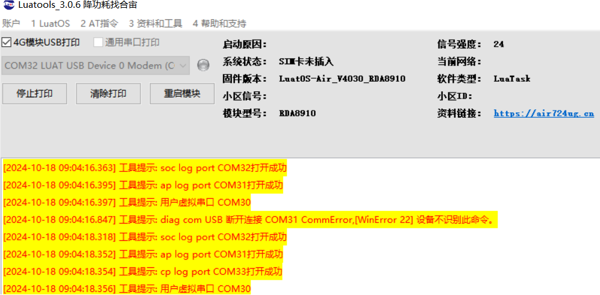
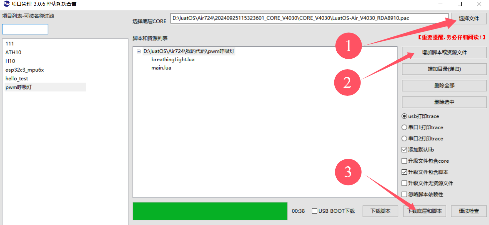
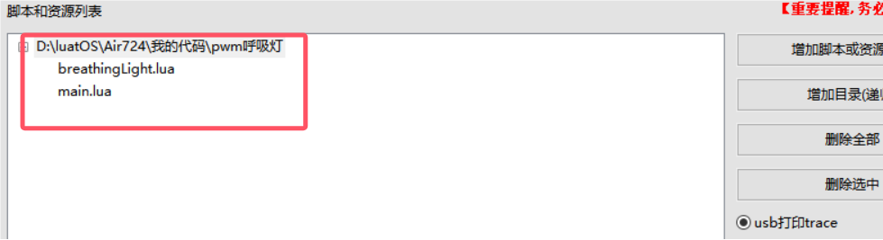
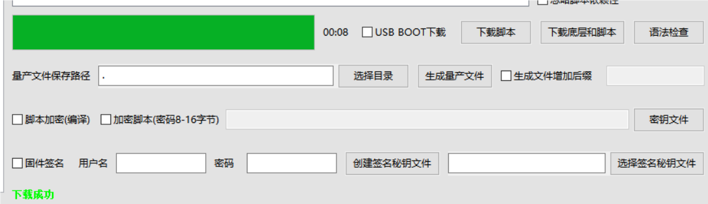

## 一、简介

### 1.1 **pwm 是什么**

脉冲宽度调制(PWM)，是英文“Pulse Width Modulation”的缩写，简称**脉宽调制**，是利用微处理器的数字输出来对模拟电路进行控制的一种非常有效的技术，广泛应用在从测量、通信到功率控制与变换的许多领域中。

PWM 的相关参数：

> 1. PWM 的频率：
>    是指 1 秒钟内信号从高电平到低电平再回到高电平的次数（一个周期），也就是说一秒钟 PWM 有多少个周期
>    单位：Hz
> 2. PWM 的周期：
>    T=1/f
>    周期=1/频率
>    例：如果频率为 50Hz ，也就是说一个周期是 20ms，那么一秒钟就有 50 次 PWM 周期
> 3. PWM 的占空比：
>    是一个脉冲周期内，高电平的时间占整个周期时间的比例
>    单位： % (0%-100%)
>    例：一个周期 10ms,高电平占 8ms，那么此占空比就是 8/10=80%

### 1.2 **pwm 原理**

单片机的 IO 引脚输出的是数字信号，且只能输出 1 和 0，那如果 TTL 电平中，高电平为 5V，低电平为 0V，但是我们想要输出不同的模拟电压，比如输出 3.75V 应该怎么操作？

> 此时要用到 PWM，通过改变 IO 口输出方波的占空比，得到不同的模拟电压。
> 3.75/5=0.75 ，也就是高电平时间占整个周期的 75%，即占空比为 75%，可得到模拟电压 3.75V.
> 
> 注意上图中蓝线，代表着输出的模拟电压，占空比越大，则模拟电压也越大。

### 1.3 Air724UG pwm 说明

查阅 [Air724UG 模块硬件设计手册](https://docs.openluat.com/air724ug/product/)



PWM_PWT_OUT 的时钟基于 APB 时钟，主时钟是 200Mhz，通过配置 pwt 寄存器的 PWT_Period 和

PWT_Duty 来控制 pwm 的输出

PWM_LPG_OUT（Light Pulse Generation）用于低频率的应用如驱动 LED 闪烁。

下面是频率和占空比可以选择的取值范围：

周期范围：125ms,250ms,500ms,1000ms,1500ms,2000ms,2500ms, 3000ms

选择对应的时间，输出的波形周期也与之对应。

高电平时间： 15.6ms, 31.2ms, 46.8ms, 62ms, 78ms, 94ms, 110ms, 125ms, 140ms, 156ms, 172ms, 188ms,

200ms, 218ms, 243ms

选择对应高电平时间，输出在当前周期内的高电平。

## 二、演示功能概述

本教程教你如何使用开发板输出 PWM 功能。

功能定义：

1. 使用 PWM 引脚输出脉宽调制信号
2. 驱动开发板指示灯，呼吸灯演示

## 三、准备硬件环境

### 3.1 开发板准备

使用 EVB_Air724 开发板，如下图所示：


淘宝购买链接：<u>Air724UG-NFM 开发板淘宝购买链接</u>

此开发板的详细使用说明参考：[Air724UG 产品手册](https://docs.openluat.com/air724ug/product/) 中的 << EVB_Air724UG_AXX 开发板使用说明 >>，写这篇文章时最新版本的使用说明为：EVB_Air724UG_A14 开发板使用说明；开发板使用过程中遇到任何问题，可以直接参考这份使用说明文档。

api：[https://doc.openluat.com/wiki/21?wiki_page_id=2068](https://doc.openluat.com/wiki/21?wiki_page_id=2068)

### 3.2 数据通信线

USB 数据线一根（micro usb）。

### 3.3 PC 电脑

WINDOWS 系统，其他暂无特别要求

### 3.4 组装硬件环境

usb 数据线插入 usb 口，另一端与电脑相连，拨码开关全部拨到 on，串口切换开关选择 UART1,USB 供电的 4V 对应开关拨至 ON 档，如下图所示。



## 四、准备软件环境

### 4.1 下载调试工具

使用说明参考：[Luatools 下载和详细使用](https://docs.openluat.com/Luatools/)

### 4.2 源码及固件

1. 底层 core 下载

下载底层固件，并解压

链接：[https://docs.openluat.com/air724ug/luatos/firmware/](https://docs.openluat.com/air724ug/luatos/firmware/)

如下图所示，红框的是我们要使用到的


1. 本教程使用的 demo 见附件：
[右键点我,另存为,下载完整压缩文件包](file/pwm呼吸灯.zip){:target="_blank"}

### 4.3 下载固件和脚本到开发板中

打开 luatools，开发板上电开机，如开机成功 Luatools 会打印如下信息。



点击项目管理测试选项。


进入管理界面，如下图所示。



- 点击选择文件，选择底层固件，我的文件放在 D:\luatOS\Air724 路径中


- 点击增加脚本或资源文件，选择之前下载的程序源码，如下图所示。



- 点击下载底层和脚本，下载完成如下图所示。



## 五、代码示例介绍

### 5.1 PWM 接口说明

本例使用 Air724 的 49 管脚，即 PWM_PWT_OUT GPIO_5    pwm 通道 id=0，控制开发板上的红色电源指示灯。

开启 pwm 通道的 pwm 输出，设置不同的占空比，小灯会有不同的亮度，原理图如图所示。


### 5.2 breathingLight.lua 代码

打开并且配置 PWM   函数 misc.openPwm(0, 512, y) 说明

--0：gpio5,  1:gpio13

--p1        周期        0-1024

--p2        占空比        0-512

```lua
sys.taskInit(function()
    sys.wait(5000)
    log.info("test start")
    while true do
        if x == 0 then
            y = y + 4
        elseif x == 1 then
            y = y - 4
        end
        if y < 6 then
            x = 0
        elseif y >= 508 then
            x = 1
        end
        misc.openPwm(0, 512, y)         -- 打开并且配置PWM
        sys.wait(8)
    end
end)
```

### 5.3 main.lua 代码

本代码为主程序脚本，系统启动后首先会对 4G 网络进行配置，然后加载加载呼吸灯功能测试模块。

```lua
--必须在这个位置定义PROJECT和VERSION变量
--PROJECT：ascii string类型，可以随便定义，只要不使用,就行
--VERSION：ascii string类型，如果使用Luat物联云平台固件升级的功能，必须按照"X.X.X"定义，X表示1位数字；否则可随便定义
PROJECT = "BREATHING_LIGHT"
VERSION = "2.0.0"

--加载日志功能模块，并且设置日志输出等级
--如果关闭调用log模块接口输出的日志，等级设置为log.LOG_SILENT即可
require "log"
LOG_LEVEL = log.LOGLEVEL_TRACE
--[[
如果使用UART输出日志，打开这行注释的代码"--log.openTrace(true,1,115200)"即可，根据自己的需求修改此接口的参数
如果要彻底关闭脚本中的输出日志（包括调用log模块接口和Lua标准print接口输出的日志），执行log.openTrace(false,第二个参数跟调用openTrace接口打开日志的第二个参数相同)，例如：
1、没有调用过sys.opntrace配置日志输出端口或者最后一次是调用log.openTrace(true,nil,921600)配置日志输出端口，此时要关闭输出日志，直接调用log.openTrace(false)即可
2、最后一次是调用log.openTrace(true,1,115200)配置日志输出端口，此时要关闭输出日志，直接调用log.openTrace(false,1)即可
]]
--log.openTrace(true,1,115200)

require "sys"

require "net"
--每1分钟查询一次GSM信号强度
--每1分钟查询一次基站信息
net.startQueryAll(60000, 60000)

--此处关闭RNDIS网卡功能
--否则，模块通过USB连接电脑后，会在电脑的网络适配器中枚举一个RNDIS网卡，电脑默认使用此网卡上网，导致模块使用的sim卡流量流失
--如果项目中需要打开此功能，把ril.request("AT+RNDISCALL=0,1")修改为ril.request("AT+RNDISCALL=1,1")即可
--注意：core固件：V0030以及之后的版本、V3028以及之后的版本，才以稳定地支持此功能
ril.request("AT+RNDISCALL=0,1")

--加载控制台调试功能模块（此处代码配置的是uart1，波特率115200）
--此功能模块不是必须的，根据项目需求决定是否加载
--使用时注意：控制台使用的uart不要和其他功能使用的uart冲突
--使用说明参考demo/console下的《console功能使用说明.docx》
--require "console"
--console.setup(1, 115200)

--加载硬件看门狗功能模块
--根据自己的硬件配置决定：1、是否加载此功能模块；2、配置Luat模块复位单片机引脚和互相喂狗引脚
--合宙官方出售的Air201开发板上有硬件看门狗，所以使用官方Air201开发板时，必须加载此功能模块
--[[
require "wdt"
wdt.setup(pio.P0_30, pio.P0_31)
]]

--加载网络指示灯和LTE指示灯功能模块
--根据自己的项目需求和硬件配置决定：1、是否加载此功能模块；2、配置指示灯引脚
--合宙官方出售的Air720U开发板上的网络指示灯引脚为pio.P0_1，LTE指示灯引脚为pio.P0_4
require "netLed"
pmd.ldoset(2,pmd.LDO_VLCD)
netLed.setup(true,pio.P0_1,pio.P0_4)
--网络指示灯功能模块中，默认配置了各种工作状态下指示灯的闪烁规律，参考netLed.lua中ledBlinkTime配置的默认值
--如果默认值满足不了需求，此处调用netLed.updateBlinkTime去配置闪烁时长

--加载错误日志管理功能模块【强烈建议打开此功能】
--如下2行代码，只是简单的演示如何使用errDump功能，详情参考errDump的api
require "errDump"
errDump.request("udp://dev_msg1.openluat.com:12425", nil, true)

--加载远程升级功能模块【强烈建议打开此功能】
--如下3行代码，只是简单的演示如何使用update功能，详情参考update的api以及demo/update
--PRODUCT_KEY = "v32xEAKsGTIEQxtqgwCldp5aPlcnPs3K"
--require "update"
--update.request()

--加载呼吸灯功能测试模块
require "breathingLight"

--启动系统框架
sys.init(0, 0)
sys.run()
```

## 六、开机展示

连接好硬件并下载固件后，重启开发板观察指示灯的变化，如下图所示。
<video src="file/pwm.mp4"></video>

## 七、常见问题

1. 为什么 gpio13 输出是低频波形吗？

gpio13 只能输出低频 pwm 波形。

1. 为什么配置后输出没波形？

答：看通道是否配置正确，gpio 口是否被占用。

1. PWM 的信号的频率如何选择？

频率的选择通常取决于具体应用，根据自己的项目需要来选择:

（1）电机控制:常用频率为 1 kHz 到 20 kHz，以确保足够的反应速度和控制精度。

（2）LED 调光：频率通常在 1 kHz 以上，以避免人眼感知到闪烁。

（3）音频信号：频率设置应高于音频信号的最高频率（例如，至少为 20 kHz）。

## 给读者的话

> 本篇文章由`杨超`开发；
>
> 本篇文章描述的内容，如果有错误、细节缺失、细节不清晰或者其他任何问题，总之就是无法解决您遇到的问题；
>
> 请登录[合宙技术交流论坛](https://chat.openluat.com/)，点击[文档找错赢奖金-Air724UG-LuatOS-软件指南-硬件驱动-PWM](https://chat.openluat.com/#/page/matter?125=1848965110773710849&126=%E6%96%87%E6%A1%A3%E6%89%BE%E9%94%99%E8%B5%A2%E5%A5%96%E9%87%91-Air724UG-LuatOS-%E8%BD%AF%E4%BB%B6%E6%8C%87%E5%8D%97-%E7%A1%AC%E4%BB%B6%E9%A9%B1%E5%8A%A8-PWM&askid=1848965110773710849)；
>
> 用截图标注+文字描述的方式跟帖回复，记录清楚您发现的问题；
>
> 我们会迅速核实并且修改文档；
>
> 同时也会为您累计找错积分，您还可能赢取月度找错奖金！
