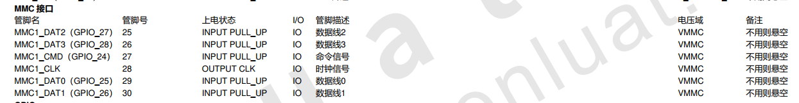

## 一、SD 卡概述

SD 卡在物联网设备中，经常用于存储较大文件的容器载体。本文介绍如何用 Air724UG 开发板，和 PC 端搭建一个基于 SD 卡存储文件的功能演示。

SDIO(Secure Digital Input and Output)全称为安全数字输入输出接口，在协议上和 SPI 类似是一种串行的硬件接口，通信的双方一个作为 HOST，另一端是 Device，所有的通信都是由 HOST 端发送命令开始的，Device 端只要解析相应的命令，就可以正常通信了。比较常见的应用是用来外接 SD 卡或者 MicroSD Card(也叫 TF 卡)。

## 二、演示功能概述

本教程教你如何在开发板上使用 SD 卡读写文件。

功能定义：

1. 开发板读取 SD 卡大小信息
2. 开发板读取 SD 文件
3. 复制 SD 卡文件到开发板中

## 三、准备硬件环境

### 3.1 Air724UG

使用 EVB_Air724 开发板，如下图所示：


淘宝购买链接：<u>Air724UG-NFM 开发板淘宝购买链接</u>

此开发板的详细使用说明参考：[Air724UG 产品手册](https://docs.openluat.com/air724ug/product/) 中的 << EVB_Air724UG_AXX 开发板使用说明 >>，写这篇文章时最新版本的使用说明为：EVB_Air724UG_A14 开发板使用说明；开发板使用过程中遇到任何问题，可以直接参考这份使用说明文档。

api：[https://doc.openluat.com/wiki/21?wiki_page_id=2068](https://doc.openluat.com/wiki/21?wiki_page_id=2068)

### 3.2 PC 电脑

WINDOWS 系统，其他暂无特别要求；

### 3.3 数据通信线

USB 数据线，暂无特别要求；

### 3.4 SD 卡

支持的 SD 卡最大容量为 32GB；

### 3.5 组装硬件环境

usb 数据线插入 usb 口，另一端与电脑相连，拨码开关全部拨到 on，串口切换开关选择 UART1,USB 供电的 4V 对应开关拨至 ON 档，SD 卡放入 SD 插槽中并锁死，如下图所示。


## 四、准备软件环境

### 4.1 安装驱动程序

驱动下载地址如下,直接安装即可。

USB 驱动程序：<u>点击此处下载</u>

下载驱动压缩包，解压后，根据电脑配置安装对应驱动，如 64 位操作系统选择如下所示


安装成功后，将开发板连接到电脑 USB 口，开机后会在设备管理器中虚拟出 3 个虚拟串口，如下则 USB 驱动安装完成。

### 4.2 安装工具 Luatools

要想烧录固件到 4G 模组中，需要用到合宙的强大的调试工具：Luatools；

详细使用说明参考：[Luatools 工具使用说明](https://docs.openluat.com/Luatools/) 。

Luatools 程序：<u>点击此处下载</u>

Luatools 工具集具备以下几大核心功能：

- 一键获取最新固件：自动连接合宙服务器，轻松下载最新的合宙模组固件。
- 固件与脚本烧录：便捷地将固件及脚本文件烧录至目标模组中。
- 串口日志管理：实时查看模组通过串口输出的日志信息，并支持保存功能。
- 串口调试助手：提供简洁的串口调试界面，满足基本的串口通信测试需求。

Luatools 下载之后， 无需安装， 解压到你的硬盘，点击 Luatools_v3.exe 运行即可。

Luatools 支持最新固件获取、固件打包、项目管理、trace 打印、单机烧录等功能。

### 4.3 脚本和固件下载

#### 程序源码下载

脚本源码见附件。
[右键点我,另存为,下载完整压缩文件包](file/sdCard.zip){:target="_blank"}

#### 固件下载

下载底层固件，并解压

链接：[https://docs.openluat.com/air724ug/luatos/firmware/](https://docs.openluat.com/air724ug/luatos/firmware/)

如下图所示，红框的是我们要使用到的


### 4.4 下载固件和脚本到开发板中

打开 luatools，开发板上电开机，如开机成功 Luatools 会打印如下信息。


点击项目管理测试选项。


进入管理界面，如下图所示。


- 点击选择文件，选择底层固件，具体路径在 4.2 项目中的解压为文件中，我的文件放在 D:\luatOS\Air724 路径中


- 点击增加脚本或资源文件，如下图所示。


- 点击下载底层和脚本，下载完成如下图所示。


## 五、开发板接口说明

### 5.1 SDIO 硬件通道对应的接口如下：



### 5.2 SD 卡部分原理图


### 5.3 SD 卡安装位置


## 六、脚本代码说明

### 6.1 testSdCard.lua

本代码为 SD 卡程序脚本，系统启动先判断是否有 sd 卡，如果挂载成功，打印总容量（单位为 KB），并且遍历读取 SD 卡根目录下的最多 10 个文件或者文件夹。复制 sd 卡的 pwron.mp3 文件，到开发板根目录，并且播放开发板根目录下的 pwron.mp3 文件。

```lua
module(..., package.seeall)

require"audio"

function sdCardTask()
    sys.wait(5000)
    --挂载SD卡,返回值0表示失败，1表示成功
    io.mount(io.SDCARD)

    --第一个参数1表示sd卡
    --第二个参数1表示返回的总空间单位为KB
    local sdCardTotalSize = rtos.get_fs_total_size(1,1)
    log.info("sd card total size "..sdCardTotalSize.." KB")


    --遍历读取sd卡根目录下的最多10个文件或者文件夹
    if io.opendir("/sdcard0") then
        for i=1,10 do
            local fType,fName,fSize = io.readdir()
            if fType==32 then
                log.info("sd card file",fName,fSize)
            elseif fType == nil then
                break
            end
        end
        io.closedir("/sdcard0")
    end

    --向sd卡根目录下写入一个pwron.mp3
    io.writeFile("/sdcard0/pwron.mp3",io.readFile("/lua/pwron.mp3"))
    --播放sd卡根目录下的pwron.mp3
    audio.play(0,"FILE","/sdcard0/pwron.mp3",audiocore.VOL7,function() sys.publish("AUDIO_PLAY_END") end)
    sys.waitUntil("AUDIO_PLAY_END")

    --卸载SD卡，返回值0表示失败，1表示成功
    io.unmount(io.SDCARD)
end

sys.taskInit(sdCardTask)
```

### 6.2 main.lua

本代码为主程序脚本，系统启动后首先会对 4G 网络进行配置，然后加载加载 SD 卡测试模块。

```lua
--必须在这个位置定义PROJECT和VERSION变量
--PROJECT：ascii string类型，可以随便定义，只要不使用,就行
--VERSION：ascii string类型，如果使用Luat物联云平台固件升级的功能，必须按照"X.X.X"定义，X表示1位数字；否则可随便定义
PROJECT = "SDCARD"
VERSION = "2.0.0"

--加载日志功能模块，并且设置日志输出等级
--如果关闭调用log模块接口输出的日志，等级设置为log.LOG_SILENT即可
require "log"
LOG_LEVEL = log.LOGLEVEL_TRACE
--[[
如果使用UART输出日志，打开这行注释的代码"--log.openTrace(true,1,115200)"即可，根据自己的需求修改此接口的参数
如果要彻底关闭脚本中的输出日志（包括调用log模块接口和Lua标准print接口输出的日志），执行log.openTrace(false,第二个参数跟调用openTrace接口打开日志的第二个参数相同)，例如：
1、没有调用过sys.opntrace配置日志输出端口或者最后一次是调用log.openTrace(true,nil,921600)配置日志输出端口，此时要关闭输出日志，直接调用log.openTrace(false)即可
2、最后一次是调用log.openTrace(true,1,115200)配置日志输出端口，此时要关闭输出日志，直接调用log.openTrace(false,1)即可
]]
--log.openTrace(true,1,115200)

require "sys"

require "net"
--每1分钟查询一次GSM信号强度
--每1分钟查询一次基站信息
net.startQueryAll(60000, 60000)

--此处关闭RNDIS网卡功能
--否则，模块通过USB连接电脑后，会在电脑的网络适配器中枚举一个RNDIS网卡，电脑默认使用此网卡上网，导致模块使用的sim卡流量流失
--如果项目中需要打开此功能，把ril.request("AT+RNDISCALL=0,1")修改为ril.request("AT+RNDISCALL=1,1")即可
--注意：core固件：V0030以及之后的版本、V3028以及之后的版本，才以稳定地支持此功能
ril.request("AT+RNDISCALL=0,1")

--加载控制台调试功能模块（此处代码配置的是uart1，波特率115200）
--此功能模块不是必须的，根据项目需求决定是否加载
--使用时注意：控制台使用的uart不要和其他功能使用的uart冲突
--使用说明参考demo/console下的《console功能使用说明.docx》
--require "console"
--console.setup(1, 115200)

--加载硬件看门狗功能模块
--根据自己的硬件配置决定：1、是否加载此功能模块；2、配置Luat模块复位单片机引脚和互相喂狗引脚
--合宙官方出售的Air201开发板上有硬件看门狗，所以使用官方Air201开发板时，必须加载此功能模块
--[[
require "wdt"
wdt.setup(pio.P0_30, pio.P0_31)
]]

--加载网络指示灯和LTE指示灯功能模块
--根据自己的项目需求和硬件配置决定：1、是否加载此功能模块；2、配置指示灯引脚
--合宙官方出售的Air720U开发板上的网络指示灯引脚为pio.P0_1，LTE指示灯引脚为pio.P0_4
require "netLed"
pmd.ldoset(2,pmd.LDO_VLCD)
netLed.setup(true,pio.P0_1,pio.P0_4)
--网络指示灯功能模块中，默认配置了各种工作状态下指示灯的闪烁规律，参考netLed.lua中ledBlinkTime配置的默认值
--如果默认值满足不了需求，此处调用netLed.updateBlinkTime去配置闪烁时长

--加载错误日志管理功能模块【强烈建议打开此功能】
--如下2行代码，只是简单的演示如何使用errDump功能，详情参考errDump的api
require "errDump"
errDump.request("udp://dev_msg1.openluat.com:12425", nil, true)

--加载远程升级功能模块【强烈建议打开此功能】
--如下3行代码，只是简单的演示如何使用update功能，详情参考update的api以及demo/update
--PRODUCT_KEY = "v32xEAKsGTIEQxtqgwCldp5aPlcnPs3K"
--require "update"
--update.request()

--加载SD卡功能测试模块
require "testSdCard"

--启动系统框架
sys.init(0, 0)
sys.run()
```

## 七、开机调试

### 7.1 开发板开机

连接好硬件并下载固件后，启动 Luatools 软件，系统运行信息将显示在界面中。红框中为开发板连接到 PC 机后正常打印的信息，如下图所示。


### 7.2 SD 卡调试

读取 SD 卡信息：

显示 SD 卡中的文件和大小：


### 7.3 MP3 文件处理

复制 mp3 文件到开发板，完成后在开发板上播放 mp3，如下图所示。


## 给读者的话

> 本篇文章由`杨超`开发；
>
> 本篇文章描述的内容，如果有错误、细节缺失、细节不清晰或者其他任何问题，总之就是无法解决您遇到的问题；
>
> 请登录[合宙技术交流论坛](https://chat.openluat.com/)，点击[文档找错赢奖金-Air724UG-LuatOS-软件指南-硬件驱动-SD卡](https://chat.openluat.com/#/page/matter?125=1848965518229372930&126=%E6%96%87%E6%A1%A3%E6%89%BE%E9%94%99%E8%B5%A2%E5%A5%96%E9%87%91-Air724UG-LuatOS-%E8%BD%AF%E4%BB%B6%E6%8C%87%E5%8D%97-%E7%A1%AC%E4%BB%B6%E9%A9%B1%E5%8A%A8-SD%E5%8D%A1&askid=1848965518229372930)；
>
> 用截图标注+文字描述的方式跟帖回复，记录清楚您发现的问题；
>
> 我们会迅速核实并且修改文档；
>
> 同时也会为您累计找错积分，您还可能赢取月度找错奖金！
