## 一、串口（uart）概述


UART（通用异步接收器/发送器）是一种串行通信协议，因其多功能性和简单性而被广泛使用。与 I2C 和 SPI 不同，UART 只需要两条线即可运行：TX（发送）和 RX（接收）。该协议允许异步通信，也就是说发送器和接收器之间无需共享时钟。数据被组织成数据包，每个数据包包含一个起始位、5 到 9 个数据位、一个可选的奇偶校验位和一个或两个停止位。

**优点**：

- 简单：UART 通信协议相对简单，易于实现和调试。
- 适用性广泛：UART 被广泛应用于各种设备之间的通信，具有较好的兼容性。
- 距离：UART 通信距离较远，适用于需要长距离传输的场景。

**缺点**：

- 速度较低：UART 通信速度相对较低，不适用于对速度要求较高的应用。
- 双工：UART 通信是双工的，可以进行低速双工传输数据，进行数据的发送和接收。
- 不可靠：由于 UART 是异步通信，可能会受到噪声和干扰的影响，导致数据传输不可靠。

## 二、演示功能概述

本文主要教你使用 Air724UG 开发板对串口（uart）进行一个测试，其中包含了串口，RS485，usb 虚拟串口，多串口，串口电平转换等内容，其中对 RS485 有一个搭配温湿度传感器做的一个温湿度传感器 demo

## 三、准备硬件环境

### 3.1 开发板准备

在开始之前，需要准备一套 Air724UG 开发板，目前合宙推出两种 Air724UG 开发板（开发板和核心板），开发板的优势在于大多数管脚接口都引出来了，例如 sd 卡，camera，屏幕等接口，实际使用都是一样的，在使用时可根据自身需求选择开发板。

1. 如果你选择的是 Air724UG 开发板，下方资料可供你参考查阅
   使用 Air724UG-NFM 开发板，如下图所示：
   
   淘宝购买链接：[Air724UG-NFM 开发板淘宝购买链接](https://item.taobao.com/item.htm?id=614077856538&pisk=fliezCgRrHKeY5RClWrz399HDhZLAodXU0N7EYDudWVnNJZzE5kDpWTJJbuZZfUQtW9L4zcotzc7Nv6KWjMcADTLVgrL2uAXGntfpvE8qeHl-l1dI82vVwqutHtLvKdXGntPbFd0mIGI4pMNR8PgK8VuZdzgpJquK7VHQ52zH7jnZuYWol5WiUapixFiPWEh80XknSSlqDx88SyNPgSzbJ4EDvVaCRiaLyP05f0fODcsEDiLWHsL2Agqa4cD1wNnu-lal2RVYjlLEf2iOL_8Q4koDkUdegh4YbzmxPWl0xqnJlyimL_Y1cPIZDzMhiz7jma0xVT9OzZU3bmKTTSoigkVwRfI_03FZaz3BRPXQd8vULWW-_YfbaQ8SoeaGpwCyaU3BRPXQd7RyPVTQS9Qd&skuId=4862577940947&spm=a1z10.3-c-s.w4002-24045920836.10.292c6ee5wTkgXN) ；
   此开发板的详细使用说明参考：[Air724UG 产品手册](https://docs.openluat.com/air724ug/product/) 中的 << EVB_Air724UG_AXX 开发板使用说明 >>，写这篇文章时最新版本的使用说明为：EVB_Air724UG_A14 开发板使用说明；开发板使用过程中遇到任何问题，可以直接参考这份使用说明文档。
2. 如果你选择的是 Air724UG 核心板，下方资料可供你参考查阅
   淘宝购买链接：[Air724UG 核心板淘宝购买链接](https://item.taobao.com/item.htm?id=614077856538&pisk=fw1rTbsxq7FP7wrSC3Re7ZlEMd8WNCE1-6tB-wbHP3xlAUOe-n7gy3wLeMWVxipWq31CYwxc5a6SN7Kn8ibHKMtCP4BAfNc5N8dITQdptlZ_15T5yBdn_rvsR0hDSFFB-XcHdXn91lZ_1Wl4HlAgfgse3hkW8nYkrBc3uKYH5BYkqL42me89xbjHtUfG85mE2pqGWnXIeOobyA6k0XcZWUJlg5KmtJfDzZ-Prehnts8ye6QgotBWF9b9B_s3Tjd57tAD86UiLHJNK_OcZoVMHpfcmEj7RvLVLwf9wLgt6QWh26JRU2UOoQjABhpuHoLVN19eXKo0qZ_2qdWwh2DfudKkI_RK8X7Jtejr5DLcCk1pF4MeEEL2frz4ad9_zXnN2fHKpKA9uhaWPvHpE_L2fryZpvp8vE-_PD1..&skuId=4862577940947&spm=a1z10.1-c-s.w4004-24795286339.18.25f01170ZZXGdm)
   硬件资料：[Air724UG 产品手册](http://docs.openluat.com/air724ug/product/) 访问页面中的 Air724UG-核心板硬件资料
   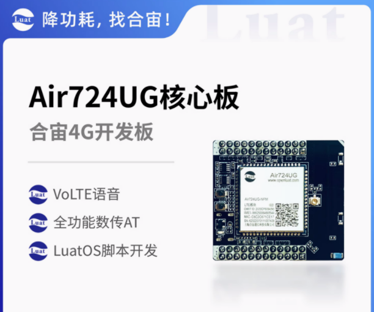

### 3.2 SIM 卡

在中国大陆环境下，使用移动，电信，联通的物联网卡或者手机卡都可以。

### 3.3 数据通信线

1. USB 数据线


1. 由于本篇教程和串口相关，所以需要准备 USB 转 TTL 工具或者串口线。例如 CH340、FT232 等，本文使用的是高速串口：[购买链接](https://item.taobao.com/item.htm?abbucket=12&id=608773837508&ns=1&pisk=gM2iHHqsm5l_brOIlMk1i10xvtu0KhMj1rpxkx3VT2uBBjuA1rc0kyG4BAET-qz8omeTH-VBnuZbBGMAfAZshx7RyT30flMXYCX9M-DUY0oRHClZgl_9YxXdyTB8x1osHk78BxmiR0nJ3xlZ3HJERm027jzqTpoj8do2Qm8FxmgE3moZb9rEX0dwbqz2TkosVFJw3V8eLmiZ3qzq3wNH3424dJ7137Wg-79ewDcizluHEkVobUmAFmvVEJobxUri-MILKccirXCMP5waJoyTCX9V4DOeaos6hk_z6IOj_Diny1NpoPbGTvsPxMA51foIXaIhxIwWPKJlpMjHakGZAcEd.&priceTId=214640db17291600001397870eb48b&skuId=4449333351143&spm=a21n57.1.item.319.487c523c1WpDjW&utparam=%7B%22aplus_abtest%22%3A%22062f9b6c0e4cc9c5268b2350d8d11526%22%7D&xxc=taobaoSearch)

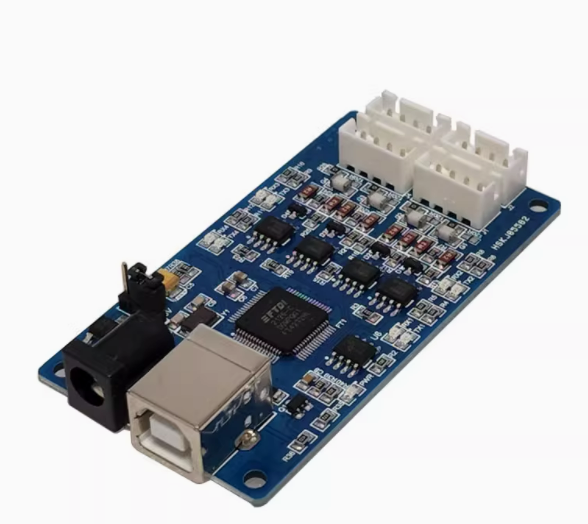

### 3.4 PC 电脑

PC 电脑推荐使用 win7 及以上版本，Air724UG 驱动下载地址：[8910 驱动](https://doc.openluat.com/wiki/21?wiki_page_id=6908)

### 3.5 介绍串口如何接线

Air724UG 模组有 5 个串口，分别为 UART1，UART2，UART3，HOST UART 和 ZSP UART 调试串口。

其中对于 Luat 开发方式，UART1 可以用作一个通用的串口来连接其他的串口设备。

UART2 可以用来射频校准，同时 UART2 还用来和内部的蓝牙进行通讯，如果用到了蓝牙功能，则 UART2 不可 再用作其他用途。

UART3 是一个通用串口，可以用作外接 GPS 等外设。

HOST UART 用来软件调试时输出 AP trace。

ZSP UART 用来软件调试时输出 CP trace。

其中 HOST UART 和 ZSP UART 不能作为普通串口使用，只用于调试输出底层日志。

1. 如果你想了解这 5 个串口对应于模组的哪个管脚，请看下方图片：

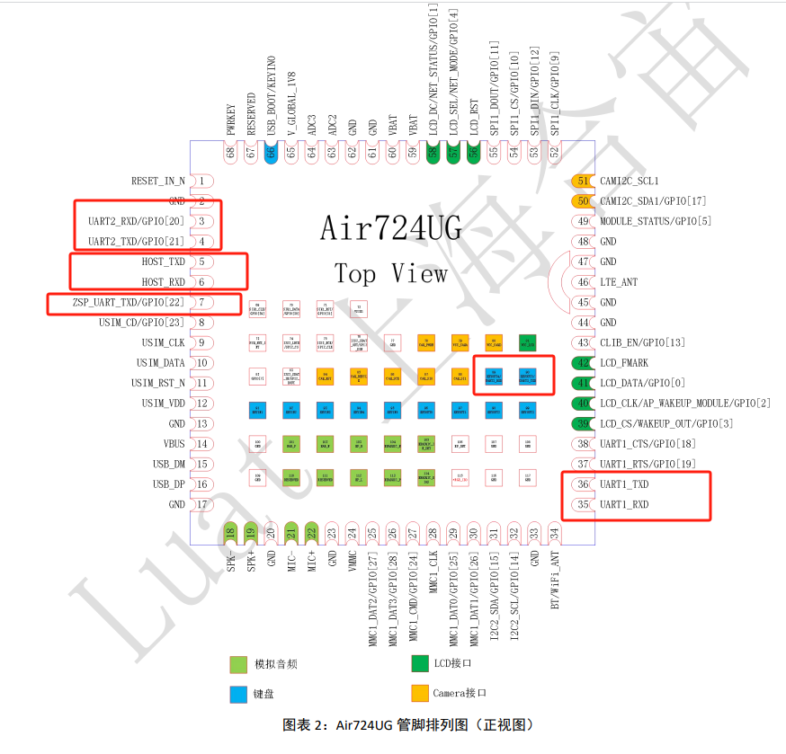

1. 如果你只想知道 Air724UG 开发板的串口引出位置，请看下方图片：

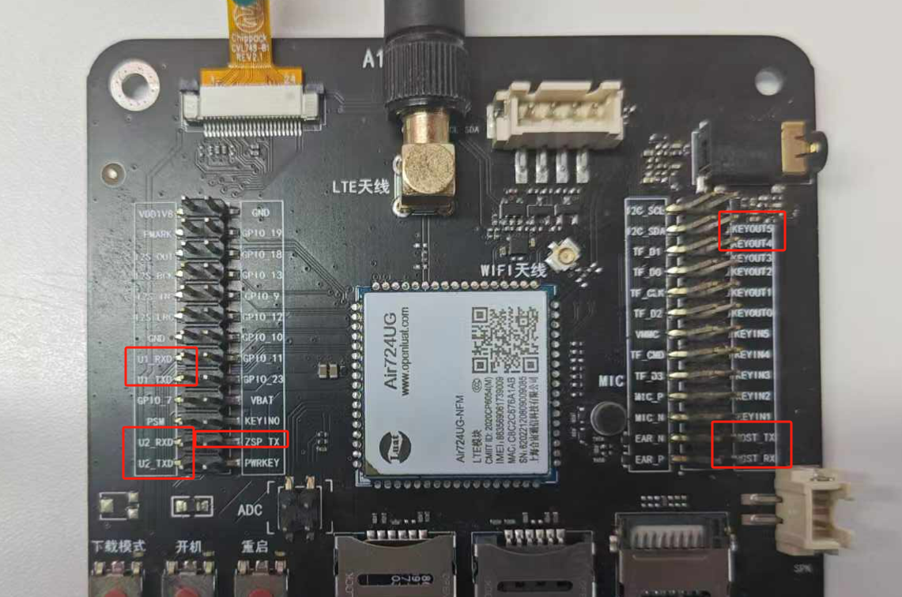

1. 接下来进行接线操作，注意模块与 MCU 之间要交叉接线，即 TX 接 RX，RX 接 TX，GND 接 GND 。由于本文只需用到 UART1 和 UART2 两个通用串口，因此下表中只列出了这两个通用串口的模块引脚编号及模块与 MCU 之间接线说明。

| **模块引脚**<br/> | **模块**<br/>  | **连接 mcu 或串口线**<br/> |
| ----------------- | -------------- | -------------------------- |
| 35<br/>           | uart1_txd<br/> | uart_rx<br/>               |
| 36<br/>           | uart1_rxd<br/> | uart_tx<br/>               |
| 3<br/>            | uart2_txd<br/> | uart_rx<br/>               |
| 4<br/>            | uart2_rxd<br/> | uart_tx<br/>               |

---

## 四、准备软件环境

### 4.1 源码及工具

- Air724UG 模块使用固件：[固件地址](https://docs.openluat.com/air724ug/luatos/firmware/)，选择最新版本 CORE_V4030，本文使用的固件版本是：LuatOS-Air_V4030_RDA8910_BT_FLOAT.pac
- 将固件和脚本烧录到模块中，使用说明参考：[Luatools 下载和详细使用](https://docs.openluat.com/Luatools/)
  源码和固件已打包，如下所示：
[右键点我,另存为,下载完整压缩文件包](file/uart.zip){:target="_blank"}
串口工具本文选用的是 sscom

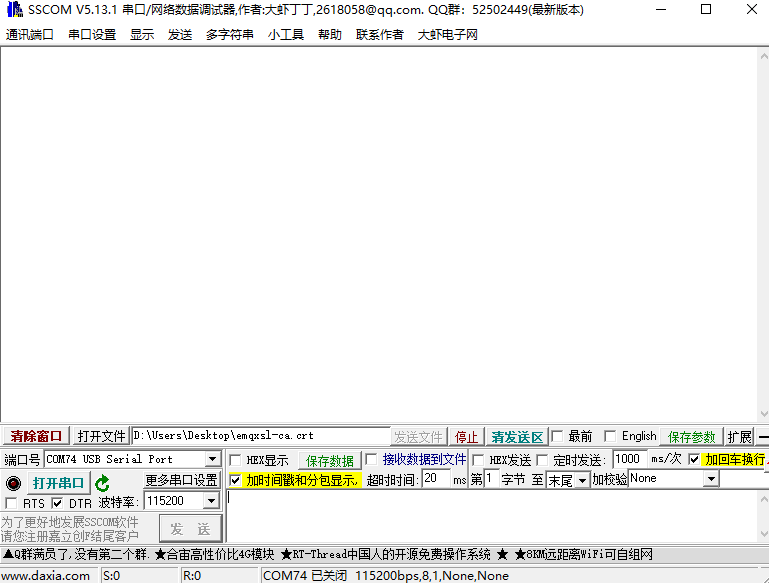

### 4.2 uart 库接口描述

uart 库即串口操作库，该库为内部库，所以在程序中使用时无需 require 调用，本文只是简单介绍 uart 库中常用接口描述，其余接口描述请参考：[uart 接口文档](https://doc.openluat.com/wiki/21?wiki_page_id=2250)

#### 4.2.1 配置串口参数

```lua
-- 配置串口参数
-- @api    uart.setup(id, baud, databits, parity, partiy, stopbits, msgmode, txDoneReport, flowcontrol, priority)
-- @int 串口id, 1(UART1),2(UART2),3(UART3),0x81(USB)
-- @int 波特率, 默认115200，可选择波特率表:{921600,460800,230400,115200,57600,38400,19200,9600,4800,2400,1200}
-- @int 数据位，只有一个取值8
-- @int 校验位，取值uart.PAR_EVEN, uart.PAR_ODD或uart.PAR_NONE
-- @int 停止位，取值uart.STOP_1，uart.STOP_2
-- @int 0 或者默认 - 消息通知，1 - 无消息上报需要用户主动轮询   取值:0/1
-- @int txdone消息上报开关  0：关闭，1：打开
-- @int 硬流控功能  0：关闭(默认)，1：打开
-- @int uart rx优先级   0：慢(默认)，1：快
-- @return int 串口的真实波特率 
-- @usage
-- 最常用115200 8N1
uart.setup(1,115200,8,uart.PAR_NONE,uart.STOP_1)
```

#### 4.2.2 写串口

```lua
-- 写串口
-- @api    uart.write(id, data)
-- @int 串口id, 1(UART1),2(UART2),3(UART3),0x81(USB)
-- @string/int 待写入的数据
-- @usage
-- 写入可见字符串
uart.write(1, "hello")
-- 写入十六进制的数据串
uart.write(1, string.char(0x55,0xAA,0x4B,0x03,0x86))
```

#### 4.2.3 读串口

```lua
-- 读串口
-- @api    uart.read(id, format)
-- @int 串口id, 1(UART1),2(UART2),3(UART3),0x81(USB)
-- @int 读取格式 l：读取到结束字符\n或者阻塞发送，n：读取整型数据，*s：读取到空格字符数字，number类型：只读取number长度的数据
-- number类型的数字：表示读取指定长度字节的数据
--     如果缓冲区中没有数据，则返回空字符串，返回值为string类型
--     如果缓冲区中的数据长度小于等于要读取的数据长度，则返回缓冲区中的所有数据，返回值为string类型
--     如果缓冲区中的数据长度大于要读取的数据长度，则返回要读取的长度的数据，返回值为string类型
-- string类型的*l：  表示读取到换行符\n
--     如果缓冲区中没有数据，则返回空字符串，返回值为string类型
--     如果缓冲区中的数据没有\n，则返回缓冲区中的所有数据，返回值为string类型
--     如果缓冲区中的数据有\n，则返回到\n结束的所有数据（包括\n），返回值为string类型
-- string类型的*n：  表示读取整型数据
--     如果缓冲区中没有数据，则返回0，返回值为number类型
--     如果缓冲区中的第一个字节的数据不是+、-、数字，则返回0，返回值为number类型
--     如果缓冲区中的前几个字节满足整型数据格式[+-]%d+，则按照最长匹配返回数据，返回值为number类型
-- string类型的*s：  表示读取到空格字符
--     如果缓冲区中没有数据，则返回空字符串，返回值为string类型
--     如果缓冲区中的数据没有空格，则返回缓冲区中的所有数据，返回值为string类型
--     如果缓冲区中的数据有空格，则返回到空格结束的所有数据（不包括空格），返回值为string类型
-- @return string 读取到的数据
-- @usage
uart.read(1,"*l")
```

#### 4.2.4 关闭串口

```lua
-- 关闭串口
-- @api    uart.close(id)
-- @int 串口id, 1(UART1),2(UART2),3(UART3),0x81(USB)
-- @return nil 无返回值
-- @usage
uart.close(1)
```

#### 4.2.5 注册串口事件回调

```lua
-- 注册串口事件回调
-- @api    uart.on(id, event, func)
-- @int 串口id, 1(UART1),2(UART2),3(UART3),0x81(USB)
-- @string 事件名称 "receive"表示串口收到数据，注意：使用uart.setup配置串口时，第6个参数设置为nil或者0，
--收到数据时，才会产生"receive"事件"sent"表示串口数据发送完成，注意：使用uart.setup配置串口时，第7个参数设置为1，
--调用uart.write接口发送数据之后，才会产生"sent"事件
-- @function 回调方法   可选参数，默认为nil，callback 串口事件的处理函数
-- @return nil 无返回值
-- @usage
local function writeOk()
    log.info("testUart.writeOk")
end
uart.on(1,"sent",writeOk)
```

#### 4.2.6 485 转向控制

```lua
--485转向控制
-- @api     uart.set_rs485_oe(id, io, level, timeUs, mode)
-- @int 串口id, 1(UART1),2(UART2),3(UART3),0x81(USB)
-- @int gpio值  pio.Pxx
-- @int 输出使能电平有效值，默认1，配置为1时表示高电平发送，配置为0时表示低电平发送      1/0
-- @int 485 oe转向延迟时间,单位US，缺省时为0延迟5个当前波特率的时钟时间      
-- @int 485 oe转向模式选择，默认0。 配置为1时表示使用定时器控制，可以使转向时间小于100us(timeUs最小值为1)       1/0  
-- @return nil 无返回值
-- @usage
uart.setup(1,115200,8,uart.PAR_NONE,uart.STOP_1,nil,1) --必须先使用setup，并且最后一个参数是1（打开发送完成后的通知功能）
uart.set_rs485_oe(1, pio.P2_0) --仅4G 0013版本之后支持
--当mode=1时
uart.set_rs485_oe(1, pio.P2_0,1,1,1)
--使用定时器进行转向控制，所以timeUs最小值为1。由于误差的存在，所以设置timeUs范围在（1--20），才能保证转向时间小于100us。
```

#### 4.2.7 从串口读取单字符

```lua
--从串口读取单字符
-- @api     uart.getchar(id)
-- @int 串口id, 1(UART1),2(UART2),3(UART3),0x81(USB)
-- @return 串口读出来的字符
-- @usage
uart.getchar(1)
```

### 4.3 初始化 uart

使用 UART1 串口
```lua
local UART_ID = 1 -- 使用uart1，可根据实际设备选取不同的uartid

--初始化 参数都可以根据实施情况修改
uart.setup(UART_ID,115200,8,uart.PAR_NONE,uart.STOP_1)
```
使用 UART2 串口
```lua
local UART_ID= 2 -- 使用uart2

--初始化 参数都可以根据实施情况修改
uart.setup(UART_ID,115200,8,uart.PAR_NONE,uart.STOP_1)
```

### 4.4 注册接收数据的回调函数

`uart.on` 函数用于注册一个接收事件的回调函数，当指定的串口 `uartid` 接收到数据时，该回调函数会被自动触发并执行。回调函数通过 `uart.on(UART_ID, "receive", read)` 定义，并处理接收到的数据。数据的读取是通过 `uart.read()` 函数进行的，`uart.read()` 函数是非阻塞的，它是直接从现有缓存区中直接读取数据。

```lua
-- 收取数据会触发回调, 这里的 "receive" 是固定值不要修改。
local function read()
    local data = ""
    --底层core中，串口收到数据时：
    --如果接收缓冲区为空，则会以中断方式通知Lua脚本收到了新数据；
    --如果接收缓冲器不为空，则不会通知Lua脚本
    --所以Lua脚本中收到中断读串口数据时，每次都要把接收缓冲区中的数据全部读出，这样才能保证底层core中的新数据中断上来，此read函数中的while语句中就保证了这一点
    while true do        
        data = uart.read(uartid,"*l")
        if not data or string.len(data) == 0 then break end
        --打开下面的打印会耗时
        log.info("testUart.read bin",data)
        log.info("testUart.read hex",data:toHex())
    end
end

uart.on(UART_ID,"receive",read)
```

### 4.5 发送数据

> 本文中字符串编码格式为 UTF-8 编码格式，SSCOM 串口调试工具的编码格式为 GB2312,所以导致无法正确显示字符串中的中文，需要注意。

#### 4.5.1 发送普通字符串

```lua
--本文中字符串编码格式为UTF-8编码格式，SSCOM串口调试工具的编码格式为GB2312,所以导致无法正确显示字符串中的中文，需要注意。
uart.write(UART_ID, "合宙模块Air724UG") 
--利用common库的common.utf8ToGb2312()将UTF-8编码转换成GB2312格式，在sscom可以正常显示中文
uart.write(UART_ID, common.utf8ToGb2312("合宙模块Air724UG"))
```

#### 4.5.2 发送十六进制的数据串

```lua
uart.write(UART_ID, string.char(0x55,0xAA,0x4B,0x03,0x86))
```

#### 4.5.3 发送 json 格式的数据

```lua
local data =
{
    host = "abcdefg.com",
    port = "1883",
    clientID = "c88885",
    username = "user",
    password = "123456",
    ca_self = {ssl=false},
}

local jsondata = json.encode(data)
uart.write(UART_ID, jsondata)
```

### 4.6 完整例程

```lua
--- 模块功能：串口1功能测试
-- @author openLuat
-- @module uart.testUart
-- @license MIT
-- @copyright openLuat
-- @release 2018.03.27

module(...,package.seeall)

require"utils"
require"pm"
require "common"
--[[
功能定义：
uart按照帧结构接收外围设备的输入，收到正确的指令后，回复ASCII字符串

帧结构如下：
帧头：1字节，0x01表示扫描指令，0x02表示控制GPIO命令，0x03表示控制端口命令
帧体：字节不固定，跟帧头有关
帧尾：1字节，固定为0xC0

收到的指令帧头为0x01时，回复"CMD_SCANNER\r\n"给外围设备；例如接收到0x01 0xC0两个字节，就回复"CMD_SCANNER\r\n"
收到的指令帧头为0x02时，回复"CMD_GPIO\r\n"给外围设备；例如接收到0x02 0xC0两个字节，就回复"CMD_GPIO\r\n"
收到的指令帧头为0x03时，回复"CMD_PORT\r\n"给外围设备；例如接收到0x03 0xC0两个字节，就回复"CMD_PORT\r\n"
收到的指令帧头为其余数据时，回复"CMD_ERROR\r\n"给外围设备；例如接收到0x04 0xC0两个字节，就回复"CMD_ERROR\r\n"
]]

--串口ID,1对应uart1
--如果要修改为uart2，把UART_ID赋值为2即可
local UART_ID = 1
--帧头类型以及帧尾
local CMD_SCANNER,CMD_GPIO,CMD_PORT,FRM_TAIL = 1,2,3,string.char(0xC0)
--串口读到的数据缓冲区
local rdbuf = ""

--[[
函数名：parse
功能  ：按照帧结构解析处理一条完整的帧数据
参数  ：
        data：所有未处理的数据
返回值：第一个返回值是一条完整帧报文的处理结果，第二个返回值是未处理的数据
]]
local function parse(data)
    if not data then return end    
    
    local tail = string.find(data,string.char(0xC0))
    if not tail then return false,data end    
    local cmdtyp = string.byte(data,1)
    local body,result = string.sub(data,2,tail-1)
    
    log.info("testUart.parse",data:toHex(),cmdtyp,body:toHex())
    
    if cmdtyp == CMD_SCANNER then
        write("CMD_SCANNER")
    elseif cmdtyp == CMD_GPIO then
        write("CMD_GPIO")
    elseif cmdtyp == CMD_PORT then
        write("CMD_PORT")
    else
        write("CMD_ERROR")
    end
    
    return true,string.sub(data,tail+1,-1)    
end

--[[
函数名：proc
功能  ：处理从串口读到的数据
参数  ：
        data：当前一次从串口读到的数据
返回值：无
]]
local function proc(data)
    if not data or string.len(data) == 0 then return end
    --追加到缓冲区
    rdbuf = rdbuf..data    
    
    local result,unproc
    unproc = rdbuf
    --根据帧结构循环解析未处理过的数据
    while true do
        result,unproc = parse(unproc)
        if not unproc or unproc == "" or not result then
            break
        end
    end

    rdbuf = unproc or ""
end

--[[
函数名：read
功能  ：读取串口接收到的数据
参数  ：无
返回值：无
]]
local function read()
    local data = ""
    --底层core中，串口收到数据时：
    --如果接收缓冲区为空，则会以中断方式通知Lua脚本收到了新数据；
    --如果接收缓冲器不为空，则不会通知Lua脚本
    --所以Lua脚本中收到中断读串口数据时，每次都要把接收缓冲区中的数据全部读出，这样才能保证底层core中的新数据中断上来，此read函数中的while语句中就保证了这一点
    while true do        
        data = uart.read(UART_ID,"*l")
        if not data or string.len(data) == 0 then break end
        --打开下面的打印会耗时
        log.info("testUart.read bin",data)
        log.info("testUart.read hex",data:toHex())
        proc(data)
    end
end

--[[
函数名：write
功能  ：通过串口发送数据
参数  ：
        s：要发送的数据
返回值：无
]]
function write(s)
    log.info("testUart.write",s)
    uart.write(UART_ID,s.."\r\n")
end

local function writeOk()
    log.info("testUart.writeOk")
end

sys.taskInit(function()
    -- 循环两秒向串口发一次数据
    while true do
        sys.wait(2000)
        --利用common库的common.utf8ToGb2312()将UTF-8编码转换成GB2312格式，在sscom可以正常显示中文
        uart.write(UART_ID, common.utf8ToGb2312("合宙模块Air724UG"))
    end
end)

--保持系统处于唤醒状态，此处只是为了测试需要，所以此模块没有地方调用pm.sleep("testUart")休眠，不会进入低功耗休眠状态
--在开发“要求功耗低”的项目时，一定要想办法保证pm.wake("testUart")后，在不需要串口时调用pm.sleep("testUart")
pm.wake("testUart")
--注册串口的数据接收函数，串口收到数据后，会以中断方式，调用read接口读取数据
uart.on(UART_ID,"receive",read)
--注册串口的数据发送通知函数
uart.on(UART_ID,"sent",writeOk)

--配置并且打开串口
uart.setup(UART_ID,115200,8,uart.PAR_NONE,uart.STOP_1)
--如果需要打开“串口发送数据完成后，通过异步消息通知”的功能，则使用下面的这行setup，注释掉上面的一行setup
--uart.setup(UART_ID,115200,8,uart.PAR_NONE,uart.STOP_1,nil,1)
```

**代码运行结果**：

`uart.write(UART_ID, common.utf8ToGb2312("合宙模块Air724UG"))` 向串口发送对应的字符串数据，`uart.on()` 会事先注册一个接收数据的回调函数，当指定的串口 `uartid` 接收到数据时，该回调函数会被自动触发并执行，`log.info``("testUart.read bin",data)``log.info``("testUart.read hex",data:toHex())` 会将接收到的数据打印出来，此时我们通过串口调试工具，选择对应的端口，即可看到对应的打印信息。

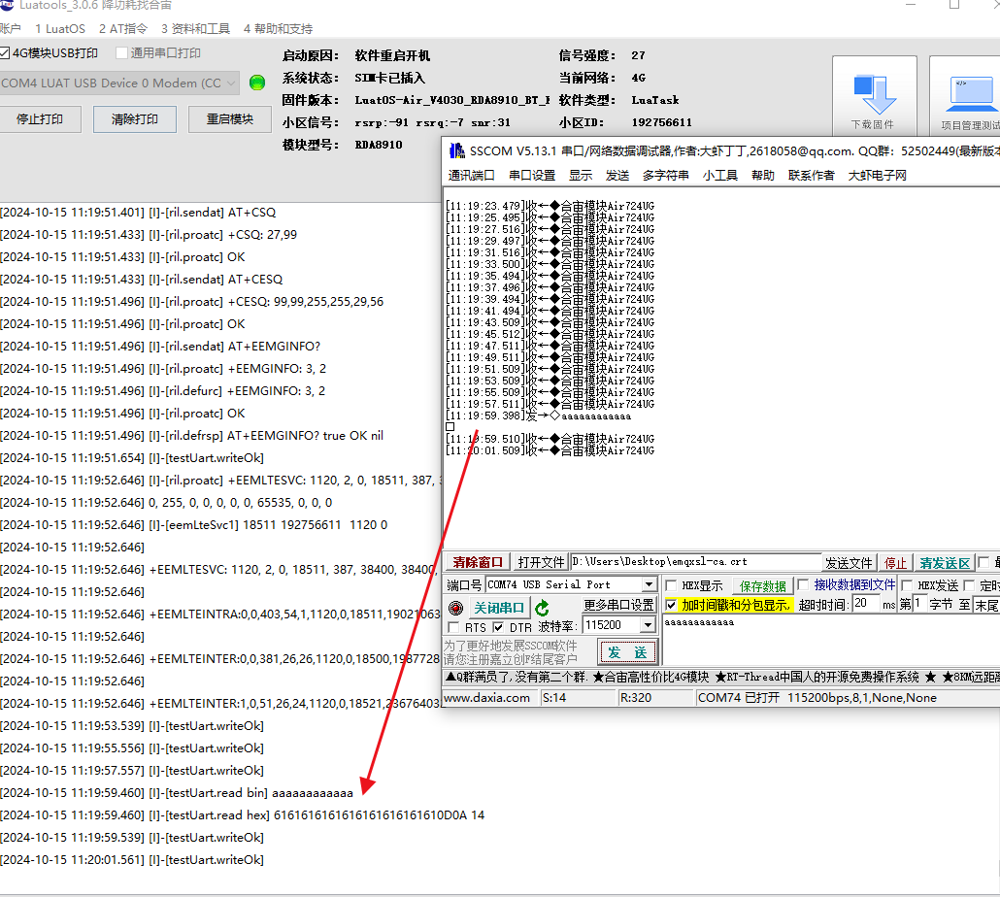

---

## 五、RS485 通信

### 5.1 简单介绍下 RS485

物联网（IoT）在工业场景中的应用越来越广泛，而 RS485 是一种常见的通信协议，广泛应用于工业自动化和物联网系统中。RS485 是一种串行通信标准，主要用于长距离、多节点通信。适用于工业环境中的传感器、执行器、控制器等设备之间的数据传输，且支持多点通信，可以连接多个设备，实现分布式控制。因为具有较好的抗干扰能力，也很适用于噪声环境下的通信。RS485 支持长距离传输，通常可达 1200 米，适用于工业现场中的远程监控和控制。

RS485 是一种半双工通信协议。半双工通信协议允许数据在两个方向上传输，但同一时间只能在一个方向上传输数据。在 RS485 通信中，当发送数据时，只能发送数据而不能接收数据；当接收数据时，只能接收数据而不能发送数据。

比如：在 RS485 通信中，通常使用一个引脚（如 A 或 RX ）作为发送引脚，另一个引脚（如 B 或 TX ）作为接收引脚。当发送数据时，发送引脚输出高电平或低电平，接收引脚不工作；当接收数据时，接收引脚输出高电平或低电平，发送引脚不工作。有的也有单独一根线专门用于控制收发逻辑，输出高低电平，负责管理 RS485 的通讯，包括发送、接收、处理错误等数据。

**优点**：

- 抗干扰能力强：RS485 采用差分信号传输，抗干扰能力强，适用于工业环境中的噪声干扰。
- 传输距离远：RS485 支持长距离传输，适用于工业现场中的远程监控和控制。
- 多节点通信：RS485 支持多点通信，可以连接多个设备，实现分布式控制。
- 兼容性好：RS485 是一种标准化的通信协议，具有较好的兼容性，可以与其他设备进行通信。
- 成本较低：RS485 模块和电缆的成本相对较低，适用于工业现场中的成本控制。

**缺点**：

- 信号衰减：随着距离的增加，信号衰减会加剧，影响通信质量。
- 速率限制：RS485 的传输速率相对较低，通常在 9600bps 到 115200bps 之间，适用于低速数据传输。
- 电气特性要求：RS485 对电气特性有较高的要求，需要使用特定的电缆和连接器。
- 布线复杂：RS485 需要使用双绞线进行布线，布线复杂度较高。

### 5.2 硬件展示

724UG 开发板 +RS485-TTL+RS485-USB

RS485-TTL：[购买链接](https://detail.tmall.com/item.htm?abbucket=12&id=609616777223&ns=1&pisk=gLXKHx20zP437xnZU4NMZ8jr2zM8JTIU-wSjEUYnNNQOVFDuYpVyeaLOzeAHdeDJegQPraIzY3T5PaLlt52cYMJyFrD8n-jFdIjEqwKBFCZW0nlQo2eMLk9yFr4-sYOUHL72yr86Vft673LSPH_WCGtJcLtWALZ953KqN2_WFlE92nhIALGI1AtHcLGWFXG6CnKqR2OWNFZ94FtWAwIYyFiBrYCrG93ClzqH4369vBLfXSHZIY8no3SQyYH5F1UpkM1rFY69vB6oCpj1vBf50IWHWg7fntB1gqbDlXZTXblyOhREzu-vEiT3WhL0v8hraCrwXEqtpbGSPS-9olYoabRNu&priceTId=2146402417291593304052114e5630&skuId=4387706588967&spm=a21n57.1.item.227.487c523c1WpDjW&utparam=%7B%22aplus_abtest%22%3A%229231e72621ac548ac3391f30d5d6a7e0%22%7D&xxc=taobaoSearch)

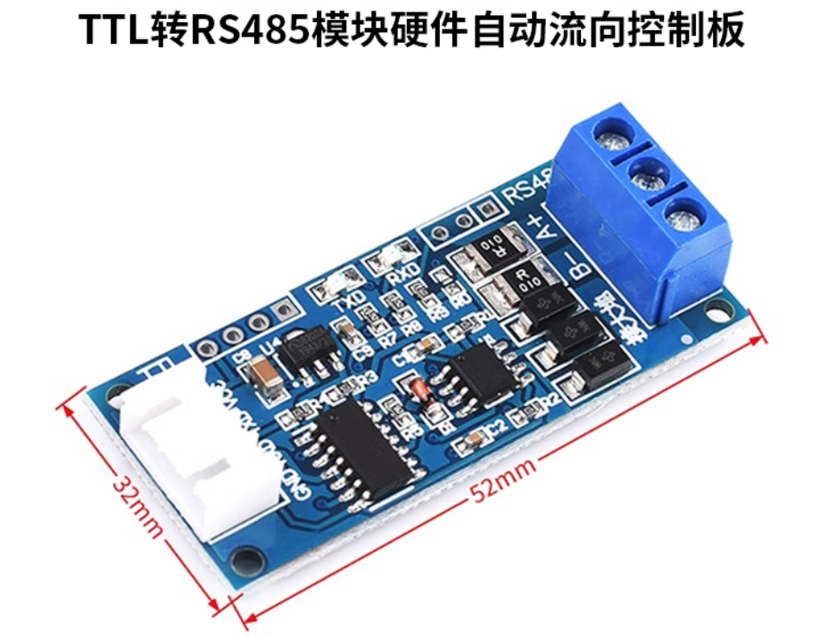

RS485-USB：[购买链接](https://detail.tmall.com/item.htm?abbucket=12&id=607264051474&ns=1&pisk=gVgxhYTHQLvDgYCP7OtujFcN6d_9kVh2nxlCSR2cfYH-18bMgrxaWAe-Q-q0l-bTWfHZIAhwg5wsCAeim3Yngjza5pb9-ecqlkcVsxQ_hUO_tS6XKtLuuIaa5pvOqNZ2JPkUBp74GgN7U5e1CSM_PbNQTPN_GPO8F5FFftM_5Qd86WIfGPsfVaN0OPs_5ZZ5VWP1cSw1l7O8_8w1R2JTFswGWcSIktMB-Oe8E4FYDJGJvaby9WX3TjZfWa2vIowQ-8Q154FjahiyXwKgdDy0xjsrC20KPDWnKJsXwQINboNz0ORa9PcQnLF8KILObGrya7eHwZI1fOtUwJAuIGSa4v5..&priceTId=2146402417291592532647820e5630&skuId=4389943960595&spm=a21n57.1.item.183.487c523c1WpDjW&utparam=%7B%22aplus_abtest%22%3A%22586362286f857861f02862f21e75cde4%22%7D&xxc=taobaoSearch)

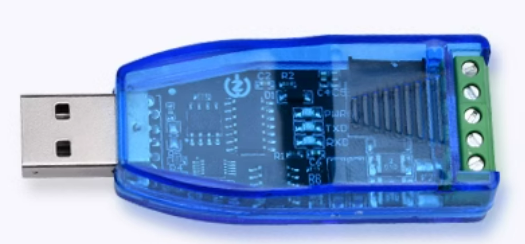

接线方式：

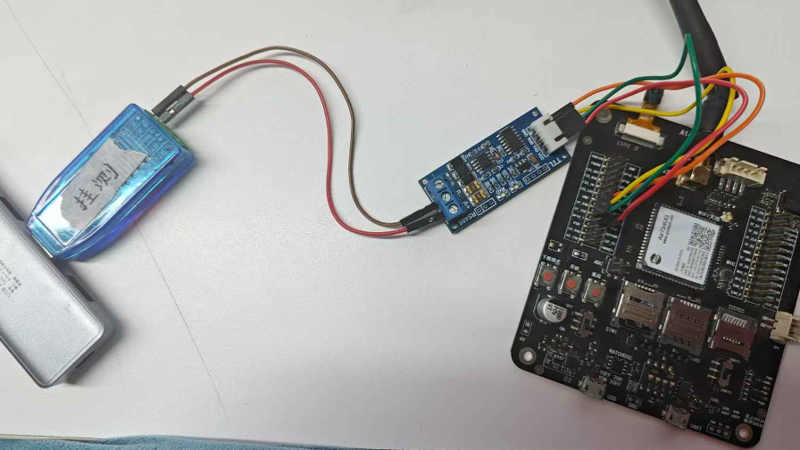

注意：上面的硬件使用的 RS485-TTL 为硬件自动转换，实际使用根据硬件设置去选择 gpio 转换或者硬件自动转换

### 5.3 初始化 uart

```lua
local UART_ID = 1
--配置并且打开串口
uart.setup(UART_ID,115200,8,uart.PAR_NONE,uart.STOP_1,nil,1)
--如果需要打开“串口发送数据完成后，通过异步消息通知”的功能，则使用下面的这行setup，注释掉上面的一行setup
--uart.setup(UART_ID,115200,8,uart.PAR_NONE,uart.STOP_1,nil,1)
--485转向控制    由于此演示用的硬件自动转换，所以不在此配置485转向
-- @api     uart.set_rs485_oe(id, io, level, timeUs, mode)
-- @int 串口id, 1(UART1),2(UART2),3(UART3),0x81(USB)
-- @int gpio值  pio.Pxx
-- @int 输出使能电平有效值，默认1，配置为1时表示高电平发送，配置为0时表示低电平发送      1/0
-- @int 485 oe转向延迟时间,单位US，缺省时为0延迟5个当前波特率的时钟时间      
-- @int 485 oe转向模式选择，默认0。 配置为1时表示使用定时器控制，可以使转向时间小于100us(timeUs最小值为1)       1/0  
-- @return nil 无返回值
-- @usage
--uart.set_rs485_oe(UART_ID,pio.P0_23,1,3500)
```

### 5.4 注册接收数据的回调函数

```lua
-- 收取数据会触发回调, 这里的 "receive" 是固定值不要修改。
local function read()
    local data = ""
    --底层core中，串口收到数据时：
    --如果接收缓冲区为空，则会以中断方式通知Lua脚本收到了新数据；
    --如果接收缓冲器不为空，则不会通知Lua脚本
    --所以Lua脚本中收到中断读串口数据时，每次都要把接收缓冲区中的数据全部读出，这样才能保证底层core中的新数据中断上来，此read函数中的while语句中就保证了这一点
    while true do        
        data = uart.read(uartid,"*l")
        if not data or string.len(data) == 0 then break end
        --打开下面的打印会耗时
        log.info("testUart.read bin",data)
        log.info("testUart.read hex",data:toHex())
    end
end

uart.on(UART_ID,"receive",read)
```

### 5.5 发送数据

> 本文中字符串编码格式为 UTF-8 编码格式，SSCOM 串口调试工具的编码格式为 GB2312,所以导致无法正确显示字符串中的中文，需要注意。

#### 5.5.1 发送普通字符串

```lua
--本文中字符串编码格式为UTF-8编码格式，SSCOM串口调试工具的编码格式为GB2312,所以导致无法正确显示字符串中的中文，需要注意。
uart.write(UART_ID, "合宙模块Air724UG") 
--利用common库的common.utf8ToGb2312()将UTF-8编码转换成GB2312格式，在sscom可以正常显示中文
uart.write(UART_ID, common.utf8ToGb2312("合宙模块Air724UG"))
```

#### 5.5.2 发送十六进制的数据串

```lua
uart.write(UART_ID, string.char(0x55,0xAA,0x4B,0x03,0x86))
```

#### 5.5.3 发送 json 格式的数据

```lua
local data =
{
    host = "abcdefg.com",
    port = "1883",
    clientID = "c88885",
    username = "user",
    password = "123456",
    ca_self = {ssl=false},
}

local jsondata = json.encode(data)
uart.write(UART_ID, jsondata)
```

### 5.6 完整例程

```lua
--- 模块功能：串口1功能测试
-- @author openLuat
-- @module uart.testUart
-- @license MIT
-- @copyright openLuat
-- @release 2018.03.27

module(...,package.seeall)

require"utils"
require"pm"
require "common"
--[[
功能定义：
uart按照帧结构接收外围设备的输入，收到正确的指令后，回复ASCII字符串

帧结构如下：
帧头：1字节，0x01表示扫描指令，0x02表示控制GPIO命令，0x03表示控制端口命令
帧体：字节不固定，跟帧头有关
帧尾：1字节，固定为0xC0

收到的指令帧头为0x01时，回复"CMD_SCANNER\r\n"给外围设备；例如接收到0x01 0xC0两个字节，就回复"CMD_SCANNER\r\n"
收到的指令帧头为0x02时，回复"CMD_GPIO\r\n"给外围设备；例如接收到0x02 0xC0两个字节，就回复"CMD_GPIO\r\n"
收到的指令帧头为0x03时，回复"CMD_PORT\r\n"给外围设备；例如接收到0x03 0xC0两个字节，就回复"CMD_PORT\r\n"
收到的指令帧头为其余数据时，回复"CMD_ERROR\r\n"给外围设备；例如接收到0x04 0xC0两个字节，就回复"CMD_ERROR\r\n"
]]

--串口ID,1对应uart1
--如果要修改为uart2，把UART_ID赋值为2即可
local UART_ID = 1
--帧头类型以及帧尾
local CMD_SCANNER,CMD_GPIO,CMD_PORT,FRM_TAIL = 1,2,3,string.char(0xC0)
--串口读到的数据缓冲区
local rdbuf = ""

--[[
函数名：parse
功能  ：按照帧结构解析处理一条完整的帧数据
参数  ：
        data：所有未处理的数据
返回值：第一个返回值是一条完整帧报文的处理结果，第二个返回值是未处理的数据
]]
local function parse(data)
    if not data then return end    
    
    local tail = string.find(data,string.char(0xC0))
    if not tail then return false,data end    
    local cmdtyp = string.byte(data,1)
    local body,result = string.sub(data,2,tail-1)
    
    log.info("testUart.parse",data:toHex(),cmdtyp,body:toHex())
    
    if cmdtyp == CMD_SCANNER then
        write("CMD_SCANNER")
    elseif cmdtyp == CMD_GPIO then
        write("CMD_GPIO")
    elseif cmdtyp == CMD_PORT then
        write("CMD_PORT")
    else
        write("CMD_ERROR")
    end
    
    return true,string.sub(data,tail+1,-1)    
end

--[[
函数名：proc
功能  ：处理从串口读到的数据
参数  ：
        data：当前一次从串口读到的数据
返回值：无
]]
local function proc(data)
    if not data or string.len(data) == 0 then return end
    --追加到缓冲区
    rdbuf = rdbuf..data    
    
    local result,unproc
    unproc = rdbuf
    --根据帧结构循环解析未处理过的数据
    while true do
        result,unproc = parse(unproc)
        if not unproc or unproc == "" or not result then
            break
        end
    end

    rdbuf = unproc or ""
end

--[[
函数名：read
功能  ：读取串口接收到的数据
参数  ：无
返回值：无
]]
local function read()
    local data = ""
    --底层core中，串口收到数据时：
    --如果接收缓冲区为空，则会以中断方式通知Lua脚本收到了新数据；
    --如果接收缓冲器不为空，则不会通知Lua脚本
    --所以Lua脚本中收到中断读串口数据时，每次都要把接收缓冲区中的数据全部读出，这样才能保证底层core中的新数据中断上来，此read函数中的while语句中就保证了这一点
    while true do        
        data = uart.read(UART_ID,"*l")
        if not data or string.len(data) == 0 then break end
        --打开下面的打印会耗时
        log.info("testUart.read bin",data)
        log.info("testUart.read hex",data:toHex())
        proc(data)
    end
end

--[[
函数名：write
功能  ：通过串口发送数据
参数  ：
        s：要发送的数据
返回值：无
]]
function write(s)
    log.info("testUart.write",s)
    uart.write(UART_ID,s.."\r\n")
end

local function writeOk()
    log.info("testUart.writeOk")
end

sys.taskInit(function()
    -- 循环两秒向串口发一次数据
    while true do
        sys.wait(2000)
        --利用common库的common.utf8ToGb2312()将UTF-8编码转换成GB2312格式，在sscom可以正常显示中文
        uart.write(UART_ID, common.utf8ToGb2312("合宙模块Air724UG"))
    end
end)

--保持系统处于唤醒状态，此处只是为了测试需要，所以此模块没有地方调用pm.sleep("testUart")休眠，不会进入低功耗休眠状态
--在开发“要求功耗低”的项目时，一定要想办法保证pm.wake("testUart")后，在不需要串口时调用pm.sleep("testUart")
pm.wake("testUart")
--注册串口的数据接收函数，串口收到数据后，会以中断方式，调用read接口读取数据
uart.on(UART_ID,"receive",read)
--注册串口的数据发送通知函数
uart.on(UART_ID,"sent",writeOk)

--配置并且打开串口
uart.setup(UART_ID,115200,8,uart.PAR_NONE,uart.STOP_1,nil,1)
--如果需要打开“串口发送数据完成后，通过异步消息通知”的功能，则使用下面的这行setup，注释掉上面的一行setup
--uart.setup(UART_ID,115200,8,uart.PAR_NONE,uart.STOP_1,nil,1)

--uart.set_rs485_oe(UART_ID,pio.P0_23,1,3500)
```

**代码运行结果**：

`uart.write(UART_ID, common.utf8ToGb2312("合宙模块Air724UG"))` 向串口发送对应的字符串数据，`uart.on()` 会事先注册一个接收数据的回调函数，当指定的串口 `uartid` 接收到数据时，该回调函数会被自动触发并执行，`log.info``("testUart.read bin",data)``log.info``("testUart.read hex",data:toHex())` 会将接收到的数据打印出来，此时我们通过串口调试工具，选择对应的端口，即可看到对应的打印信息。

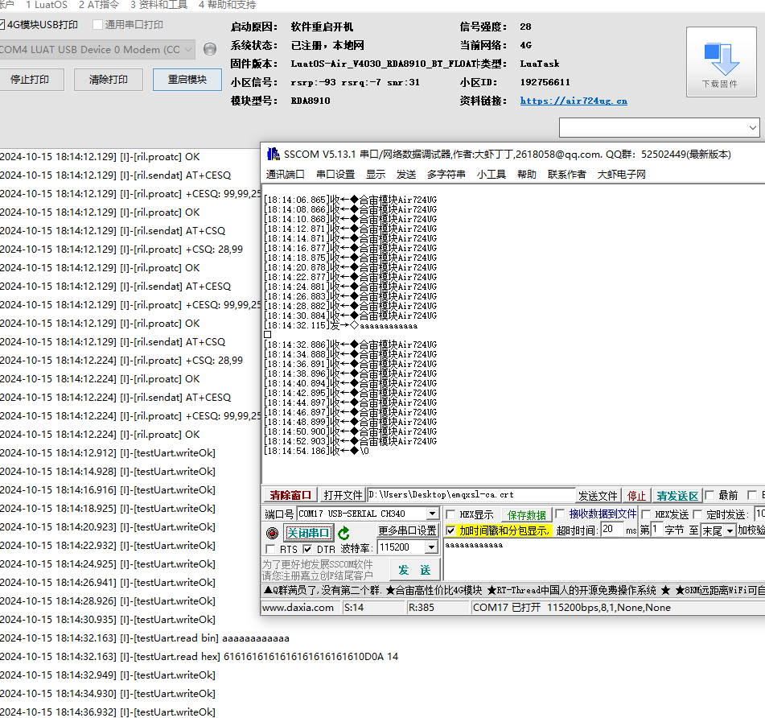

### 5.7 温湿度传感器例程

#### 5.7.1 硬件展示

使用的硬件为 sht20 温湿度传感器 +724UG 开发板 +RS485-TTL

RS485-TTL：[购买链接](https://detail.tmall.com/item.htm?abbucket=12&id=609616777223&ns=1&pisk=gLXKHx20zP437xnZU4NMZ8jr2zM8JTIU-wSjEUYnNNQOVFDuYpVyeaLOzeAHdeDJegQPraIzY3T5PaLlt52cYMJyFrD8n-jFdIjEqwKBFCZW0nlQo2eMLk9yFr4-sYOUHL72yr86Vft673LSPH_WCGtJcLtWALZ953KqN2_WFlE92nhIALGI1AtHcLGWFXG6CnKqR2OWNFZ94FtWAwIYyFiBrYCrG93ClzqH4369vBLfXSHZIY8no3SQyYH5F1UpkM1rFY69vB6oCpj1vBf50IWHWg7fntB1gqbDlXZTXblyOhREzu-vEiT3WhL0v8hraCrwXEqtpbGSPS-9olYoabRNu&priceTId=2146402417291593304052114e5630&skuId=4387706588967&spm=a21n57.1.item.227.487c523c1WpDjW&utparam=%7B%22aplus_abtest%22%3A%229231e72621ac548ac3391f30d5d6a7e0%22%7D&xxc=taobaoSearch)

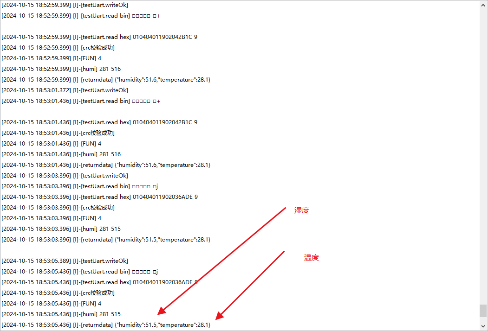

本示例是利用 sht20 温湿度传感器 +724UG 开发板 +RS485-TTL 通过 485 做的一个采集温湿度的 demo，主要逻辑是通过发送 16 进制数据 0x01,0x04,0x00,0x01,0x00,0x02,0x20,0x0B 来获取温湿度

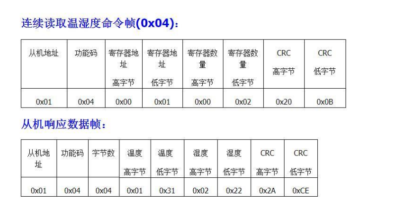

然后对获取数据进行 modbus 校验，然后对数据进行解析，根据公式计算出实际温湿度

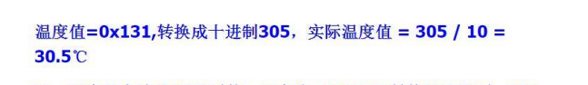

通过 json.encode()把表内的数据转换成 json 类型打印出来

---

## 六、USB 虚拟串口

### 6.1 介绍 USB 虚拟串口

USB 虚拟串口是一种将 USB 接口转换为串行通信接口的技术。它允许计算机通过 USB 接口与其他设备进行串行通信，如调制解调器、打印机、扫描仪等。USB 虚拟串口通常由一个 USB 转串行适配器和一个驱动程序组成。

并且虚拟串口通常没有波特率要求，因为它们是软件模拟的串行通信接口，不依赖于物理硬件。然而，在实际应用中，虚拟串口仍然需要遵守一些基本的通信协议，比如数据位、停止位和校验位等。

USB 虚拟串口的主要功能包括：

- 串行通信：USB 虚拟串口可以模拟串行通信接口，实现数据的串行传输。它支持各种串行通信协议，如 RS-232、RS-485 等。
- 传输可靠：传统的串口连接线容易受到干扰，而 USB 虚拟串口采用的 USB 技术可以更好地抵抗干扰，提高了通信的可靠性。
- 串行控制：USB 虚拟串口可以控制串行通信参数，如波特率、数据位、停止位、奇偶校验等。它还支持串行通信的流控制和错误处理。
- 使用方便：USB 虚拟串口无需再使用传统的串口连接线，只需要一个标准的 USB 数据线即可连接计算机和外部设备，使得设备连接更加方便

USB 虚拟串口广泛应用于各种领域，如工业自动化、物联网、智能家居等。它为各种设备提供了便捷的串行通信解决方案，提高了系统的灵活性和可靠性。

### 6.2 虚拟通讯串口-端口位置说明

首先通过带有 DM、DP 的 USB 数据线两端连接 模块 和 Windows7 及以上系统的电脑。

然后将模块开机，就可以从电脑的设备管理器中看到端口处多出来 4 个 USB 端口。

驱动装好之后会枚举出 4 个 USB 接口，其中 LUAT USB Device 1 AT (COM6)为虚拟 AT 口，MODEM 为日志口，AP，和 CP 口为底层日志口

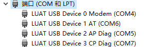

### 6.3 初始化 USB_UART

```lua
local UART_ID= uart.USB -- 使用USB虚拟串口，固定id

--初始化 参数都可以根据实施情况修改
uart.setup(UART_ID,9600,8,uart.PAR_NONE,uart.STOP_1,nil,1)
```

### 6.4 注册接收数据的回调函数

```lua
-- 收取数据会触发回调, 这里的 "receive" 是固定值不要修改。
local function read()
    local data = ""
    --底层core中，串口收到数据时：
    --如果接收缓冲区为空，则会以中断方式通知Lua脚本收到了新数据；
    --如果接收缓冲器不为空，则不会通知Lua脚本
    --所以Lua脚本中收到中断读串口数据时，每次都要把接收缓冲区中的数据全部读出，这样才能保证底层core中的新数据中断上来，此read函数中的while语句中就保证了这一点
    while true do        
        data = uart.read(uartid,"*l")
        if not data or string.len(data) == 0 then break end
        --打开下面的打印会耗时
        log.info("testUart.read bin",data)
        log.info("testUart.read hex",data:toHex())
    end
end

uart.on(UART_ID,"receive",read)
```

### 6.5 发送数据

> 本文中字符串编码格式为 UTF-8 编码格式，SSCOM 串口调试工具的编码格式为 GB2312,所以导致无法正确显示字符串中的中文，需要注意。

#### 6.5.1 发送普通字符串

```lua
--本文中字符串编码格式为UTF-8编码格式，SSCOM串口调试工具的编码格式为GB2312,所以导致无法正确显示字符串中的中文，需要注意。
uart.write(UART_ID, "合宙模块Air724UG") 
--利用common库的common.utf8ToGb2312()将UTF-8编码转换成GB2312格式，在sscom可以正常显示中文
uart.write(UART_ID, common.utf8ToGb2312("合宙模块Air724UG"))
```

#### 6.5.2 发送十六进制的数据串

```lua
uart.write(UART_ID, string.char(0x55,0xAA,0x4B,0x03,0x86))
```

#### 6.5.3 发送 json 格式的数据

```lua
local data =
{
    host = "abcdefg.com",
    port = "1883",
    clientID = "c88885",
    username = "user",
    password = "123456",
    ca_self = {ssl=false},
}

local jsondata = json.encode(data)
uart.write(UART_ID, jsondata)
```

### 6.6 完整例程

```lua
--- 模块功能：串口1功能测试
-- @author openLuat
-- @module uart.testUart
-- @license MIT
-- @copyright openLuat
-- @release 2018.03.27

module(...,package.seeall)

require"utils"
require"pm"
require "common"
require "pack"
--[[
功能定义：
uart按照帧结构接收外围设备的输入，收到正确的指令后，回复ASCII字符串

帧结构如下：
帧头：1字节，0x01表示扫描指令，0x02表示控制GPIO命令，0x03表示控制端口命令
帧体：字节不固定，跟帧头有关
帧尾：1字节，固定为0xC0

收到的指令帧头为0x01时，回复"CMD_SCANNER\r\n"给外围设备；例如接收到0x01 0xC0两个字节，就回复"CMD_SCANNER\r\n"
收到的指令帧头为0x02时，回复"CMD_GPIO\r\n"给外围设备；例如接收到0x02 0xC0两个字节，就回复"CMD_GPIO\r\n"
收到的指令帧头为0x03时，回复"CMD_PORT\r\n"给外围设备；例如接收到0x03 0xC0两个字节，就回复"CMD_PORT\r\n"
收到的指令帧头为其余数据时，回复"CMD_ERROR\r\n"给外围设备；例如接收到0x04 0xC0两个字节，就回复"CMD_ERROR\r\n"
]]

--串口ID,1对应uart1
--如果要修改为uart2，把UART_ID赋值为2即可
local UART_ID = 0x81
--帧头类型以及帧尾
local CMD_SCANNER,CMD_GPIO,CMD_PORT,FRM_TAIL = 1,2,3,string.char(0xC0)
--串口读到的数据缓冲区
local rdbuf = ""

--[[
函数名：parse
功能  ：按照帧结构解析处理一条完整的帧数据
参数  ：
        data：所有未处理的数据
返回值：第一个返回值是一条完整帧报文的处理结果，第二个返回值是未处理的数据
]]
local function parse(data)
    if not data then return end    
    
    local tail = string.find(data,string.char(0xC0))
    if not tail then return false,data end    
    local cmdtyp = string.byte(data,1)
    local body,result = string.sub(data,2,tail-1)
    
    log.info("testUart.parse",data:toHex(),cmdtyp,body:toHex())
    
    if cmdtyp == CMD_SCANNER then
        write("CMD_SCANNER")
    elseif cmdtyp == CMD_GPIO then
        write("CMD_GPIO")
    elseif cmdtyp == CMD_PORT then
        write("CMD_PORT")
    else
        write("CMD_ERROR")
    end
    
    return true,string.sub(data,tail+1,-1)    
end

--[[
函数名：proc
功能  ：处理从串口读到的数据
参数  ：
        data：当前一次从串口读到的数据
返回值：无
]]
local function proc(data)
    if not data or string.len(data) == 0 then return end
    --追加到缓冲区
    rdbuf = rdbuf..data    
    
    local result,unproc
    unproc = rdbuf
    --根据帧结构循环解析未处理过的数据
    while true do
        result,unproc = parse(unproc)
        if not unproc or unproc == "" or not result then
            break
        end
    end

    rdbuf = unproc or ""
end
local function test(...)
    --将串口接收的数据赋值给str
    local str= ...
    local addr = str:sub(1, 1)--地址位
    local fun = str:sub(2, 2)--功能码
    local byte = str:sub(3, 3)--有效字节数
    local humi =str:sub(4,5)--湿度值
    local temp = str:sub(6,7)--温度值
    local idx, crc = pack.unpack(str:sub(-2, -1), "H")
    local tmp = str:sub(1, -3)
    --crc校验原理前面所有位合起来校验后的值等于上报的数据的最后校验位
    if crc == crypto.crc16("MODBUS", tmp) then
        log.info("crc校验成功")
        -- _无用，addr地址码，fun功能码，byte返回有效字节数，humi湿度，temp温度
        -- pack.unpack 将lua字符串分解为不同的数值
        -- ">b3h2"表示在tmp字符串中，从tmp第一个字节开始，取三个字节，取两个短整数
        local _,addr,fun,byte,humi,temp = pack.unpack(tmp, ">b3h2")
        --如果功能码为0x03，则为读取温湿度值
        log.info("FUN",fun)
        if fun == 0x04 then
        log.info("humi",humi,temp)
            --创建一个局部表，命名为t，lua语言种没有数组/结构体，取而代之的是table，用户可以当成结构体使用。       
            local t= {}
            --给表中添加一个叫做addr的元素，并将上文中的addr变量的值赋给该元素（如果用户不需要该值可不填）
            --给表中添加一个叫做humi的元素，并将上文中的humi变量的值赋给该元素
            t.temperature = humi/10 --pack.unpack后已经将该数转换成了十进制的整数，需要将其除以10才是真实的湿度百分比数
            --给表中添加一个叫做temp的元素，并将上文中的temp变量的值赋给该元素
            t.humidity =temp/10 --pack.unpack后已经将该数转换成了十进制的整数，需要将其除以10才是真实的温度值
            --将该表转换成json格式的字符串并发送给服务器
            return json.encode(t)
        end
    else
    --如果crc校验失败则将"crc error"发送给服务器
        log.info("crc校验失败")
        return "crc error"
    end
end
--[[
函数名：read
功能  ：读取串口接收到的数据
参数  ：无
返回值：无
]]
local function read()
    local data = ""
    --底层core中，串口收到数据时：
    --如果接收缓冲区为空，则会以中断方式通知Lua脚本收到了新数据；
    --如果接收缓冲器不为空，则不会通知Lua脚本
    --所以Lua脚本中收到中断读串口数据时，每次都要把接收缓冲区中的数据全部读出，这样才能保证底层core中的新数据中断上来，此read函数中的while语句中就保证了这一点
    while true do        
        data = uart.read(UART_ID,"*l")
        if not data or string.len(data) == 0 then break end
        --打开下面的打印会耗时
        log.info("testUart.read bin",data)
        log.info("testUart.read hex",data:toHex())
        -- proc(data)
        -- local returndata=test(data)
        -- log.info("returndata",returndata)
    end
end

--[[
函数名：write
功能  ：通过串口发送数据
参数  ：
        s：要发送的数据
返回值：无
]]
function write(s)
    log.info("testUart.write",s)
    uart.write(UART_ID,s.."\r\n")
end

local function writeOk()
    log.info("testUart.writeOk")
end

sys.taskInit(function()
    -- 循环两秒向串口发一次数据
    while true do
        sys.wait(2000)
        --利用common库的common.utf8ToGb2312()将UTF-8编码转换成GB2312格式，在sscom可以正常显示中文
        uart.write(UART_ID,common.utf8ToGb2312("合宙模块Air724UG"))
    end
end)

--保持系统处于唤醒状态，此处只是为了测试需要，所以此模块没有地方调用pm.sleep("testUart")休眠，不会进入低功耗休眠状态
--在开发“要求功耗低”的项目时，一定要想办法保证pm.wake("testUart")后，在不需要串口时调用pm.sleep("testUart")
pm.wake("testUart")
--注册串口的数据接收函数，串口收到数据后，会以中断方式，调用read接口读取数据
uart.on(UART_ID,"receive",read)
--注册串口的数据发送通知函数
uart.on(UART_ID,"sent",writeOk)

--配置并且打开串口
-- uart.setup(UART_ID,9600,8,uart.PAR_NONE,uart.STOP_1,nil,1)
--如果需要打开“串口发送数据完成后，通过异步消息通知”的功能，则使用下面的这行setup，注释掉上面的一行setup
--uart.setup(UART_ID,115200,8,uart.PAR_NONE,uart.STOP_1,nil,1)

--uart.set_rs485_oe(UART_ID,pio.P0_23,1,3500)
uart.setup(UART_ID,115200,8,uart.PAR_NONE,uart.STOP_1)
```

**代码运行结果**：

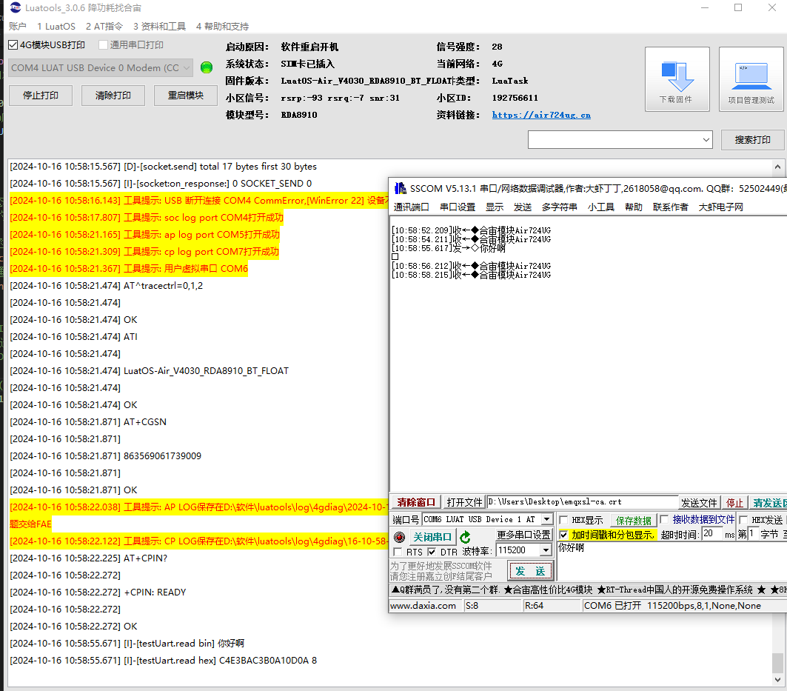

---

## 七、多串口

### 7.1 简介

前面已经介绍了串口的基本用法，本文将使用两个串口（UART1、UART2）进行分别通信的演示。

### 7.2 介绍多串口如何接线

大家可先跳转至 3.5 介绍串口如何接线中查看单串口的接线说明，在学会了 UART1 接线和 UART2 接线后，只需将这两个通用串口同时接上对应位置即可。

### 7.3 初始化 UART1 串口和 UART2 串口

```lua
-- 根据实际设备选取不同的uartid
local UART_ID = 1
local UART_ID2 = 2

uart.setup(UART_ID,115200,8,uart.PAR_NONE,uart.STOP_1,nil,1)
uart.setup(UART_ID2,115200,8,uart.PAR_NONE,uart.STOP_1,nil,1)
```

### 7.4 注册接收数据的回调函数

```lua
--[[
函数名：read
功能  ：读取串口接收到的数据
参数  ：无
返回值：无
]]
local function read()
    local data = ""
    --底层core中，串口收到数据时：
    --如果接收缓冲区为空，则会以中断方式通知Lua脚本收到了新数据；
    --如果接收缓冲器不为空，则不会通知Lua脚本
    --所以Lua脚本中收到中断读串口数据时，每次都要把接收缓冲区中的数据全部读出，这样才能保证底层core中的新数据中断上来，此read函数中的while语句中就保证了这一点
    while true do        
        data = uart.read(UART_ID,"*l")
        if not data or string.len(data) == 0 then break end
        --打开下面的打印会耗时
        log.info("testUart.read bin",data)
        log.info("testUart.read hex",data:toHex())
        -- proc(data)
        -- local returndata=test(data)
        -- log.info("returndata",returndata)
    end
end

--[[
函数名：read
功能  ：读取串口接收到的数据
参数  ：无
返回值：无
]]
local function read2()
    local data = ""
    --底层core中，串口收到数据时：
    --如果接收缓冲区为空，则会以中断方式通知Lua脚本收到了新数据；
    --如果接收缓冲器不为空，则不会通知Lua脚本
    --所以Lua脚本中收到中断读串口数据时，每次都要把接收缓冲区中的数据全部读出，这样才能保证底层core中的新数据中断上来，此read函数中的while语句中就保证了这一点
    while true do        
        data = uart.read(UART_ID2,"*l")
        if not data or string.len(data) == 0 then break end
        --打开下面的打印会耗时
        log.info("testUart.read bin",data)
        log.info("testUart.read hex",data:toHex())
        -- proc(data)
        -- local returndata=test(data)
        -- log.info("returndata",returndata)
    end
end

uart.on(UART_ID,"receive",read)
uart.on(UART_ID2,"receive",read2)
```

### 7.5 发送数据

> 本文中字符串编码格式为 UTF-8 编码格式，SSCOM 串口调试工具的编码格式为 GB2312,所以导致无法正确显示字符串中的中文，需要注意。

#### 7.5.1 发送普通字符串

```lua
uart.write(UART_ID,common.utf8ToGb2312("合宙模块Air724UG"))
uart.write(UART_ID2,common.utf8ToGb2312("合宙模块Air724UG"))
```

#### 7.5.2 发送十六进制的数据串

```lua
uart.write(UART_ID, string.char(0x55,0xAA,0x4B,0x03,0x86))
uart.write(UART_ID2, string.char(0x55,0xAA,0x4B,0x03,0x86))
```

#### 7.5.3 发送 json 格式的数据

```lua
local data =
{
    host = "abcdefg.com",
    port = "1883",
    clientID = "c88885",
    username = "user",
    password = "123456",
    ca_self = {ssl=false},
}

local jsondata = json.encode(data)
uart.write(UART_ID, jsondata)
uart.write(UART_ID2, jsondata)
```

### 7.6 **完整例程**

```lua
--- 模块功能：串口1功能测试
-- @author openLuat
-- @module uart.testUart
-- @license MIT
-- @copyright openLuat
-- @release 2018.03.27

module(...,package.seeall)

require"utils"
require"pm"
require "common"
require "pack"
--[[
功能定义：
uart按照帧结构接收外围设备的输入，收到正确的指令后，回复ASCII字符串

帧结构如下：
帧头：1字节，0x01表示扫描指令，0x02表示控制GPIO命令，0x03表示控制端口命令
帧体：字节不固定，跟帧头有关
帧尾：1字节，固定为0xC0

收到的指令帧头为0x01时，回复"CMD_SCANNER\r\n"给外围设备；例如接收到0x01 0xC0两个字节，就回复"CMD_SCANNER\r\n"
收到的指令帧头为0x02时，回复"CMD_GPIO\r\n"给外围设备；例如接收到0x02 0xC0两个字节，就回复"CMD_GPIO\r\n"
收到的指令帧头为0x03时，回复"CMD_PORT\r\n"给外围设备；例如接收到0x03 0xC0两个字节，就回复"CMD_PORT\r\n"
收到的指令帧头为其余数据时，回复"CMD_ERROR\r\n"给外围设备；例如接收到0x04 0xC0两个字节，就回复"CMD_ERROR\r\n"
]]

--串口ID,1对应uart1
--如果要修改为uart2，把UART_ID赋值为2即可
local UART_ID = 1
local UART_ID2 = 2
--帧头类型以及帧尾
local CMD_SCANNER,CMD_GPIO,CMD_PORT,FRM_TAIL = 1,2,3,string.char(0xC0)
--串口读到的数据缓冲区
local rdbuf = ""

--[[
函数名：parse
功能  ：按照帧结构解析处理一条完整的帧数据
参数  ：
        data：所有未处理的数据
返回值：第一个返回值是一条完整帧报文的处理结果，第二个返回值是未处理的数据
]]
local function parse(data)
    if not data then return end    
    
    local tail = string.find(data,string.char(0xC0))
    if not tail then return false,data end    
    local cmdtyp = string.byte(data,1)
    local body,result = string.sub(data,2,tail-1)
    
    log.info("testUart.parse",data:toHex(),cmdtyp,body:toHex())
    
    if cmdtyp == CMD_SCANNER then
        write("CMD_SCANNER")
    elseif cmdtyp == CMD_GPIO then
        write("CMD_GPIO")
    elseif cmdtyp == CMD_PORT then
        write("CMD_PORT")
    else
        write("CMD_ERROR")
    end
    
    return true,string.sub(data,tail+1,-1)    
end

--[[
函数名：proc
功能  ：处理从串口读到的数据
参数  ：
        data：当前一次从串口读到的数据
返回值：无
]]
local function proc(data)
    if not data or string.len(data) == 0 then return end
    --追加到缓冲区
    rdbuf = rdbuf..data    
    
    local result,unproc
    unproc = rdbuf
    --根据帧结构循环解析未处理过的数据
    while true do
        result,unproc = parse(unproc)
        if not unproc or unproc == "" or not result then
            break
        end
    end

    rdbuf = unproc or ""
end
local function test(...)
    --将串口接收的数据赋值给str
    local str= ...
    local addr = str:sub(1, 1)--地址位
    local fun = str:sub(2, 2)--功能码
    local byte = str:sub(3, 3)--有效字节数
    local humi =str:sub(4,5)--湿度值
    local temp = str:sub(6,7)--温度值
    local idx, crc = pack.unpack(str:sub(-2, -1), "H")
    local tmp = str:sub(1, -3)
    --crc校验原理前面所有位合起来校验后的值等于上报的数据的最后校验位
    if crc == crypto.crc16("MODBUS", tmp) then
        log.info("crc校验成功")
        -- _无用，addr地址码，fun功能码，byte返回有效字节数，humi湿度，temp温度
        -- pack.unpack 将lua字符串分解为不同的数值
        -- ">b3h2"表示在tmp字符串中，从tmp第一个字节开始，取三个字节，取两个短整数
        local _,addr,fun,byte,humi,temp = pack.unpack(tmp, ">b3h2")
        --如果功能码为0x03，则为读取温湿度值
        log.info("FUN",fun)
        if fun == 0x04 then
        log.info("humi",humi,temp)
            --创建一个局部表，命名为t，lua语言种没有数组/结构体，取而代之的是table，用户可以当成结构体使用。       
            local t= {}
            --给表中添加一个叫做addr的元素，并将上文中的addr变量的值赋给该元素（如果用户不需要该值可不填）
            --给表中添加一个叫做humi的元素，并将上文中的humi变量的值赋给该元素
            t.temperature = humi/10 --pack.unpack后已经将该数转换成了十进制的整数，需要将其除以10才是真实的湿度百分比数
            --给表中添加一个叫做temp的元素，并将上文中的temp变量的值赋给该元素
            t.humidity =temp/10 --pack.unpack后已经将该数转换成了十进制的整数，需要将其除以10才是真实的温度值
            --将该表转换成json格式的字符串并发送给服务器
            return json.encode(t)
        end
    else
    --如果crc校验失败则将"crc error"发送给服务器
        log.info("crc校验失败")
        return "crc error"
    end
end
--[[
函数名：read
功能  ：读取串口接收到的数据
参数  ：无
返回值：无
]]
local function read()
    local data = ""
    --底层core中，串口收到数据时：
    --如果接收缓冲区为空，则会以中断方式通知Lua脚本收到了新数据；
    --如果接收缓冲器不为空，则不会通知Lua脚本
    --所以Lua脚本中收到中断读串口数据时，每次都要把接收缓冲区中的数据全部读出，这样才能保证底层core中的新数据中断上来，此read函数中的while语句中就保证了这一点
    while true do        
        data = uart.read(UART_ID,"*l")
        if not data or string.len(data) == 0 then break end
        --打开下面的打印会耗时
        log.info("testUart.read bin",data)
        log.info("testUart.read hex",data:toHex())
        -- proc(data)
        -- local returndata=test(data)
        -- log.info("returndata",returndata)
    end
end

--[[
函数名：read
功能  ：读取串口接收到的数据
参数  ：无
返回值：无
]]
local function read2()
    local data = ""
    --底层core中，串口收到数据时：
    --如果接收缓冲区为空，则会以中断方式通知Lua脚本收到了新数据；
    --如果接收缓冲器不为空，则不会通知Lua脚本
    --所以Lua脚本中收到中断读串口数据时，每次都要把接收缓冲区中的数据全部读出，这样才能保证底层core中的新数据中断上来，此read函数中的while语句中就保证了这一点
    while true do        
        data = uart.read(UART_ID2,"*l")
        if not data or string.len(data) == 0 then break end
        --打开下面的打印会耗时
        log.info("testUart.read bin",data)
        log.info("testUart.read hex",data:toHex())
        -- proc(data)
        -- local returndata=test(data)
        -- log.info("returndata",returndata)
    end
end
--[[
函数名：write
功能  ：通过串口发送数据
参数  ：
        s：要发送的数据
返回值：无
]]
function write(s)
    log.info("testUart.write",s)
    uart.write(UART_ID,s.."\r\n")
end

local function writeOk()
    log.info("testUart.writeOk")
end

local function writeOk2()
    log.info("testUart.writeOk2")
end

sys.taskInit(function()
    -- 循环两秒向串口发一次数据
    while true do
        sys.wait(2000)
        --利用common库的common.utf8ToGb2312()将UTF-8编码转换成GB2312格式，在sscom可以正常显示中文
        uart.write(UART_ID,common.utf8ToGb2312("合宙模块Air724UG"))
        uart.write(UART_ID2,common.utf8ToGb2312("合宙模块Air724UG"))
    end
end)

--保持系统处于唤醒状态，此处只是为了测试需要，所以此模块没有地方调用pm.sleep("testUart")休眠，不会进入低功耗休眠状态
--在开发“要求功耗低”的项目时，一定要想办法保证pm.wake("testUart")后，在不需要串口时调用pm.sleep("testUart")
pm.wake("testUart")
--注册串口的数据接收函数，串口收到数据后，会以中断方式，调用read接口读取数据
uart.on(UART_ID,"receive",read)
uart.on(UART_ID2,"receive",read2)
--注册串口的数据发送通知函数
uart.on(UART_ID,"sent",writeOk)
uart.on(UART_ID2,"sent",writeOk2)

--配置并且打开串口
-- uart.setup(UART_ID,9600,8,uart.PAR_NONE,uart.STOP_1,nil,1)
--如果需要打开“串口发送数据完成后，通过异步消息通知”的功能，则使用下面的这行setup，注释掉上面的一行setup
--uart.setup(UART_ID,115200,8,uart.PAR_NONE,uart.STOP_1,nil,1)

--uart.set_rs485_oe(UART_ID,pio.P0_23,1,3500)
uart.setup(UART_ID,115200,8,uart.PAR_NONE,uart.STOP_1,nil,1)
uart.setup(UART_ID2,115200,8,uart.PAR_NONE,uart.STOP_1,nil,1)
```

**代码运行结果：**

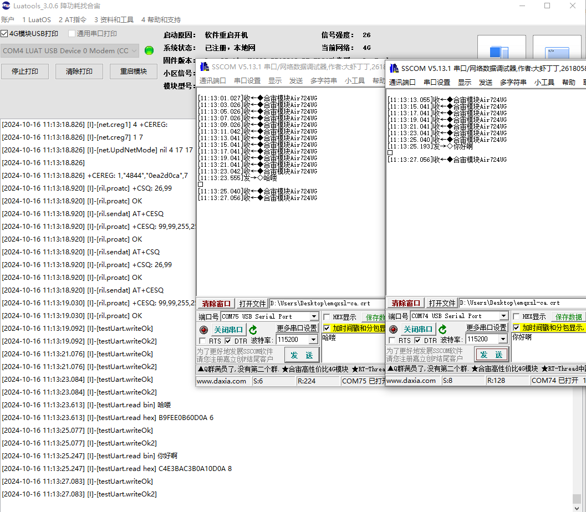

---

## 八、UART 电平

### 8.1 介绍 UART 电平

UART 电平是指串行通信中使用的电压电平标准。常见的串口电平标准有 RS-232、TTL 和 RS-485 等。

1. RS-232 电平：RS-232 是一种常用的串口通信标准，它使用负逻辑电平，即逻辑 1 用 -3V 到 -15V 表示，逻辑 0 用 +3V 到 +15V 表示。RS-232 电平适用于短距离、低速率的通信。
2. TTL 电平：TTL（Transistor-Transistor Logic）电平是一种常见的数字电路电平标准，它使用正逻辑电平，即逻辑 1 用 +5V 表示，逻辑 0 用 0V 表示。TTL 电平适用于短距离、高速率的通信。
3. RS-485 电平：RS-485 是一种常用的串口通信标准，它使用差分电平，即逻辑 1 用 +2V 到 +6V 表示，逻辑 0 用 -2V 到 -6V 表示。RS-485 电平适用于长距离、高速率的通信。

在串口通信中，选择合适的电平标准非常重要，它直接影响到通信的可靠性和稳定性。

Air724UG 模块的 UART IO 电压默认为 1.8V，如果要和 3.3V/5V 的 MCU 或其他串口外设通信，必须要加电平转换电路

### 8.2 电平转换参考电路设计

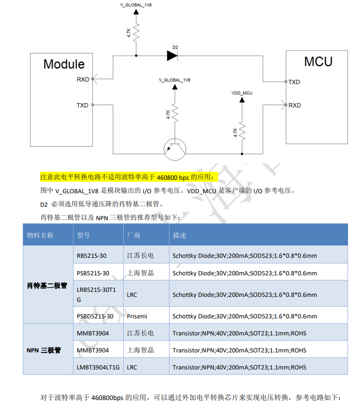

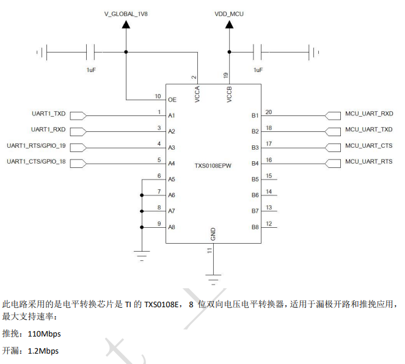

### 8.3 常见问题

1. **串口电平电压过低或过高可能会导致什么问题？**
   如果电压过低，可能会导致接收器无法正确识别信号，如果过高，可能会导致信号损坏或损坏接收器。
   概述：可能会导致串口无法正常通讯，或通讯数据会突然出现乱码，数据错乱等问题。

---

## 九、常见问题

### 9.1 模块串口接收到乱码是什么情况？

串口接收到乱码通常是由于数据格式不匹配或信号干扰等原因引起的。以下是一些可能导致乱码的情况及其解决方法：
  
  1 波特率不一致
  - 情况：发送方和接收方的波特率设置不同。
  - 解决：确保两端的波特率设置一致。
  
  2 数据位、停止位或校验位不匹配
  - 情况：数据格式不一致，例如数据位数、停止位或是否使用校验位。
  - 解决：确认发送和接收的设置一致。例如，常用设置为8个数据位、1个停止位、无校验。
  
  3 信号干扰
  - 情况：外部干扰导致信号失真。
  - 解决：使用屏蔽线缆，缩短线缆长度，避免在电磁干扰强的环境中使用。
 
  4 接线错误
  - 情况：TX（发送）和RX（接收）线接反。
  - 解决：检查接线，确保正确连接。
  
  5 设备未正确初始化
  - 情况：发送设备未配置好，导致数据格式不正确。
  - 解决：检查发送设备的初始化代码和配置，确保正确设置。
  
  6 缓冲区溢出
  - 情况：接收端处理速度慢，导致数据被覆盖。
  - 解决：提高接收端处理速度，或者增加缓冲区大小。
  
  7 电源问题
  - 情况：设备供电不足或不稳定。
  - 解决：检查电源供应，确保设备正常供电。
 
  8 数据编码不一致
  - 情况：发送和接收使用不同的字符编码（如ASCII与UTF-8）。
  - 解决：确保两端使用相同的字符编码。
  
  9 物理连接问题
  - 情况：接口接触不良或线缆损坏。
  - 解决：检查串口连接，确保接触良好，必要时更换线缆。
  
  10 串口驱动问题
  - 情况：驱动程序不兼容或未正确安装。
  - 解决：检查并更新串口驱动程序。

### 9.2 使用 RS485 连接模块，出现漏发，接收不到的情况是怎么回事？

出现漏发和接收不到的情况，大概率是因为模块转向时间设置的问题，模块收不到数据可能是因为没有设置转向脚，导致只能发不能收，出现漏发的情况，大概率是因为转向时间设置和设备的实际转向存在偏差导致漏数据的情况，可以通过 uart.set_rs485_oe()接口调整转向时间，通常 9600 波特率设置 3500us 的转向时间。

### 9.3 模块串口接收不到数据/模块发的数据收不到？

如果出现模块串口接收不到数据的情况，首先排查软件方面逻辑是否写的正确，可以按照 Uart 的 demo 进行测试，如果 demo 也不行的话，排查下模块端和设备端是否为 rx-tx，tx-rx 这样的接法，避免 rx-rx，tx-tx，如果接线也都正常的话确定下波特率方面，如果有条件的话，可以直接通过逻辑分析仪/示波器检测模块的 rx/tx 脚看是否收到数据或者发送数据。

---

## 十、扩展

## 给读者的话

> 本篇文章由`李源龙`开发；
>
> 本篇文章描述的内容，如果有错误、细节缺失、细节不清晰或者其他任何问题，总之就是无法解决您遇到的问题；
>
> 请登录[合宙技术交流论坛](https://chat.openluat.com/)，点击[文档找错赢奖金-Air724UG-LuatOS-软件指南-硬件驱动-UART](https://chat.openluat.com/#/page/matter?125=1848964491937710081&126=%E6%96%87%E6%A1%A3%E6%89%BE%E9%94%99%E8%B5%A2%E5%A5%96%E9%87%91-Air724UG-LuatOS-%E8%BD%AF%E4%BB%B6%E6%8C%87%E5%8D%97-%E7%A1%AC%E4%BB%B6%E9%A9%B1%E5%8A%A8-UART&askid=1848964491937710081)；
>
> 用截图标注+文字描述的方式跟帖回复，记录清楚您发现的问题；
>
> 我们会迅速核实并且修改文档；
>
> 同时也会为您累计找错积分，您还可能赢取月度找错奖金！