## 一、远程温湿度监控器概述

远程温湿度监控器是基于 Air724UG 开发板和 AHT10 数字型温湿度传感器模块而设计的，主要功能是通过 AHT10 数字型温湿度传感器采取现场的温湿度数据，然后通过 cat1 网络采用 mqtt 协议发送温湿度数据到 mqtt 服务器上，用户可以通过特定的客户端（如 Web 应用、手机应用等）接收和展示传感器数据，以实现远程监控的目的。

## 二、参考资料

### Air724UG

淘宝购买链接：<u>Air724UG-NFM 开发板淘宝购买链接</u>

开发板的详细使用说明链接：<u>Air724UG 产品手册</u>

产品手册：[https://docs.openluat.com/air724ug/product/](https://docs.openluat.com/air724ug/product/)

api：[https://doc.openluat.com/wiki/21?wiki_page_id=2068](https://doc.openluat.com/wiki/21?wiki_page_id=2068)

### AHT10 模块

AHT10 数字型温湿度传感器模块购买链接：<u>点击此处</u>

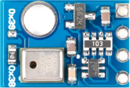

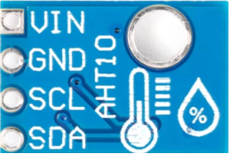

## 三、准备软件环境

### 安装驱动程序

驱动下载地址如下,直接安装即可。

USB 驱动程序：<u>点击此处下载</u>

下载驱动压缩包，解压后，根据电脑配置安装对应驱动，如 64 位操作系统选择如下所示

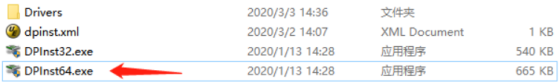

安装成功后，将开发板连接到电脑 USB 口，开机后会在设备管理器中虚拟出 3 个虚拟串口，如下则 USB 驱动安装完成。

### 安装工具 Luatools

要想烧录固件到 4G 模组中，需要用到合宙的强大的调试工具：Luatools；

详细使用说明参考：[Luatools 工具使用说明](https://docs.openluat.com/Luatools/) 。

Luatools 程序：<u>点击此处下载</u>

Luatools 工具集具备以下几大核心功能：

- 一键获取最新固件：自动连接合宙服务器，轻松下载最新的合宙模组固件。
- 固件与脚本烧录：便捷地将固件及脚本文件烧录至目标模组中。
- 串口日志管理：实时查看模组通过串口输出的日志信息，并支持保存功能。
- 串口调试助手：提供简洁的串口调试界面，满足基本的串口通信测试需求。

Luatools 下载之后， 无需安装， 解压到你的硬盘，点击 Luatools_v3.exe 运行即可。

Luatools 支持最新固件获取、固件打包、项目管理、trace 打印、单机烧录等功能。

### 安装 mqtt.fx

mqtt.fx 是一款基于 Eclipse Paho，使用 Java 语言编写的 MQTT 客户端工具。支持通过 Topic 订阅和发布消息，用来前期和物联网云平台调试非常方便。

mqtt.fx 下载地址：http://www.jensd.de/apps/mqttfx/1.7.1/

安装使用说明参见：[https://cloud.tencent.com/developer/article/1662831](https://cloud.tencent.com/developer/article/1662831)

## 四、准备硬件环境

### 主板与 PC 连接

如下图，使用 USB 线缆，插入左侧的 USB 端口，将开发板左侧的电源拨动开关拨至“ON”。拨码开关 1 和 2 的位置需拨至上方与下图保持一致，以确保开发板能够正常工作。

按下开机键 3 秒开机。

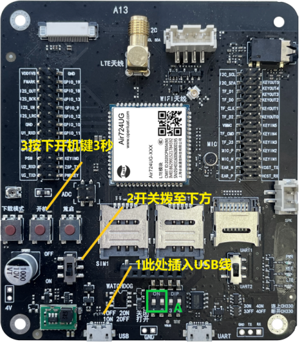

### SIM 卡

中国大陆环境下，可以上网的 sim 卡,一般来说，使用移动，电信，联通的物联网卡或者手机卡都行；

### PC 电脑

WINDOWS 系统，其他暂无特别要求；

### 数据通信线

USB 数据线，暂无特别要求；

### 主板和传感器连接

确保 SDA、SCL、GND、VIN 分别连接主板和传感器，如下图所示。

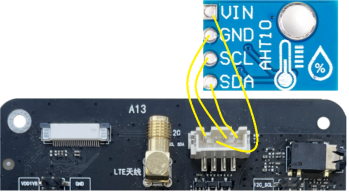

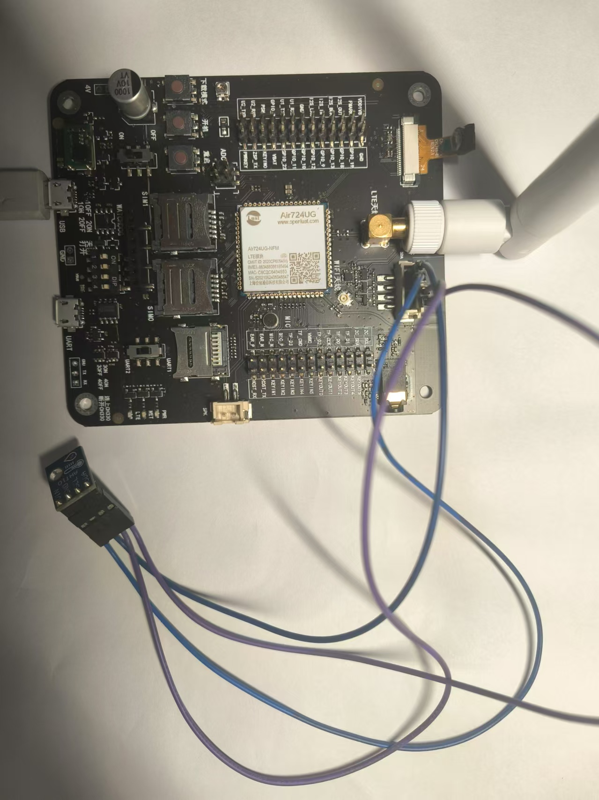

## 五、脚本和固件下载

### 远程温湿度监控器程序源码下载


[右键点我,另存为,下载完整压缩文件包](file/温湿度控制器.zip){:target="_blank"}

### 固件下载

下载底层固件，并解压

链接：[https://docs.openluat.com/air724ug/luatos/firmware/](https://docs.openluat.com/air724ug/luatos/firmware/)

如下图所示，红框的是我们要使用到的

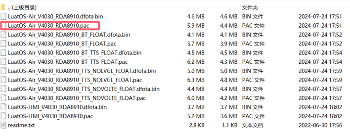

### 下载固件和脚本到开发板中

打开 luatools，开发板上电开机，如开机成功 Luatools 会打印如下信息。


点击项目管理测试选项。


进入管理界面，如下图所示。

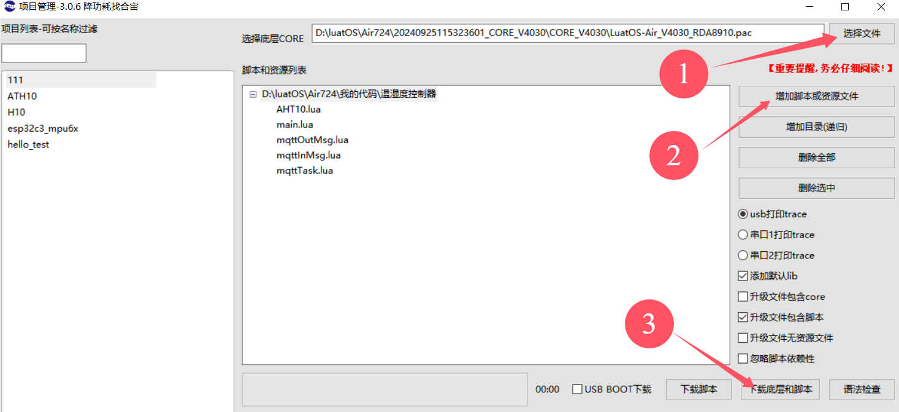

- 点击选择文件，选择底层固件，具体路径在 4.2 项目中的解压为文件中，我的文件放在 D:\luatOS\Air724 路径中


- 点击增加脚本或资源文件，选择 4.1 项目中下载的 远程温湿度监控器程序源码，如下图所示。

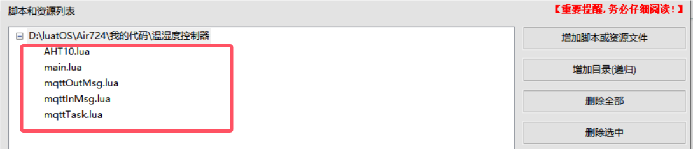

- 点击下载底层和脚本，下载完成如下图所示。


## 六、脚本代码说明

### AHT10.lua

本代码为温度传感器驱动程序脚本，系统通过调用 readAHT10()函数来读取 AHT10 传感器的信息。

```lua
--- 模块功能：AHT10功能测试.
-- @module i2c
-- @author openLuat
-- @license MIT
-- @copyright OpenLuat.com
-- @release 2021.8.10

local sys = require "sys"

local function i2c_open(id)
    if i2c.setup(id, i2c.SLOW) ~= i2c.SLOW then
        log.error("I2C.init is: ", "fail")
    end
end
 function readAHT10()
    local id = 2
    i2c_open(id)
    --数值查询，发送指令0xAC, 0x22, 0x00,通过iic发送完毕之后，AHT10返回的数值是6个字节的数组
    i2c.send(id, 0x38, {0xAC, 0x22, 0x00})
    --等待75毫秒以上
    rtos.sleep(80)
    --1[状态位],2[湿度第一段],3[湿度第二段],4前四位[湿度第三段],4后四位[温度第一段],5[温度第二段],6[温度第三段]
    local data = i2c.recv(id, 0x38, 6)
    log.info("i2cdata", #data, data:toHex())
    i2c.close(id)
    if #data == 6 then
        local _, _, data2, data3, data4, data5, data6 = pack.unpack(data, "b6")
        local hum = bit.bor(bit.bor(bit.lshift(data2, 12), bit.lshift(data3, 4)), bit.rshift(data4, 4))* 1000/ 1048576
        --log.info("hum",hum/10, ".",hum%10 )
        local tmp = bit.bor(bit.bor(bit.lshift(bit.band(data4, 0x0f), 16), bit.lshift(data5, 8)), data6) * 2000/ 1048576  - 500
        --log.info("tmp" ,tmp/10,".", tmp%10  )
        --前面将数据放大了100倍，方便没有float的固件保留精度，在使用float固件时直接缩小100倍还原
        --return tmp, hum
        return tmp, hum
    else
        return 0, 0
    end
end
```

### main.lua

本代码为主程序脚本，系统启动后首先会对 4G 网络进行配置，然后加载 AHT10 驱动和 mqtt 驱动程序，并且执行 readAHT10 任务，以 15 秒的时间间隔间断采集温湿度数据上传到 mqtt 服务器中。

```lua
--必须在这个位置定义PROJECT和VERSION变量
--PROJECT：ascii string类型，可以随便定义，只要不使用,就行
--VERSION：ascii string类型，如果使用Luat物联云平台固件升级的功能，必须按照"X.X.X"定义，X表示1位数字；否则可随便定义
PROJECT = "AHT10000"
VERSION = "2.0.0"

--加载日志功能模块，并且设置日志输出等级
--如果关闭调用log模块接口输出的日志，等级设置为log.LOG_SILENT即可
require "log"
LOG_LEVEL = log.LOGLEVEL_TRACE
--[[
如果使用UART输出日志，打开这行注释的代码"--log.openTrace(true,1,115200)"即可，根据自己的需求修改此接口的参数
如果要彻底关闭脚本中的输出日志（包括调用log模块接口和Lua标准print接口输出的日志），执行log.openTrace(false,第二个参数跟调用openTrace接口打开日志的第二个参数相同)，例如：
1、没有调用过sys.opntrace配置日志输出端口或者最后一次是调用log.openTrace(true,nil,921600)配置日志输出端口，此时要关闭输出日志，直接调用log.openTrace(false)即可
2、最后一次是调用log.openTrace(true,1,115200)配置日志输出端口，此时要关闭输出日志，直接调用log.openTrace(false,1)即可
]]
--log.openTrace(true,1,115200)

sys = require "sys"

require "net"
--每1分钟查询一次GSM信号强度
--每1分钟查询一次基站信息
net.startQueryAll(60000, 60000)

--此处关闭RNDIS网卡功能
--否则，模块通过USB连接电脑后，会在电脑的网络适配器中枚举一个RNDIS网卡，电脑默认使用此网卡上网，导致模块使用的sim卡流量流失
--如果项目中需要打开此功能，把ril.request("AT+RNDISCALL=0,1")修改为ril.request("AT+RNDISCALL=1,1")即可
--注意：core固件：V0030以及之后的版本、V3028以及之后的版本，才以稳定地支持此功能
ril.request("AT+RNDISCALL=0,1")

--加载控制台调试功能模块（此处代码配置的是uart1，波特率115200）
--此功能模块不是必须的，根据项目需求决定是否加载
--使用时注意：控制台使用的uart不要和其他功能使用的uart冲突
--使用说明参考demo/console下的《console功能使用说明.docx》
--require "console"
--console.setup(1, 115200)

--加载硬件看门狗功能模块
--根据自己的硬件配置决定：1、是否加载此功能模块；2、配置Luat模块复位单片机引脚和互相喂狗引脚
--合宙官方出售的Air201开发板上有硬件看门狗，所以使用官方Air201开发板时，必须加载此功能模块
--[[
require "wdt"
wdt.setup(pio.P0_30, pio.P0_31)
]]

--加载网络指示灯和LTE指示灯功能模块
--根据自己的项目需求和硬件配置决定：1、是否加载此功能模块；2、配置指示灯引脚
--合宙官方出售的Air720U开发板上的网络指示灯引脚为pio.P0_1，LTE指示灯引脚为pio.P0_4
require "netLed"
pmd.ldoset(2,pmd.LDO_VLCD)
netLed.setup(true,pio.P0_1,pio.P0_4)
--网络指示灯功能模块中，默认配置了各种工作状态下指示灯的闪烁规律，参考netLed.lua中ledBlinkTime配置的默认值
--如果默认值满足不了需求，此处调用netLed.updateBlinkTime去配置闪烁时长

--加载错误日志管理功能模块【强烈建议打开此功能】
--如下2行代码，只是简单的演示如何使用errDump功能，详情参考errDump的api
require "errDump"
errDump.request("udp://dev_msg1.openluat.com:12425", nil, true)

--加载远程升级功能模块【强烈建议打开此功能】
--如下3行代码，只是简单的演示如何使用update功能，详情参考update的api以及demo/update
--PRODUCT_KEY = "v32xEAKsGTIEQxtqgwCldp5aPlcnPs3K"
--require "update"
--update.request()

--加载系统工具
require "misc"
require "utils"
require "patch"

--local aht10_tmp, aht10_hum

--加载MQTT功能测试模块
local mqtt=require "mqttTask"
-- 加载I²C功能测试模块
local aht10 = require "AHT10"

--启动readAHT10 任务
sys.taskInit(function()
    while true do

         aht10_tmp, aht10_hum=readAHT10()
        log.info("aht10_hum:", (aht10_hum /10) .. ".".. (aht10_hum%10 ) .. "%  ","aht10_tmp:" .. (aht10_tmp/10) ..".".. (aht10_tmp%10) .. "℃")
        sys.wait(15000)
    end
end)

-- 启动系统框架
sys.init(0, 0)
sys.run()
```

### mqttInMsg.lua

mqtt 接收程序脚本，本部分的功能是实时接收订阅的信息，并且将接收到的信息通过 log 打印到日志中。

```lua
--- 模块功能：MQTT客户端数据接收处理
-- @author openLuat
-- @module mqtt.mqttInMsg
-- @license MIT
-- @copyright openLuat
-- @release 2018.03.28

module(...,package.seeall)

--- MQTT客户端数据接收处理
-- @param mqttClient，MQTT客户端对象
-- @return 处理成功返回true，处理出错返回false
-- @usage mqttInMsg.proc(mqttClient)
function proc(mqttClient)
    local result,data
    while true do
        result,data = mqttClient:receive(20000,"APP_SOCKET_SEND_DATA")
        --接收到数据
        if result then
            log.info("mqttInMsg.proc",data.topic,string.toHex(data.payload))

            --TODO：根据需求自行处理data.payload
        else
            break
        end
    end

    return result or data=="timeout" or data=="APP_SOCKET_SEND_DATA"
end
```

### mqttOutMsg.lua

matt 发送程序脚本。这里启用了一个消息队列，要发送的消息都要先添加到消息队列后才可以自动发送。

```lua
--- 模块功能：MQTT客户端数据发送处理
-- @author openLuat
-- @module mqtt.mqttOutMsg
-- @license MIT
-- @copyright openLuat
-- @release 2018.03.28

module(...,package.seeall)

--数据发送的消息队列
local msgQueue = {}

local function insertMsg(topic,payload,qos,user)
    table.insert(msgQueue,{t=topic,p=payload,q=qos,user=user})
    sys.publish("APP_SOCKET_SEND_DATA")
end
--回调函数
local function pubQos0TestCb(result)
    log.info("mqttOutMsg.pubQos0TestCb",result)
    if result then sys.timerStart(pubQos0Test,25000) end
end

function pubQos0Test()
    insertMsg("/qos0topic","hum:".. (aht10_hum /10) .. ".".. (aht10_hum%10 ) .. "%  ".."tmp:" .. (aht10_tmp/10) ..".".. (aht10_tmp%10) .. "℃",0,{cb=pubQos0TestCb})
end

--- 初始化“MQTT客户端数据发送”
-- @return 无
-- @usage mqttOutMsg.init()
function init()
    pubQos0Test()
    --pubQos1Test()
end

--- 去初始化“MQTT客户端数据发送”
-- @return 无
-- @usage mqttOutMsg.unInit()
function unInit()
    sys.timerStop(pubQos0Test)
    --sys.timerStop(pubQos1Test)
    while #msgQueue>0 do
        local outMsg = table.remove(msgQueue,1)
        if outMsg.user and outMsg.user.cb then outMsg.user.cb(false,outMsg.user.para) end
    end
end

--- MQTT客户端数据发送处理
-- @param mqttClient，MQTT客户端对象
-- @return 处理成功返回true，处理出错返回false
-- @usage mqttOutMsg.proc(mqttClient)
function proc(mqttClient)
    while #msgQueue>0 do
        local outMsg = table.remove(msgQueue,1)
        local result = mqttClient:publish(outMsg.t,outMsg.p,outMsg.q)
        if outMsg.user and outMsg.user.cb then outMsg.user.cb(result,outMsg.user.para) end
        if not result then return end
    end
    return true
end
```

### mqttTask.lua

系统初始化后会加载 mqtt 任务程序脚本，配置 mqtt 属性，连接服务器，加载订阅主题，定时发布主题数据等。

```lua
--- 模块功能：MQTT客户端处理框架
-- @author openLuat
-- @module mqtt.mqttTask
-- @license MIT
-- @copyright openLuat
-- @release 2018.03.28

module(...,package.seeall)

require"misc"
require"mqtt"
require"mqttOutMsg"
require"mqttInMsg"

local ready = false

--- MQTT连接是否处于激活状态
-- @return 激活状态返回true，非激活状态返回false
-- @usage mqttTask.isReady()
function isReady()
    return ready
end

--启动MQTT客户端任务
sys.taskInit(
    function()
        local retryConnectCnt = 0

        while true do
            if not socket.isReady() then
                retryConnectCnt = 0
                --等待网络环境准备就绪，超时时间是5分钟
                sys.waitUntil("IP_READY_IND",300000)
            end
            log.info("IP_READY_IND" )
            if socket.isReady() then
                local imei = misc.getImei()
                --创建一个MQTT客户端
                local mqttClient = mqtt.client(imei,600,"user","password")
                --阻塞执行MQTT CONNECT动作，直至成功
                --如果使用ssl连接，打开mqttClient:connect("lbsmqtt.airm2m.com",1884,"tcp_ssl",{caCert="ca.crt"})，根据自己的需求配置
                --mqttClient:connect("lbsmqtt.airm2m.com",1884,"tcp_ssl",{caCert="ca.crt"})
                if mqttClient:connect("lbsmqtt.airm2m.com",1884,"tcp") then
                    retryConnectCnt = 0
                    ready = true
                    --订阅主题
                    if mqttClient:subscribe({["/event0"]=0, ["/中文event1"]=1}) then
                        mqttOutMsg.init()
                        --循环处理接收和发送的数据
                        while true do
                            if not mqttInMsg.proc(mqttClient) then log.error("mqttTask.mqttInMsg.proc error") break end
                            if not mqttOutMsg.proc(mqttClient) then log.error("mqttTask.mqttOutMsg proc error") break end
                        end
                        mqttOutMsg.unInit()
                    end
                    ready = false
                else
                    retryConnectCnt = retryConnectCnt+1
                end
                --断开MQTT连接
                mqttClient:disconnect()
                if retryConnectCnt>=5 then link.shut() retryConnectCnt=0 end
                sys.wait(5000)
            else
                --进入飞行模式，20秒之后，退出飞行模式
                net.switchFly(true)
                sys.wait(20000)
                net.switchFly(false)
            end
        end
    end
)
```

## 七、开机调试

### Luatools 软件 调试

连接好硬件并下载固件后，启动 Luatools 软件，系统运行信息将显示在界面中。红框中为开发板获得传感器的温湿度数值，系统会每间隔 15 更新秒输出一次，如下图所示。

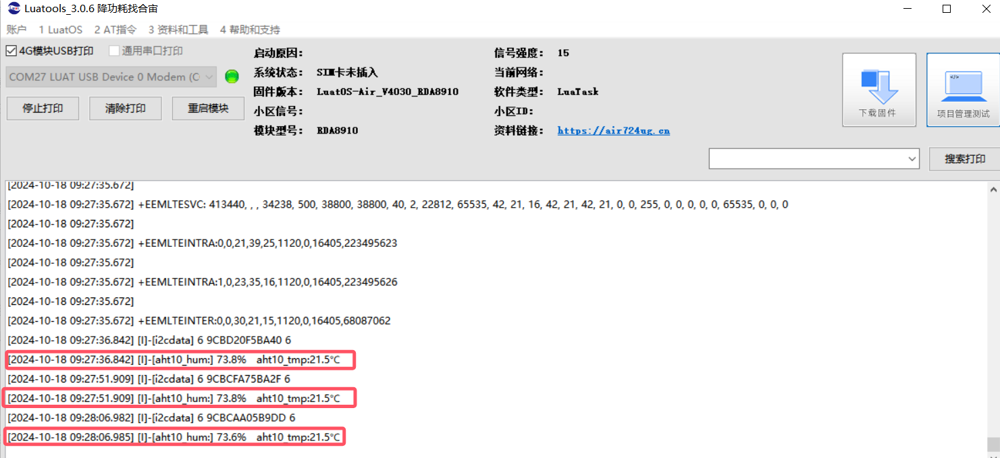

### 远程监控温湿度数据

本系统的源码是通过手机网络以 MQTT 协议 定时上传温湿度数据，使用合宙 lbsmqtt.airm2m.com:1884 的 broker，可以用 mqtt.fx 客户端监控温湿度信息。

- 启动 mqtt.fx 客户端 点击图标新建连接，如下图所示。

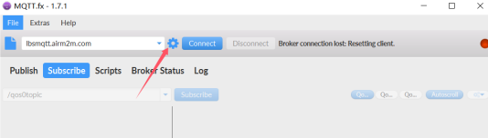

- 填写红框的信息后，点击 ok 确认，如下图所示。

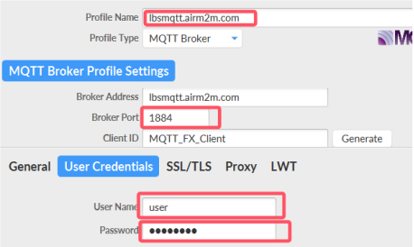

- 点击 connect 连接服务，如下图所示。

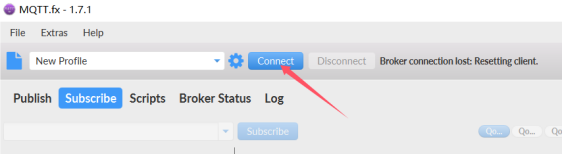

- 添加主题信息，点击 Subscribe 订阅主题，如下图所示。

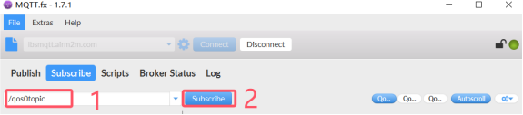

- 在成功订阅后，用户可以接收到温湿度数据，如下图所示。


## 给读者的话

> 本篇文章由`杨超`开发；
>
> 本篇文章描述的内容，如果有错误、细节缺失、细节不清晰或者其他任何问题，总之就是无法解决您遇到的问题；
>
> 请登录[合宙技术交流论坛](https://chat.openluat.com/)，点击[文档找错赢奖金-Air724UG-LuatOS-软件指南-项目实战-温湿度数据采集](https://chat.openluat.com/#/page/matter?125=1848966228857716737&126=%E6%96%87%E6%A1%A3%E6%89%BE%E9%94%99%E8%B5%A2%E5%A5%96%E9%87%91-Air724UG-LuatOS-%E8%BD%AF%E4%BB%B6%E6%8C%87%E5%8D%97-%E9%A1%B9%E7%9B%AE%E5%AE%9E%E6%88%98-%E6%B8%A9%E6%B9%BF%E5%BA%A6%E6%95%B0%E6%8D%AE%E9%87%87%E9%9B%86&askid=1848966228857716737)；
>
> 用截图标注+文字描述的方式跟帖回复，记录清楚您发现的问题；
>
> 我们会迅速核实并且修改文档；
>
> 同时也会为您累计找错积分，您还可能赢取月度找错奖金！
