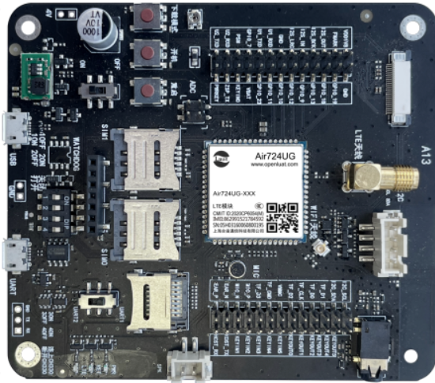
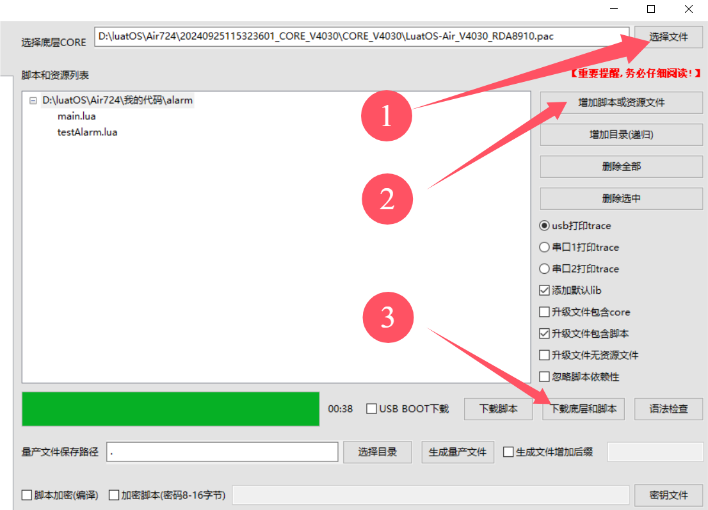
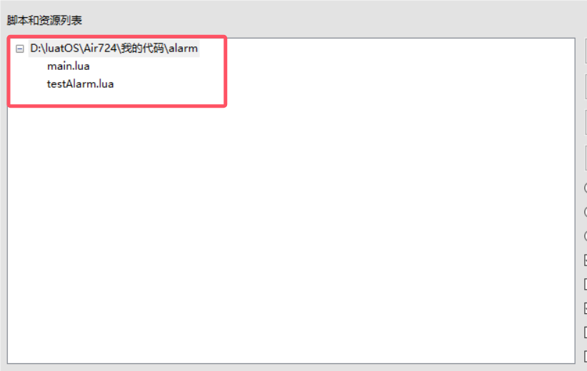
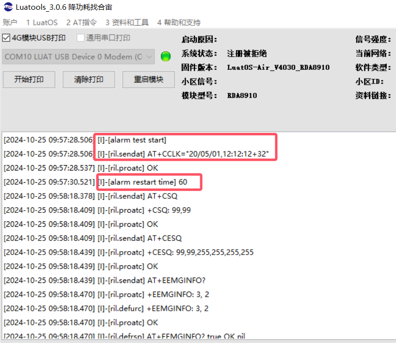
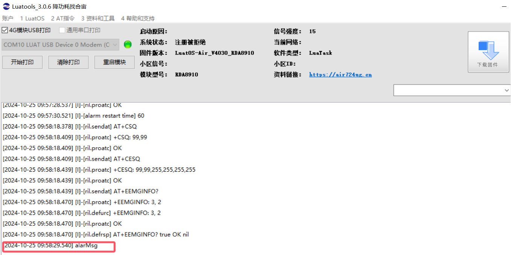

## 一、简介

alarm 闹钟是电子产品中常用来作为设备软件定时开关机的一项基本功能，本文介绍如何用 Air724 开发板，进行闹钟功能演示。

## 二、演示功能概述

本教程教你如何用 Air724 开发板，进行闹钟的功能演示。

## 三、准备硬件环境

### 3.1 开发板准备

使用 EVB_Air724 开发板，如下图所示：



淘宝购买链接：<u>Air724UG-NFM 开发板淘宝购买链接</u>

此开发板的详细使用说明参考：[Air724UG 产品手册](https://docs.openluat.com/air724ug/product/) 中的 << EVB_Air724UG_AXX 开发板使用说明 >>，写这篇文章时最新版本的使用说明为：EVB_Air724UG_A14 开发板使用说明；开发板使用过程中遇到任何问题，可以直接参考这份使用说明文档。

api：[https://doc.openluat.com/wiki/21?wiki_page_id=2068](https://doc.openluat.com/wiki/21?wiki_page_id=2068)

### 3.2 数据通信线

USB 数据线一根（micro usb）。

### 3.3 PC 电脑

WINDOWS 系统，其他暂无特别要求。

### 3.4 SIM 卡

中国大陆环境下，可以上网的 sim 卡,一般来说，使用移动，电信，联通的物联网卡或者手机卡都行。

### 3.5 组装硬件环境

usb 数据线插入 usb 口，另一端与电脑相连，拨码开关全部拨到 on，串口切换开关选择 UART1,USB 供电的 4V 对应开关拨至 ON 档，SIM 卡放到 SIM 卡槽中锁紧，如下图所示。


## 四、准备软件环境

### 4.1 下载调试工具

使用说明参考：[Luatools 下载和详细使用](https://docs.openluat.com/Luatools/)

### 4.2 源码及固件

1. 底层 core 下载

下载底层固件，并解压

链接：[https://docs.openluat.com/air724ug/luatos/firmware/](https://docs.openluat.com/air724ug/luatos/firmware/)

如下图所示，红框的是我们要使用到的。


2. 本教程使用的 demo 见附件：

[右键点我,另存为,下载完整压缩文件包](file/alarm.zip){:target="_blank"}

### 4.3 下载固件和脚本到开发板中

打开 luatools，开发板上电开机，如开机成功 Luatools 会打印如下信息。


点击项目管理测试选项。


进入管理界面，如下图所示。



- 点击选择文件，选择底层固件，我的文件放在 D:\luatOS\Air724 路径中


- 点击增加脚本或资源文件，选择 之前下载的程序源码，如下图所示。



- 点击下载底层和脚本，下载完成如下图所示。


## 五、代码示例介绍

### 5.1 API 说明

--注册闹钟模块

rtos.init_module(rtos.MOD_ALARM)

--注册闹钟消息的处理函数（如果是开机闹钟，闹钟事件到来时会调用 alarmsg）

rtos.on(rtos.MSG_ALARM,alarMsg)

模块进行 lua 开发的 lua 虚拟机架设在 RTOS 操作系统之上，所以在设置完系统时间，闹钟开关机时间之后，需要将闹钟消息进行注册，才能对操作系统进行开关机启动操作

```lua
_--注册闹钟模块_
rtos.init_module(rtos.MOD_ALARM)
_--注册闹钟消息的处理函数（如果是开机闹钟，闹钟事件到来时会调用alarmsg）_
rtos.on(rtos.MSG_ALARM,alarMsg)
```

--设定闹铃

rtos.set_alarm(1,onTimet.year,onTimet.month,onTimet.day,onTimet.hour,onTimet.min,onTimet.sec)

set_alarm 接口参数中的第一个参数 1 表示开启闹钟，0 表示关闭闹钟

闹钟关机之后，模块将进入超低功耗模式，此时停止解析应用层的代码，大部分协议栈也将停止，所以闹钟开机需软件主动重启一次

```lua
_--如果是关机闹钟开机，则需要软件主动重启一次，才能启动GSM协议栈_
if rtos.poweron_reason()==rtos.POWERON_ALARM then
        sys.restart("ALARM")
end
```

### 5.2 testAlarm.lua 代码

首先通过 misc.setClock()接口函数手动设置当前系统时间，该函数可传入 table 类型的变量，依次包含年、月、日、时、分、秒等 6 个参数，设置后，系统时间即更新生效；通过 rtos.set_alarm()接口函数设置闹钟关机后再次开机的时间间隔，在这里修改为 60，即模块关机开始 60S 后再次开机：

```lua
--- 模块功能：闹钟功能测试(支持开机闹钟和关机闹钟，同时只能存在一个闹钟，如果想实现多个闹钟，等当前闹钟触发后，再次调用闹钟设置接口去配置下一个闹钟).
-- @author openLuat
-- @module alarm.testAlarm
-- @license MIT
-- @copyright openLuat
-- @release 2018.03.14

require"ntp"
require "sys"
require"misc"
module(...,package.seeall)

sys.taskInit(function()
    sys.wait(10000)
    log.info("alarm test start")
    misc.setClock({year=2020,month=5,day=1,hour=12,min=12,sec=12})
    sys.wait(2000)
    local onTimet = os.date("*t",os.time() + 60)  --下次要开机的时间为60秒后
    log.info("alarm restart time", 60)
    rtos.set_alarm(1,onTimet.year,onTimet.month,onTimet.day,onTimet.hour,onTimet.min,onTimet.sec)   --设定闹铃
    --如果要测试关机闹钟，打开下面这2行代码
    --sys.wait(2000)
    --rtos.poweroff()
end)

--[[
函数名：alarMsg
功能  ：开机闹钟事件的处理函数
参数  ：无
返回值：无
]]
local function alarMsg()
    print("alarMsg")
end

--如果是关机闹钟开机，则需要软件主动重启一次，才能启动GSM协议栈
if rtos.poweron_reason()==rtos.POWERON_ALARM then
    sys.restart("ALARM")
end

--注册闹钟模块
rtos.init_module(rtos.MOD_ALARM)
--注册闹钟消息的处理函数（如果是开机闹钟，闹钟事件到来时会调用alarmsg）
rtos.on(rtos.MSG_ALARM,alarMsg)
```

### 5.3 main.lua 代码

本代码为主程序脚本，系统启动后首先会对 4G 网络进行配置，等待网络连接成功，然后加载测试模块。

```lua
--必须在这个位置定义PROJECT和VERSION变量
--PROJECT：ascii string类型，可以随便定义，只要不使用,就行
--VERSION：ascii string类型，如果使用Luat物联云平台固件升级的功能，必须按照"X.X.X"定义，X表示1位数字；否则可随便定义
PROJECT = "ALARM"
VERSION = "2.0.0"

--加载日志功能模块，并且设置日志输出等级
--如果关闭调用log模块接口输出的日志，等级设置为log.LOG_SILENT即可
require "log"
LOG_LEVEL = log.LOGLEVEL_TRACE
--[[
如果使用UART输出日志，打开这行注释的代码"--log.openTrace(true,1,115200)"即可，根据自己的需求修改此接口的参数
如果要彻底关闭脚本中的输出日志（包括调用log模块接口和Lua标准print接口输出的日志），执行log.openTrace(false,第二个参数跟调用openTrace接口打开日志的第二个参数相同)，例如：
1、没有调用过sys.opntrace配置日志输出端口或者最后一次是调用log.openTrace(true,nil,921600)配置日志输出端口，此时要关闭输出日志，直接调用log.openTrace(false)即可
2、最后一次是调用log.openTrace(true,1,115200)配置日志输出端口，此时要关闭输出日志，直接调用log.openTrace(false,1)即可
]]
--log.openTrace(true,1,115200)

require "sys"

require "net"
--每1分钟查询一次GSM信号强度
--每1分钟查询一次基站信息
net.startQueryAll(60000, 60000)

--此处关闭RNDIS网卡功能
--否则，模块通过USB连接电脑后，会在电脑的网络适配器中枚举一个RNDIS网卡，电脑默认使用此网卡上网，导致模块使用的sim卡流量流失
--如果项目中需要打开此功能，把ril.request("AT+RNDISCALL=0,1")修改为ril.request("AT+RNDISCALL=1,1")即可
--注意：core固件：V0030以及之后的版本、V3028以及之后的版本，才以稳定地支持此功能
ril.request("AT+RNDISCALL=0,1")

--加载控制台调试功能模块（此处代码配置的是uart2，波特率115200）
--此功能模块不是必须的，根据项目需求决定是否加载
--使用时注意：控制台使用的uart不要和其他功能使用的uart冲突
--使用说明参考demo/console下的《console功能使用说明.docx》
--require "console"
--console.setup(2, 115200)

--加载网络指示灯和LTE指示灯功能模块
--根据自己的项目需求和硬件配置决定：1、是否加载此功能模块；2、配置指示灯引脚
--合宙官方出售的Air720U开发板上的网络指示灯引脚为pio.P0_1，LTE指示灯引脚为pio.P0_4
require "netLed"
pmd.ldoset(2,pmd.LDO_VLCD)
netLed.setup(true,pio.P0_1,pio.P0_4)
--网络指示灯功能模块中，默认配置了各种工作状态下指示灯的闪烁规律，参考netLed.lua中ledBlinkTime配置的默认值
--如果默认值满足不了需求，此处调用netLed.updateBlinkTime去配置闪烁时长
--LTE指示灯功能模块中，配置的是注册上4G网络，灯就常亮，其余任何状态灯都会熄灭

--加载错误日志管理功能模块【强烈建议打开此功能】
--如下2行代码，只是简单的演示如何使用errDump功能，详情参考errDump的api
require "errDump"
errDump.request("udp://dev_msg1.openluat.com:12425", nil, true)

--加载远程升级功能模块【强烈建议打开此功能】
--如下3行代码，只是简单的演示如何使用update功能，详情参考update的api以及demo/update
--PRODUCT_KEY = "v32xEAKsGTIEQxtqgwCldp5aPlcnPs3K"
--require "update"
--update.request()

--加载闹钟功能测试模块
require "testAlarm"

--启动系统框架
sys.init(0, 0)
sys.run()
```

## 六、开机调试

### 6.1 开发板开机

连接好硬件并下载固件后，启动 Luatools 软件，系统运行信息将显示在界面中。红框中为开发板连接到 PC 机后正常打印的信息，如下图所示。


### 6.2  功能调试

1. 设置闹钟

`通过misc.setClock()接口函数手动设置当前系统时间，然后通过rtos.set_alarm()接口函数设置闹钟关机后再次开机的时间间隔，在这里修改为60，即模块关机开始60S后再次开机`。



1. 闹钟时间到打印输出



## 七、常见问题

### 7.1 为什么烧录完 demo 之后，用户反映不能进行闹钟关机？

答：demo 中已经将闹钟关机的函数屏蔽掉，需要用户释放时才能进行闹钟关机。

### 7.2 为什么烧录完 demo 之后，用开发板测试时发现代码中设定的时间跟我们看到的网络时间不一样，甚至比当前的时间早，但是还是会安装设定的时间间隔开机？

答：demo 中设定的时间为手动设置，并没有与网络时间同步，模块是以手动设定的时间为基础计时运行。

## 给读者的话

> 本篇文章由`杨超`开发；
>
> 本篇文章描述的内容，如果有错误、细节缺失、细节不清晰或者其他任何问题，总之就是无法解决您遇到的问题；
>
> 请登录[合宙技术交流论坛](https://chat.openluat.com/)，点击[文档找错赢奖金-Air724UG-LuatOS-软件指南-基础服务-闹钟](https://chat.openluat.com/#/page/matter?125=1850352479871565826&126=%E6%96%87%E6%A1%A3%E6%89%BE%E9%94%99%E8%B5%A2%E5%A5%96%E9%87%91-Air724UG-LuatOS-%E8%BD%AF%E4%BB%B6%E6%8C%87%E5%8D%97-%E5%9F%BA%E7%A1%80%E6%9C%8D%E5%8A%A1-%E9%97%B9%E9%92%9F&askid=1850352479871565826)；
>
> 用截图标注+文字描述的方式跟帖回复，记录清楚您发现的问题；
>
> 我们会迅速核实并且修改文档；
>
> 同时也会为您累计找错积分，您还可能赢取月度找错奖金！
