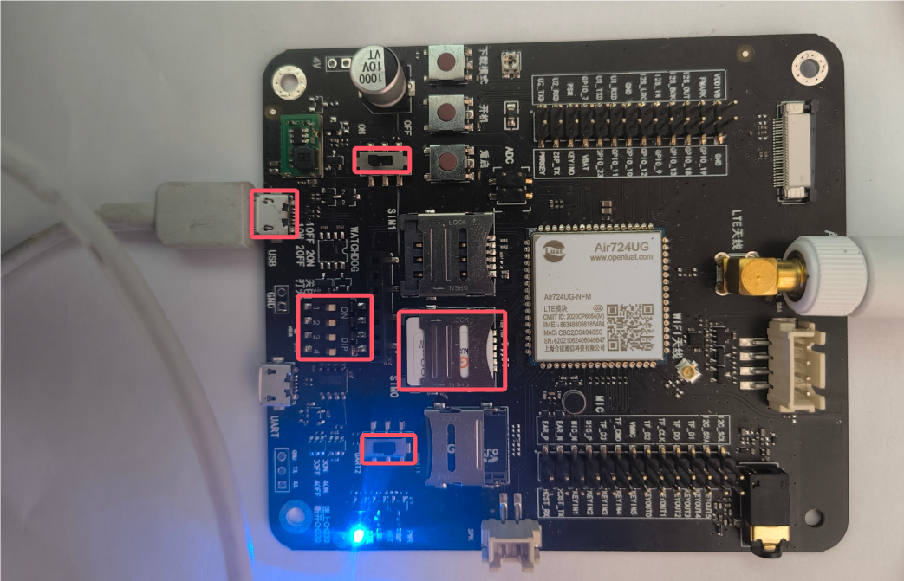

## 一、简介

位运算是一种在计算机系统中对二进制数位进行操作的运算。由于计算机内部数据的存储和处理都是以二进制形式进行的，位运算能够直接对整数的二进制位进行高效操作。位运算包括与（&）、或（|）、异或（^）、非（~）、左移（<<）和右移（>>）等基本操作。

## 二、演示功能概述

本教程教你如何用 Air724 开发板，进行 API 函数基础服务-位运算(bit)。

## 三、准备硬件环境

### 3.1 开发板准备

使用 EVB_Air724 开发板，如下图所示：


淘宝购买链接：<u>Air724UG-NFM 开发板淘宝购买链接</u>

此开发板的详细使用说明参考：[Air724UG 产品手册](https://docs.openluat.com/air724ug/product/) 中的 << EVB_Air724UG_AXX 开发板使用说明 >>，写这篇文章时最新版本的使用说明为：EVB_Air724UG_A14 开发板使用说明；开发板使用过程中遇到任何问题，可以直接参考这份使用说明文档。

api：[https://doc.openluat.com/wiki/21?wiki_page_id=2068](https://doc.openluat.com/wiki/21?wiki_page_id=2068)

### 3.2 数据通信线

USB 数据线一根（micro usb）。

### 3.3 PC 电脑

WINDOWS 系统，其他暂无特别要求。

### 3.4 SIM 卡

中国大陆环境下，可以上网的 sim 卡,一般来说，使用移动，电信，联通的物联网卡或者手机卡都行。

### 3.5 组装硬件环境

usb 数据线插入 usb 口，另一端与电脑相连，拨码开关全部拨到 on，串口切换开关选择 UART1,USB 供电的 4V 对应开关拨至 ON 档，SIM 卡放到 SIM 卡槽中锁紧，如下图所示。



## 四、准备软件环境

### 4.1 下载调试工具

使用说明参考：[Luatools 下载和详细使用](https://docs.openluat.com/Luatools/)

### 4.2 源码及固件

1. 底层 core 下载

下载底层固件，并解压

链接：[https://docs.openluat.com/air724ug/luatos/firmware/](https://docs.openluat.com/air724ug/luatos/firmware/)

如下图所示，红框的是我们要使用到的。


2. 本教程使用的 demo 见附件：

[右键点我,另存为,下载完整压缩文件包](file/bit.zip){:target="_blank"}

### 4.3 下载固件和脚本到开发板中

打开 luatools，开发板上电开机，如开机成功 Luatools 会打印如下信息。


点击项目管理测试选项。


进入管理界面，如下图所示。


- 点击选择文件，选择底层固件，我的文件放在 D:\luatOS\Air724 路径中


- 点击增加脚本或资源文件，选择 之前下载的程序源码，如下图所示。


- 点击下载底层和脚本，下载完成如下图所示。


## 五、代码示例介绍

### 5.1 API 说明

位操作支持库

1.bit.bnot( value )

取反，等价于 C 语言中的~

参数        类型        释义        取值

value        number        需要取反的值        0x0000 0000~0xFFFF FFFF

返回值        类型        释义        取值

result        number        取反之后的值        0x0000 0000~0xFFFF FFFF

例子

```lua
--支持32位比特数按位取反
print(bit.bnot(5))--按位取反，输出-6
```

2.bit.band( val1, val2, … valn )

与运算，等价于 Ｃ 语言中的 val1 & val2 & … & valn

参数        类型        释义        取值

val1        number        第一个参数

val2        number        第二个参数

valn        number        第 n 个参数

返回值        类型        释义        取值

result        number        与运算之后的结果

例子

```lua
print(bit.band(1,1))--与,--输出1
```

3.bit.bor( val1, val2, … valn )

或运算，等价于 C 里面的 val1 | val2 | … | valn

参数        类型        释义        取值

val1        number        第一个参数

val2        number        第二个参数

valn        number        第 n 个参数

返回值        类型        释义        取值

result        number        或运算之后的结果

例子

```lua
print(bit.bor(1,2))--或，--输出3
```

4.bit.bxor( val1, val2, … valn )

异或运算，等价于 C 语言中的 val1 ^ val2 ^ … ^ valn

参数        类型        释义        取值

val1        number        第一个参数

val2        number        第二个参数

valn        number        第 n 个参数

返回值        类型        释义        取值

result        number        异或运算之后的结果, 此处为位异或

例子

```lua
print(bit.bxor(2,3,5))--异或结果为4
```

5.bit.lshift( value, shift )

逻辑左移，等价于 C 语言中的 value << shift

参数        类型        释义        取值

value        number        移位的值

shift        number        移位的位置

返回值        类型        释义        取值

result        number        逻辑左移之后的结果

例子

```lua
print(bit.lshift(1,2))--逻辑左移，“100”，输出为4
```

6.bit.rshift( value, shift )

逻辑右移，等价于 C 语言中的 value >> shift

参数        类型        释义        取值

value        number        移位的值

shift        number        移位的位置

返回值        类型        释义        取值

result        number        逻辑右移之后的结果

例子

```lua
print(bit.rshift(4,2))--逻辑右移，“001”，输出为1
```

7.bit.arshift( value, shift )

算数右移

参数        类型        释义        取值

value        number        移位的值

shift        number        移位的位置

返回值        类型        释义        取值

result        number        逻辑右移之后的结果

例子

```lua
print(bit.arshift(2,2))--算数右移，左边添加的数与符号有关，输出为0
```

8.bit.bit( position )

左移运算，等价于 C 语言中的 1 << position

参数        类型        释义        取值

position        number        移位的位置

返回值        类型        释义        取值

result        number        需要移位的位置

例子

```lua
print(bit.bit(2))--参数是位数，作用是1向左移动两位，打印出4
```

9.bit.isset(value, position)

测试位数是否被置 1

参数        类型        释义        取值

value        number        被测试的值

position        number        被测试的位置

返回值        类型        释义        取值

result        bool        true:该位被置 1，false:其他        0/其它

```lua
-- 例子1
print(bit.isset(5,0))--第一个参数是是测试数字，第二个是测试位置。从右向左数0到7。是1返回true，否则返回false，该返回true
-- 例子2
print(bit.isset(5,1))--打印false
-- 例子3
print(bit.isset(5,2))--打印true
-- 例子4
print(bit.isset(5,3))--返回返回false
```

10.bit.isclear(value, position)

测试位数是否被置 0

参数        类型        释义        取值

value        number        被测试的值

position        number        被测试的位置

返回值        类型        释义        取值

result        bool        true:该位被置 0，false:其他        0/其它

例子

```lua
print(bit.isclear(5,0))--与上面的相反
print(bit.isclear(5,1))
print(bit.isclear(5,2))
print(bit.isclear(5,3))
```

11.bit.set(value, pos1, pos2, …posn)

置 1

参数        类型        释义        取值

value        number        基数(需要改变的值)

pos1        number        第一位置

pos2        number        第二位置

posn        number        第 n 位置

返回值        类型        释义        取值

result        bool        置 1 之后的值

例子

```lua
-- 把0的第0，1，2，3位值为1
print(bit.set(0,0,1,2,3))--在相应的位数置1，打印15
```

12.number=bit.clear(value, pos1, pos2, …posn)

置 0

参数        类型        释义        取值

value        number        基数（需要改变的值）

pos1        number        第一位置

pos2        number        第二位置

posn        number        第 n 位置

返回值        类型        释义        取值

result        bool        置 0 之后的值

例子

```lua
-- 把5的第0，2位置为0
print(bit.clear(5,0,2)) --在相应的位置置0，打印0
```

### 5.2 testBit.lua 代码

打印输出各种位操作指令。

```lua
--- 模块功能：闹钟功能测试(支持开机闹钟和关机闹钟，同时只能存在一个闹钟，如果想实现多个闹钟，等当前闹钟触发后，再次调用闹钟设置接口去配置下一个闹钟).
-- @author openLuat
-- @module alarm.testAlarm
-- @license MIT
-- @copyright openLuat
-- @release 2018.03.14

require "sys"
require"misc"
module(...,package.seeall)

sys.taskInit(function()
    sys.wait(10000)

    log.info("按位取反，输出-6",bit.bnot(5))
    log.info("与,--输出1",bit.band(1,1))
    log.info("或，--输出3",bit.bor(1,2))
    log.info("异或结果为4",bit.bxor(2,3,5))
    log.info("逻辑左移，“100”，输出为4",bit.lshift(1,2))

    log.info("逻辑右移，“001”，输出为1",bit.rshift(4,2))
    log.info("算数右移，左边添加的数与符号有关，输出为0",bit.arshift(2,2))
    log.info("参数是位数，作用是1向左移动两位，打印出4",bit.bit(2))
    log.info("测试位数是否被置1",bit.isset(5,0))--第一个参数是是测试数字，第二个是测试位置。从右向左数0到7。是1返回true，否则返回false，该返回true
    log.info("测试位数是否被置1",bit.isset(5,1))--打印false
    log.info("测试位数是否被置1",bit.isset(5,2))--打印true
    log.info("测试位数是否被置1",bit.isset(5,3))--返回返回false
    log.info("测试位数是否被置0",bit.isclear(5,0))----与上面的相反
    log.info("测试位数是否被置0",bit.isclear(5,1))
    log.info("测试位数是否被置0",bit.isclear(5,2))
    log.info("测试位数是否被置0",bit.isclear(5,3))
    log.info("把0的第0，1，2，3位值为1",bit.set(0,0,1,2,3))--在相应的位数置1，打印15
    log.info("把5的第0，2位置为0",bit.clear(5,0,2))--在相应的位置置0，打印0
    sys.wait(2000)

end)
```

### 5.3 main.lua 代码

本代码为主程序脚本，系统启动后首先会对 4G 网络进行配置，等待网络连接成功，然后加载测试模块。

```lua
--必须在这个位置定义PROJECT和VERSION变量
--PROJECT：ascii string类型，可以随便定义，只要不使用,就行
--VERSION：ascii string类型，如果使用Luat物联云平台固件升级的功能，必须按照"X.X.X"定义，X表示1位数字；否则可随便定义
PROJECT = "ALARM"
VERSION = "2.0.0"

--加载日志功能模块，并且设置日志输出等级
--如果关闭调用log模块接口输出的日志，等级设置为log.LOG_SILENT即可
require "log"
LOG_LEVEL = log.LOGLEVEL_TRACE
--[[
如果使用UART输出日志，打开这行注释的代码"--log.openTrace(true,1,115200)"即可，根据自己的需求修改此接口的参数
如果要彻底关闭脚本中的输出日志（包括调用log模块接口和Lua标准print接口输出的日志），执行log.openTrace(false,第二个参数跟调用openTrace接口打开日志的第二个参数相同)，例如：
1、没有调用过sys.opntrace配置日志输出端口或者最后一次是调用log.openTrace(true,nil,921600)配置日志输出端口，此时要关闭输出日志，直接调用log.openTrace(false)即可
2、最后一次是调用log.openTrace(true,1,115200)配置日志输出端口，此时要关闭输出日志，直接调用log.openTrace(false,1)即可
]]
--log.openTrace(true,1,115200)

require "sys"

require "net"
--每1分钟查询一次GSM信号强度
--每1分钟查询一次基站信息
net.startQueryAll(60000, 60000)

--此处关闭RNDIS网卡功能
--否则，模块通过USB连接电脑后，会在电脑的网络适配器中枚举一个RNDIS网卡，电脑默认使用此网卡上网，导致模块使用的sim卡流量流失
--如果项目中需要打开此功能，把ril.request("AT+RNDISCALL=0,1")修改为ril.request("AT+RNDISCALL=1,1")即可
--注意：core固件：V0030以及之后的版本、V3028以及之后的版本，才以稳定地支持此功能
ril.request("AT+RNDISCALL=0,1")

--加载控制台调试功能模块（此处代码配置的是uart2，波特率115200）
--此功能模块不是必须的，根据项目需求决定是否加载
--使用时注意：控制台使用的uart不要和其他功能使用的uart冲突
--使用说明参考demo/console下的《console功能使用说明.docx》
--require "console"
--console.setup(2, 115200)

--加载网络指示灯和LTE指示灯功能模块
--根据自己的项目需求和硬件配置决定：1、是否加载此功能模块；2、配置指示灯引脚
--合宙官方出售的Air720U开发板上的网络指示灯引脚为pio.P0_1，LTE指示灯引脚为pio.P0_4
require "netLed"
pmd.ldoset(2,pmd.LDO_VLCD)
netLed.setup(true,pio.P0_1,pio.P0_4)
--网络指示灯功能模块中，默认配置了各种工作状态下指示灯的闪烁规律，参考netLed.lua中ledBlinkTime配置的默认值
--如果默认值满足不了需求，此处调用netLed.updateBlinkTime去配置闪烁时长
--LTE指示灯功能模块中，配置的是注册上4G网络，灯就常亮，其余任何状态灯都会熄灭

--加载错误日志管理功能模块【强烈建议打开此功能】
--如下2行代码，只是简单的演示如何使用errDump功能，详情参考errDump的api
require "errDump"
errDump.request("udp://dev_msg1.openluat.com:12425", nil, true)

--加载远程升级功能模块【强烈建议打开此功能】
--如下3行代码，只是简单的演示如何使用update功能，详情参考update的api以及demo/update
--PRODUCT_KEY = "v32xEAKsGTIEQxtqgwCldp5aPlcnPs3K"
--require "update"
--update.request()

--加载闹钟功能测试模块
require "testBit"

--启动系统框架
sys.init(0, 0)
sys.run()
```

## 六、开机调试

### 6.1 开发板开机

连接好硬件并下载固件后，启动 Luatools 软件，系统运行信息将显示在界面中。红框中为开发板连接到 PC 机后正常打印的信息，如下图所示。


### 6.2  功能调试

打印输出各种位操作指令。


## 七、位操作命令列表

bit.bnot( value )

bit.band( val1, val2, ... valn )

bit.bor( val1, val2, ... valn )

bit.bxor( val1, val2, ... valn )

bit.lshift( value, shift )

bit.rshift( value, shift )

bit.arshift( value, shift )

bit.bit( position )

bit.isset(value, position)

bit.isclear(value, position)

bit.set(value, pos1, pos2, ...posn)

number=bit.clear(value, pos1, pos2, ...posn)

## 给读者的话

> 本篇文章由`杨超`开发；
>
> 本篇文章描述的内容，如果有错误、细节缺失、细节不清晰或者其他任何问题，总之就是无法解决您遇到的问题；
>
> 请登录[合宙技术交流论坛](https://chat.openluat.com/)，点击[文档找错赢奖金-Air724UG-LuatOS-软件指南-基础服务-位运算](https://chat.openluat.com/#/page/matter?125=1850352165118410754&126=%E6%96%87%E6%A1%A3%E6%89%BE%E9%94%99%E8%B5%A2%E5%A5%96%E9%87%91-Air724UG-LuatOS-%E8%BD%AF%E4%BB%B6%E6%8C%87%E5%8D%97-%E5%9F%BA%E7%A1%80%E6%9C%8D%E5%8A%A1-%E4%BD%8D%E8%BF%90%E7%AE%97&askid=1850352165118410754)；
>
> 用截图标注+文字描述的方式跟帖回复，记录清楚您发现的问题；
>
> 我们会迅速核实并且修改文档；
>
> 同时也会为您累计找错积分，您还可能赢取月度找错奖金！
