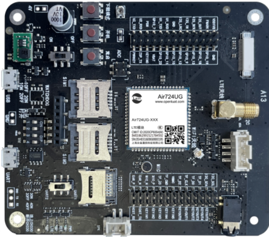
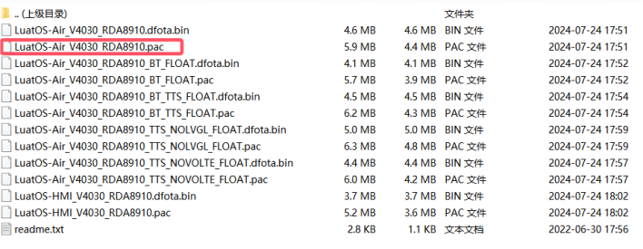

## 一、简介

FTP（File Transfer Protocol，文件传输协议） 是 TCP/IP 协议组中的协议之一。FTP 协议包括两个组成部分，其一为 FTP 服务器，其二为 FTP 客户端。其中 FTP 服务器用来存储文件，用户可以使用 FTP 客户端通过 FTP 协议访问位于 FTP 服务器上的资源。在开发网站的时候，通常利用 FTP 协议把网页或程序传到 Web 服务器上。此外，由于 FTP 传输效率非常高，在网络上传输大的文件时，一般也采用该协议。

默认情况下 FTP 协议使用 TCP 端口中的 20 和 21 这两个端口，其中 20 用于传输数据，21 用于传输控制信息。但是，是否使用 20 作为传输数据的端口与 FTP 使用的传输模式有关，如果采用主动模式，那么数据传输端口就是 20；如果采用被动模式，则具体最终使用哪个端口要服务器端和客户端协商决定。

## 二、演示功能概述

本教程教你如何使用开发板登录 FTP 服务器访问服务器资源。

功能定义：

1. 登录 FTP 服务器
2. 读取服务器上的文件资源
3. 在 FTP 服务器上创建目录

## 三、准备硬件环境

### 3.1 开发板准备

使用 EVB_Air724 开发板，如下图所示：



淘宝购买链接：<u>Air724UG-NFM 开发板淘宝购买链接</u>

此开发板的详细使用说明参考：[Air724UG 产品手册](https://docs.openluat.com/air724ug/product/) 中的 << EVB_Air724UG_AXX 开发板使用说明 >>，写这篇文章时最新版本的使用说明为：EVB_Air724UG_A14 开发板使用说明；开发板使用过程中遇到任何问题，可以直接参考这份使用说明文档。

api：[https://doc.openluat.com/wiki/21?wiki_page_id=2068](https://doc.openluat.com/wiki/21?wiki_page_id=2068)

### 3.2 数据通信线

USB 数据线一根（micro usb）。

### 3.3 PC 电脑

WINDOWS 系统，其他暂无特别要求

### 3.4 SIM 卡

中国大陆环境下，可以上网的 sim 卡,一般来说，使用移动，电信，联通的物联网卡或者手机卡都行；

### 3.5 组装硬件环境

usb 数据线插入 usb 口，另一端与电脑相连，拨码开关全部拨到 on，串口切换开关选择 UART1,USB 供电的 4V 对应开关拨至 ON 档，SIM 卡放到 SIM 卡槽中锁紧，如下图所示。


## 四、准备软件环境

### 4.1 下载调试工具

使用说明参考：[Luatools 下载和详细使用](https://docs.openluat.com/Luatools/)

### 4.2 源码及固件

1. 底层 core 下载

下载底层固件，并解压

链接：[https://docs.openluat.com/air724ug/luatos/firmware/](https://docs.openluat.com/air724ug/luatos/firmware/)

如下图所示，红框的是我们要使用到的



1. 本教程使用的 demo 见附件：
[右键点我,另存为,下载完整压缩文件包](file/ftp.zip){:target="_blank"}

### 4.3 下载固件和脚本到开发板中

打开 luatools，开发板上电开机，如开机成功 Luatools 会打印如下信息。


点击项目管理测试选项。


进入管理界面，如下图所示。


- 点击选择文件，选择底层固件，我的文件放在 D:\luatOS\Air724 路径中


- 点击增加脚本或资源文件，选择之前下载的程序源码，如下图所示。


- 点击下载底层和脚本，下载完成如下图所示。


### 4.4 FTP 服务器

本文测试用的服务器的地址，端口号，用户名，密码为 "121.43.224.154",21,"ftp_user","3QujbiMG"。

如果使用其他服务器请自行修改。

## 五、代码示例介绍

### 5.1 API 说明

ftp 的 API 在 LuatOS-Air lib 有做封装，建议直接用 lib 的 API 接口。

```lua
API接口        描述
ftp.close()        FTP客户端关闭
ftp.command()        FTP客户端命令
ftp.pasv_connect()        连接到PASV接口
ftp.login()        FTP客户端登录
ftp.upload()        FTP客户端文件上传
ftp.download()        FTP客户端文件下载
ftp.checktype()        设置FTP传输类型 A:ascii I:Binary
ftp.pwd()        显示当前工作目录
ftp.cwd()        更改工作目录
ftp.cdup()        回到上级目录
ftp.mkd()        创建目录
ftp.list()        列出目录列表或文件信息
ftp.deletefolder()        删除目录
ftp.deletefile()        删除文件
```

### 5.2 ftp_test.lua 代码

系统启动后演示 5 秒，登录 FTP 服务器，等待登录成功后，查看服务器信息、显示目录下文件、显示文件详细信息、显示工作目录、创建目录等操作。

下载 ftp 服务器的文件至 sd 卡目录，/1040K.jpg", "/sdcard0/1040K.jpg"

从 sd 卡目录上传文件至服务器，/sdcard0/ftp_lib_test_up.txt"

在 ftp_test.lua 这个文件中将登录中的地址，端口号，用户名，密码等必要信息修改为自己服务器的。

```lua
--- 模块功能：ftp功能测试
-- @module ftp_test
-- @author Dozingfiretruck
-- @license MIT
-- @copyright OpenLuat.com
-- @release 2020.12.08
require "ftp"
module(..., package.seeall)

-- 挂载SD卡
-- io.mount(io.SDCARD)

function ftp_thread()
    local r, n = ftp.login("PASV", "36.7.87.100", 21, "user", "123456") -- 登录
    log.info("ftp_login", r, n)
    if r ~= "200" then return end

    r, n = ftp.command("SYST") -- 查看服务器信息
    log.info("ftp_command SYST", r, n)
    if r == "426" or r == "503" then return end

    r, n = ftp.list("/") -- 显示目录下文件
    log.info("ftp_list /", r, n)
    if r == "503" or r == "502" or r == "426" then return end

    r, n = ftp.list("/ftp_lib_test_down.txt") -- 显示文件详细信息
    log.info("ftp_list /ftp_lib_test_down.txt", r, n)
    if r == "503" or r == "502" or r == "426" then return end

    r, n = ftp.pwd() -- 显示工作目录
    log.info("ftp_pwd", r, n)
    if r == "426" or r == "503" then return end

    r, n = ftp.mkd("/ftp_test") -- 创建目录
    log.info("ftp_mkd", r, n)
    if r == "426" or r == "503" then return end

    r, n = ftp.cwd("/ftp_test") -- 切换目录
    log.info("ftp_cwd", r, n)
    if r == "426" or r == "503" then return end

    r, n = ftp.pwd() -- 显示工作目录
    log.info("ftp_pwd", r, n)
    if r == "426" or r == "503" then return end

    r, n = ftp.cdup() -- 返回上级工作目录
    log.info("ftp_cdup", r, n)
    if r == "426" or r == "503" then return end

    r, n = ftp.pwd() -- 显示工作目录
    log.info("ftp_pwd", r, n)
    if r == "426" or r == "503" then return end

     r, n = ftp.download("/1040K.jpg", "/sdcard0/1040K.jpg") -- 下载ftp服务器的文件至sd卡目录
     log.info("ftp_download", r, n)
     if r ~= "200" then return end
     r, n = ftp.upload("/ftp_lib_test_up.txt","/sdcard0/ftp_lib_test_up.txt") -- 从sd卡目录上传文件至服务器
     log.info("ftp_download", r, n)
     if r ~= "200" then
         return
     end
    ftp.close()
end

sys.taskInit(ftp_thread)

-- 卸载SD卡
 io.unmount(io.SDCARD)
```

### 5.3 main.lua 代码

本代码为主程序脚本，系统启动后首先会对 4G 网络进行配置，然后加载 FTP 测试模块。

```lua
--必须在这个位置定义PROJECT和VERSION变量
--PROJECT：ascii string类型，可以随便定义，只要不使用,就行
--VERSION：ascii string类型，如果使用Luat物联云平台固件升级的功能，必须按照"X.X.X"定义，X表示1位数字；否则可随便定义
PROJECT = "FTP"
VERSION = "2.0.0"

--加载日志功能模块，并且设置日志输出等级
--如果关闭调用log模块接口输出的日志，等级设置为log.LOG_SILENT即可
require "log"
LOG_LEVEL = log.LOGLEVEL_TRACE
--[[
如果使用UART输出日志，打开这行注释的代码"--log.openTrace(true,1,115200)"即可，根据自己的需求修改此接口的参数
如果要彻底关闭脚本中的输出日志（包括调用log模块接口和Lua标准print接口输出的日志），执行log.openTrace(false,第二个参数跟调用openTrace接口打开日志的第二个参数相同)，例如：
1、没有调用过sys.opntrace配置日志输出端口或者最后一次是调用log.openTrace(true,nil,921600)配置日志输出端口，此时要关闭输出日志，直接调用log.openTrace(false)即可
2、最后一次是调用log.openTrace(true,1,115200)配置日志输出端口，此时要关闭输出日志，直接调用log.openTrace(false,1)即可
]]
--log.openTrace(true,1,115200)

require "sys"

require "net"
--每1分钟查询一次GSM信号强度
--每1分钟查询一次基站信息
net.startQueryAll(10000, 60000)

--此处关闭RNDIS网卡功能
--否则，模块通过USB连接电脑后，会在电脑的网络适配器中枚举一个RNDIS网卡，电脑默认使用此网卡上网，导致模块使用的sim卡流量流失
--如果项目中需要打开此功能，把ril.request("AT+RNDISCALL=0,1")修改为ril.request("AT+RNDISCALL=1,1")即可
--注意：core固件：V0030以及之后的版本、V3028以及之后的版本，才以稳定地支持此功能
ril.request("AT+RNDISCALL=0,1")

--加载控制台调试功能模块（此处代码配置的是uart1，波特率115200）
--此功能模块不是必须的，根据项目需求决定是否加载
--使用时注意：控制台使用的uart不要和其他功能使用的uart冲突
--使用说明参考demo/console下的《console功能使用说明.docx》
--require "console"
--console.setup(1, 115200)

--加载硬件看门狗功能模块
--根据自己的硬件配置决定：1、是否加载此功能模块；2、配置Luat模块复位单片机引脚和互相喂狗引脚
--合宙官方出售的Air201开发板上有硬件看门狗，所以使用官方Air201开发板时，必须加载此功能模块
--[[
require "wdt"
wdt.setup(pio.P0_30, pio.P0_31)
]]

--加载网络指示灯和LTE指示灯功能模块
--根据自己的项目需求和硬件配置决定：1、是否加载此功能模块；2、配置指示灯引脚
--合宙官方出售的Air720U开发板上的网络指示灯引脚为pio.P0_1，LTE指示灯引脚为pio.P0_4
require "netLed"
pmd.ldoset(2,pmd.LDO_VLCD)
netLed.setup(true,pio.P0_1,pio.P0_4)
--网络指示灯功能模块中，默认配置了各种工作状态下指示灯的闪烁规律，参考netLed.lua中ledBlinkTime配置的默认值
--如果默认值满足不了需求，此处调用netLed.updateBlinkTime去配置闪烁时长

--加载错误日志管理功能模块【强烈建议打开此功能】
--如下2行代码，只是简单的演示如何使用errDump功能，详情参考errDump的api
require "errDump"
errDump.request("udp://dev_msg1.openluat.com:12425", nil, true)

--加载远程升级功能模块【强烈建议打开此功能】
--如下3行代码，只是简单的演示如何使用update功能，详情参考update的api以及demo/update
--PRODUCT_KEY = "v32xEAKsGTIEQxtqgwCldp5aPlcnPs3K"
--require "update"
--update.request()

--加载NTP功能测试模块
-- 重要提醒！！！！！！
-- ntp功能模块采用多个免费公共的NTP服务器来同步时间
-- 并不能保证任何时间任何地点都能百分百同步到正确的时间
-- 所以，如果用户项目中的业务逻辑严格依赖于时间同步功能
-- 则不要使用使用本功能模块，建议使用自己的应用服务器来同步时间
--require "testNtp"
require"ntp"
ntp.timeSync(1)

--加载FTP功能测试模块
require"ftp_test"

--启动系统框架
sys.init(0, 0)
sys.run()
```

## 六、开机调试

### 6.1 开发板开机

连接好硬件并下载固件后，启动 Luatools 软件，系统运行信息将显示在界面中。红框中为开发板连接到 PC 机后正常打印的信息，如下图所示。


### 6.2  FTP 调试

1. FTP 登录服务器，并且获取信息。


1. 显示目录下的文件


1. 创建目录/ftp_test


1. 下载 ftp 服务器的文件

下载成功返回 200。

下载前 FTP 服务器的数据如下：


下载文件的打印日志信息：


1. 上传文件至服务器

上传成功返回 200。

上传成功后 FTP 服务器的数据如下：


上传文件打印日志信息：


## 七、常见问题

### 7.1 关于不支持主动模式：

模块 ftp 默认是被动模式，不支持主动模式，无法设置主动模式，公网下要想模块正常连接服务器，服务器肯定不能设置为主动模式，否则哪家模块都不能用。

### 7.2 发送带 0x0d 0x0a 这些数据会丢失

需要通过 ftp.checktype(“I”，0)设置为二进制方式传输文件，否则传输过程中会丢弃换行符。

## 给读者的话

> 本篇文章由`杨超`开发；
>
> 本篇文章描述的内容，如果有错误、细节缺失、细节不清晰或者其他任何问题，总之就是无法解决您遇到的问题；
>
> 请登录[合宙技术交流论坛](https://chat.openluat.com/)，点击[文档找错赢奖金-Air724UG-LuatOS-软件指南-网络驱动-FTP](https://chat.openluat.com/#/page/matter?125=1849698563383230466&126=%E6%96%87%E6%A1%A3%E6%89%BE%E9%94%99%E8%B5%A2%E5%A5%96%E9%87%91-Air724UG-LuatOS-%E8%BD%AF%E4%BB%B6%E6%8C%87%E5%8D%97-%E7%BD%91%E7%BB%9C%E9%A9%B1%E5%8A%A8-FTP&askid=1849698563383230466)；
>
> 用截图标注+文字描述的方式跟帖回复，记录清楚您发现的问题；
>
> 我们会迅速核实并且修改文档；
>
> 同时也会为您累计找错积分，您还可能赢取月度找错奖金！
