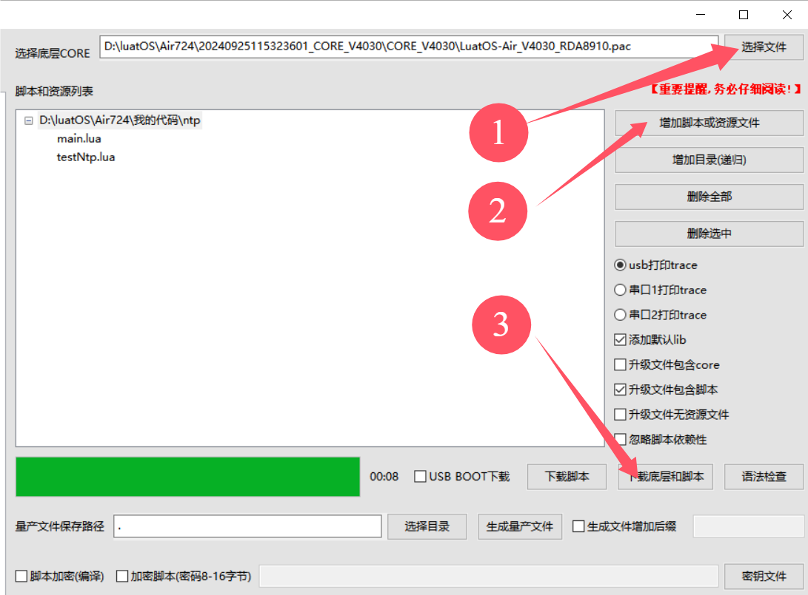

## 一、简介

网络时间协议，英文名称：Network Time Protocol（NTP）是用来使计算机[时间同步](https://baike.baidu.com/item/%E6%97%B6%E9%97%B4%E5%90%8C%E6%AD%A5/0?fromModule=lemma_inlink)化的一种协议，它可以使[计算机](https://baike.baidu.com/item/%E8%AE%A1%E7%AE%97%E6%9C%BA/140338?fromModule=lemma_inlink)对其[服务器](https://baike.baidu.com/item/%E6%9C%8D%E5%8A%A1%E5%99%A8/100571?fromModule=lemma_inlink)或[时钟源](https://baike.baidu.com/item/%E6%97%B6%E9%92%9F%E6%BA%90/3219811?fromModule=lemma_inlink)（如石英钟，GPS 等等)做同步化，它可以提供高精准度的时间校正（LAN 上与标准间差小于 1 毫秒，WAN 上几十毫秒），且可介由加密确认的方式来防止恶毒的[协议](https://baike.baidu.com/item/%E5%8D%8F%E8%AE%AE/670528?fromModule=lemma_inlink)攻击。NTP 的目的是在无序的 Internet 环境中提供精确和健壮的时间服务。

## 二、演示功能概述

本教程教你如何使用开发板功能模块采用多个免费公共的 NTP 服务器来同步时间并不能保证任何时间任何地点都能百分百同步到正确的时间所以，如果用户项目中的业务逻辑严格依赖于时间同步功能则不要使用使用本功能模块，建议使用自己的应用服务器来同步时间。

## 三、准备硬件环境

### 3.1 开发板准备

使用 EVB_Air724 开发板，如下图所示：


淘宝购买链接：<u>Air724UG-NFM 开发板淘宝购买链接</u>

此开发板的详细使用说明参考：[Air724UG 产品手册](https://docs.openluat.com/air724ug/product/) 中的 << EVB_Air724UG_AXX 开发板使用说明 >>，写这篇文章时最新版本的使用说明为：EVB_Air724UG_A14 开发板使用说明；开发板使用过程中遇到任何问题，可以直接参考这份使用说明文档。

api：[https://doc.openluat.com/wiki/21?wiki_page_id=2068](https://doc.openluat.com/wiki/21?wiki_page_id=2068)

### 3.2 数据通信线

USB 数据线一根（micro usb）。

### 3.3 PC 电脑

WINDOWS 系统，其他暂无特别要求

### 3.4 SIM 卡

中国大陆环境下，可以上网的 sim 卡,一般来说，使用移动，电信，联通的物联网卡或者手机卡都行；

### 3.5 组装硬件环境

usb 数据线插入 usb 口，另一端与电脑相连，拨码开关全部拨到 on，串口切换开关选择 UART1,USB 供电的 4V 对应开关拨至 ON 档，SIM 卡放到 SIM 卡槽中锁紧，如下图所示。


## 四、准备软件环境

### 4.1 下载调试工具

使用说明参考：[Luatools 下载和详细使用](https://docs.openluat.com/Luatools/)

### 4.2 源码及固件

1. 底层 core 下载

下载底层固件，并解压

链接：[https://docs.openluat.com/air724ug/luatos/firmware/](https://docs.openluat.com/air724ug/luatos/firmware/)

如下图所示，红框的是我们要使用到的


1. 本教程使用的 demo 见附件：

[右键点我,另存为,下载完整压缩文件包](file/ntp.zip){:target="_blank"}

### 4.3 下载固件和脚本到开发板中

打开 luatools，开发板上电开机，如开机成功 Luatools 会打印如下信息。


点击项目管理测试选项。


进入管理界面，如下图所示。



- 点击选择文件，选择底层固件，我的文件放在 D:\luatOS\Air724 路径中


- 点击增加脚本或资源文件，选择之前下载的程序源码，如下图所示。


- 点击下载底层和脚本，下载完成如下图所示。


## 五、代码示例介绍

### 5.1 API 说明

ntp.timeSync(period, fnc, fun)

ntp 同步时间任务.

重要提醒！！！！！！

本功能模块采用多个免费公共的 NTP 服务器来同步时间

并不能保证任何时间任何地点都能百分百同步到正确的时间

所以，如果用户项目中的业务逻辑严格依赖于时间同步功能

则不要使用使用本功能模块，建议使用自己的应用服务器来同步时间


例子

```lua
_-- 立即同步一次（仅同步这一次）：_
ntp.timeSync()
_-- 立即同步一次，之后每隔1小时自动同步一次：_
ntp.timeSync(1)
_-- 立即同步一次（仅同步这一次），同步结束后执行fnc(time,result)：_
ntp.timeSync(nil,fnc)
_-- 立即同步一次，之后每隔24小时自动同步一次，每次同步结束后执行fnc(time,result)：_
ntp.timeSync(24,fnc)
```

### 5.2 testNtp.lua 代码

调用 ntp.timeSync()接口同步时间。
`ntp.timeSync()#同步一次时间`

> 注意：本功能模块采用多个免费公共的 NTP 服务器来同步时间并不能保证任何时间任何地点都能百分百同步到正确的时间所以，如果用户项目中的业务逻辑严格依赖于时间同步功能则不要使用使用本功能模块，建议使用自己的应用服务器来同步时间

调用 misc.getClock()接口获取系统时间

```lua
local function prinTime()
    local tm = misc.getClock()
    log.info("testNtp.printTime", string.format("%04d/%02d/%02d,%02d:%02d:%02d", tm.year, tm.month, tm.day, tm.hour, tm.min, tm.sec))--打印时间
end
sys.timerLoopStart(prinTime,1000)--循环打印
```

```lua
--- 模块功能：NTP功能测试.
-- @author openLuat
-- @module ntp.testNtp
-- @license MIT
-- @copyright openLuat
-- @release 2018.03.28

module(...,package.seeall)

-- 重要提醒！！！！！！
-- ntp功能模块采用多个免费公共的NTP服务器来同步时间
-- 并不能保证任何时间任何地点都能百分百同步到正确的时间
-- 所以，如果用户项目中的业务逻辑严格依赖于时间同步功能
-- 则不要使用使用本功能模块，建议使用自己的应用服务器来同步时间
require"ntp"
require"misc"

local function prinTime()
    local tm = misc.getClock()
    log.info("testNtp.printTime", string.format("%04d/%02d/%02d,%02d:%02d:%02d", tm.year, tm.month, tm.day, tm.hour, tm.min, tm.sec))
end

sys.timerLoopStart(prinTime,1000)
ntp.timeSync()
```

### 5.3 main.lua 代码

本代码为主程序脚本，系统启动后首先会对 4G 网络进行配置，等待网络连接成功，然后加载 NTP 测试模块。

```lua
--必须在这个位置定义PROJECT和VERSION变量
--PROJECT：ascii string类型，可以随便定义，只要不使用,就行
--VERSION：ascii string类型，如果使用Luat物联云平台固件升级的功能，必须按照"X.X.X"定义，X表示1位数字；否则可随便定义
PROJECT = "NTP"
VERSION = "2.0.0"

--加载日志功能模块，并且设置日志输出等级
--如果关闭调用log模块接口输出的日志，等级设置为log.LOG_SILENT即可
require "log"
LOG_LEVEL = log.LOGLEVEL_TRACE
--[[
如果使用UART输出日志，打开这行注释的代码"--log.openTrace(true,1,115200)"即可，根据自己的需求修改此接口的参数
如果要彻底关闭脚本中的输出日志（包括调用log模块接口和Lua标准print接口输出的日志），执行log.openTrace(false,第二个参数跟调用openTrace接口打开日志的第二个参数相同)，例如：
1、没有调用过sys.opntrace配置日志输出端口或者最后一次是调用log.openTrace(true,nil,921600)配置日志输出端口，此时要关闭输出日志，直接调用log.openTrace(false)即可
2、最后一次是调用log.openTrace(true,1,115200)配置日志输出端口，此时要关闭输出日志，直接调用log.openTrace(false,1)即可
]]
--log.openTrace(true,1,115200)

require "sys"

require "net"
--每1分钟查询一次GSM信号强度
--每1分钟查询一次基站信息
net.startQueryAll(10000, 60000)

--此处关闭RNDIS网卡功能
--否则，模块通过USB连接电脑后，会在电脑的网络适配器中枚举一个RNDIS网卡，电脑默认使用此网卡上网，导致模块使用的sim卡流量流失
--如果项目中需要打开此功能，把ril.request("AT+RNDISCALL=0,1")修改为ril.request("AT+RNDISCALL=1,1")即可
--注意：core固件：V0030以及之后的版本、V3028以及之后的版本，才以稳定地支持此功能
ril.request("AT+RNDISCALL=0,1")

--加载控制台调试功能模块（此处代码配置的是uart1，波特率115200）
--此功能模块不是必须的，根据项目需求决定是否加载
--使用时注意：控制台使用的uart不要和其他功能使用的uart冲突
--使用说明参考demo/console下的《console功能使用说明.docx》
--require "console"
--console.setup(1, 115200)

--加载硬件看门狗功能模块
--根据自己的硬件配置决定：1、是否加载此功能模块；2、配置Luat模块复位单片机引脚和互相喂狗引脚
--合宙官方出售的Air201开发板上有硬件看门狗，所以使用官方Air201开发板时，必须加载此功能模块
--[[
require "wdt"
wdt.setup(pio.P0_30, pio.P0_31)
]]

--加载网络指示灯和LTE指示灯功能模块
--根据自己的项目需求和硬件配置决定：1、是否加载此功能模块；2、配置指示灯引脚
--合宙官方出售的Air720U开发板上的网络指示灯引脚为pio.P0_1，LTE指示灯引脚为pio.P0_4
require "netLed"
pmd.ldoset(2,pmd.LDO_VLCD)
netLed.setup(true,pio.P0_1,pio.P0_4)
--网络指示灯功能模块中，默认配置了各种工作状态下指示灯的闪烁规律，参考netLed.lua中ledBlinkTime配置的默认值
--如果默认值满足不了需求，此处调用netLed.updateBlinkTime去配置闪烁时长

--加载错误日志管理功能模块【强烈建议打开此功能】
--如下2行代码，只是简单的演示如何使用errDump功能，详情参考errDump的api
require "errDump"
errDump.request("udp://dev_msg1.openluat.com:12425", nil, true)

--加载远程升级功能模块【强烈建议打开此功能】
--如下3行代码，只是简单的演示如何使用update功能，详情参考update的api以及demo/update
--PRODUCT_KEY = "v32xEAKsGTIEQxtqgwCldp5aPlcnPs3K"
--require "update"
--update.request()

--加载NTP功能测试模块
-- 重要提醒！！！！！！
-- ntp功能模块采用多个免费公共的NTP服务器来同步时间
-- 并不能保证任何时间任何地点都能百分百同步到正确的时间
-- 所以，如果用户项目中的业务逻辑严格依赖于时间同步功能
-- 则不要使用使用本功能模块，建议使用自己的应用服务器来同步时间
--require "testNtp"
require"ntp"
ntp.timeSync(1)

--加载NTP功能测试模块
-- 重要提醒！！！！！！
-- ntp功能模块采用多个免费公共的NTP服务器来同步时间
-- 并不能保证任何时间任何地点都能百分百同步到正确的时间
-- 所以，如果用户项目中的业务逻辑严格依赖于时间同步功能
-- 则不要使用使用本功能模块，建议使用自己的应用服务器来同步时间
require "testNtp"

--启动系统框架
sys.init(0, 0)
sys.run()
```

## 六、开机调试

### 6.1 开发板开机

连接好硬件并下载固件后，启动 Luatools 软件，系统运行信息将显示在界面中。红框中为开发板连接到 PC 机后正常打印的信息，如下图所示。


### 6.2  NTP 调试

`开机启动后，ntp.timeSync()#同步一次时间`，然后每隔一秒调用 misc.getClock()接口获取系统时间。


## 七、常见问题

### 7.1 os.time()返回值，需不需要特别加载模块？

返回从 1970 年 1 月 1 日到指定日期的时间的秒数，无参数表示当前时间。不需要添加操作，直接可以获取。

os.date 这个 api 只支持 os.date(“*t”) 这样用，不能 os.date(‘%Y-%m-%d %H:%M:%S’) 这样用？

是的，不支持。可以按如下方式处理

```lua
local t = os.date("*t")
    log.info("printTime", string.format("%04d-%02d-%02d %02d:%02d:%02d", t.year,t.month,t.day,t.hour,t.min,t.sec))
```

### 7.2 ntp 同步时间后，这个 clock 精度高吗，需要多久同步一次

并不能保证任何时间任何地点都能百分百同步到正确的时间。 所以，如果用户项目中的业务逻辑严格依赖于时间同步功能 则不要使用本功能模块，建议使用自己的应用服务器来同步时间。

### 7.3 ntp.timeSync(24,fnc)时间同步说明

立即同步一次，之后每隔 24 小时自动同步一次，每次同步结束后执行 fnc(time,result)

### 7.4 ntp.timeSync() 请问这个函数是异步执行的还是执行完成之后，其后的代码才会执行？

获取时间是通过 sys.taskInit 创建一个时间任务来同步时间的，模块会随机尝试访问每一个 NTP 服务器，尝试 1 次，如果成功，如果不需循环同步时间，则退出当前线程，运行别的代码，否则同通过 sys.wait(period)挂起当前任务循环同步时间，运行别的代码，时间到之后重新运行当前任务。如果失败，通过 sys.wait(1000)挂起当前任务 1 秒，运行别的代码，1 秒时间到，在尝试访问下一个服务器，循环操作，直到同步时间成功，或服务器全部访问结束，之后按照成功之后的动作执行。

### 7.5 有个这个函数后 ntp.timeSync(1) 每次在程序中调用 os.time 也是实时时间了吗？

是的，只要时间同步成功了，就是实时时间了。

## 给读者的话

> 本篇文章由`杨超`开发；
>
> 本篇文章描述的内容，如果有错误、细节缺失、细节不清晰或者其他任何问题，总之就是无法解决您遇到的问题；
>
> 请登录[合宙技术交流论坛](https://chat.openluat.com/)，点击[文档找错赢奖金-Air724UG-LuatOS-软件指南-网络驱动-NTP](https://chat.openluat.com/#/page/matter?125=1849698817633550337&126=%E6%96%87%E6%A1%A3%E6%89%BE%E9%94%99%E8%B5%A2%E5%A5%96%E9%87%91-Air724UG-LuatOS-%E8%BD%AF%E4%BB%B6%E6%8C%87%E5%8D%97-%E7%BD%91%E7%BB%9C%E9%A9%B1%E5%8A%A8-NTP&askid=1849698817633550337)；
>
> 用截图标注+文字描述的方式跟帖回复，记录清楚您发现的问题；
>
> 我们会迅速核实并且修改文档；
>
> 同时也会为您累计找错积分，您还可能赢取月度找错奖金！
