## **一、TCP 概述**

TCP（Transmission Control Protocol，传输控制协议）是一种面向连接的、可靠的、基于字节流的传输层通信协议。它主要用于在不可靠的网络环境中提供稳定的数据传输服务，确保数据能够按照顺序、无错误地到达接收端。TCP 通过三次握手建立连接，使用滑动窗口进行流量控制，以及通过校验和、确认应答、超时重传等机制来保证数据的可靠性。它是互联网协议套件（TCP/IP 协议族）的核心组成部分，广泛应用于各种网络应用中。

### 工作原理：

### 1.1 连接建立：TCP 协议使用三次握手协议来建立连接。

- 客户端发送一个 SYN（同步序列编号）报文给服务端，并携带一个随机生成的初始序列号。
- 服务端收到 SYN 报文后，发送一个 SYN+ACK（同步序列编号 + 确认应答）报文给客户端，表示确认收到了客户端的 SYN 报文，并携带自己的初始序列号。
- 客户端收到服务端的 SYN+ACK 报文后，发送一个 ACK（确认应答）报文给服务端，表示确认收到了服务端的 SYN+ACK 报文。至此，TCP 连接建立完成。

### 1.2 数据传输：

在连接建立后，双方就可以开始传输数据了。TCP 协议会将应用层发送的数据分割成适当长度的报文段（通常受该计算机连接的网络的数据链路层的最大传输单元 MTU 的限制），并为每个报文段分配一个序号。接收端在收到报文段后，会按照序号进行排序，并发送确认应答（ACK）给发送端。如果发送端在合理的往返时延（RTT）内未收到确认应答，则会重传对应的报文段。

### 1.3 连接释放：TCP 协议使用四次挥手协议来终止连接。

- 客户端发送一个 FIN（结束）报文给服务端，表示自己想要关闭连接。
- 服务端收到 FIN 报文后，发送一个 ACK 报文给客户端，表示确认收到了客户端的 FIN 报文。此时，客户端到服务端的连接关闭，但服务端到客户端的连接仍然打开。
- 服务端在发送完所有剩余数据后，也发送一个 FIN 报文给客户端，表示自己也想要关闭连接。
- 客户端收到服务端的 FIN 报文后，发送一个 ACK 报文给服务端，表示确认收到了服务端的 FIN 报文。至此，TCP 连接完全关闭。

## 二、功能概述

这篇文章主要通过宝宝教学的方式，细述了 tcp、tcp 单项认证、tcp 双向认证如何搭配串口进行数据透传，以及描述各种工具的使用和演示示例。

## 三、准备硬件环境

### 3.1 Air724UG-NFM 开发板

使用 Air724UG-NFM 开发板，如下图所示：

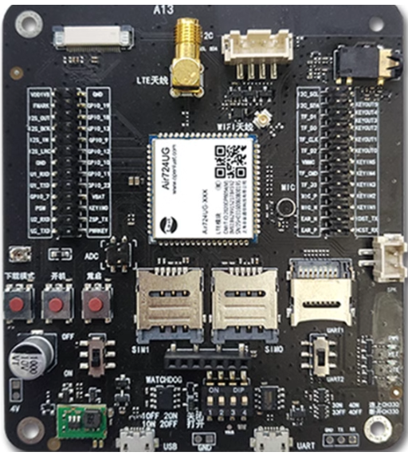

淘宝购买链接：[Air724UG-NFM 开发板淘宝购买链接](https://item.taobao.com/item.htm?id=614077856538&pisk=fliezCgRrHKeY5RClWrz399HDhZLAodXU0N7EYDudWVnNJZzE5kDpWTJJbuZZfUQtW9L4zcotzc7Nv6KWjMcADTLVgrL2uAXGntfpvE8qeHl-l1dI82vVwqutHtLvKdXGntPbFd0mIGI4pMNR8PgK8VuZdzgpJquK7VHQ52zH7jnZuYWol5WiUapixFiPWEh80XknSSlqDx88SyNPgSzbJ4EDvVaCRiaLyP05f0fODcsEDiLWHsL2Agqa4cD1wNnu-lal2RVYjlLEf2iOL_8Q4koDkUdegh4YbzmxPWl0xqnJlyimL_Y1cPIZDzMhiz7jma0xVT9OzZU3bmKTTSoigkVwRfI_03FZaz3BRPXQd8vULWW-_YfbaQ8SoeaGpwCyaU3BRPXQd7RyPVTQS9Qd&skuId=4862577940947&spm=a1z10.3-c-s.w4002-24045920836.10.292c6ee5wTkgXN) 。

### 3.2 SIM 卡

请准备一张可正常上网的 SIM 卡，该卡可以是物联网卡或您的个人手机卡。

**特别提醒：**

- 请确保 SIM 卡未欠费且网络功能正常，以便顺利进行后续操作。
- 物联网需要找卡商确认 apn 配置信息并进行配置，否则可能无法注网。
- 专网卡需要自备服务器或找卡商将服务器拉入白名单。

**注：部分卡无法使用需要进行 apn 配置：**

```lua
**require "ril"  --引入ril库**

-- AT+CGDCONT 设置apn参数，PDP 上下文定义
-- AT+CPNETAPN 专网卡设置 APN、用户名、密码和鉴权方式
-- 具体at指令请v查看at手册进行配置 
-- https://c.vue2.cn/attachment/20240522153259969_%E4%B8%8A%E6%B5%B7%E5%90%88%E5%AE%99Cat.1%E6%A8%A1%E7%BB%84(%E5%B1%95%E9%94%908910%E5%B9%B3%E5%8F%B0%E7%B3%BB%E5%88%97)AT%E5%91%BD%E4%BB%A4%E6%89%8B%E5%86%8CV1.1.3.pdf
**ril.request("AT指令")**
```

### 3.3 PC 电脑

请准备一台配备 USB 接口且能够正常上网的电脑。

### 3.4 数据通信线

请准备一根用于连接 Air724UG-NFM 开发板和 PC 电脑的数据线，该数据线将实现业务逻辑的控制与交互。您有两种选择：

- USB 数据线（其一端为 micro-B 接口（俗称老安卓口），用于连接 Air724UG-NFM 开发板）。通常，这种数据线的外观如下示意图所示：

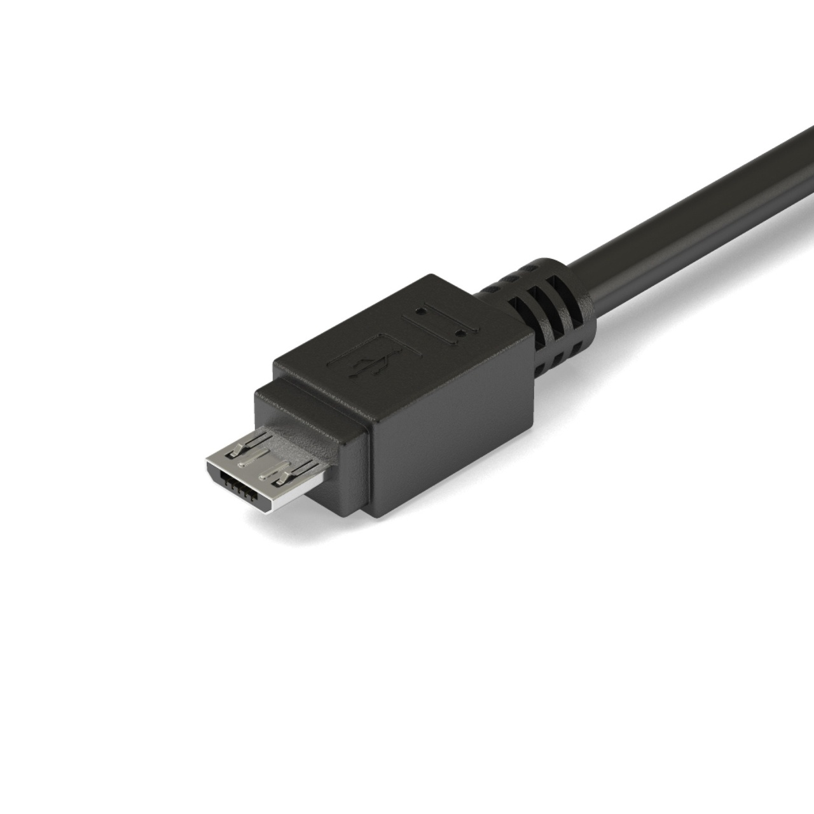

- 准备一块 TTL 串口板，这里采用了高速串口板其速率高达 12Mbps，建议购买一块备用，有需要时方便其对模块日志进行有效抓取：


[【淘宝】 MF3543 「USB 转 4 路串口 TTLRS232RS485 串口转 USB 模块 FT4232HL5V3.3V2.5V1.8」](http://e.tb.cn/h.gsUadIxohw3wc2D?tk=8zDi38lE5Qd)

在本教程中，我们将采用以下数据线配置进行测试和数据查看：

- 第一部：USB 数据线：此数据线不仅用于为测试板供电，还可用于查看抓取 lua 脚本上层和底层 core 日志。其一端为 micro-B 接口，连接 Air724UG-NFM 开发板；另一端为标准 USB 接口，连接 PC 电脑。
- 第二部：USB 转 TTL 串口板：主要用于 tcp 透传串口数据的查看和发送。

### 3.5 组装硬件环境

##### 组装准备：


##### 组装过程：

1 、请按照 SIM 卡槽上的指示方向正确插入 SIM 卡，务必确保插入方向正确，避免插反导致损坏！


2 、安装天线，保证其网络连接和传输质量。


3、将 usb 公口线，连接电脑和串口板并将串口板的 ch-1 使用杜邦线或者顺手在淘宝店铺买的组装线连接至串口 2，注意板子上的丝印！


4、 将 USB 数据线，连接电脑和 Air724UG-NFM 开发板。


5、将 usb 串口板连接至电脑：


##### 组装完成：


## 四、准备软件环境

### 4.1 安装设备驱动

跳转以下连接按照连接教程，并完成设备驱动的安装：[https://docs.openluat.com/usb_drv/](https://docs.openluat.com/usb_drv/)

### 4.2 Luatools 工具

使用说明参考：[Luatools 下载和详细使用](https://docs.openluat.com/Luatools/)

### 4.3 源码及固件

1. 添加底层固件，本次 demo 演示使用 core 版本为：[LuatOS-Air_V4028_RDA8910](https://docs.openluat.com/air724ug/luatos/firmware/)。
2. 添加脚本运行 lib，本次 demo 演示使用的为 [Luat_Lua_Air724U](https://gitee.com/openLuat/Luat_Lua_Air724U)[g](https://gitee.com/openLuat/Luat_Lua_Air724U) 仓库最新的 lib 版本。
3. 添加运行脚本，注：lua_run_script 下有两个目录，TCP_UART 目录是没有任何验证的，TCP_UNI_OR_BI_CONNECT 可以配置选择校验类型：单向认证或双向认证。

[点我,下载完整压缩文件包](file/724_tcp_uart.zip){:target="_blank"}

### 4.4 合宙 TCP/UDP web 测试工具

为了方便测试，合宙提供了免费的不可商用的 TCP/UDP web 测试工具：[合宙 TCP/UDP web 工具 (](https://netlab.luatos.com/)[luatos.com](https://netlab.luatos.com/)[)](https://netlab.luatos.com/)

详细使用说明参考：[合宙 TCP/UDP web 测试工具使用说明](https://docs.openluat.com/TCPUDP_Test/) 。

### 4.5 PC 端串口工具

串口调试工具推荐使用 SSCOM 工具。

工具使用说明：由于 docs 上还没有移植过来，此处链接先空着。

## 五、AIR724 硬件资料

- [产品资料](https://docs.openluat.com/air724ug/product/)
- [硬件手册](https://docs.openluat.com/air724ug/product/)

## 六、TCP 主要 API 介绍

### 6.1 SOCKET 是否有可用

```lua
--- SOCKET 是否有可用
-- @return 可用true,不可用false
socket.isReady()
```

### 6.2 创建基于 TCP 的 socket 对象

```lua
--- 创建基于TCP的socket对象
-- @bool[opt=nil] ssl 是否为ssl连接，true表示是，其余表示否
-- @table[opt=nil] cert ssl连接需要的证书配置，只有ssl参数为true时，此参数才有意义，cert格式如下：
-- {
--     caCert = "ca.crt", --CA证书文件(Base64编码 X.509格式)，如果存在此参数，则表示客户端会对服务器的证书进行校验；不存在则不校验
--     clientCert = "client.crt", --客户端证书文件(Base64编码 X.509格式)，服务器对客户端的证书进行校验时会用到此参数
--     clientKey = "client.key", --客户端私钥文件(Base64编码 X.509格式)
--     clientPassword = "123456", --客户端证书文件密码[可选]
-- }
-- @table[opt=nil] tCoreExtPara 建立链接扩展参数，4G链接和ch395链接所需扩展参数不一样
-- @bool[ipv6=nil] ipv6 是否为ipv6连接，true表示是，其余表示否
-- @return client，创建成功返回socket客户端对象；创建失败返回nil
socket.tcp(ssl, cert, tCoreExtPara)
```

### 6.3 设置 TCP 层自动重传的参数

```lua
-- @number[opt=4] retryCnt 重传次数；取值范围0到12
-- @number[opt=16] retryMaxTimeout 限制每次重传允许的最大超时时间(单位秒)，取值范围1到16
-- @return nil
setTcpResendPara(retryCnt, retryMaxTimeout)
```

### 6.4 设置域名解析参数

```lua
--- 设置域名解析参数
-- 注意：0027以及之后的core版本才支持此功能
-- @number[opt=4] retryCnt 重传次数；取值范围1到8
-- @number[opt=4] retryTimeoutMulti 重传超时时间倍数，取值范围1到5
--                第n次重传超时时间的计算方式为：第n次的重传超时基数*retryTimeoutMulti，单位为秒
--                重传超时基数表为{1, 1, 2, 4, 4, 4, 4, 4}
--                第1次重传超时时间为：1*retryTimeoutMulti 秒
--                第2次重传超时时间为：1*retryTimeoutMulti 秒
--                第3次重传超时时间为：2*retryTimeoutMulti 秒
--                ...........................................
--                第8次重传超时时间为：8*retryTimeoutMulti 秒
-- @return nil
-- @usage
socket.setDnsParsePara(8,5)
```

### 6.5 打印所有 socket 的状态

```lua
-- @return 无
printStatus()
```

**以上接口函数不做详细介绍，可通过此链接查看具体介绍：**[API 链接](https://doc.openluat.com/wiki/21?wiki_page_id=2294)

## 七、 TCP-UART 无校验实战演示

#### 7.1 创建 TCP 无加密的服务器

可根据 章节 4.4（合宙 TCP/UDP web 测试工具） 创建 tcp 无校验加密的 web 服务器：

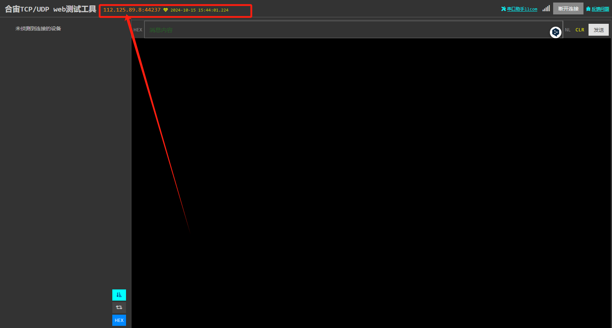

#### 7.2 修改脚本

选择创建好 tcp 无校验加密的服务，并记录一下服务器地址和端口来修改脚本中的服务器地址和端口，注意这个位置速度要快一点，否则创建的服务器端口可能会失效，失效也不要慌张，重新刷新创建一个即可：

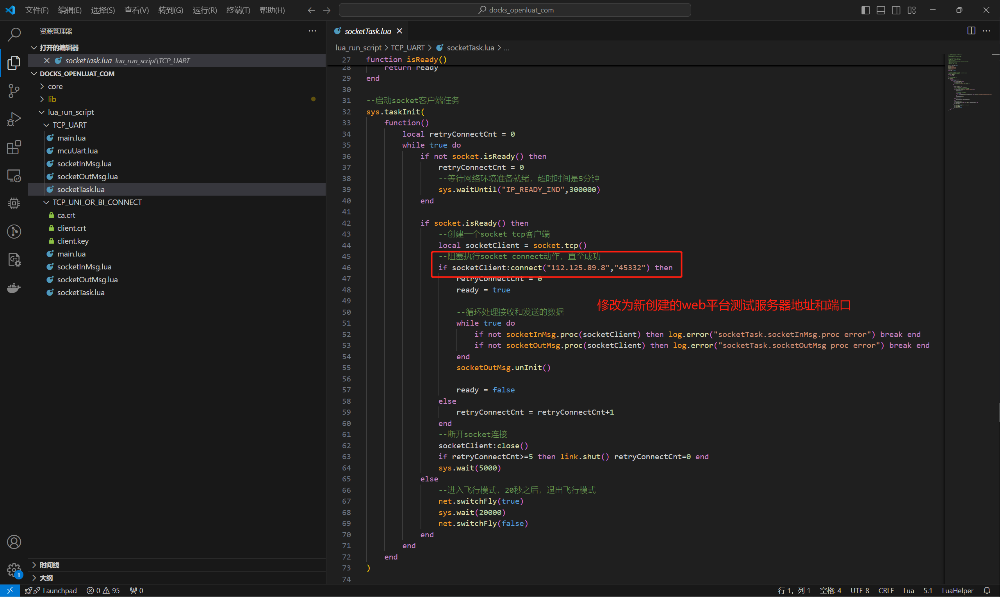

#### 7.3 luatools 下载

这里只进行了工程下载的概述，详细下载教程请查看章节 4.2 Luatools 工具讲解

1. 模块首先进行上电：
   

2. 模块上电后，右侧三种状态灯会根据程序状态进行闪烁：
   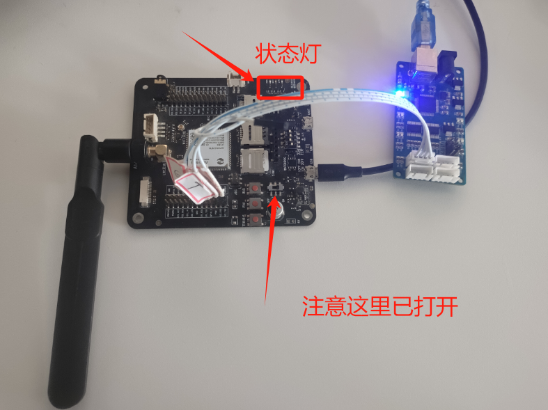

3. 创建项目并添加对应的工程脚本进行下载，这里选择了工程中的 lib 以及免 boot 下载固件和脚本：
   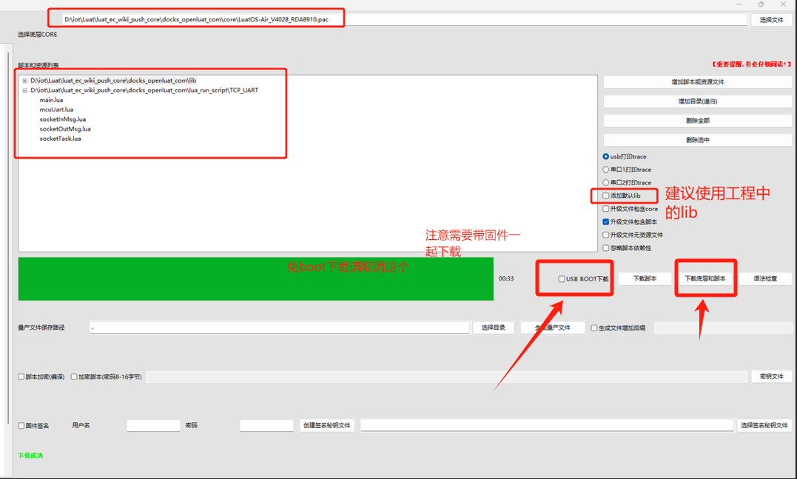

4. luatools 打印效果：
   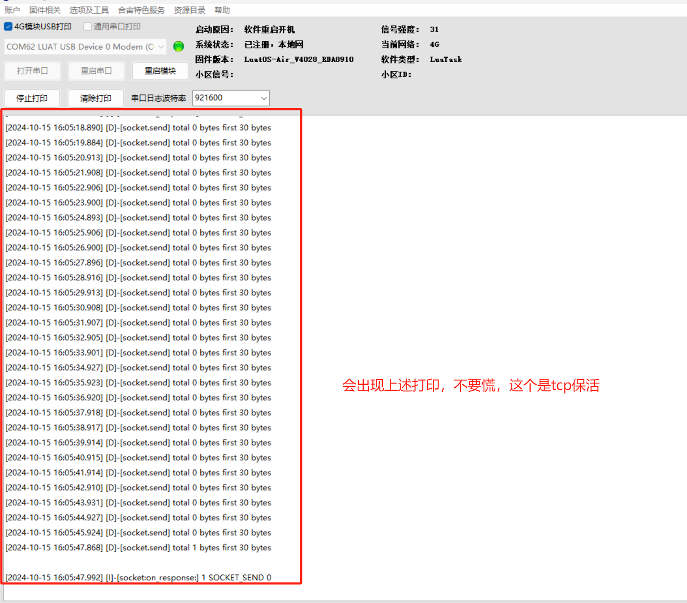


#### 7.4 sscom 串口工具发送数据

- 点击计算机右键，找到计算机管理，找到你连接的串口端口：

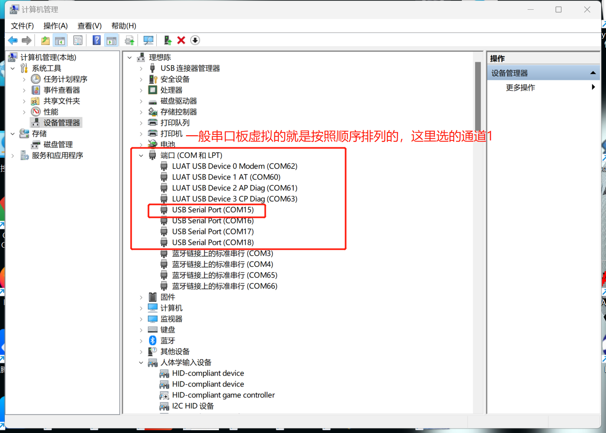

- 打开 sscom，发送数据：

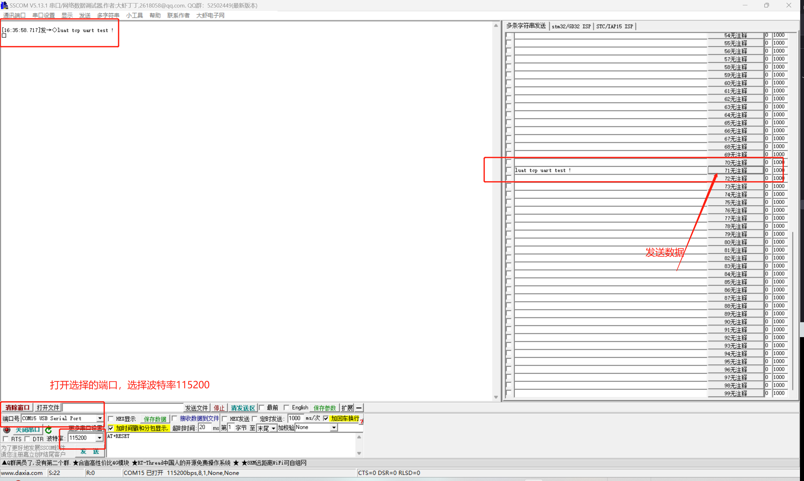

- 查看发送的数据：

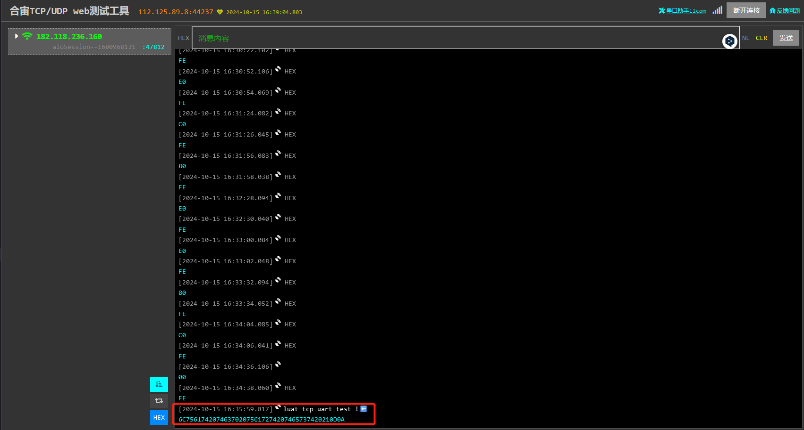

- 使用 web 平台发送

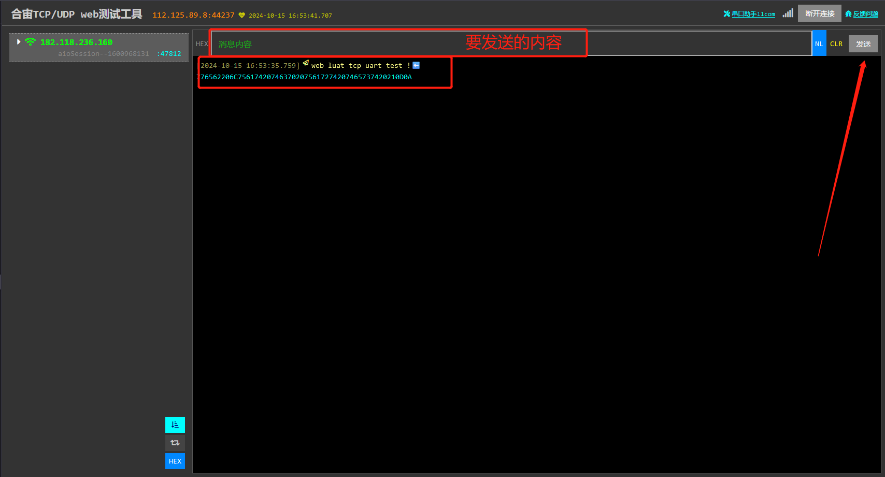

- sscom 串口读取

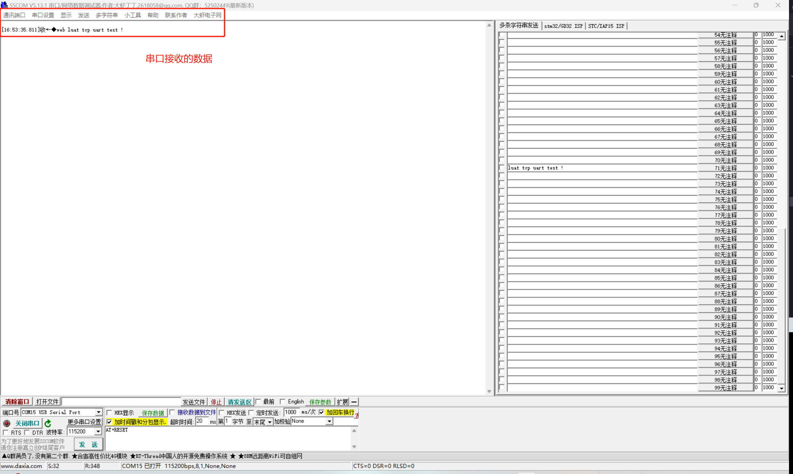

## 八、TCP_UART 有校验单双认证实战演示

#### 8.1  创建 TCP 无加密的服务器

可根据 章节 4.4（合宙 TCP/UDP web 测试工具） 创建 tcp 无校验加密的 web 服务器：

#### 8.2 修改脚本

选择创建好 tcp 有校验加密的服务，并记录一下服务器地址和端口来修改脚本中的服务器地址和端口，注意这个位置速度要快一点，否则创建的服务器端口可能会失效，失效也不要慌张，重新刷新创建一个即可：

#### 8.3 luatools 下载

这里只进行了工程下载的概述，详细下载教程请查看章节 4.2 Luatools 工具讲解

1. 模块首先进行上电：
   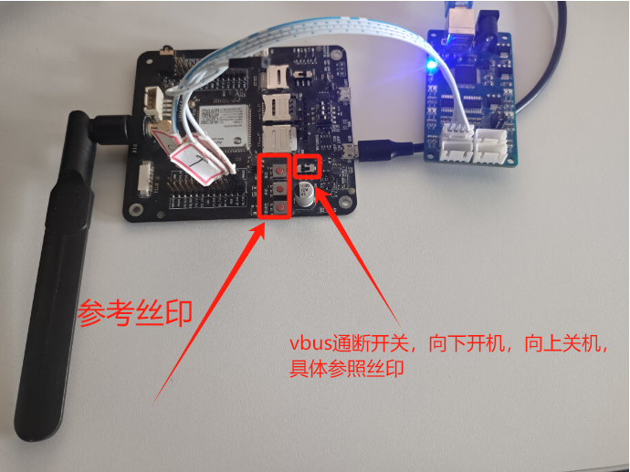

2. 模块上电后，右侧三种状态灯会根据程序状态进行闪烁：
   

3. 创建项目并添加对应的工程脚本进行下载，这里选择了工程中的 lib 以及免 boot 下载固件和脚本：
   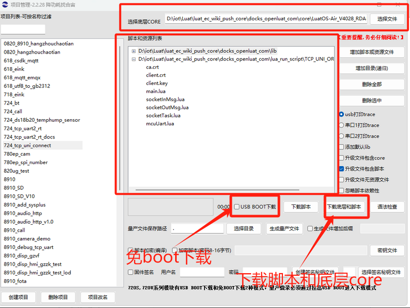

4. luatools 打印效果：
   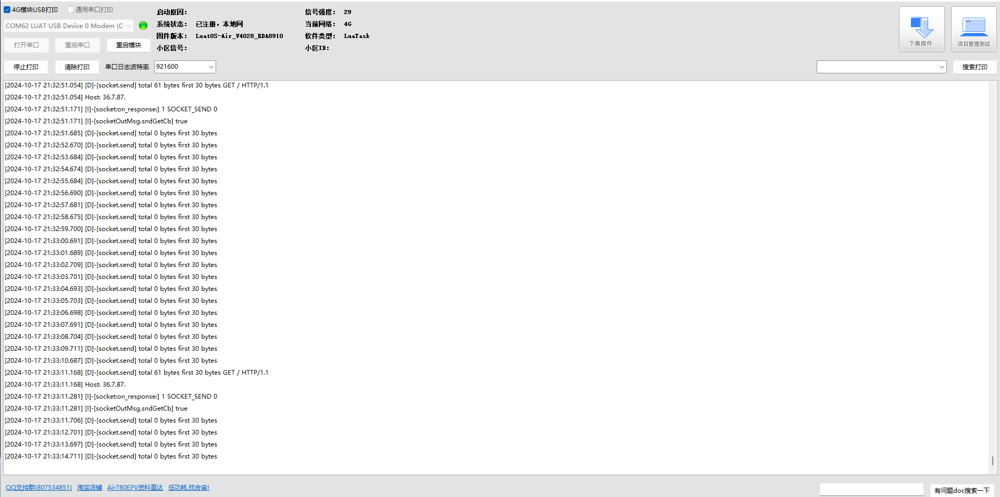

#### 8.4 sscom 串口工具发送数据

- 打开计算机右键，找到计算机管理，找到你连接的串口端口：
  
- 打开 sscom，发送数据：
  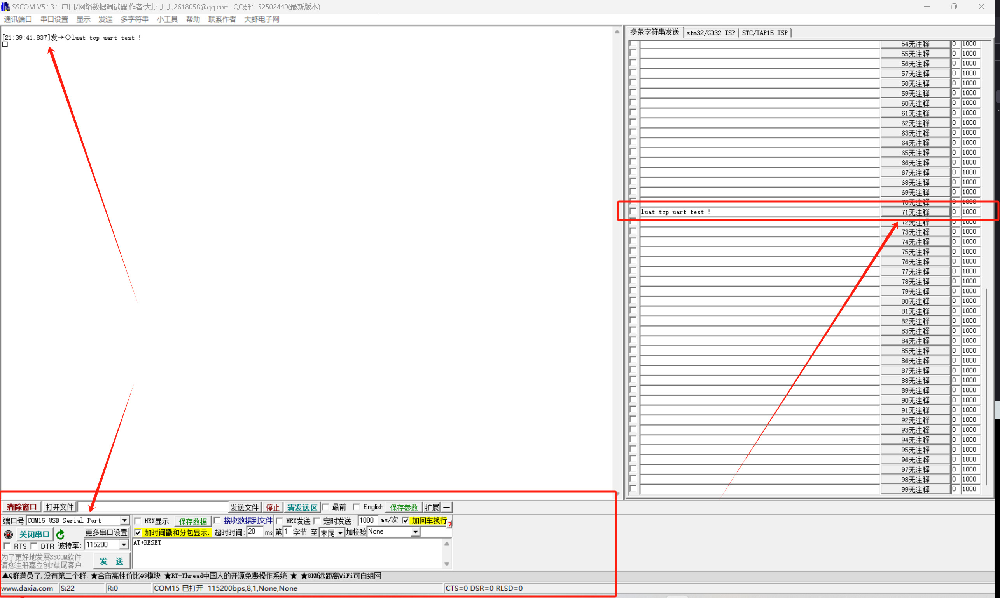
- 查看发送的数据：(注意脚本中穿插了一条消息，默认是发送的，可以选择注释掉)
  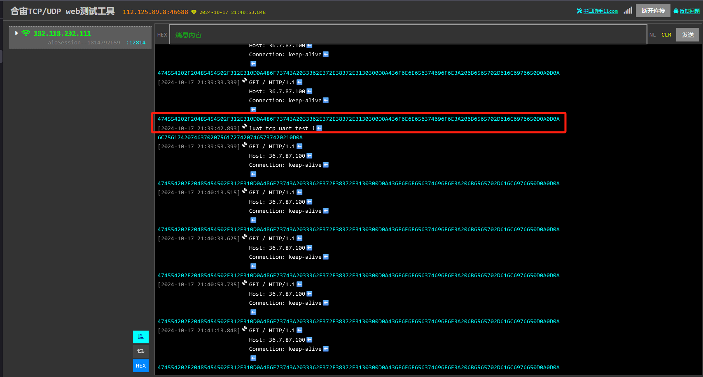
- 使用 web 平台发送
  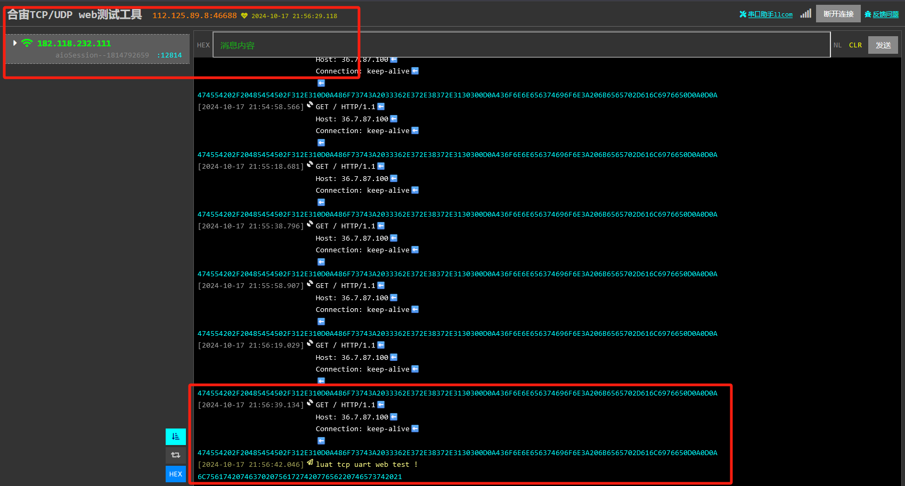
- sscom 串口读取
  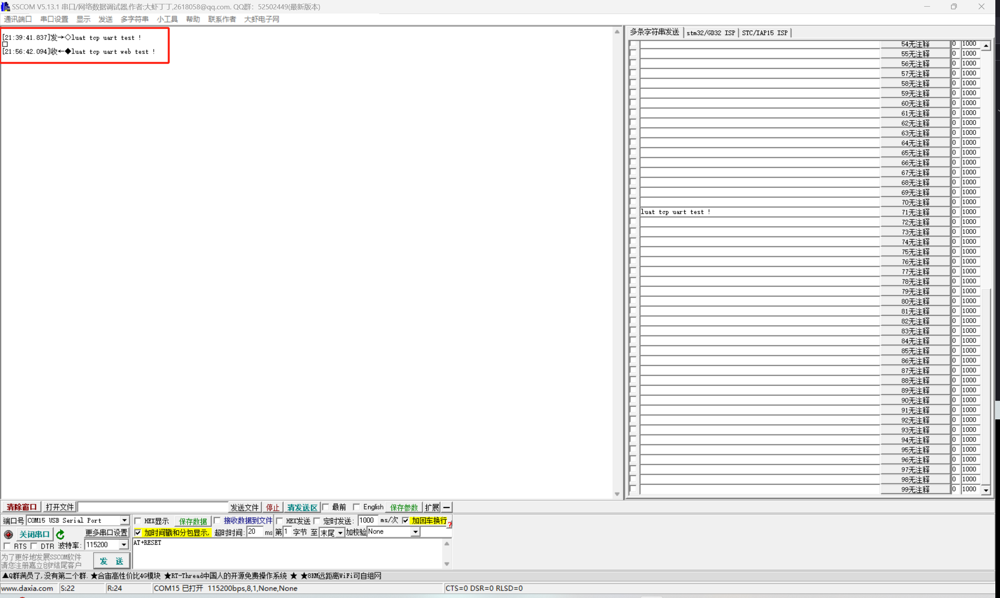

## 九、总结

这篇文章主要通过宝宝教学的方式，细述了 tcp 如何搭配串口进行数据透传，以及描述了一系列工具的使用和演示示例。

## 扩展

### TCP 单向认证

- 定义：单向认证是指在通信过程中，只有一方（通常是服务器）对另一方（通常是客户端）进行身份验证。
- 应用：在 TCP 连接中，单向认证常用于客户端向服务器发起请求时，服务器验证客户端的身份。
- 特点：实现简单，但安全性相对较低，因为只验证了一方的身份。

### TCP 双向认证

- 定义：双向认证是指通信双方都需要对对方进行身份验证，只有双方都通过对方的认证请求时，通信才会被允许。
- 应用：在需要高安全性的场景中，如金融服务、医疗信息传输等，TCP 双向认证被广泛应用。
- 特点：安全性高，但实现复杂，且可能带来一定的性能开销。

## 常见问题

sys.waitUntil("IP_READY_IND") -- 此条消息，是由底层默认注网流程成功后，发送此条消息，注意如果一直没有注网成功，需要检查 apn 配置啦。

## 给读者的话

> 本篇文章由 `dreamchen` 开发；
>
> 本篇文章描述的内容，如果有错误、细节缺失、细节不清晰或者其他任何问题，总之就是无法解决您遇到的问题；
>
> 请登录[合宙技术交流论坛](https://chat.openluat.com/)，点击[文档找错赢奖金-Air724UG-LuatOS-软件指南-网络驱动-TCP](https://chat.openluat.com/#/page/matter?125=1848965846047784961&126=%E6%96%87%E6%A1%A3%E6%89%BE%E9%94%99%E8%B5%A2%E5%A5%96%E9%87%91-Air724UG-LuatOS-%E8%BD%AF%E4%BB%B6%E6%8C%87%E5%8D%97-%E7%BD%91%E7%BB%9C%E9%A9%B1%E5%8A%A8-TCP&askid=1848965846047784961)；
>
> 用截图标注 + 文字描述的方式跟帖回复，记录清楚您发现的问题；
>
> 我们会迅速核实并且修改文档；
>
> 同时也会为您累计找错积分，您还可能赢取月度找错奖金！
