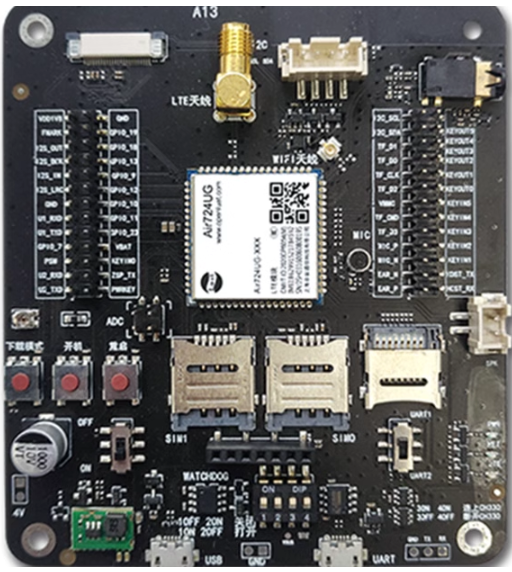
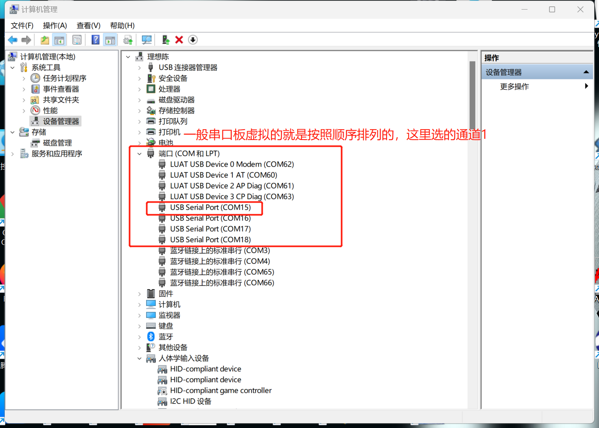

## **一、UDP 概述**

UDP（用户数据报协议，User Datagram Protocol）是一种无连接的、不可靠的传输层协议，主要用于实现网络中的快速通讯。以下是 UDP 通讯的主要特点：

### 1.1 无连接通讯：

UDP 在发送数据之前不需要建立连接，这大大减少了通讯的延迟。发送方只需将数据包封装成 UDP 报文，并附上目的地址和端口号，即可直接发送。

### 1.2 不可靠传输：

UDP 不保证数据包的顺序性、完整性和可靠性。数据包在传输过程中可能会丢失、重复或乱序到达。因此，UDP 通讯需要应用层自行处理这些问题，如实现错误检测、数据重传等机制。

### 1.3 面向报文：

UDP 以报文为单位进行数据传输，每个报文都是独立的。这种面向报文的特性使得 UDP 能够保持数据的完整性，并且便于进行错误检测和处理。

### 1.4 高效性：

UDP 的头部结构非常简单，只包含必要的字段，如源端口、目的端口、数据长度和校验和。这种简洁的头部设计使得 UDP 在处理数据包时更加高效，减少了网络延迟。

### 1.5 实时性：

UDP 通讯具有较快的传输速度，适用于对实时性要求较高的应用场景，如视频通话、在线游戏等。在这些场景中，即使数据包偶尔丢失或延迟，也不会对整体功能产生严重影响。

## 二、功能概述

这篇文章主要通过宝宝教学的方式，细述了 udp、以及描述各种工具的使用和演示示例。

## 三、准备硬件环境

### 3.1 Air724UG-NFM 开发板

使用 Air724UG-NFM 开发板，如下图所示：



淘宝购买链接：[Air724UG-NFM 开发板淘宝购买链接](https://item.taobao.com/item.htm?id=614077856538&pisk=fliezCgRrHKeY5RClWrz399HDhZLAodXU0N7EYDudWVnNJZzE5kDpWTJJbuZZfUQtW9L4zcotzc7Nv6KWjMcADTLVgrL2uAXGntfpvE8qeHl-l1dI82vVwqutHtLvKdXGntPbFd0mIGI4pMNR8PgK8VuZdzgpJquK7VHQ52zH7jnZuYWol5WiUapixFiPWEh80XknSSlqDx88SyNPgSzbJ4EDvVaCRiaLyP05f0fODcsEDiLWHsL2Agqa4cD1wNnu-lal2RVYjlLEf2iOL_8Q4koDkUdegh4YbzmxPWl0xqnJlyimL_Y1cPIZDzMhiz7jma0xVT9OzZU3bmKTTSoigkVwRfI_03FZaz3BRPXQd8vULWW-_YfbaQ8SoeaGpwCyaU3BRPXQd7RyPVTQS9Qd&skuId=4862577940947&spm=a1z10.3-c-s.w4002-24045920836.10.292c6ee5wTkgXN) 。

### 3.2 SIM 卡

请准备一张可正常上网的 SIM 卡，该卡可以是物联网卡或您的个人手机卡。

**特别提醒：**

- 请确保 SIM 卡未欠费且网络功能正常，以便顺利进行后续操作。
- 物联网需要找卡商确认 apn 配置信息并进行配置，否则可能无法注网。
- 专网卡需要自备服务器或找卡商将服务器拉入白名单。

**注：部分卡无法使用需要进行 apn 配置：**

```lua
require "ril"  --引入ril库

-- AT+CGDCONT 设置apn参数，PDP 上下文定义
-- AT+CPNETAPN 专网卡设置 APN、用户名、密码和鉴权方式
-- 具体at指令请v查看at手册进行配置 
-- https://docs.openluat.com/air724ug/at/firmware/
ril.request("AT指令")
```

### 3.3 PC 电脑

请准备一台配备 USB 接口且能够正常上网的电脑。

### 3.4 数据通信线

请准备一根用于连接 Air724UG-NFM 开发板和 PC 电脑的数据线，该数据线将实现业务逻辑的控制与交互。您有两种选择：

- USB 数据线（其一端为 micro-B 接口（俗称老安卓口），用于连接 Air724UG-NFM 开发板）。通常，这种数据线的外观如下示意图所示：


- 准备一块 TTL 串口板，这里采用了高速串口板其速率高达 12Mbps，建议购买一块备用，有需要时方便其对模块日志进行有效抓取：


[【淘宝】 MF3543 「USB 转 4 路串口 TTLRS232RS485 串口转 USB 模块 FT4232HL5V3.3V2.5V1.8」](http://e.tb.cn/h.gsUadIxohw3wc2D?tk=8zDi38lE5Qd)

在本教程中，我们将采用以下数据线配置进行测试和数据查看：

- 第一步：USB 数据线：此数据线不仅用于为测试板供电，还可用于查看抓取 lua 脚本上层和底层 core 日志。其一端为 micro-B 接口，连接 Air724UG-NFM 开发板；另一端为标准 USB 接口，连接 PC 电脑。
- 第二步：USB 转 TTL 串口板：主要用于 tcp 透传串口数据的查看和发送。

### 3.5 组装硬件环境

##### 组装准备：


##### 组装过程：

1 、请按照 SIM 卡槽上的指示方向正确插入 SIM 卡，务必确保插入方向正确，避免插反导致损坏！


2 、安装天线，保证其网络连接和传输质量。


3、将 usb 公口线，连接电脑和串口板并将串口板的 ch-1 使用杜邦线或着顺手在淘宝店铺买的组装线连接至串口 2，注意板子上的丝印！


4、 将 USB 数据线，连接电脑和 Air724UG-NFM 开发板。


5、将 usb 串口板连接至电脑：


##### 组装完成：


## 四、准备软件环境

### 4.1 安装设备驱动

跳转以下连接按照连接教程，并完成设备驱动的安装：[https://docs.openluat.com/usb_drv/](https://docs.openluat.com/usb_drv/)

### 4.2 Luatools 工具

使用说明参考：[Luatools 下载和详细使用](https://docs.openluat.com/Luatools/)

### 4.3 源码及固件

注：这里推荐使用第一种方式。

#### 4.3.1 选择打包好的工程文件：

1、下载解压
[点我,下载完整压缩文件包](file/724_udp_uart.7z){:target="_blank"}
选择打包好的 UDP 工程进行下载，下载后解压缩后按照 4.2 Luatools 工具添加工程、lib、脚本文件.


2、 目录结构

- 脚本运行 lib：请选择 lib 文件下的脚本文件。
- 底层固件：请选择 core 文件下的文件 LuatOS-Air_V4028_RDA8910。
- 运行脚本：请选择 lua_run_script 文件下的 udp-uart 文件下的脚本文件。


#### 4.3.2 自行选底层固件、lib：

点击浏览选择下载：[downlod-luatos-core-lib](https://docs.openluat.com/air724ug/luatos/firmware/)

根据上述链接打开下载界面，在下载界面中有对 Air724 相关的固件功能、固件下载、固件更细说明、固件历史版本下载、固件功能可自定义定制以及 lib 下载等说明。

1、底层固件

本 demo 中选择了历史版本中的标准版本 LuatOS-Air_V4028_RDA8910。


2、脚本运行 lib


3、运行脚本
[点我,下载完整压缩文件包](file/lua_run_script.7z){:target="_blank"}
解压压缩包 lua_run_script，添加运行脚本。

### 4.4 合宙 TCP/UDP web 测试工具

为了方便测试，合宙提供了免费的不可商用的 TCP/UDP web 测试工具：[合宙 TCP/UDP web 工具 (](https://netlab.luatos.com/)[luatos.com](https://netlab.luatos.com/)[)](https://netlab.luatos.com/)

详细使用说明参考：[合宙 TCP/UDP web 测试工具使用说明](https://docs.openluat.com/TCPUDP_Test/) 。

### 4.5 PC 端串口工具

串口调试工具推荐使用 SSCOM 工具。

工具使用说明：由于 docs 上还没有移植过来，此处链接先空着。

## 五、AIR724 硬件资料

- [产品资料](https://docs.openluat.com/air724ug/product/)
- [硬件手册](https://docs.openluat.com/air724ug/product/)

## 六、UDP 主要 API 介绍

### 6.1 SOCKET 是否可用

```lua
--- SOCKET 是否可用
-- @return 可用true,不可用false
socket.isReady()
```

### 6.2 创建基于 UDP 的 socket 对象

```lua
-- @bool[ipv6=nil] ipv6 是否为ipv6连接，true表示是，其余表示否
-- @return client，创建成功返回socket客户端对象；创建失败返回nil
-- @usage c = socket.udp()
socket.udp()
```

### 6.3 设置域名解析参数

```lua
--- 设置域名解析参数
-- 注意：0027以及之后的core版本才支持此功能
-- @number[opt=4] retryCnt 重传次数；取值范围1到8
-- @number[opt=4] retryTimeoutMulti 重传超时时间倍数，取值范围1到5
--                第n次重传超时时间的计算方式为：第n次的重传超时基数*retryTimeoutMulti，单位为秒
--                重传超时基数表为{1, 1, 2, 4, 4, 4, 4, 4}
--                第1次重传超时时间为：1*retryTimeoutMulti 秒
--                第2次重传超时时间为：1*retryTimeoutMulti 秒
--                第3次重传超时时间为：2*retryTimeoutMulti 秒
--                ...........................................
--                第8次重传超时时间为：8*retryTimeoutMulti 秒
-- @return nil
-- @usage
socket.setDnsParsePara(8,5)
```

### 6.4 打印所有 socket 的状态

```lua
-- @return 无
printStatus()
```

**以上接口函数不做详细介绍，可通过此链接查看具体介绍：**[API 链接](https://doc.openluat.com/wiki/21?wiki_page_id=2294)

## 七、 UDP-UART 无校验实战演示

#### 7.1 创建 udp 无加密的服务器

可根据 章节 4.4（合宙 TCP/UDP web 测试工具） 创建 udp 无校验加密的 web 服务器：


#### 7.2 修改脚本

选择创建好 udp 的 web 服务，并记录一下服务器地址和端口来修改脚本中的服务器地址和端口，注意这个位置速度要快一点，否则创建的服务器端口可能会失效，失效也不要慌张，重新刷新创建一个即可：


#### 7.3 luatools 下载

这里只进行了工程下载的概述，详细下载教程请查看章节 4.2 Luatools 工具讲解

1. 模块首先进行上电：


2. 模块上电后，右侧三种状态灯会根据程序状态进行闪烁：


3. 创建项目并添加对应的工程脚本进行下载，这里选择了工程中的 lib 以及免 boot 下载固件和脚本：


4. luatools 打印效果：


#### 7.4 sscom 串口工具发送数据

- 打开计算机右键，找到计算机管理，找到你连接的串口端口：



- 打开 sscom，发送数据，查看返回的数据，这里的数据设置了回显，所以服务器会回复一样的数据：


- 查看 web 端：


## 八、总结

这篇文章主要通过宝宝教学的方式，细述了 udp 如何搭配串口进行数据透传，以及描述了一系列工具的使用和演示示例。

## 扩展

### TCP 和 UDP

TCP（Transmission Control Protocol，传输控制协议）和 UDP（User Datagram Protocol，用户数据报协议）都是网络层之上的传输层协议，它们在网络通讯中扮演着重要的角色，但有着显著的区别。以下是 TCP 和 UDP 的简化对比：

#### 连接性：

- TCP：面向连接。在数据传输之前，需要先建立连接（三次握手），确保数据传输的可靠性。
- UDP：不保证数据的可靠性。数据包可能会丢失、重复或乱序到达。

#### 可靠性：

- TCP：提供可靠的传输服务。通过确认应答、超时重传、错误校验等机制，确保数据按顺序、无错误地传输。
- UDP：不保证数据的可靠性。数据包可能会丢失、重复或乱序到达。

#### 速度：

- TCP：由于需要建立连接和进行各种可靠性检查，TCP 的传输速度相对较慢。
- UDP：没有连接建立和可靠性检查的开销，UDP 的传输速度通常更快。

#### 应用场景：

- TCP：适用于需要可靠传输的应用场景，如网页浏览、文件传输等。
- UDP：适用于对实时性要求较高、但对数据可靠性要求不高的应用场景，如视频流、音频流、在线游戏等。

#### 流量控制：

- TCP：具有流量控制和拥塞控制机制，能够根据网络状况调整数据传输速率。
- UDP：没有流量控制和拥塞控制机制，数据发送速率完全取决于应用程序。

#### 头部开销：

- TCP：头部开销较大，包含源端口、目的端口、序列号、确认号、窗口大小等多个字段。
- UDP：头部开销较小，仅包含源端口、目的端口、长度和校验和等字段。

## 常见问题

sys.waitUntil("IP_READY_IND") -- 此条消息，是由底层默认注网流程成功后，发送此条消息，注意如果一直没有注网成功，需要检查 apn 配置啦。

## 给读者的话

> 本篇文章由 `dreamchen` 开发；
>
> 本篇文章描述的内容，如果有错误、细节缺失、细节不清晰或者其他任何问题，总之就是无法解决您遇到的问题；
>
> 请登录[合宙技术交流论坛](https://chat.openluat.com/)，点击[文档找错赢奖金-Air724UG-LuatOS-软件指南-网络驱动-UDP](https://chat.openluat.com/#/page/matter?125=1849698289914609666&126=%E6%96%87%E6%A1%A3%E6%89%BE%E9%94%99%E8%B5%A2%E5%A5%96%E9%87%91-Air724UG-LuatOS-%E8%BD%AF%E4%BB%B6%E6%8C%87%E5%8D%97-%E7%BD%91%E7%BB%9C%E9%A9%B1%E5%8A%A8-UDP&askid=1849698289914609666)；
>
> 用截图标注 + 文字描述的方式跟帖回复，记录清楚您发现的问题；
>
> 我们会迅速核实并且修改文档；
>
> 同时也会为您累计找错积分，您还可能赢取月度找错奖金！


