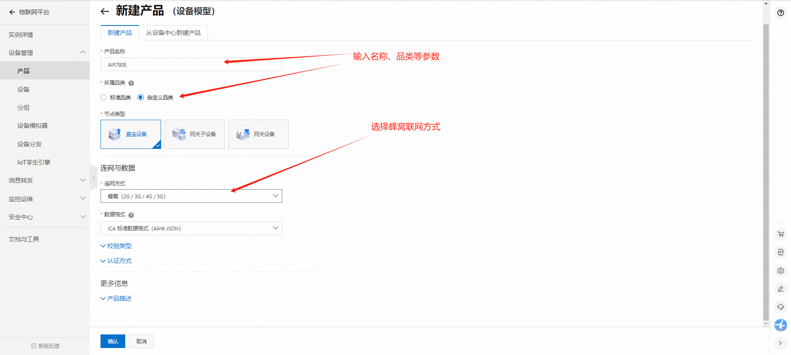

## 一、AT 命令概述

AT 命令是一种古老的使用方式，从有线通信就开始使用了。

距离到 2024 年的今天， 已经有超过 40 年的使用历史。

AT 命令的使用场景是，把 4G 模组当做一个黑盒配件，设备必须有一个主控 CPU。

设备的主控 CPU， 通过串口，（也可以是 SPI 或者 USB，但是 99% 的场景都是通过串口），发送一个 "AT"字符串开头的指令， 像 4G 模组请求各种服务。

4G 模组完成服务后， 回复一个字符串，向主控 CPU 做应答。

通过这样一系列的发送请求，应答的交互方式， 使设备具备了通信能力。

AT 命令发展到今天， 功能日趋完善。

厂家的 4G 模组的 AT 指令至少具备如下完善的功能：

1. 基本的网络查询指令 信号强度查询，运营商查询，SIM 卡状态查询，IMEI 查询，注册网络状态查询，等等；
2. 各种通信协议的支持 TCP/UDP 协议，HTTP 协议，FTP 协议，MQTT 协议，等等；
3. 模组内部资源的使用文件系统的存入，删除，查询，等等。

尽管 AT 使用起来很便利，但是 AT 指令方式依然有几个明显的缺点：

1. 运行效率低 只能是两个物理 CPU 通过串口这样的介质做异步通信， 沟通效率很低，如果要做高效的业务和通信的整合动作的话， 代价更大。
2. 需要一个额外的主控 CPU；
3. 对于复杂度不高的物联网设备，虽然 4G 模组本身的运算资源和存储资源已经过剩， 但是为了使用 AT 指令，依然需要一个额外的主控 CPU。
4. 为了节约成本，主控 CPU 往往会选择一个资源不太大的型号，通常无法运行高级语言， 所以往往要用 C 语言开发业务逻辑。
5. 这需要研发团队熟悉主控 CPU 的开发架构，仍然是一个不小的学习成本。
6. 而 4G 模组因为资源足够大， 大多数 4G 模组已经支持脚本开发应用了，
7. 所以省掉设备主控 CPU，直接用 4G 模组开发应用， 研发成本更低。

尽管 AT 指令有这些缺点， 但是由于 AT 指令有庞大的用户群， 基于使用的惯性， AT 指令在今天仍然有非常大的使用比例。

## 二、本教程实现的功能概述

阿里云常见的两种链接方式分为一机一密和一型一密，其中一型一密又可以分为预注册和免预注册。

他们的区别在于：

| **对比项**                                        | **一机一密**                               | **一型一密预注册**                                 | **一型一密预注册**                                      |
| ------------------------------------------------------ | ----------------------------------------------- | ------------------------------------------------------- | ------------------------------------------------------------ |
| 设备端烧录信息                                    | ProductKey、DeviceName、DeviceSecret       | ProductKey、ProductSecret                          | ProductKey、ProductSecret                               |
| 云端是否需要开启动态注册                          | 无需开启，默认支持。                       | 需打开动态注册开关。                               | 需打开动态注册开关。                                    |
| 是否需要提前在物联网平台创建设备，注册 DeviceName | 需要，产品下 DeviceName 唯一。             | 需要，产品下 DeviceName 唯一。                     | 不需要。                                                |
| 产线烧录要求                                 | 逐一烧录设备证书，需确保设备证书的安全性。 | 批量烧录相同的产品证书，需确保产品证书的安全存储。 | 批量烧录相同的产品证书，需确保产品证书的安全存储。 |
| 安全性                                            | 较高                                       | 一般                                               | 一般                                                    |

**本教程实现的功能定义是**：

1. 使用一机一密 AT 直连 MQTT；
2. 一型一密 AT 方式连接（预注册）；
3. 一型一密 AT 方式连接（免预注册）；

## 三、准备硬件环境

工欲善其事，必先利其器。在正式介绍本功能示例之前，需要先准备好以下硬件环境。

### 3.1 Air780E 开发板

使用 Air780E 核心板，如下图所示：


点击链接购买：[Air780E 核心板淘宝购买链接](https://item.taobao.com/item.htm?id=693774140934&pisk=f1eiwOqL25l1_HYiV6D1ize3wN5d5FMjRrpxkx3VT2uIHCCskWm4kysffAEqor4KRRIskGT0ooqi_coq7DWE000qbVr2mmzKQjNtkV3mnoalvaBRelZshA7RyTFdpD4xQco2_VS2Tcnvc89h5lZshq-pu_FUfEDVVdOmgrkET0ir3mkq_MDEmmM2QjJaY2uI0UGAoNueWRjiw4YTC-_opNr-zluaXleFpfR_X2fhTJVn94W--KJ4KcqQreCDEs3zNVh-DyWpIxqEmyc8savgoor7gX2D7GUzmW4jBJS2_4PTWjestFRZqA0iaRlwjdkIgW2nBR7XNkEn7bDL96_tMA4gN4GNOwa0xVU4IX8G4iReapZyhDSYLIOj_DinyhbSB2IHjbEhxMA51foIXaIhxItMPKJlyMjHNEGZAcQR.&spm=a1z10.5-c-s.w4002-24045920841.33.639f1fd1YrS4b6&skuId=5098266470883) ；

此核心板的详细使用说明参考：[Air780E 产品手册](https://docs.openluat.com/air780e/product/) 中的 << 开发板 Core_Air780E 使用说明 VX.X.X.pdf>>，写这篇文章时最新版本的使用说明为：[开发板 Core_Air780E 使用说明 V1.0.5.pdf](https://cdn.openluat-luatcommunity.openluat.com/attachment/20240419155721583_%E5%BC%80%E5%8F%91%E6%9D%BFCore_Air780E%E4%BD%BF%E7%94%A8%E8%AF%B4%E6%98%8EV1.0.5.pdf) ；核心板使用过程中遇到任何问题，可以直接参考这份使用说明 pdf 文档。

### 3.2 SIM 卡

准备一张可以上网的 SIM 卡，可以是物联网卡，也可以是自己的手机卡；

注意：SIM 卡不能欠费，可以正常上网！！！

### 3.3 PC 电脑

准备一台电脑；

注意：电脑有 USB 口，并且可以正常上网！！！

### 3.4 数据通信线

准备一根数据线，此数据线的作用是，连接 Air780E 开发板和 PC 电脑，通过 AT 命令完成业务逻辑的控制和交互；

有两种数据线可以使用，二选一即可；

第一种数据线是 USB 数据线（连接 Air780E 开板的一段是 Type-C 接口），一般来说这种数据线如下图所示：


普通的手机 USB 数据线一般都可以直接使用；

第二种数据线是 USB 转 TTL 串口线，一般来说这种数据线如下图所示：


在本教程中，使用的是第一种 USB 数据线。

### 3.5 组装硬件环境

按照 SIM 卡槽上的插入方向，插入 SIM 卡，注意不要插反！

如下图所示，将 SIM 卡用力推入卡槽，听到咔嚓声音后即可。


USB 数据线，连接电脑和 Air780E 开发板，如下图所示：


## 四、准备软件环境

工欲善其事，必先利其器。在正式介绍本功能示例之前，需要先准备好以下软件环境。

### 4.1 Luatools 工具

要想烧录 AT 固件到 4G 模组中，需要用到合宙的强大的调试工具：Luatools；

详细使用说明参考：[Luatools 工具使用说明](https://docs.openluat.com/Luatools/) 。

### 4.2 AT 固件

4G 模组中必须烧录正确的 AT 固件才能支持 AT 命令功能；

通过 Luatools 可以烧录 AT 固件；

有两种方式可以获取到 Air780E 模组的最新 AT 固件，二选一即可；

第一种方式是通过 Luatools 获取，如下图所示，可以直接选中最新版本的 AT 固件：


第二种方式是访问：[Air780E 固件版本](https://docs.openluat.com/air780e/at/firmware/) ，找到最新版本的固件即可。

### 4.3 PC 端串口工具

在量产的项目硬件设计中，一般都是由主控 MCU 通过 UART 给 4G 模组发送命令实现具体的业务逻辑；

在本教程中，为了测试方便，没有使用主控 MCU；

而是使用了 PC 电脑上的一个串口工具 LLCOM 给 4G 模组发送命令来实现演示功能；

LLCOM 的下载链接：[LLCOM](https://llcom.papapoi.com/index.html) ，详细使用说明可以直接参考下载网站。

## 五、使用方法举例

### 5.1 确认开发板正常开机并联网正常

本次教程所用固件版本是 v1169，通过 luatools 烧录过固件后可以通过打印来判断设备情况，具体参考下图：


### 5.2 连接阿里云所需相关指令

[点击链接查看合宙 4G 模组 MQTT 指令](https://docs.openluat.com/air780e/at/app/at_command/#mqtt)

### 5.3 阿里云操作

#### 5.3.1 产品操作

首先，打开阿里云找到物联网平台，开通业务后进入控制台。

点开设备管理的产品页面，点击新建产品。根据需求和图示说明创建产品。

[具体详细介绍见阿里云页面](https://help.aliyun.com/document_detail/73728.html?spm=a2c4g.11174283.6.571.3a8b1668Vmv5CZ)



#### 5.3.2 设备操作

创建产品完成后就可以进入设备页面添加设备，在对应产品页面进入设备管理，按照提示添加设备

（在做正式产品时建议使用 imei 为 devicename，方便后期维护）

[阿里云设备创建](https://help.aliyun.com/document_detail/73729.html?spm=a2c4g.11186623.6.573.55977b7bAjX04B)


### 5.4 一机一密 AT 直连 MQTT

#### 5.4.1 计算得到三元组

创建完毕后，点击 DeviceSecret 查看详情，一键复制设备证书


我们就可以得到设备证书信息

```sql
{
  "ProductKey": "k04xkOr6rWR",
  "DeviceName": "869861069996614",
  "DeviceSecret": "09ba0ef4c5bbb19a8398c0a2f8b15ac0"
}
```

接下来，打开阿里云自带的三元组计算工具[如何计算 MQTT 签名参数_物联网平台(IoT)-阿里云帮助中心](https://help.aliyun.com/zh/iot/user-guide/how-do-i-obtain-mqtt-parameters-for-authentication?spm=a2c4g.11186623.0.0.6e4c4c11lrnSVz#section-jx3-u57-pmm)


按要求解压完毕后，打开页面工具，将上面得到设备证书信息填入，method 选择 hmacmd5，即可得到三元组


MQTT 接入 Url 和 Port 可以在如下位置获取


#### 5.4.2 直接获取三元组

我们还可以通过点击设备管理-设备-设备详情界面，直接查看这台设备的 MQTT 连接参数


在这里我们可以得到设备的 clientId、username、passwd、mqttHostUrl 和 port 信息

#### 5.4.3 连接阿里云

接下来就可以打开 llcom，开始进行连接

```sql
→  AT+CGREG?  //查询当前GPRS注册状态
←  +CGREG: 0,1 //<n>=0，表示禁用URC上报,<stat>=1，标识已经注册GPRS网络，而且是本地网
←  OK


→  AT+CGATT?  //查看当前GPRS附着状态
←  +CGATT: 1  //<state>=1，标明当前GPRS已经附着
←  OK


//输入上方获取的"clientId"，"username"，"passwd"、最好用双引号括住，其中不要有空格，换行符
→  AT+MCONFIG="k04xkOr6rWR.869861069996614|securemode=2,signmethod=hmacsha256,timestamp=1728988266914|","869861069996614&k04xkOr6rWR","8b698e8b90eeee66ea733e8082d9061f6c5a04e45095e0bcbcde841304337ce3"
←  OK


//输入上方获取的"mqttHostUrl","port"
→  AT+MIPSTART="iot-06z00fu5vlxsx8b.mqtt.iothub.aliyuncs.com","1883"
←  OK
←  CONNECT OK


→  AT+MCONNECT=1,60  //建立mqtt会话
←  OK                //注： 在MIPSTART返回 CONNECT OK后才能发MCONNECT命令，
                     //而且要立即发，否则会被服务器踢掉。
←  CONNACK OK        //收到CONNACK OK后才能发布消息
```

输入完毕后，我们可以看到已经成功连接上阿里云了


### 5.5 一型一密 AT 方式连接（预注册）

一型一密（预注册）需要产品的 ProductKey、ProductSecret 和 DeviceName

#### 5.5.1 在阿里云打开动态注册开关


#### 5.5.2 计算三元组

点击查看 ProductSecret，获取产品证书


```sql
{
"ProductSecret"："spiACsLREgY0sLoC"
"ProductKey"："k04xkOr6rWR"
}
```

参考[使用 TLS 加密设备和物联网平台的 MQTT 通信_物联网平台(IoT)-阿里云帮助中心](https://help.aliyun.com/zh/iot/user-guide/establish-mqtt-connections-over-tcp#section-4cb-emx-i4f)计算出三元组


#### 5.5.3 连接阿里云

接下来步骤就跟 5.4.3 一致打开 llcom，开始进行连接，只不过需要把连接参数配置成一型一密的三元组

```sql
→  AT+CGREG?  //查询当前GPRS注册状态
←  +CGREG: 0,1 //<n>=0，表示禁用URC上报,<stat>=1，标识已经注册GPRS网络，而且是本地网
←  OK


→  AT+CGATT?  //查看当前GPRS附着状态
←  +CGATT: 1  //<state>=1，标明当前GPRS已经附着
←  OK


//输入上方获取的"clientId"，"username"，"passwd"、最好用双引号括住，其中不要有空格，换行符
→  AT+MCONFIG="869861069996614|securemode=2,signmethod=hmacsha256,timestamp=1729134662463|","869861069996614&k04xkOr6rWR","D90E4A4927E154099C68D23A54AC1418"
←  OK


//输入上方获取的"mqttHostUrl","port"
→  AT+MIPSTART="iot-06z00fu5vlxsx8b.mqtt.iothub.aliyuncs.com","1883"
←  OK
←  CONNECT OK


→  AT+MCONNECT=1,60  //建立mqtt会话
←  OK                //注： 在MIPSTART返回 CONNECT OK后才能发MCONNECT命令，
                     //而且要立即发，否则会被服务器踢掉。
←  CONNACK OK        //收到CONNACK OK后才能发布消息
```

输入完毕后，我们可以看到设备也成功连接上阿里云了


### 5.6 一型一密 AT 方式连接（免预注册）

一型一密（免预注册）相比与预注册，只需要产品的 ProductKey、ProductSecret 即可

#### 5.6.1 在阿里云打开动态注册开关


#### 5.6.2 计算三元组

点击查看 ProductSecret，获取产品证书


```sql
{
"ProductSecret"："spiACsLREgY0sLoC"
"ProductKey"："k04xkOr6rWR"
}
```

参考[使用 TLS 加密设备和物联网平台的 MQTT 通信_物联网平台(IoT)-阿里云帮助中心](https://help.aliyun.com/zh/iot/user-guide/establish-mqtt-connections-over-tcp#section-4cb-emx-i4f)计算出三元组


#### 5.6.3 连接阿里云

接下来步骤就跟 5.5.3 一致打开 llcom，输入算出来的三元组，输入完毕后，我们可以看到设备成功连接上阿里云


### 5.7 订阅与发布消息

#### 5.7.1 订阅消息

按照以下步骤，选取一个具有订阅权限的 topic，其中 ${deviceName}要替换为自己真实的设备名称


然后在 llcom 输入指令订阅消息

```sql
//订阅发布的前提是确保已经连接上阿里云服务器
→ AT+MSUB="/k04xkOr6rWR/869861069996614/user/get",0 //订阅阿里云topic
← AT+MSUB="/k04xkOr6rWR/869861069996614/user/get",0

← OK

← SUBACK  //订阅成功
```

然后返回阿里云平台-设备界面，就可以看到已订阅的 Topic，可以在这里发布消息


得到结果


#### 5.7.8 发布消息

在产品-Topic 类列表-自定义 Topic 中选取一个具有发布权限的 Topic，其中 ${deviceName}也要替换为自己真实的设备名称


然后在 llcom 输入指令发布消息

```sql
//订阅发布的前提是确保已经连接上阿里云服务器
→ AT+MPUB="/k04xkOr6rWR/869861069996614/user/update",0,0,"SSSSddddd"
← AT+MPUB="/k04xkOr6rWR/869861069996614/user/update",0,0,"SSSSddddd"

← OK
```

发布的日志可以在下面的位置查看


可以看到内容


## 六、总结

本教程简单演示了设备上云，以及设备和云平台在线模拟设备工具的简单通信，通过以上步骤，您可以成功连接阿里云，并开始使用其提供的各种云服务和解决方案。希望本教程总结对您有所帮助，祝您在阿里云的使用过程中取得更好的成果！

## 七、常见问题

### 7.1 **780E 支持的 MQTT 版本**

```
MQTT3.1.1
```

### 7.2 **连接服务器失败**

```
1、检查下模块信号、网络注册、网络附着、PDP激活状态。

2、检查下SIM卡是否欠费【4G模块有一种欠费表现：无法注册4G网络，可以注册2G网络】。

3、使用mqtt.fx，连接服务器确认一下是否可以连接成功，排除服务器故障。

4、部分国外的开源项目提供免费的MQTT代理服务器，因为网络的原因，国内存在严重的延迟或者丢包现象，导致程序运行出现问题。

5、确认是不是域名解析失败导致，可以通过AT+CDNSGIP=<domain name>确认一下域名是否能正常解析（注意：该命令只有在执行完at+cstt、at+ciicr、at+cifsr后才能正常工作），不能正常解析，可以通过AT+CDNSCFG=ip1,ip2设置域名解析服务器。

6、在 MIPSTART /SSLMIPSTART返 回 CONNECT OK后 才 能 发 MCONNECT命令，而且要立即发，否则会被服务器踢掉。
```

### 7.3 **频繁掉线是什么原因**

```
1、检查下是否存在代码逻辑错误，导致异常。

2、检查下是否不断重启，导致异常。

3、检查下服务器网络是否稳定，不要用内网穿透方式搭建服务器。

4、检查下使用环境是否网络覆盖不好，例如车库、地下、电梯、山区等。

5、检查下模块信号、网络注册、网络附着、PDP激活状态。

6、排查是否为设备天线问题：发出来设备的天线调试指标参数给合宙技术支持人员；曾经有一个客户天线指标明显有问题，导致10几个小时出现30次左右掉线；后来重新调试天线之后，40个小时出现几次掉线。

7、如果经常出现连接被动断开：
  1) 检查下mqtt keep alive的时间，一般建议使用2分钟【如果每2分钟内都有应用数据收发，则可以把mqtt keep alive的时间设置的长一点儿】，除非有强制要求，否则不能太长，也不能太短。不建议超过4分钟，基站策略会关闭长时间没有数据传输的连接，太长时间可能会导致连接被基站关闭；不建议少于1分钟，太短时间可能会因为网络环境波动导致上行数据发送超时，可能超过1.5倍的心跳时间，从而被服务器主动断开连接。

  2) 检查下是否在1.5倍的mqtt keep alive的时间，没有成功发送数据到服务器，就会被被服务器主动断开，这种情况一般都是发送数据超时引起的。

8、如果要降低掉线率，可通过如下方式设置【注意：在网络环境不变的情况下，降低掉线率意味着会增加响应延时】
A. mqtt keep alive的时间，一般建议使用2分钟【如果每2分钟内都有应用数据收发，则可以把mqtt keep alive的时间设置的长一点儿】，除非有强制要求，否则不能太长，也不能太短。不建议超过4分钟，基站策略会关闭长时间没有数据传输的连接，太长时间可能会导致连接被基站关闭；不建议少于1分钟，太短时间可能会因为网络环境波动导致上行数据发送超时，可能超过1.5倍的心跳时间，从而被服务器主动断开连接。

B. 减少Qos1和Qos2的publish使用，允许的话建议都使用Qos0。
```

## 给读者的话

> 本篇文章由`王文中`开发；
>
> 本篇文章描述的内容，如果有错误、细节缺失、细节不清晰或者其他任何问题，总之就是无法解决您遇到的问题；
>
> 请登录[合宙技术交流论坛](https://chat.openluat.com/)，点击
[文档找错赢奖金-Air780E-AT-软件指南-应用实例-阿里云](https://chat.openluat.com/#/page/matter?125=1847252397211123714&126=%E6%96%87%E6%A1%A3%E6%89%BE%E9%94%99%E8%B5%A2%E5%A5%96%E9%87%91-Air780E-AT-%E8%BD%AF%E4%BB%B6%E6%8C%87%E5%8D%97-%E5%BA%94%E7%94%A8%E5%AE%9E%E4%BE%8B-%E9%98%BF%E9%87%8C%E4%BA%91&askid=1847252397211123714)；
>
> 用截图标注+文字描述的方式跟帖回复，记录清楚您发现的问题；
>
> 我们会迅速核实并且修改文档；
>
> 同时也会为您累计找错积分，您还可能赢取月度找错奖金！
