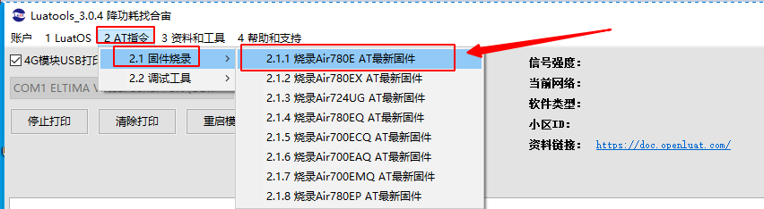
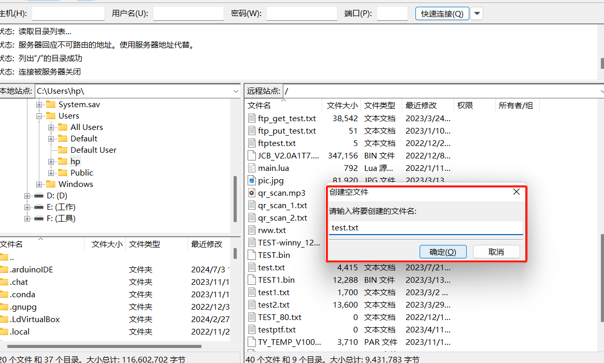
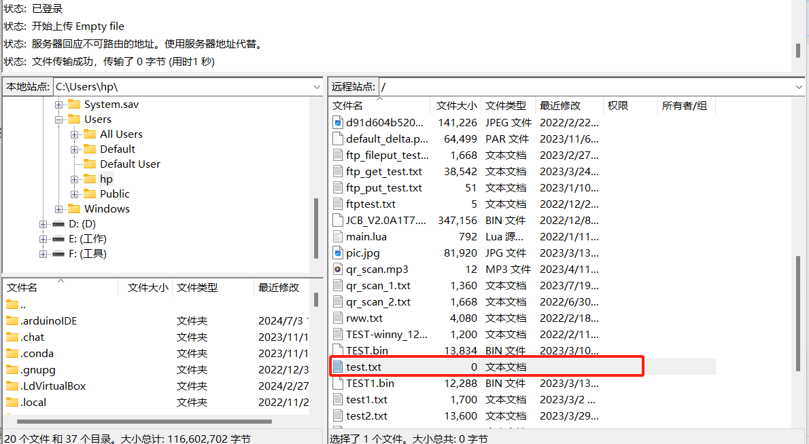
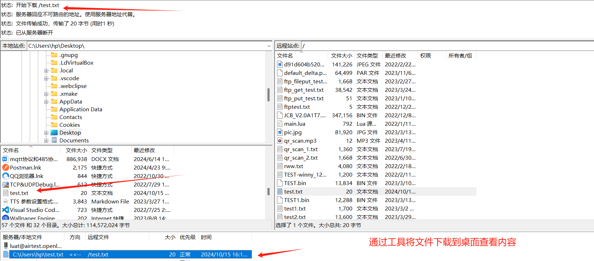
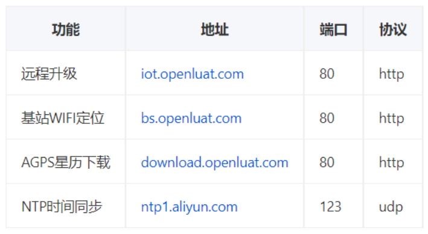

## 一 FTP 协议简介

FTP（File Transfer Protocol，文件传输协议） 是 TCP/IP 协议组中的协议之一。FTP 协议包括两个组成部分，其一为 FTP 服务器，其二为 FTP 客户端。其中 FTP 服务器用来存储文件，用户可以使用 FTP 客户端通过 FTP 协议访问位于 FTP 服务器上的资源。在开发网站的时候，通常利用 FTP 协议把网页或程序传到 Web 服务器上。此外，由于 FTP 传输效率非常高，在网络上传输大的文件时，一般也采用该协议。

默认情况下 FTP 协议使用 TCP 端口中的 20 和 21 这两个端口，其中 20 用于传输数据，21 用于传输控制信息。但是，是否使用 20 作为传输数据的端口与 FTP 使用的传输模式有关，如果采用主动模式，那么数据传输端口就是 20；如果采用被动模式，则具体最终使用哪个端口要服务器端和客户端协商决定。模块 ftp 默认是被动模式，不支持主动模式，无法设置主动模式，公网下要想模块正常连接服务器，服务器肯定不能设置为主动模式，否则哪家模块都不能用。

## 二 本教程实现的功能概述

本文教你合宙 4G 模组使用 AT 命令连接 FTP 服务器，实现模组和服务器之间数据的传输！

本教程实现的功能定义是：

1. 准备一个公网 FTP 服务器；
   
2. 4G 模组插卡开机，把模组作为 FTP 客户端去连接服务器；
   
3. 分步演示 FTP 控制命令；这些命令包括列出目录内容 改变工作目录 上传文件 下载文件 删除文件等。
   
4. 演示完毕关闭连接

## 三 准备硬件环境

工欲善其事，必先利其器。在正式介绍本功能示例之前，需要先准备好以下硬件环境。

### 3.1 Air780E 开发板

使用的开发板是 Air780E 核心板，如下图所示：


点击链接购买：[Air780E 核心板淘宝购买链接](https://item.taobao.com/item.htm?id=693774140934&pisk=f1eiwOqL25l1_HYiV6D1ize3wN5d5FMjRrpxkx3VT2uIHCCskWm4kysffAEqor4KRRIskGT0ooqi_coq7DWE000qbVr2mmzKQjNtkV3mnoalvaBRelZshA7RyTFdpD4xQco2_VS2Tcnvc89h5lZshq-pu_FUfEDVVdOmgrkET0ir3mkq_MDEmmM2QjJaY2uI0UGAoNueWRjiw4YTC-_opNr-zluaXleFpfR_X2fhTJVn94W--KJ4KcqQreCDEs3zNVh-DyWpIxqEmyc8savgoor7gX2D7GUzmW4jBJS2_4PTWjestFRZqA0iaRlwjdkIgW2nBR7XNkEn7bDL96_tMA4gN4GNOwa0xVU4IX8G4iReapZyhDSYLIOj_DinyhbSB2IHjbEhxMA51foIXaIhxItMPKJlyMjHNEGZAcQR.&spm=a1z10.5-c-s.w4002-24045920841.33.639f1fd1YrS4b6&skuId=5098266470883) ；

此核心板的详细使用说明参考：[Air780E 产品手册](https://docs.openluat.com/air780e/product/) 中的 << 开发板 Core_Air780E 使用说明 VX.X.X.pdf>>，写这篇文章时最新版本的使用说明为：[开发板 Core_Air780E 使用说明 V1.0.5.pdf](https://cdn.openluat-luatcommunity.openluat.com/attachment/20240419155721583_%E5%BC%80%E5%8F%91%E6%9D%BFCore_Air780E%E4%BD%BF%E7%94%A8%E8%AF%B4%E6%98%8EV1.0.5.pdf) ；核心板使用过程中遇到任何问题，可以直接参考这份使用说明 pdf 文档。

### 3.2 SIM 卡

准备一张可以上网的 SIM 卡，可以是物联网卡，也可以是自己的手机卡；
注意：SIM 卡不能欠费，可以正常上网！！！

### 3.3 PC 电脑

准备一台电脑；
注意：电脑有 USB 口，并且可以正常上网！！！

### 3.4 数据通信线

准备一根数据线，此数据线的作用是，连接 Air780E 开发板和 PC 电脑，通过 AT 命令完成业务逻辑的控制和交互；
有两种数据线可以使用，二选一即可；
第一种数据线是 USB 数据线（连接 Air780E 开板的一段是 Type-C 接口），一般来说这种数据线如下图所示：


普通的手机 USB 数据线一般都可以直接使用；

第二种数据线是 USB 转 TTL 串口线，一般来说这种数据线如下图所示：


在本教程中，使用的是第一种 USB 数据线。

### 3.5 组装硬件环境

按照 SIM 卡槽上的插入方向，插入 SIM 卡，注意不要插反！
如下图所示，将 SIM 卡用力推入卡槽，听到咔嚓声音后即可。


USB 数据线，连接电脑和 Air780E 开发板，如下图所示：


## 四 准备软件环境

在正式使用之前，需要安装装备好以下软件。

### 4.1 Luatools 工具

要想烧录 AT 固件到 4G 模组中，需要用到合宙的强大的调试工具：Luatools；
详细使用说明参考：[Luatools 工具使用说明](https://docs.openluat.com/Luatools/) 。

### 4.2 AT 固件

4G 模组中必须烧录正确的 AT 固件才能支持 AT 命令功能；

通过 Luatools 可以烧录 AT 固件；

有两种方式可以获取到 Air780E 模组的最新 AT 固件，二选一即可；

第一种方式是通过 Luatools 获取，如下图所示，可以直接选中最新版本的 AT 固件：



第二种方式是访问：[Air780E 固件版本](https://docs.openluat.com/air780e/at/firmware/) ，找到最新版本的固件即可。

### 4.3 合宙 FTP 测试服务器

为了方便测试，合宙提供了免费的不可商用的 FTP 测试服务器；

```
host:[airtest.openluat.com](http://airtest.openluat.com/)
port:21
username:luat
password:123456
注意：此ftp服务器是不加密服务器，如果使用加密方式连接会导致失败
```

### 4.4 PC 端串口工具

在量产的项目硬件设计中，一般都是由主控 MCU 通过 UART 给 4G 模组发送命令实现具体的业务逻辑；

在本教程中，为了测试方便，没有使用主控 MCU；

而是使用了 PC 电脑上的一个串口工具 SSCOM 给 4G 模组发送命令来实现演示功能。

## 五  FTP 相关 AT 指令

[点击链接查看合宙 4G 模组 FTP 指令](https://docs.openluat.com/air780e/at/app/at_command/#ftp)

## 六 使用方法举例

### 6.1 确认开发板正常开机并联网正常

本次教程所用固件版本是 v1169，通过 luatools 烧录过固件后可以通过打印来判断设备情况，具体参考下图：


### 6.2 FTP GET 请求使用流程举例

下面演示合宙 780E 4G 模组通过 at 指令去 ftp 服务器下载文件的流程：

```
ATI
 ATI                                    //查询模组固件版本
 
 AirM2M_780E_V1169_LTE_AT
 
 OK
 AT+SAPBR=3,1,"Contype","GPRS"            //设置FTP功能的承载类型
 AT+SAPBR=3,1,"Contype","GPRS"
 
 OK
 AT+SAPBR=3,1,"APN",""                    //设置PDP承载之APN参数
 AT+SAPBR=3,1,"APN",""
 
 OK
 AT+SAPBR=1,1                            //激活该承载的GPRS PDP上下文
 AT+SAPBR=1,1
 
 OK
 AT+SAPBR=2,1                            //查询下承载的状态
 AT+SAPBR=2,1
 
 +SAPBR: 1,1,"10.39.255.61"
 
 OK
 AT+FTPCID=1                            //设置cid
 AT+FTPCID=1
 
 OK
 AT+FTPSERV="airtest.openluat.com"        //设置服务器ip地址，也可以使用域名。
 AT+FTPSERV="airtest.openluat.com"
 
 OK
 AT+FTPUN=luat                            //设置服务器用户名。
 AT+FTPUN=luat
 
 OK
 AT+FTPPW=123456                            //输入密码。
 AT+FTPPW=123456
 
 OK
 AT+FTPGETPATH="/"                        //设置下载文件的路径
 AT+FTPGETPATH="/"
 
 OK
 AT+FTPGETNAME="1222.txt"                //设置服务器端目标文件的名称
 AT+FTPGETNAME="1222.txt"
 
 OK
 AT+FTPGET=1                            //开始下载会话
 AT+FTPGET=1
 
 OK
 
 +FTPGET: 1,1                        //注意必须等这条上报才能发下一条
 
 +FTPGET: 1,1
 AT+FTPGET=2,1460                    //一次读入最多1460字节
 AT+FTPGET=2,1460
 
 +FTPGET: 2,1460                    //这条URC上报后面两个参数2表示正在读入FTP下载数据；1460表示读取的数据长度
 2321414D520A3C71C743D906A381ACAC4BBFC5656227C0007B97E273AA6C00073EFAC1760C603C55E8FFD4CF2E1E5E0403184B7195D6CBF688BE633A0C6AA70535432853EEF03CB5DAB1CB3053239E0A678FE278011CB48157EBFF840B1070A041602AD503003CF3B6B5C77D8C1B5E16480794B5B0EA3FC76AE5E0C38B5C0FE0FBA63AB67F203C2E0E88B801AC167E120A59569DBF05A47AF7AD383159D59C4057F896C513003C24B895B801E7C31E061B52F8BD4494D2A70C9679CF80D5439F905FF287EB703C2CAD292801850CFE0C180BE96D9B60ECD366D18811F93C94D8C0F013227E303C2CAC9AB0AA7611DC220FBB590BECF5FC9E5910D15342A46927BC1ABB6D53F03C2F9F1D8C2FBA006B554F2FD915AF5B4433FF89A8BEB042662523B6F96146403CB51334A442300945BA5F3ADF82F644E895755B3CAB3DC9F2A68FC7A1EEEAC03CF33E594154F210BE0201773799EEDB86B2F76B827EF9A0BE53F99690BF0FE03C377A025000827454AA18CFF394EF4EA8288E141CBFDE94A1E3647C59351EF03C1C440DE801BBE1D862345FD5CFEB918A0E7B5D820DC1FD759E6D34575ED0103C241DBE3806E18512CCEF5FBD1F573D9F976429BC8E9BF9E191DCF2BFB22AC03C06199F515CFB44706CBF4BFE42F98F461B108BD1D1A6D948207F6EB4F1D5803C0C026498358411A0D3009FA058A149BD9B787656190CE28EC90E149A1360303C206E4068331167FE31F1D4F437E42523C87BCB5CC3E1F7FECD7FCF724EFF103C4F7E0EE867C6A5DE14DEEFC72B8C52DD162ED838003459F6D387CAA01776103C44EA0B007BC5F01E318C48A083E74C2CCC1237A60428A0653031422AA382603C424A13618081F09E0586AF63CA3515DD56E3E304A4CD238603AE71DBF7F8D03C444C110186BE3DCF11988CCBF0A00F11F0824034FE304C469C7414763478503C217A16E99BCC797E0192AFC03C69C3F77AFDCC5313C15219ABF799C4B84E503C0E1387519FAD68E97784424721ECFB1B52CC72
 OK
 AT+FTPGET=2,1460                ////如果目标文件大于1460字节，需要在第一次读完数据后，再次发送这条指令，读取下一部分数据，直至结束
 AT+FTPGET=2,1460
 
 +FTPGET: 2,1460
 75564ED8D2B93DD7632715F03C06147D799E761E6D32737AE14F99DBC52D2FC675D6270C07E01C9D28E6D4703C05FEADA99DBB1F9E139BE78213E8ED03EB0E1D36FA509CE4EC3000B20DA6703CE1DD06C2F3700A768890AF8F4DB1078F36A76A83131881C8444B6366D46CF03C53E506C552021D1E03A80ADE13CBD056BFB6C1E178C88FACD87E8D38939B303CD1CD07D564FAB91E02C1390E1C0385E64B873B8779625ED30EFA6EF92032B03CF3E6B4BEA26A10FE071F97A88F25A836108C8178DB31FDAAC13EEEA42CA1C03C280E18480C69179E179473BDEC1807F6CBC2FD358277D1F1B78590444CD8A03C466D90E8198279FA4D81D9B9393D2880C02C5D9C0C5D6638D094BEEE18B3903C357A02501991688977801A3F2694BDE54A83979E9D93683A489C5E54E048B03C3041AE58184FE05866D59E92531C43F28C6D033BE0030F00846A7A102661E03C1C44025018041FAB547FDFE8E7A825934A668CFA0C34CFFC050980CB9139F03C2454091012E001E1F985DB11A15F526CD3EC457744B56478446F8981E3AA303C8AEB936566D82B87919AA306FCB7D43AA5DB742F4C097032E87263D73D49D03C286C0F13F3281DFA54977C621A77BF35C00868BCA193A5446BE04D3A7174A03C8B2D8D55E1F430969B87497E1D0F01314C8F1C1976586657EE02932C37CF303C6872211C03AA01BE01814A71AFDB644FD331582B71248DD81B59122C9C65803CE4719354349A74DE0188DFE756BC18FEC8E2C90B3E7AA202EC713FDD9F09803CF25B7B18678C3D1E056F5A1D0F96CA36DE18747C16E0349B0F0B145C9294903CE0638862EB3E209E07393F9A24C994D5A9EC1CC5222EF59E9F036EF7DC76203C16622D20D59625DE11A5B8E7131ABF078A59D4667E64D4D1921BD4D58C9E603CE068280BADDC125E05F41ADF1800FC8B6918A142C79C178667402047B77B803CD8563049E3085BDE05A5A8081D5DA4461B0E29542FE6F303DC0421188D31E03CE05D6411F8B61E9C2BA5C809E6
 OK
 AT+FTPGET=2,1460
 AT+FTPGET=2,1460
 
 +FTPGET: 2,1460
 B55AF4ED0AE2922C4E9CCBE03A324F8F57703C1A47711E00C41EDE00F5391A94E7CBB288F1383E83E06E019FE837FD0074803C08476D14AEE0078D33AA4751E9906C1C045E81EF97A6D70950C543ABF178E03C0C084A1C20C643016C28BA4E42CE890AB79E6D7213FFA1ABF073F890980CD03C061A85848A1201C500ADDA092BF9C9D6BCEDC07FFF8010C5C0E5D1E7A006D02321414D520A3C71C743D906A381ACAC4BBFC5656227C0007B97E273AA6C00073EFAC1760C603C55E8FFD4CF2E1E5E0403184B7195D6CBF688BE633A0C6AA70535432853EEF03CB5DAB1CB3053239E0A678FE278011CB48157EBFF840B1070A041602AD503003CF3B6B5C77D8C1B5E16480794B5B0EA3FC76AE5E0C38B5C0FE0FBA63AB67F203C2E0E88B801AC167E120A59569DBF05A47AF7AD383159D59C4057F896C513003C24B895B801E7C31E061B52F8BD4494D2A70C9679CF80D5439F905FF287EB703C2CAD292801850CFE0C180BE96D9B60ECD366D18811F93C94D8C0F013227E303C2CAC9AB0AA7611DC220FBB590BECF5FC9E5910D15342A46927BC1ABB6D53F03C2F9F1D8C2FBA006B554F2FD915AF5B4433FF89A8BEB042662523B6F96146403CB51334A442300945BA5F3ADF82F644E895755B3CAB3DC9F2A68FC7A1EEEAC03CF33E594154F210BE0201773799EEDB86B2F76B827EF9A0BE53F99690BF0FE03C377A025000827454AA18CFF394EF4EA8288E141CBFDE94A1E3647C59351EF03C1C440DE801BBE1D862345FD5CFEB918A0E7B5D820DC1FD759E6D34575ED0103C241DBE3806E18512CCEF5FBD1F573D9F976429BC8E9BF9E191DCF2BFB22AC03C06199F515CFB44706CBF4BFE42F98F461B108BD1D1A6D948207F6EB4F1D5803C0C026498358411A0D3009FA058A149BD9B787656190CE28EC90E149A1360303C206E4068331167FE31F1D4F437E42523C87BCB5CC3E1F7FECD7FCF724EFF103C4F7E0EE867C6A5DE14DEEFC72B8C52DD162ED838003459F6D387CAA01776103C44
 OK
 AT+FTPGET=2,1460
 AT+FTPGET=2,1460
 
 +FTPGET: 2,1460
 EA0B007BC5F01E318C48A083E74C2CCC1237A60428A0653031422AA382603C424A13618081F09E0586AF63CA3515DD56E3E304A4CD238603AE71DBF7F8D03C444C110186BE3DCF11988CCBF0A00F11F0824034FE304C469C7414763478503C217A16E99BCC797E0192AFC03C69C3F77AFDCC5313C15219ABF799C4B84E503C0E1387519FAD68E97784424721ECFB1B52CC7275564ED8D2B93DD7632715F03C06147D799E761E6D32737AE14F99DBC52D2FC675D6270C07E01C9D28E6D4703C05FEADA99DBB1F9E139BE78213E8ED03EB0E1D36FA509CE4EC3000B20DA6703CE1DD06C2F3700A768890AF8F4DB1078F36A76A83131881C8444B6366D46CF03C53E506C552021D1E03A80ADE13CBD056BFB6C1E178C88FACD87E8D38939B303CD1CD07D564FAB91E02C1390E1C0385E64B873B8779625ED30EFA6EF92032B03CF3E6B4BEA26A10FE071F97A88F25A836108C8178DB31FDAAC13EEEA42CA1C03C280E18480C69179E179473BDEC1807F6CBC2FD358277D1F1B78590444CD8A03C466D90E8198279FA4D81D9B9393D2880C02C5D9C0C5D6638D094BEEE18B3903C357A02501991688977801A3F2694BDE54A83979E9D93683A489C5E54E048B03C3041AE58184FE05866D59E92531C43F28C6D033BE0030F00846A7A102661E03C1C44025018041FAB547FDFE8E7A825934A668CFA0C34CFFC050980CB9139F03C2454091012E001E1F985DB11A15F526CD3EC457744B56478446F8981E3AA303C8AEB936566D82B87919AA306FCB7D43AA5DB742F4C097032E87263D73D49D03C286C0F13F3281DFA54977C621A77BF35C00868BCA193A5446BE04D3A7174A03C8B2D8D55E1F430969B87497E1D0F01314C8F1C1976586657EE02932C37CF303C6872211C03AA01BE01814A71AFDB644FD331582B71248DD81B59122C9C65803CE4719354349A74DE0188DFE756BC18FEC8E2C90B3E7AA202EC713FDD9F09803CF25B7B18678C3D1E056F5A1D0F96CA36DE18747C16E0349B0F0B14
 OK
 AT+FTPGET=2,1460
 AT+FTPGET=2,1460
 
 +FTPGET: 2,1460
 5C9294903CE0638862EB3E209E07393F9A24C994D5A9EC1CC5222EF59E9F036EF7DC76203C16622D20D59625DE11A5B8E7131ABF078A59D4667E64D4D1921BD4D58C9E603CE068280BADDC125E05F41ADF1800FC8B6918A142C79C178667402047B77B803CD8563049E3085BDE05A5A8081D5DA4461B0E29542FE6F303DC0421188D31E03CE05D6411F8B61E9C2BA5C809E6B55AF4ED0AE2922C4E9CCBE03A324F8F57703C1A47711E00C41EDE00F5391A94E7CBB288F1383E83E06E019FE837FD0074803C08476D14AEE0078D33AA4751E9906C1C045E81EF97A6D70950C543ABF178E03C0C084A1C20C643016C28BA4E42CE890AB79E6D7213FFA1ABF073F890980CD03C061A85848A1201C500ADDA092BF9C9D6BCEDC07FFF8010C5C0E5D1E7A006D02321414D520A3C71C743D906A381ACAC4BBFC5656227C0007B97E273AA6C00073EFAC1760C603C55E8FFD4CF2E1E5E0403184B7195D6CBF688BE633A0C6AA70535432853EEF03CB5DAB1CB3053239E0A678FE278011CB48157EBFF840B1070A041602AD503003CF3B6B5C77D8C1B5E16480794B5B0EA3FC76AE5E0C38B5C0FE0FBA63AB67F203C2E0E88B801AC167E120A59569DBF05A47AF7AD383159D59C4057F896C513003C24B895B801E7C31E061B52F8BD4494D2A70C9679CF80D5439F905FF287EB703C2CAD292801850CFE0C180BE96D9B60ECD366D18811F93C94D8C0F013227E303C2CAC9AB0AA7611DC220FBB590BECF5FC9E5910D15342A46927BC1ABB6D53F03C2F9F1D8C2FBA006B554F2FD915AF5B4433FF89A8BEB042662523B6F96146403CB51334A442300945BA5F3ADF82F644E895755B3CAB3DC9F2A68FC7A1EEEAC03CF33E594154F210BE0201773799EEDB86B2F76B827EF9A0BE53F99690BF0FE03C377A025000827454AA18CFF394EF4EA8288E141CBFDE94A1E3647C59351EF03C1C440DE801BBE1D862345FD5CFEB918A0E7B5D820DC1FD759E6D34575ED0103C241DBE3806E18512CCEF5FBD1F573D
 OK
 AT+FTPGET=2,1460
 AT+FTPGET=2,1460
 
 +FTPGET: 2,1460
 9F976429BC8E9BF9E191DCF2BFB22AC03C06199F515CFB44706CBF4BFE42F98F461B108BD1D1A6D948207F6EB4F1D5803C0C026498358411A0D3009FA058A149BD9B787656190CE28EC90E149A1360303C206E4068331167FE31F1D4F437E42523C87BCB5CC3E1F7FECD7FCF724EFF103C4F7E0EE867C6A5DE14DEEFC72B8C52DD162ED838003459F6D387CAA01776103C44EA0B007BC5F01E318C48A083E74C2CCC1237A60428A0653031422AA382603C424A13618081F09E0586AF63CA3515DD56E3E304A4CD238603AE71DBF7F8D03C444C110186BE3DCF11988CCBF0A00F11F0824034FE304C469C7414763478503C217A16E99BCC797E0192AFC03C69C3F77AFDCC5313C15219ABF799C4B84E503C0E1387519FAD68E97784424721ECFB1B52CC7275564ED8D2B93DD7632715F03C06147D799E761E6D32737AE14F99DBC52D2FC675D6270C07E01C9D28E6D4703C05FEADA99DBB1F9E139BE78213E8ED03EB0E1D36FA509CE4EC3000B20DA6703CE1DD06C2F3700A768890AF8F4DB1078F36A76A83131881C8444B6366D46CF03C53E506C552021D1E03A80ADE13CBD056BFB6C1E178C88FACD87E8D38939B303CD1CD07D564FAB91E02C1390E1C0385E64B873B8779625ED30EFA6EF92032B03CF3E6B4BEA26A10FE071F97A88F25A836108C8178DB31FDAAC13EEEA42CA1C03C280E18480C69179E179473BDEC1807F6CBC2FD358277D1F1B78590444CD8A03C466D90E8198279FA4D81D9B9393D2880C02C5D9C0C5D6638D094BEEE18B3903C357A02501991688977801A3F2694BDE54A83979E9D93683A489C5E54E048B03C3041AE58184FE05866D59E92531C43F28C6D033BE0030F00846A7A102661E03C1C44025018041FAB547FDFE8E7A825934A668CFA0C34CFFC050980CB9139F03C2454091012E001E1F985DB11A15F526CD3EC457744B56478446F8981E3AA303C8AEB936566D82B87919AA306FCB7D43AA5DB742F4C097032E87263D73D49D03C286C0F13F3281DFA54
 OK
 AT+FTPGET=2,1460
 AT+FTPGET=2,1460
 
 +FTPGET: 2,1460
 977C621A77BF35C00868BCA193A5446BE04D3A7174A03C8B2D8D55E1F430969B87497E1D0F01314C8F1C1976586657EE02932C37CF303C6872211C03AA01BE01814A71AFDB644FD331582B71248DD81B59122C9C65803CE4719354349A74DE0188DFE756BC18FEC8E2C90B3E7AA202EC713FDD9F09803CF25B7B18678C3D1E056F5A1D0F96CA36DE18747C16E0349B0F0B145C9294903CE0638862EB3E209E07393F9A24C994D5A9EC1CC5222EF59E9F036EF7DC76203C16622D20D59625DE11A5B8E7131ABF078A59D4667E64D4D1921BD4D58C9E603CE068280BADDC125E05F41ADF1800FC8B6918A142C79C178667402047B77B803CD8563049E3085BDE05A5A8081D5DA4461B0E29542FE6F303DC0421188D31E03CE05D6411F8B61E9C2BA5C809E6B55AF4ED0AE2922C4E9CCBE03A324F8F57703C1A47711E00C41EDE00F5391A94E7CBB288F1383E83E06E019FE837FD0074803C08476D14AEE0078D33AA4751E9906C1C045E81EF97A6D70950C543ABF178E03C0C084A1C20C643016C28BA4E42CE890AB79E6D7213FFA1ABF073F890980CD03C061A85848A1201C500ADDA092BF9C9D6BCEDC07FFF8010C5C0E5D1E7A006D02321414D520A3C71C743D906A381ACAC4BBFC5656227C0007B97E273AA6C00073EFAC1760C603C55E8FFD4CF2E1E5E0403184B7195D6CBF688BE633A0C6AA70535432853EEF03CB5DAB1CB3053239E0A678FE278011CB48157EBFF840B1070A041602AD503003CF3B6B5C77D8C1B5E16480794B5B0EA3FC76AE5E0C38B5C0FE0FBA63AB67F203C2E0E88B801AC167E120A59569DBF05A47AF7AD383159D59C4057F896C513003C24B895B801E7C31E061B52F8BD4494D2A70C9679CF80D5439F905FF287EB703C2CAD292801850CFE0C180BE96D9B60ECD366D18811F93C94D8C0F013227E303C2CAC9AB0AA7611DC220FBB590BECF5FC9E5910D15342A46927BC1ABB6D53F03C2F9F1D8C2FBA006B554F2FD915AF5B4433FF89A8BEB042662523B6F961
 OK
 AT+FTPGET=2,1460
 AT+FTPGET=2,1460
 
 +FTPGET: 2,1460
 46403CB51334A442300945BA5F3ADF82F644E895755B3CAB3DC9F2A68FC7A1EEEAC03CF33E594154F210BE0201773799EEDB86B2F76B827EF9A0BE53F99690BF0FE03C377A025000827454AA18CFF394EF4EA8288E141CBFDE94A1E3647C59351EF03C1C440DE801BBE1D862345FD5CFEB918A0E7B5D820DC1FD759E6D34575ED0103C241DBE3806E18512CCEF5FBD1F573D9F976429BC8E9BF9E191DCF2BFB22AC03C06199F515CFB44706CBF4BFE42F98F461B108BD1D1A6D948207F6EB4F1D5803C0C026498358411A0D3009FA058A149BD9B787656190CE28EC90E149A1360303C206E4068331167FE31F1D4F437E42523C87BCB5CC3E1F7FECD7FCF724EFF103C4F7E0EE867C6A5DE14DEEFC72B8C52DD162ED838003459F6D387CAA01776103C44EA0B007BC5F01E318C48A083E74C2CCC1237A60428A0653031422AA382603C424A13618081F09E0586AF63CA3515DD56E3E304A4CD238603AE71DBF7F8D03C444C110186BE3DCF11988CCBF0A00F11F0824034FE304C469C7414763478503C217A16E99BCC797E0192AFC03C69C3F77AFDCC5313C15219ABF799C4B84E503C0E1387519FAD68E97784424721ECFB1B52CC7275564ED8D2B93DD7632715F03C06147D799E761E6D32737AE14F99DBC52D2FC675D6270C07E01C9D28E6D4703C05FEADA99DBB1F9E139BE78213E8ED03EB0E1D36FA509CE4EC3000B20DA6703CE1DD06C2F3700A768890AF8F4DB1078F36A76A83131881C8444B6366D46CF03C53E506C552021D1E03A80ADE13CBD056BFB6C1E178C88FACD87E8D38939B303CD1CD07D564FAB91E02C1390E1C0385E64B873B8779625ED30EFA6EF92032B03CF3E6B4BEA26A10FE071F97A88F25A836108C8178DB31FDAAC13EEEA42CA1C03C280E18480C69179E179473BDEC1807F6CBC2FD358277D1F1B78590444CD8A03C466D90E8198279FA4D81D9B9393D2880C02C5D9C0C5D6638D094BEEE18B3903C357A02501991688977801A3F2694BDE54A83979E9D9368
 OK
 AT+FTPGET=2,1460
 AT+FTPGET=2,1460
 
 +FTPGET: 2,1168
 3A489C5E54E048B03C3041AE58184FE05866D59E92531C43F28C6D033BE0030F00846A7A102661E03C1C44025018041FAB547FDFE8E7A825934A668CFA0C34CFFC050980CB9139F03C2454091012E001E1F985DB11A15F526CD3EC457744B56478446F8981E3AA303C8AEB936566D82B87919AA306FCB7D43AA5DB742F4C097032E87263D73D49D03C286C0F13F3281DFA54977C621A77BF35C00868BCA193A5446BE04D3A7174A03C8B2D8D55E1F430969B87497E1D0F01314C8F1C1976586657EE02932C37CF303C6872211C03AA01BE01814A71AFDB644FD331582B71248DD81B59122C9C65803CE4719354349A74DE0188DFE756BC18FEC8E2C90B3E7AA202EC713FDD9F09803CF25B7B18678C3D1E056F5A1D0F96CA36DE18747C16E0349B0F0B145C9294903CE0638862EB3E209E07393F9A24C994D5A9EC1CC5222EF59E9F036EF7DC76203C16622D20D59625DE11A5B8E7131ABF078A59D4667E64D4D1921BD4D58C9E603CE068280BADDC125E05F41ADF1800FC8B6918A142C79C178667402047B77B803CD8563049E3085BDE05A5A8081D5DA4461B0E29542FE6F303DC0421188D31E03CE05D6411F8B61E9C2BA5C809E6B55AF4ED0AE2922C4E9CCBE03A324F8F57703C1A47711E00C41EDE00F5391A94E7CBB288F1383E83E06E019FE837FD0074803C08476D14AEE0078D33AA4751E9906C1C045E81EF97A6D70950C543ABF178E03C0C084A1C20C643016C28BA4E42CE890AB79E6D7213FFA1ABF073F890980CD03C061A85848A1201C500ADDA092BF9C9D6BCEDC07FFF8010C5C0E5D1E7A006D0
 OK
 
 
 +FTPGET: 1,0            //表示会话已结束，也可以在此条URC上报之前发送AT+FTPQUIT指令退出当前会话，如果出现此URC上报后再发送AT+FTPQUIT指令就会返回error
```

### 6.3 FTP PUT 请求使用流程举例

首先需要服务器上有需要写入数据的文件，这里我们通过工具在服务器上创建一个空白 test.txt 的文件，





然后通过合宙 780E 4G 模组上传两次数据到新建的空白文件里，下面演示 4G 模组的 AT 指令流程：

```
ATI
 ATI
 
 AirM2M_780E_V1169_LTE_AT
 
 OK
 AT+SAPBR=3,1,"Contype","GPRS"
 AT+SAPBR=3,1,"Contype","GPRS"
 
 OK
 AT+SAPBR=3,1,"APN",""
 AT+SAPBR=3,1,"APN",""
 
 OK
 AT+SAPBR=1,1
 AT+SAPBR=1,1
 
 OK
 AT+SAPBR=2,1
 AT+SAPBR=2,1
 
 +SAPBR: 1,1,"10.135.118.84"
 
 OK
 AT+FTPCID=1
 AT+FTPCID=1
 
 OK
 AT+FTPSERV="airtest.openluat.com"
 AT+FTPSERV="airtest.openluat.com"
 
 OK
 AT+FTPUN=luat
 AT+FTPUN=luat
 
 OK
 AT+FTPPW=123456
 AT+FTPPW=123456
 
 OK
 AT+FTPPUTNAME="test.txt"                //设置上传文件的名称
 AT+FTPPUTNAME="test.txt"
 
 OK
 AT+FTPPUTPATH="/"                        //设置上传文件的路径
 AT+FTPPUTPATH="/"
 
 OK
 AT+FTPPUT=1                            //开始上传会话
 AT+FTPPUT=1
 
 OK
 
 +FTPPUT: 1,1,1360                    //必须等到这个URC上报，表示可以上传数据了，单次上传的最大长度为1360
 AT+FTPPUT=2,10                       //单次上传的最大长度为1360字节，本次测试为了方便上传10字节
 AT+FTPPUT=2,10
 
 +FTPPUT: 2,10
 1234567890                            //第一次put10个数字
 
 OK
 
 +FTPPUT: 1,1,1360
 AT+FTPPUT=2,10
 AT+FTPPUT=2,10
 
 +FTPPUT: 2,10
 asdfghjklz                            //同一文件第二次put10个字符
 
 OK
 
 +FTPPUT: 1,1,1360
 AT+FTPQUIT                            //主动结束FTP会话
 AT+FTPQUIT
 
 OK
 
 +FTPPUT: 1,86                          //86表示主动退出连接
```

然后验证是否 PUT 成功，通过工具连接 ftp 服务器，找到对应的文件下载下来，打开查看文件里的内容和上报的是一样的，




### 6.4 FTP 断点续传流程举例

本例使用上面 PUT 流程上传的文件来演示断点续传

```
ATI
 ATI
 
 AirM2M_780E_V1169_LTE_AT
 
 OK
 AT+SAPBR=3,1,"Contype","GPRS"
 AT+SAPBR=3,1,"Contype","GPRS"
 
 OK
 AT+SAPBR=3,1,"APN",""
 AT+SAPBR=3,1,"APN",""
 
 OK
 AT+SAPBR=1,1
 AT+SAPBR=1,1
 
 OK
 AT+SAPBR=2,1
 AT+SAPBR=2,1
 
 +SAPBR: 1,1,"10.31.20.195"
 
 OK
 AT+FTPCID=1
 AT+FTPCID=1
 
 OK
 AT+FTPSERV="airtest.openluat.com"
 AT+FTPSERV="airtest.openluat.com"
 
 OK
 AT+FTPUN=luat
 AT+FTPUN=luat
 
 OK
 AT+FTPPW=123456
 AT+FTPPW=123456
 
 OK
 AT+FTPGETPATH="/"
 AT+FTPGETPATH="/"
 
 OK
 AT+FTPGETNAME="test.txt"
 AT+FTPGETNAME="test.txt"
 
 OK
 AT+FTPGET=1
 AT+FTPGET=1
 
 OK
 
 +FTPGET: 1,1
  AT+FTPGET=2,5                       //下载5字节数据
  AT+FTPGET=2,5
 
 +FTPGET: 2,5
 12345                                //成功下载5字节数据
 OK
 
 +FTPGET: 1,1
  AT+FTPQUIT                          //关闭FTP会话
  AT+FTPQUIT
 
 OK
 
 +FTPGET: 1,86                        //上报主动关闭URC
  AT+FTPREST=5                        //设置下载节点为5字节，（此断点只要小于文档数据长度，可任意设置），表示模块此次会从5字节处开始下载
  AT+FTPREST=5
 
 OK
  AT+FTPGET=1
  AT+FTPGET=1
 
 OK
 
 +FTPGET: 1,1
 
 +FTPGET: 1,1
 AT+FTPGET=2,10                       //从5字节处开始下载，本次下载15字节数据
 AT+FTPGET=2,10
 
 +FTPGET: 2,10
 67890asdfg                           //成功从5字节开始下载15字节数据
 OK
 
 +FTPGET: 1,1
 AT+FTPQUIT                           //关闭会话
 AT+FTPQUIT
 
 OK
 
 +FTPGET: 1,86                        //主动关闭
```

## 七 APN 设置与专网卡

用户根据自己使用的网络类型来区分，sim 卡可以分为公网卡和专网卡两种；对于如何判断自己手里的 sim 卡是公网卡还是专网卡可以通过下面两种办法区分：

- 咨询 sim 卡供应商；
- 如果有 apn 账号 或者有密码 或者有加密类型，则可以认为是专网卡。

对于公网卡和专网卡设置和查询有不同的指令，合宙 780E 4G 模组设置和查询 APN 相关指令可以参考下图：


```bash
设置apn指令流程：
AT+CPIN?                                        //检查卡是否正常
AT+CPNETAPN=2,jscmiot,u9682,iot98765,2         //举例，根据实际填写，不能照抄
AT+CGATT?                                      //查询是否附着上数据网络，如果返回+CGATT: 0表示未附着上,1表示正常
```

**APN 及专网卡常见问题**

1. 模块如何设置 APN
    ```text
    1 如果是公网SIM卡，不需要用户主动设置APN，软件自动去网络端查询APN进行设置。
    2 如果是专网SIM卡，首先咨询SIM卡提供商APN参数，然后通过AT+CPNETAPN=mode,“apnname”,“user”,“pwd”,authmoded进行专网卡的参数设置。
    ```

2. 专网卡连接服务器失败
    ```text
    1 有的专网卡没设置APN的情况下也能激活PDP，但是不能连专网卡指定的服务器，或者开机后模块没自动激活PDP，这个时候参考1，检查APN参数是否设置正确。
    2 如果有其他厂家的模块，对比测试下是否连接正常。
    3 如果无法百分百保证服务器配置没问题，最好在服务器端用wireshark抓包，或者在服务器上安装一个第三方工具，开启一个服务器端口来对比测试。
    4 用定向Ip的物联网卡，需要把域名或IP加入白名单才能使用。
    ```


3. 专网卡访问白名单
    用定向 IP 的物联网卡，需要把域名或 IP 加入白名单才能使用，下面列出模块会访问的域名或 IP 服务器。
    


## 八 总结

本文全面地探讨了 4G 模组通过 AT 指令实现与 FTP 服务器交互的技术细节。如何通过 AT 指令完成文件的 GET（下载） PUT（上传）操作，以及实现关键的断点续传功能。这些功能对于提高数据传输的效率和可靠性至关重要，尤其是在网络不稳定或大数据量传输的场景中。文章通过实例展示了具体的操作步骤，为读者提供了宝贵的实践指导。总体而言，本文不仅加深了对 FTP 协议和 4G 模组应用的理解，也为开发者在类似项目中实现高效文件传输提供了实用的技术参考和解决方案。

## 九 常见问题

1. 关于不支持主动模式：
   
    ```text
    模块ftp默认是被动模式，不支持主动模式，无法设置主动模式，公网下要想模块正常连接服务器，服务器肯定不能设置为主动模式，否则哪家模块都不能用。
    ```

2. 发送带 0x0d 0x0a 这些数据会丢失
    ```text
    需要通过AT+FTPTYPE="I"设置为二进制方式传输文件，否则传输过程中会丢弃换行符。
    ```


## 给读者的话

> 本篇文章由`李兰泽`开发；
>
> 本篇文章描述的内容，如果有错误、细节缺失、细节不清晰或者其他任何问题，总之就是无法解决您遇到的问题；
>
> 请登录[合宙技术交流论坛](https://chat.openluat.com/)，点击[文档找错赢奖金-Air780E-AT-软件指南-应用实例-FTP](https://chat.openluat.com/#/page/matter?125=1848636312454823938&126=%E6%96%87%E6%A1%A3%E6%89%BE%E9%94%99%E8%B5%A2%E5%A5%96%E9%87%91-Air780E-AT-%E8%BD%AF%E4%BB%B6%E6%8C%87%E5%8D%97-%E5%BA%94%E7%94%A8%E5%AE%9E%E4%BE%8B-FTP&askid=1848636312454823938)
> 用截图标注+文字描述的方式跟帖回复，记录清楚您发现的问题；
>
> 我们会迅速核实并且修改文档；
>
> 同时也会为您累计找错积分，您还可能赢取月度找错奖金！

