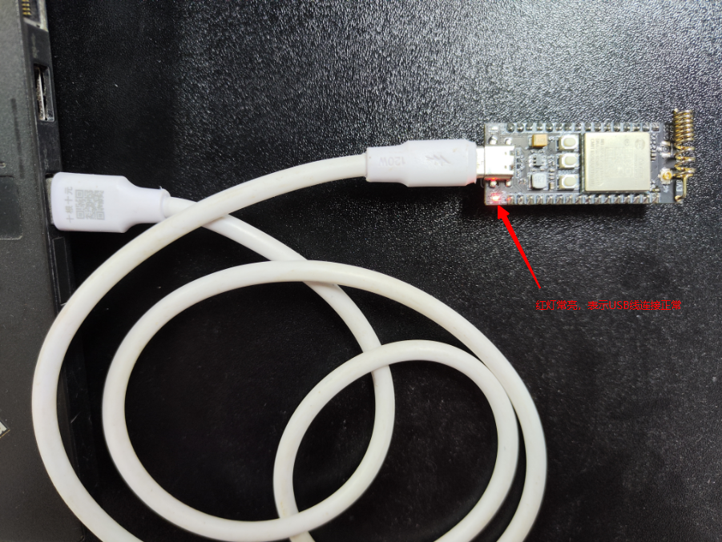
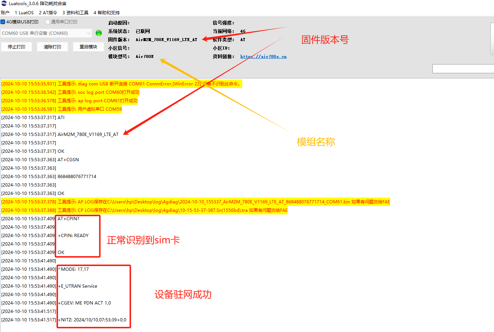

## 一、AT 命令概述

AT 命令是一种古老的使用方式，从有线通信就开始使用了。

距离到 2024 年的今天， 已经有超过 40 年的使用历史。

AT 命令的使用场景是，把 4G 模组当做一个黑盒配件，设备必须有一个主控 CPU。

设备的主控 CPU， 通过串口，（也可以是 SPI 或者 USB，但是 99% 的场景都是通过串口），发送一个 "AT"字符串开头的指令， 像 4G 模组请求各种服务。

4G 模组完成服务后， 回复一个字符串，向主控 CPU 做应答。

通过这样一系列的发送请求，应答的交互方式， 使设备具备了通信能力。

AT 命令发展到今天， 功能日趋完善。

厂家的 4G 模组的 AT 指令至少具备如下完善的功能：

1. 基本的网络查询指令 信号强度查询，运营商查询，SIM 卡状态查询，IMEI 查询，注册网络状态查询，等等；
2. 各种通信协议的支持 TCP/UDP 协议，HTTP 协议，FTP 协议，MQTT 协议，等等；
3. 模组内部资源的使用文件系统的存入，删除，查询，等等。

尽管 AT 使用起来很便利，但是 AT 指令方式依然有几个明显的缺点：

1. 运行效率低 只能是两个物理 CPU 通过串口这样的介质做异步通信， 沟通效率很低，如果要做高效的业务和通信的整合动作的话， 代价更大。
2. 需要一个额外的主控 CPU；
3. 对于复杂度不高的物联网设备，虽然 4G 模组本身的运算资源和存储资源已经过剩， 但是为了使用 AT 指令，依然需要一个额外的主控 CPU。
4. 为了节约成本，主控 CPU 往往会选择一个资源不太大的型号，通常无法运行高级语言， 所以往往要用 C 语言开发业务逻辑。
5. 这需要研发团队熟悉主控 CPU 的开发架构，仍然是一个不小的学习成本。
6. 而 4G 模组因为资源足够大， 大多数 4G 模组已经支持脚本开发应用了，
7. 所以省掉设备主控 CPU，直接用 4G 模组开发应用， 研发成本更低。

尽管 AT 指令有这些缺点， 但是由于 AT 指令有庞大的用户群， 基于使用的惯性， AT 指令在今天仍然有非常大的使用比例。

## 二、本教程实现的功能概述

本文教你怎么使用 AT 命令，通过几个简单的步骤，就可以让合宙 4G 模组与 HTTP 服务器进行接收或发送的操作！

本教程实现的功能定义是：

1. 使用一个 HTTP 服务器；
2. 4G 模组插卡开机后，使用 HTTP GET 指令从 HTTP 服务器上获取内容；
3. TCP 被动断开和 PDP 被动去激活提示说明；

## 三、准备硬件环境

工欲善其事，必先利其器。在正式介绍本功能示例之前，需要先准备好以下硬件环境。

### 3.1 Air780E 开发板

使用 Air780E 核心板，如下图所示：


点击链接购买：[Air780E 核心板淘宝购买链接](https://item.taobao.com/item.htm?id=693774140934&pisk=f1eiwOqL25l1_HYiV6D1ize3wN5d5FMjRrpxkx3VT2uIHCCskWm4kysffAEqor4KRRIskGT0ooqi_coq7DWE000qbVr2mmzKQjNtkV3mnoalvaBRelZshA7RyTFdpD4xQco2_VS2Tcnvc89h5lZshq-pu_FUfEDVVdOmgrkET0ir3mkq_MDEmmM2QjJaY2uI0UGAoNueWRjiw4YTC-_opNr-zluaXleFpfR_X2fhTJVn94W--KJ4KcqQreCDEs3zNVh-DyWpIxqEmyc8savgoor7gX2D7GUzmW4jBJS2_4PTWjestFRZqA0iaRlwjdkIgW2nBR7XNkEn7bDL96_tMA4gN4GNOwa0xVU4IX8G4iReapZyhDSYLIOj_DinyhbSB2IHjbEhxMA51foIXaIhxItMPKJlyMjHNEGZAcQR.&spm=a1z10.5-c-s.w4002-24045920841.33.639f1fd1YrS4b6&skuId=5098266470883) ；

此核心板的详细使用说明参考：[Air780E 产品手册](https://docs.openluat.com/air780e/product/) 中的 << 开发板 Core_Air780E 使用说明 VX.X.X.pdf>>，写这篇文章时最新版本的使用说明为：[开发板 Core_Air780E 使用说明 V1.0.5.pdf](https://cdn.openluat-luatcommunity.openluat.com/attachment/20240419155721583_%E5%BC%80%E5%8F%91%E6%9D%BFCore_Air780E%E4%BD%BF%E7%94%A8%E8%AF%B4%E6%98%8EV1.0.5.pdf) ；核心板使用过程中遇到任何问题，可以直接参考这份使用说明 pdf 文档。

### 3.2 SIM 卡

准备一张可以上网的 SIM 卡，可以是物联网卡，也可以是自己的手机卡；

注意：SIM 卡不能欠费，可以正常上网！！！

### 3.3 PC 电脑

准备一台电脑；

注意：电脑有 USB 口，并且可以正常上网！！！

### 3.4 数据通信线

准备一根数据线，此数据线的作用是，连接 Air780E 开发板和 PC 电脑，通过 AT 命令完成业务逻辑的控制和交互；

有两种数据线可以使用，二选一即可；

第一种数据线是 USB 数据线（连接 Air780E 开板的一段是 Type-C 接口），一般来说这种数据线如下图所示：


普通的手机 USB 数据线一般都可以直接使用；

第二种数据线是 USB 转 TTL 串口线，一般来说这种数据线如下图所示：


在本教程中，使用的是第一种 USB 数据线。

### 3.5 组装硬件环境

按照 SIM 卡槽上的插入方向，插入 SIM 卡，注意不要插反！

如下图所示，将 SIM 卡用力推入卡槽，听到咔嚓声音后即可。


USB 数据线，连接电脑和 Air780E 开发板，如下图所示：



## 四、准备软件环境

工欲善其事，必先利其器。在正式介绍本功能示例之前，需要先准备好以下软件环境。

### 4.1 Luatools 工具

要想烧录 AT 固件到 4G 模组中，需要用到合宙的强大的调试工具：Luatools；

详细使用说明参考：[Luatools 工具使用说明](https://docs.openluat.com/Luatools/) 。

### 4.2 AT 固件

4G 模组中必须烧录正确的 AT 固件才能支持 AT 命令功能；

通过 Luatools 可以烧录 AT 固件；

有两种方式可以获取到 Air780E 模组的最新 AT 固件，二选一即可；

第一种方式是通过 Luatools 获取，如下图所示，可以直接选中最新版本的 AT 固件：


第二种方式是访问：[Air780E 固件版本](https://docs.openluat.com/air780e/at/firmware/) ，找到最新版本的固件即可。

### 4.3 合宙 HTTP 测试服务器

为了方便测试，合宙提供了免费的不可商用的 HTTP 测试网站[合宙 HTTP 测试服务器](http://airtest.openluat.com:2900/download)；

### 4.4 PC 端串口工具

在量产的项目硬件设计中，一般都是由主控 MCU 通过 UART 给 4G 模组发送命令实现具体的业务逻辑；

在本教程中，为了测试方便，没有使用主控 MCU；

而是使用了 PC 电脑上的一个串口工具 LLCOM 给 4G 模组发送命令来实现演示功能；

LLCOM 的下载链接：[LLCOM](https://llcom.papapoi.com/index.html) ，详细使用说明可以直接参考下载网站。

## 五、使用方法举例

### 5.1 确认开发板正常开机并联网正常

本次教程所用固件版本是 v1169，通过 luatools 烧录过固件后可以通过打印来判断设备情况，具体参考下图：



### 5.2 HTTP 相关指令

[点击连接查看合宙 4G 模组 HTTP 指令](https://docs.openluat.com/air780e/at/app/at_command/#http)

### 5.3 在 HTTP 服务器上添加文件

在这里用合宙服务器[合宙 HTTP 测试服务器](http://airtest.openluat.com:2900/download)来演示添加文件

首先，先确认好要上传的文件


将 hello.txt 文件放入服务器


放入后可以通过邮件文件获取链接


### 5.4 普通不带证书使用流程举例

下面演示及普通连接流程，并进行 HTTP GET 操作。

查看流程时需要注意指令后面注释的内容，有助于理解指令具体作用

```
AT+CPIN?


+CPIN: READY    //查询sim卡是否正常


OK

AT+CGATT?


+CGATT: 1        //查询是否附着上数据网络，如果返回+CGATT: 0表示未附着上


OK

AT+SAPBR=3,1,"CONTYPE","GPRS"  //设置HTTP功能的承载类型


OK

AT+SAPBR=3,1,"APN",""    //设置APN，此处""表示使用从网络端自动获取到的APN


OK

AT+SAPBR=1,1             //发起激活PDP的请求


OK

AT+SAPBR=2,1             //注意：此命令仅仅查询PDP地址，可以不执行


+SAPBR: 1,1,"10.159.1.145"    //请求到的PDP地址


OK

AT+HTTPINIT   //HTTP协议栈初始化


OK

AT+HTTPPARA="CID",1    //设置HTTP会话参数：CID


OK

AT+HTTPPARA="URL","http://airtest.openluat.com:2900/download/hello.txt"  //这里的链接通过5.3的步骤获取


OK

AT+HTTPACTION=0    //GET 开始


OK


+HTTPACTION: 0,200,15  //出现这些URC上报表明GET数据成功，等待READ

AT+HTTPREAD    //读取从HTTP 服务器GET的数据

+HTTPREAD: 15
Hello LuatOS!!!   //可以看到我们成功获取到了hello.txt中的内容

OK

AT+HTTPTERM   //结束HTTP服务
```

### 5.5 带 SSL 证书验证功能的 HTTPS 过程

下面演示带 SSL 证书验证功能的过程，在后续项目的使用过程中需按真实情况填写自己的证书

```sql
AT+FSCREATE="ca.crt"   //创建服务器端CA证书文件


OK


AT+FSCREATE="client.crt"   //创建客户端证书文件


OK


AT+FSCREATE="client.key"   //创建客户端密钥文件


OK


AT+FSWRITE="ca.crt",0,2080,15   //文件长度2080字节只是举例，要根据实际填写。下同。


>   //这里输入CA证书文件


OK


AT+FSWRITE="client.crt",0,128,10


>   //这里输入客户端证书文件


OK


AT+FSWRITE="client.key",0,188,10


>   //这里输入客户端密钥文件


OK


AT+SAPBR=3,1,"CONTYPE","GPRS"


OK


AT+SAPBR=3,1,"APN",""   //设置PDP承载之APN参数
//模块注册网络后会从网络自动获取并激活一个PDP上下文，用于RNDIS上网使用（此可以通 过AT+CGDCONT?来查询,
//所以输入 AT+SAPBR=3,,"APN","" 即可，模块内部会按照自动获取的来设置APN


OK


AT+SAPBR=1,1


OK


AT+SAPBR=2,1


+SAPBR: 1,1,010.169.179.213


OK


AT+HTTPSSL=1   //开启SSL功能开关为开


OK


//设置服务器CA证书 SSL上下文id,在TCP单链接的情况下缺省为0；在HTTPS链接下为153，下同
AT+SSLCFG="cacert",153,"ca.crt"


OK


AT+SSLCFG="clientcert",153,"client.crt"   //设置客户端证书


OK


AT+SSLCFG="clientkey",153,"client.key"   //设置客户端KEY


OK


AT+SSLCFG="seclevel",153,2   //设置安全等级


OK


AT+SSLCFG="ciphersuite",153,0X0035   //设置加密套件


OK


//设置随机数
AT+SSLCFG="clientrandom",153,01B12C3141516171F19202122232425262728293031323334353637D


OK


AT+HTTPINIT      //HTTP协议栈初始化


OK


AT+HTTPPARA="CID",1     //设置HTTP会话参数：CID


OK


AT+HTTPPARA="URL","http://airtest.openluat.com:2900/download/hello.txt"  //这里的链接通过5.3的步骤获取


OK


AT+HTTPACTION=0    //GET 开始


OK


+HTTPACTION: 0,200,15  //出现这些URC上报表明GET数据成功，等待READ

AT+HTTPREAD    //读取从HTTP 服务器GET的数据

+HTTPREAD: 15
Hello LuatOS!!!   //可以看到我们成功获取到了hello.txt中的内容

OK

AT+HTTPTERM   //结束HTTP服务
```

### 5.6 HTTP 下载大文件（断点续传）

在实际的应用场景中，可能需要下载一个非常大的文件，例如几百 K 字节、几 M 字节，但是 4G 模块中 HTTP 可用的内存缓冲区为 300KB 左右（780E 模块 4KB 左右），当文件大小超过这个缓冲区时，就要使用断点续传功能来分段下载处理了。下面以“下载一个 11975260 字节的文件”为例，来说明如何使用断点续传功能（注意：本示例仅仅演示了正常流程的 HTTP AT 命令，完整流程以及异常处理流程请参考本文应用流程部分）

```sql
AT+HTTPINIT


OK

AT+HTTPPARA="URL","http://openluat-erp.oss-cn-hangzhou.aliyuncs.com/erp_site_file/product_file/sw_file_20200108162920_Luat_V0028_ASR1802.zip"


OK

AT+HTTPACTION=2


OK


+HTTPACTION: 2,200,0

AT+HTTPHEAD


+HTTPHEAD: 454

server: aliyunoss

date: thu, 16 jan 2020 06:50:58 gmt

content-type: application/zip

content-length: 11975260                            //此处的11975260表示文件总大小

connection: keep-alive

x-oss-request-id: 5e2007d108f4be32353a92ae

accept-ranges: bytes

etag: "a5b9cc75c0f26413bbaf00a0fa952bb2"

last-modified: wed, 08 jan 2020 08:29:29 gmt

x-oss-object-type: normal

x-oss-hash-crc64ecma: 16925484473913319613

x-oss-storage-class: standard

content-md5: pbnmdcdyzbo7rwcg+pursg==

x-oss-server-time: 111


OK


//如下指令，表示下载文件的第一个3KB数据

AT+HTTPPARA="BREAK",0


OK

AT+HTTPPARA="BREAKEND",3071


OK

AT+HTTPACTION=0


OK


+HTTPACTION: 0,206,3072

AT+HTTPREAD


+HTTPREAD: 3072

......                          //此处输出3072字节数据

OK

 //表示下载文件的第一个3KB数据完成


//如下指令，表示下载文件的第二个3KB数据

AT+HTTPPARA="BREAK",3072


OK

AT+HTTPPARA="BREAKEND",6143


OK

AT+HTTPACTION=0


OK


+HTTPACTION: 0,206,3072

AT+HTTPREAD


+HTTPREAD: 3072

......                          //此处输出3072字节数据

OK

 //表示下载文件的第二个3KB数据完成

//此处参考上文指令，一直循环读取文件的下一个300KB数据，直到读取结束

......


AT+HTTPTERM


OK
```

### 5.7 HTTP 下载大文件内存不足问题

可以使用上面的断点续传
或者新的 AT 指令 AT+HTTPEXACTION / AT+HTTPEXGET
示例:

```sql
AT+CPIN?


+CPIN: READY    //查询sim卡是否正常


OK

AT+CGATT?


+CGATT: 1        //查询是否附着上数据网络，如果返回+CGATT: 0表示未附着上


OK

AT+SAPBR=3,1,"CONTYPE","GPRS"


OK

AT+SAPBR=3,1,"APN",""    //设置APN，此处""表示使用从网络端自动获取到的APN


OK

AT+SAPBR=1,1             //发起激活PDP的请求


OK

AT+SAPBR=2,1             //注意：此命令仅仅查询PDP地址，可以不执行


+SAPBR: 1,1,"10.43.103.155"    //请求到的PDP地址

AT+HTTPINIT


OK

AT+HTTPPARA="CID",1


OK

AT+HTTPPARA="URL","airtest.openluat.com"

OK

AT+HTTPEXACTION=0

OK

+HTTPEXGET  //收到这个返回以后 发送下面这条指令

AT+HTTPEXGET  //重复发送这条指令直到文件下载完

+HTTPEXGET: 3880  //本次输出3880字节数据
(此处省略了打印信息)
OK

+HTTPEXGET

AT+HTTPEXGET

+HTTPEXGET:
(此处省略了打印信息)
OK

+HTTPEXACTION: 0,200  //下载完毕结束会
```

## 六、APN 设置与专网卡

### 6.1 APN 说明

用户根据自己使用的网络类型来区分，sim 卡可以分为公网卡和专网卡两种；对于如何判断自己手里的 sim 卡是公网卡还是专网卡可以通过下面两种办法区分：

- 咨询 sim 卡供应商；
- 如果有 apn 账号、或者有密码、或者有加密类型，则可以认为是专网卡。

对于公网卡和专网卡设置和查询有不同的指令，合宙 780E 4G 模组设置和查询 APN 相关指令可以参考下图：


```bash
设置apn指令流程：
AT+CPIN?                                        //检查卡是否正常
AT+CPNETAPN=2,jscmiot,u9682,iot98765,2         //举例，根据实际填写，不能照抄
AT+CGATT?                                      //查询是否附着上数据网络，如果返回+CGATT: 0表示未附着上,1表示正常
```

### 6.2 **APN 及专网卡常见问题**

1. 模块如何设置 APN

```bash
1、如果是公网SIM卡，不需要用户主动设置APN，软件自动去网络端查询APN进行设置。

2、如果是专网SIM卡，首先咨询SIM卡提供商APN参数，然后通过AT+CPNETAPN=mode,“apnname”,“user”,“pwd”,authmoded进行专网卡的参数设置。
```

2. 专网卡连接服务器失败

```bash
1、有的专网卡没设置APN的情况下也能激活PDP，但是不能连专网卡指定的服务器，或者开机后模块没自动激活PDP，这个时候参考1，检查APN参数是否设置正确。

2、如果有其他厂家的模块，对比测试下是否连接正常。

3、如果无法百分百保证服务器配置没问题，最好在服务器端用wireshark抓包，或者在服务器上安装一个第三方工具，开启一个服务器端口来对比测试。

4、用定向IP的物联网卡，需要把域名或IP加入白名单才能使用。
```

3. 专网卡访问白名单

用定向 IP 的物联网卡，需要把域名或 IP 加入白名单才能使用，下面列出模块会访问的域名或 IP 服务器。


## 七、总结

AT 指令连接 HTTP 是一种高效、灵活的通信手段，适用于物联网与远程控制系统。通过精确配置 HTTP 参数，设备能与服务器稳定交互数据。其应用场景广泛，包括设备控制、远程监控及数据采集等。相信通过这篇文章，大家已经能熟练的使用 AT 指令来链接 HTTP 进行交互操作，希望这篇文章能使大家在日后的开发工作中如虎添翼！

## 八、常见问题和注意事项

### 8.1 TCP 被动断开提示

发送 AT+HTTPACTION 命令，和服务器建立了 http 连接后，如果连接异常被动断开，会输出

`+HTTPACTION: <Method>,<StatusCode>,<DataLen>` 提示

### 8.2 PDP 被动去激活提示

先来看下 PDP 被动去激活时的 AT 命令处理序列，如果不理解 AT 命令含义，请自行参考 AT 手册

```sql
......           //此处省略了PDP激活的过程


AT+HTTPINIT


OK

AT+HTTPPARA="CID",1


OK

AT+HTTPPARA="URL","www.baidu.com"


OK

AT+HTTPACTION=0


OK


+SAPBR 1: DEACT       //此处PDP被动去激活


+HTTPACTION: 0,601,0


AT+HTTPTERM


OK                     //此处无论返回OK、ERROR还是CME ERROR，都直接跳过，不用做正确性判断

AT+SAPBR=0,1


+CME ERROR: 3         //此处无论返回OK、ERROR还是CME ERROR，都直接跳过，不用做正确性判断

......                //此处省略了PDP激活的过程

AT+HTTPINIT


OK

AT+HTTPPARA="CID",1


OK

AT+HTTPPARA="URL","www.baidu.com"


OK

AT+HTTPACTION=0


OK


+HTTPACTION: 0,200,154293
```

参考上方基本流程，右下角的“收到 +SAPBR 1: DEACT 错误提示，表示 PDP 被动去激活”为异常处理的触发点

### 8.3 HTTP 支持多连接吗

目前 HTTP 仅支持单连接，不支持多连接

### 8.4 HTTPS 如何使用

本文主要描述了使用HTTP的基本流程和异常处理，对于 HTTPS 使用方法没有做过多描述，这一部分，请自行参考 AT 手册 HTTP 章节下《使用方法举例》中的"带 SSL 证书验证功能的 HTTPS 流程"使用方法；支持的 SSL 参数，请自行参考 AT+SSLCFG 命令说明

如果 SSL 的参数配置不变，则每次开机运行过程中，仅设置一次即可

### 8.5 重试多次 PDP ，HTTP 应用一直连接失败

如果重试多次 PDP 激活，PDP 一直激活失败，或者 HTTP 一直请求应答失败，则尝试使用如下手段恢复：

1、使用 RESET 引脚复位模块

2、极端情况下，直接给模块断电，再上电，POWER KEY 引脚拉低开机

### 8.6 HTTP 下载的大文件如何可靠的发送给 MCU（AT 流控）

如在 5.6 演示指令里第 125 行开始的 AT 指令

```sql
AT+HTTPREAD


+HTTPREAD: 3072

......                          //此处输出3072字节数据

OK
```

…处的 3072 字节数据，是模块通过 UART AT 口发送给 MCU，在实际传输过程中，由于串口芯片驱动、MCU 端的处理能力、波特率的选择都存在不确定性，可能会导致 MCU 端接收到的数据，实际上没有 3072 字节，这就要求 UART AT 口打开流控功能。模块支持硬流控和软流控两种：

1. 硬流控，参考如下步骤操作：

（1） 模块和 的 UART 口，CTS、RTS 要交叉相连

（2） MCU 端固件要支持并且打开硬流控功能

（3） MCU 端要发送 AT+IFC=2,2 命令到模块端，打开模块端的硬流控功能

2. 软流控，参考如下步骤操作：

（1） MCU 端固件要支持并且打开软流控功能

（2） MCU 端要发送 AT+IFC=1,1 命令到模块端，打开模块端的硬流控功能

### 8.7 为什么我只发了 10 字节消息，100 次却消耗了那么多流量？

因为还有 HTTP 自带的请求头。[如何统计流量](https://doc.openluat.com/article/2111#1213_693)

### 8.8 为什么频繁请求会失败?

支持的 http 连接总数有限数量为 tcp 连接数量 8 个，建议一个 http 连接返回请求结果之后，再去请求下一个连接；不要使用循环定时器方式不断的发起新的 http 请求。

### 8.9 如何 POST 文件?

主要是使用 AT+HTTPDATA 命令录入文件数据后，发送 AT+HTTPACTION=1 利用 post 上传

### 8.10 数据发送接收缓存问题

AT 版本：有缓存机制，内存中有一个的缓冲区（780E 系列模块标准 AT 为 4KB，last 版本为 128k），发送和接受使用的是同一块缓冲区，发送和收到数据后，插入此缓冲区，然后通过 AT 口输出 urc，提示收到的数据长度；缓冲区满之后，再收到新数据，会丢弃新收到的数据，并通过 AT 口输出 urc 提示出错；需要读取数据时，发送 AT+HTTPREAD 命令读取，可分段读取，也可全部读取

注意：缓冲区位于内存中，断电或者重启后，缓存表中的数据会被清空；虽然缓冲区可以缓存很多数据，但是建议收到数据时，通过 AT+HTTPREAD 及时读取出来，以防缓冲区满出错

## 给读者的话

> 本篇文章由`王文中`开发；
>
> 本篇文章描述的内容，如果有错误、细节缺失、细节不清晰或者其他任何问题，总之就是无法解决您遇到的问题；
>
> 请登录[合宙技术交流论坛](https://chat.openluat.com/)，点击
[文档找错赢奖金-Air780E-AT-软件指南-应用实例-HTTP](https://chat.openluat.com/#/page/matter?125=1848636000851591169&126=%E6%96%87%E6%A1%A3%E6%89%BE%E9%94%99%E8%B5%A2%E5%A5%96%E9%87%91-Air780E-AT-%E8%BD%AF%E4%BB%B6%E6%8C%87%E5%8D%97-%E5%BA%94%E7%94%A8%E5%AE%9E%E4%BE%8B-HTTP&askid=1848636000851591169)；
>
> 用截图标注+文字描述的方式跟帖回复，记录清楚您发现的问题；
>
> 我们会迅速核实并且修改文档；
>
> 同时也会为您累计找错积分，您还可能赢取月度找错奖金！
