## 一、AT 命令概述

AT 命令是一种古老的使用方式，从有线通信就开始使用了。

距离到 2024 年的今天， 已经有超过 40 年的使用历史。

AT 命令的使用场景是，把 4G 模组当做一个黑盒配件，设备必须有一个主控 CPU。

设备的主控 CPU， 通过串口，（也可以是 SPI 或者 USB，但是 99% 的场景都是通过串口），发送一个 "AT"字符串开头的指令， 向 4G 模组请求各种服务。

4G 模组完成服务后， 回复一个字符串，向主控 CPU 做应答。

通过这样一系列的发送请求，应答的交互方式， 使设备具备了通信能力。

AT 命令发展到今天， 功能日趋完善。

厂家的 4G 模组的 AT 指令至少具备如下完善的功能：

1. 基本的网络查询指令 信号强度查询，运营商查询，SIM 卡状态查询，IMEI 查询，注册网络状态查询，等等；
2. 各种通信协议的支持 TCP/UDP 协议，HTTP 协议，FTP 协议，MQTT 协议，等等；
3. 模组内部资源的使用文件系统的存入，删除，查询，等等。

尽管 AT 使用起来很便利，但是 AT 指令方式依然有几个明显的缺点：

1. 运行效率低 只能是两个物理 CPU 通过串口这样的介质做异步通信， 沟通效率很低，如果要做高效的业务和通信的整合动作的话， 代价更大。
2. 需要一个额外的主控 CPU；
3. 对于复杂度不高的物联网设备，虽然 4G 模组本身的运算资源和存储资源已经过剩， 但是为了使用 AT 指令，依然需要一个额外的主控 CPU。
4. 为了节约成本，主控 CPU 往往会选择一个资源不太大的型号，通常无法运行高级语言， 所以往往要用 C 语言开发业务逻辑。
5. 这需要研发团队熟悉主控 CPU 的开发架构，仍然是一个不小的学习成本。
6. 而 4G 模组因为资源足够大， 大多数 4G 模组已经支持脚本开发应用了，
7. 所以省掉设备主控 CPU，直接用 4G 模组开发应用， 研发成本更低。

尽管 AT 指令有这些缺点， 但是由于 AT 指令有庞大的用户群， 基于使用的惯性， AT 指令在今天仍然有非常大的使用比例。

## 二、演示功能概述

本文教你怎么使用 AT 命令，通过几个简单的步骤，就可以让合宙 4G 模组与 TCP 服务器通讯。

1. 使用 TCP 服务器
2. 4G 模组插卡开机后，使用 AT 指令完成 TCP 链接建立，数据发送，数据接收以及链接关闭操作

## 三、准备硬件环境

工欲善其事，必先利其器。在正式介绍本功能示例之前，需要先准备好以下硬件环境。

### 3.1 Air780E 开发板

本文使用的开发板是 Air780E 核心板，如下图所示：


点击链接购买：[Air780E 核心板淘宝购买链接](https://item.taobao.com/item.htm?id=693774140934&pisk=f1eiwOqL25l1_HYiV6D1ize3wN5d5FMjRrpxkx3VT2uIHCCskWm4kysffAEqor4KRRIskGT0ooqi_coq7DWE000qbVr2mmzKQjNtkV3mnoalvaBRelZshA7RyTFdpD4xQco2_VS2Tcnvc89h5lZshq-pu_FUfEDVVdOmgrkET0ir3mkq_MDEmmM2QjJaY2uI0UGAoNueWRjiw4YTC-_opNr-zluaXleFpfR_X2fhTJVn94W--KJ4KcqQreCDEs3zNVh-DyWpIxqEmyc8savgoor7gX2D7GUzmW4jBJS2_4PTWjestFRZqA0iaRlwjdkIgW2nBR7XNkEn7bDL96_tMA4gN4GNOwa0xVU4IX8G4iReapZyhDSYLIOj_DinyhbSB2IHjbEhxMA51foIXaIhxItMPKJlyMjHNEGZAcQR.&spm=a1z10.5-c-s.w4002-24045920841.33.639f1fd1YrS4b6&skuId=5098266470883) ；

此核心板的详细使用说明参考：[Air780E 产品手册](https://docs.openluat.com/air780e/product/) 中的 << 开发板 Core_Air780E 使用说明 VX.X.X.pdf>>，写这篇文章时最新版本的使用说明为：[开发板 Core_Air780E 使用说明 V1.0.5.pdf](https://cdn.openluat-luatcommunity.openluat.com/attachment/20240419155721583_%E5%BC%80%E5%8F%91%E6%9D%BFCore_Air780E%E4%BD%BF%E7%94%A8%E8%AF%B4%E6%98%8EV1.0.5.pdf) ；核心板使用过程中遇到任何问题，可以直接参考这份使用说明 pdf 文档。

### 3.2 SIM 卡

准备一张可以上网的 SIM 卡，可以是物联网卡，也可以是自己的手机卡；

注意：SIM 卡不能欠费，可以正常上网！！！

### 3.3 PC 电脑

准备一台电脑；

注意：电脑有 USB 口，并且可以正常上网！！！

### 3.4 数据通信线

准备一根数据线，此数据线的作用是，连接 Air780E 开发板和 PC 电脑，通过 AT 命令完成业务逻辑的控制和交互；

有两种数据线可以使用，二选一即可；

第一种数据线是 USB 数据线（连接 Air780E 开板的一段是 Type-C 接口），一般来说这种数据线如下图所示：


普通的手机 USB 数据线一般都可以直接使用；

第二种数据线是 USB 转 TTL 串口线，一般来说这种数据线如下图所示：


在本教程中，使用的是第一种 USB 数据线。

### 3.5 组装硬件环境

按照 SIM 卡槽上的插入方向，插入 SIM 卡，注意不要插反！

如下图所示，将 SIM 卡用力推入卡槽，听到咔嚓声音后即可。

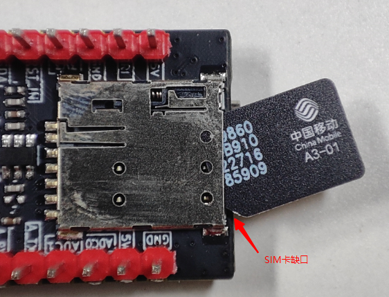

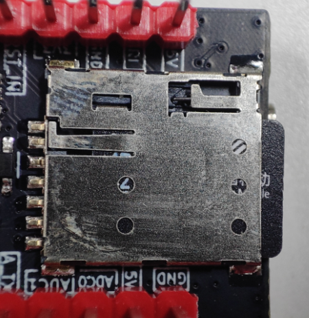

USB 数据线，连接电脑和 Air780E 开发板，如下图所示：


## 四、准备软件环境

工欲善其事，必先利其器。在正式介绍本功能示例之前，需要先准备好以下软件环境。

### 4.1 Luatools 工具

要想烧录 AT 固件到 4G 模组中，需要用到合宙的强大的调试工具：Luatools；

详细使用说明参考：[Luatools 工具使用说明](https://docs.openluat.com/Luatools/) 。

### 4.2 AT 固件

4G 模组中必须烧录正确的 AT 固件才能支持 AT 命令功能；

通过 Luatools 可以烧录 AT 固件；

有两种方式可以获取到 Air780E 模组的最新 AT 固件，二选一即可；

第一种方式是通过 Luatools 获取，如下图所示，可以直接选中最新版本的 AT 固件：


第二种方式是访问：[Air780E 固件版本](https://docs.openluat.com/air780e/at/firmware/) ，找到最新版本的固件即可。

### 4.3 合宙 TCP/UDP web 测试服务器

为了方便测试，合宙提供了免费的不可商用的 [合宙 TCP/UDP web 测试服务器](https://netlab.luatos.com)；

### 4.4 PC 端串口工具

在量产的项目硬件设计中，一般都是由主控 MCU 通过 UART 给 4G 模组发送命令实现具体的业务逻辑；

在本教程中，为了测试方便，没有使用主控 MCU；

而是使用了 PC 电脑上的一个串口工具 LLCOM 给 4G 模组发送命令来实现演示功能；

LLCOM 的下载链接：[LLCOM](https://llcom.papapoi.com/index.html) ，详细使用说明可以直接参考下载网站。

## 五、使用方法举例

### 5.1 确认开发板正常开机并联网正常

本次教程所用固件版本是 v1169，通过 luatools 烧录过固件后可以通过打印来判断设备情况，具体参考下图：


### 5.2 TCP 相关相关命令

[点击连接查看合宙 4G 模组 TCPIP 相关命令](https://docs.openluat.com/air780e/at/app/at_command/#tcpip)

## 六、TCP 通信实例

在本文中，我们将使用合宙 TCP/UDP web 测试工具，点击右侧连接进入工具：[https://netlab.luatos.com](https://netlab.luatos.com)，浏览器中出现如下界面：

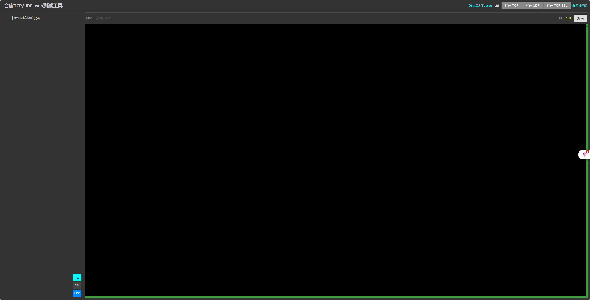

点击右上角“打开 TCP”，在 WEB 页面左上角会显示当前可用于连接的 TCP 服务器 IP 地址和端口号


如下图标记处：待测试的 IP 地址为:112.125.89.8： 端口号为:43316

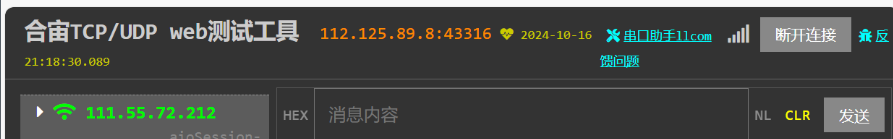

注意：读者进行测试时 IP 和端口会随机分配，测试中我们替换成对应的 IP 和端口号即可。

### 6.1 **TCP 非透传应用 1:**模块做为客户端，单链接，发送和接收数据

事实上，TCP 发送方式有快发和慢发两种，由 +CIPOSEND 命令来设置发送方式。区别就是:慢发每发送一笔数据需要服务器那边的确认，而快发则发送到模块就可以了，不需要服务器的确认。慢发可能会出现长时间没响应的情况，AT 通道就堵住了，所以建议采用快发模式)

**建立链接**

AT+CREG?                //查询当前 GPRS 注册状态

+CREG: 0,1               //`<n>`=0，表示禁用 URC 上报，+CREG: 0,1，标识已经注册 GPRS 网络，而且是本地网

OK

AT+CGATT?                //查看当前 GPRS 附着状态

+CGATT:1                //+CGATT:1 ，标明当前 GPRS 已经附着

OK

AT+CIPMUX=0            //设置为单链接模式

OK

AT+CIPQSEND=1            //设置为快发模式(推荐使用这种模式)

OK

AT+CIICR                //激活移动场景，获取 IP 地址

OK

AT+CIFSR                //查询分配的 IP 地址
10.83.172.111            //此处 IP 随机

AT+CIPSTATUS            //查询下链接状态

OK

STATE: IP STATUS        //其中:"TCP"为链接的协议类型"112.125.89.8"为对端服务器的 IP 地址_43316_为对端服务器的 TCP 端口号，注:CIPSTART 设置命令所有的参数，双括号可以用，也可以不用

OK

CONNECT OK               //如果链接成功，会有如此 URC 上报

AT+CIPSTATUS            //查询下链接状态

OK

STATE: CONNECT OK        //链接建立成功

此时，模组已经与服务器建立连接，如下图所示:

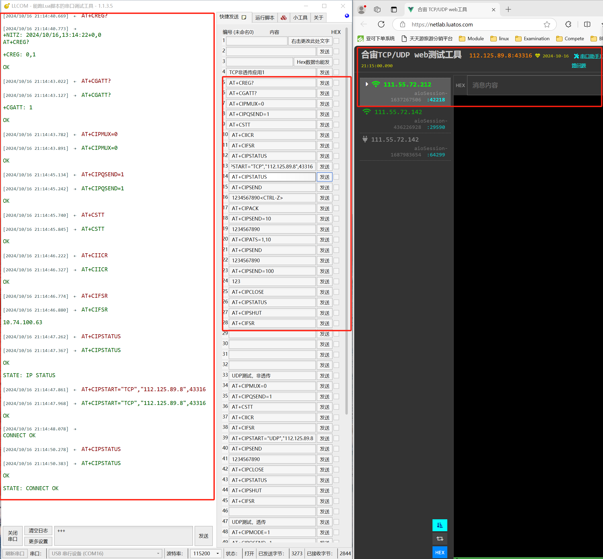

**不定长数据发送**

```
AT+CIPSEND            //发送数据(不定长度，手动发送)

>                        //等待发送数据
1234567890<CTRL-Z>        //当出现">"后，输入待发送的数据:0123456789。<CTRL-Z>用来发送数据，发送16进制数0x1A即等同于发送<CTRL-Z>

AT+CIPACK                //每发一笔，查询下发送状态，可以知道上笔数据服务器有没有收到

+CIPACK:10,10,0            //第一个10，表明已经发送的数据字节数，第二个10表示服务器收到的数据字节数，0表示服务器尚未收到的数据字节数

OK
```

指令执行截图如下：

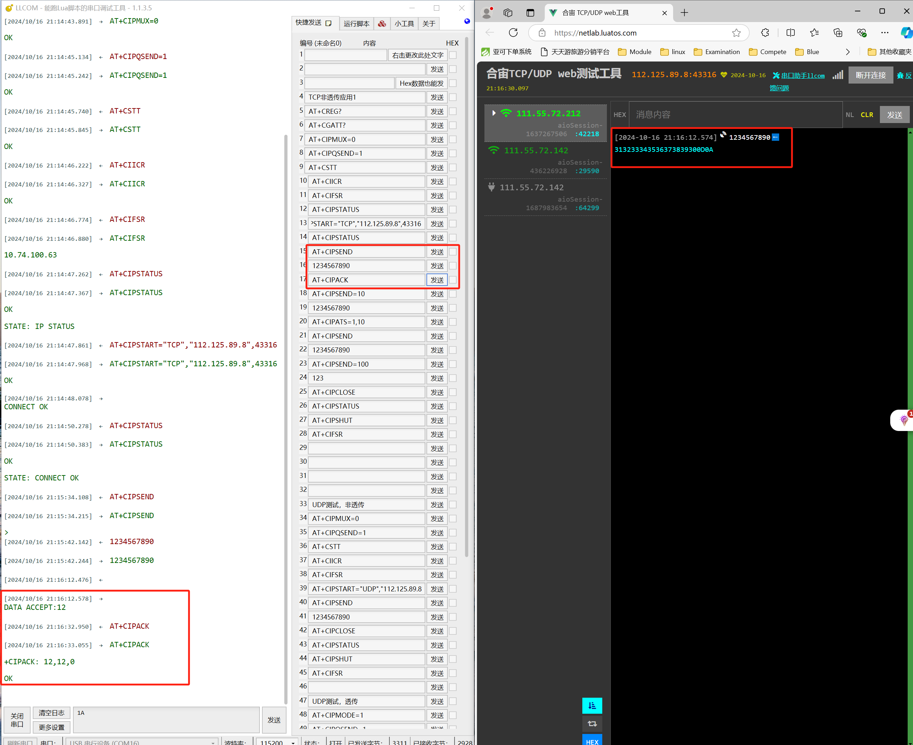

**定长数据发送**

| ->`` | AT+CIPSEND=10``  | 发送数据(确定长度)``                                         |
| ----------- | ----------------------- | ------------------------------------------------------------------- |
| <-`` | >``              | ``                                                           |
| ->`` | 1234567890``     | 输入发送数据``                                               |
| <-`` | DATA ACCEPT:10`` | 输入数据达到 10 个字节，不用发送`<CTRL-Z>`数据会自动发送`` |

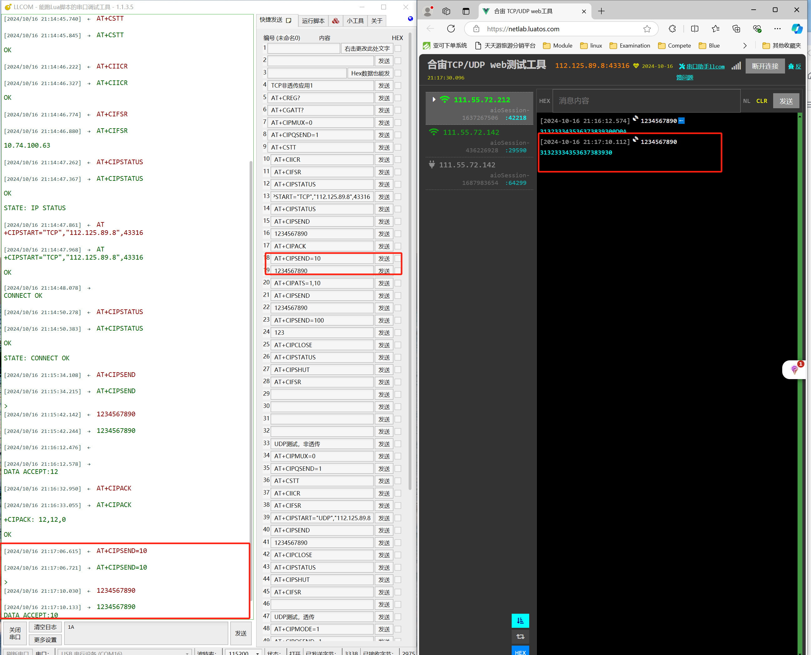

**定时定长数据发送**

| ->`` | AT+CIPATS=1,10`` | 设置自动发送，自动发送的定时为 10S``                   |
| ----------- | ----------------------- | ------------------------------------------------------------- |
| <-`` | OK``             | ``                                                     |
| ->`` | AT+CIPSEND``     | 发送数据``                                             |
| <-`` | >``              | ``                                                     |
| ->`` | 1234567890``     | ``                                                     |
| <-`` | DATA ACCEPT:10`` | 10s 定时器溢出，不用发送`<CTRL-Z>`，数据会自己发送`` |

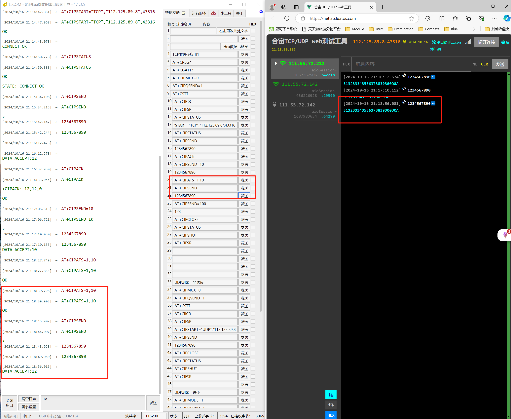

**定时数据发送**

| ->`` | AT+CIPSEND=100`` | 设置自动发送，自动发送的定时为 10S``                                                |
| ----------- | ----------------------- | ------------------------------------------------------------------------------------------ |
| <-`` | >``              | ``                                                                                  |
| ->`` | 123``            | ``                                                                                  |
| <-`` | DATA ACCEPT:3``  | 10s 定时器溢出，输入内壁不必达到 100 字节，也不用发送`<CTRL-Z>`，数据会自己发送`` |

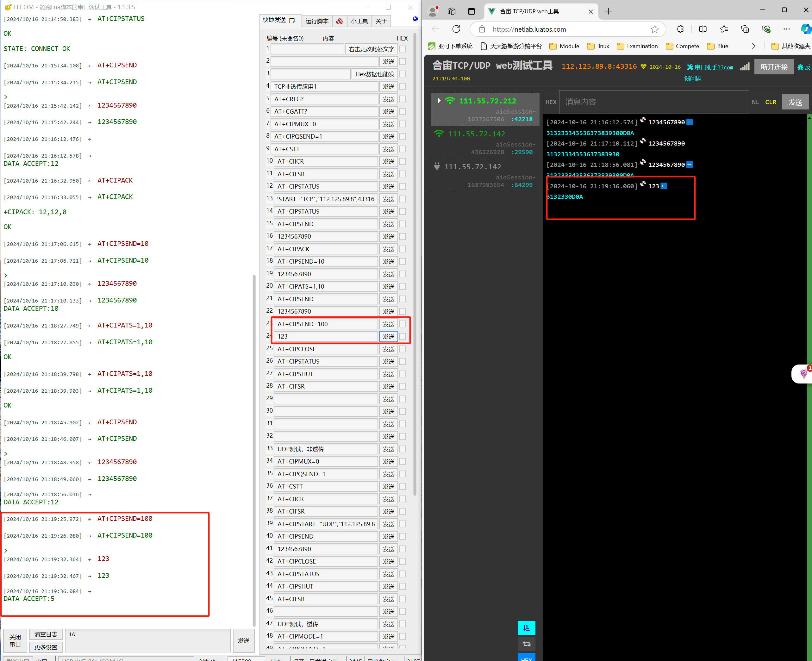

**关闭链接**

```
AT+CIPCLOSE                \\关闭TCP链接

CLOSE OK                    \\关闭成功

AT+CIPSTATUS                \\查询下链接状态

OK

STATE: TCP CLOSED            //TCP链接已经关闭

AT+CIPSHUT                    //关闭移动场景

SHUT OK                        //关闭成功

AT+CIFSR                        //查询当前的模块IP

ERROR                            //IP地址已经没有了
```

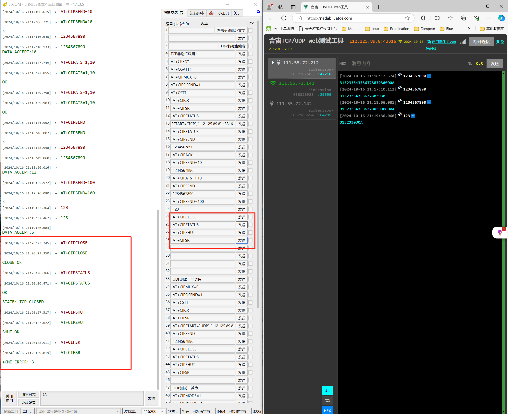

### 6.2 **TCP 非透传应用 2:**模块做为客户端，单链接，发送数据，开启 SSL 功能

```
AT+CIPMUX=0                //设置为单链接模式

OK

AT+CIPQSEND=1                //发送模式为快发

OK

AT+CIPSTATUS            //查询下链接状态
OK

STATE: IP INITIAL

AT+CIPSSL=1            //打开SSL功能(本例中双方都不需要验证证书)

AT+CIPSTART="TCP","112.125.89.8",_43316        //当模块设置为单链接并且状态为IP INITIAL时，也可以用CIPSTART直接建立连接，不必先输入CSTT CIICR CIFSR请写实际的服务器地址和端口，不要照抄_

OK

CONNECT OK                //如果链接成功，会有如此URC上报

AT+CIPSEND

>                        //等待输入数据

1234567890<CTRL-Z>        //<CTRL-Z>用来发送数据，发送16进制数0x1A即等同于发送<CTRL-Z>。
  
DATA ACCEPT:10            //表明模块接收了从TE输入的10个字节的待发数据

                            //+CIPCLOSE,+CIPSHUT，不再赘述
```

### 6**.3 TCP 非透传应用 3:**模块做为客户端，单链接，发送数据，开启 SSL 功能(双向证书验证)

```
AT+CIPMUX=0                //设置为单链接模式

OK

AT+CIPQSEND=1               //发送模式为快发

AT+CIPSSL=1                //开启SSL功能开关为开

OK

AT+FSCREATE="ca.crt"        //创建CA 证书文件

OK

AT+FSCREATE="client.crt'    //创建客户端证书文件

OK

AT+FSWRITE="ca.crt",0,2080,15 //文件长度2080只是举例，要根据实际填写。下同。

>                            //这里输入CA证书文件

OK

AT+FSWRITE="client.key",0,188,10 //

>                                //这里输入客户端密钥文件

OK

AT+SSLCFG="cacert",0,"ca.crt"    //设置服务器CA 证书SSL 上下文id，在单链接的情况下缺省为0

OK

AT+SSLCFG="clientcert",0,"client.crt"        //设置客户端证书

OK

AT+SSLCFG="client.key",0,"client.key'        //设置客户端KEY

OK

AT+SSLCFG="seclevel",0,2         //设置安全等级

OK

AT+SSLCFG="ciphersuite",0,0X0035    //设置加密套件

OK

AT+SSLCFG="clientrandom",0,101B12C3141516171F19202122232425262728293031323334353637 //设置随机数

OK

AT+CIPSTART=TCP,tcplab.openluat.com,57513 //

OK

ONNECT OK

AT+CIPSEND=10        //发送数据(确定长度)
      
>                    //等待输入数据
1234567890

DATA ACCEPT:10    //输入数据达到10个字节，不用发送<CTRL-Z>数据会自动发送

AT+CIPSHUT

OK

AT+CIPSSL=0        //关闭 SSL 功能

OK
```

### 6.6 透明传输应用 1:TCP 数据传输

```
AT+CIPMODE=1            //开启透明传输模式

OK

AT+CIPSTART="TCP","112.125.89.8",_43316  //建立TCP链接，其中:"TCP"为链接的协议类型，"__112.125.89.8__"为对端服务器的IP地址43316 为对端服务器的TCP端口号_

OK
_
_CONNECT                                //如果链接成功，会有如此URC上报
```

指令执行实例截图如下：

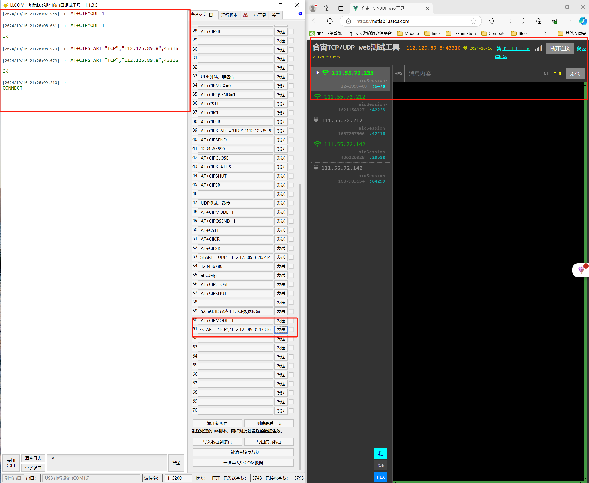

发送数据“123456789”原样发送到服务器

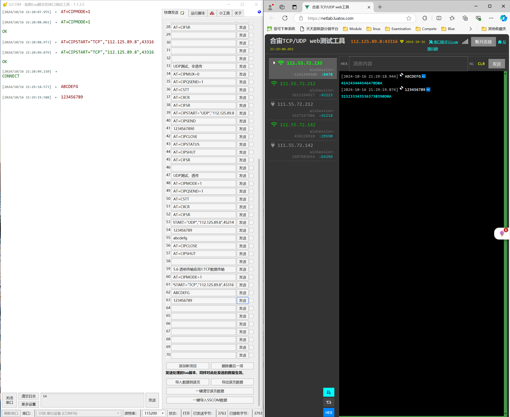

服务器下发的数据原样发送到模组

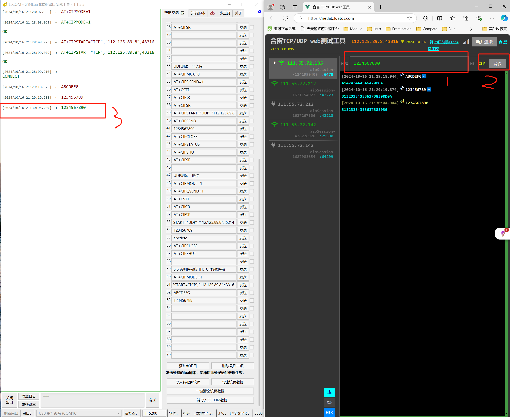

通过“+++”可以退出透传模式：

如果想返回 AT 命令模式，则在数据后面输入 +++

注：+++ 需要满足一定的条件才会被模块认为是注:escape sequence，否则会被认为是数据:

1，第一个 + 之前需要 1000ms 的间隔

2，最后一个 + 之后需要 500ms 的间隔

3，三个 + 之间的间隔不能超过 500ms

```
+++      //末尾不要加回车
OK      //OK表示已经返回到AT命令模式
```

指令执行实例截图；

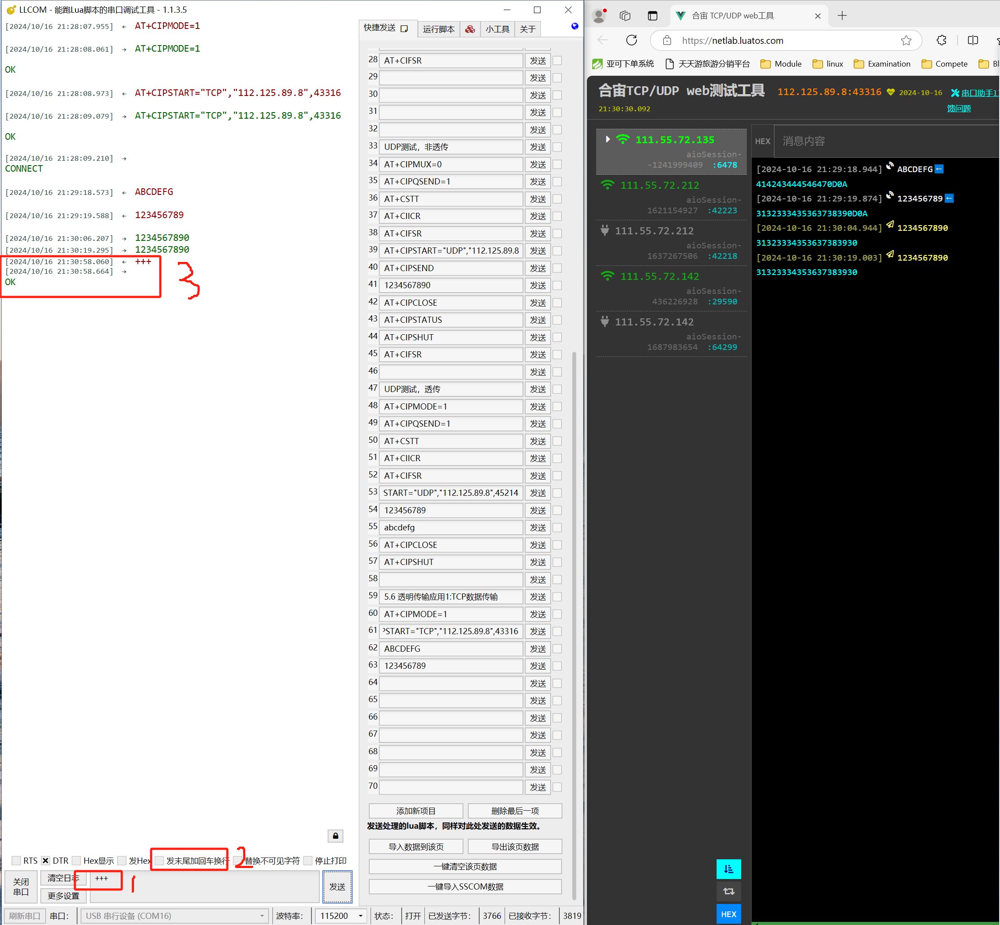

退出透传模式后，可以正常执行 AT 指令

```
AT+CIPCLOSE            //关闭TCP链接

CLOSE OK                //关闭成功

AT+CIPSHUT            //关闭移动场景
  
SHUT OK                    //关闭成功

OK
```

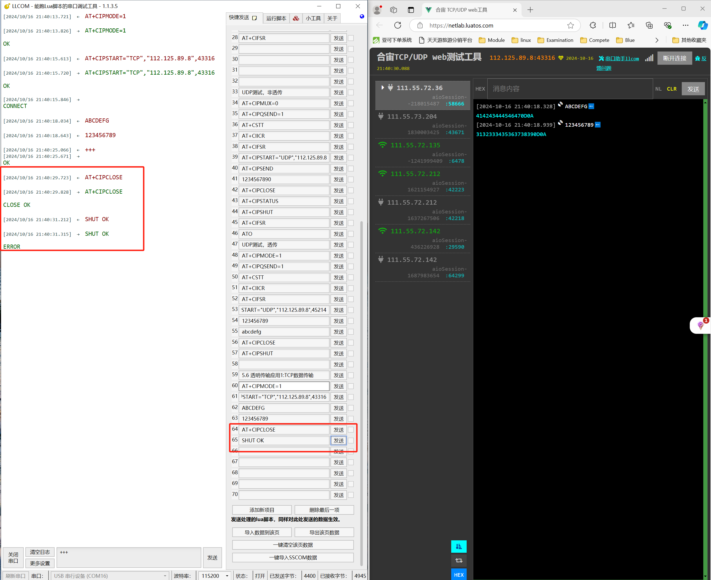

当传输中有协议栈错误发生时，会转入 AT 命令状态并上报该错误码

```
TCP ERROR:xx 或CLOSED

AT+CIPSHUT            //此时可以通过AT指令关闭移动场景

SHUT OK
```

## 七、总结

### 7.1 模块上电初始化以及 **TCPIP**流程

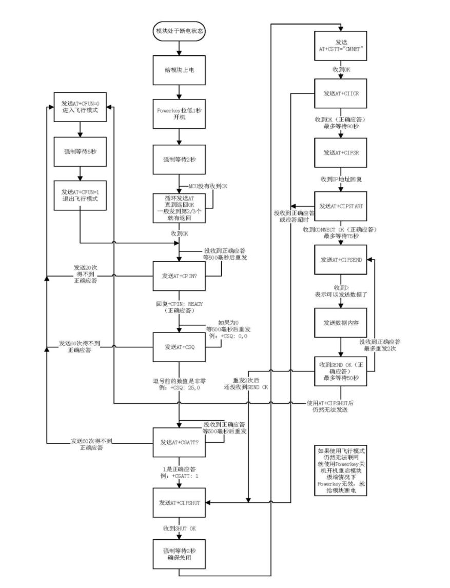

### 7.2 单链接状态机

当输入 TCPIP 相关命令以后， 模块的状态也会发生相应的迁移。 查询状态的命令是 AT+CIPSTATUS

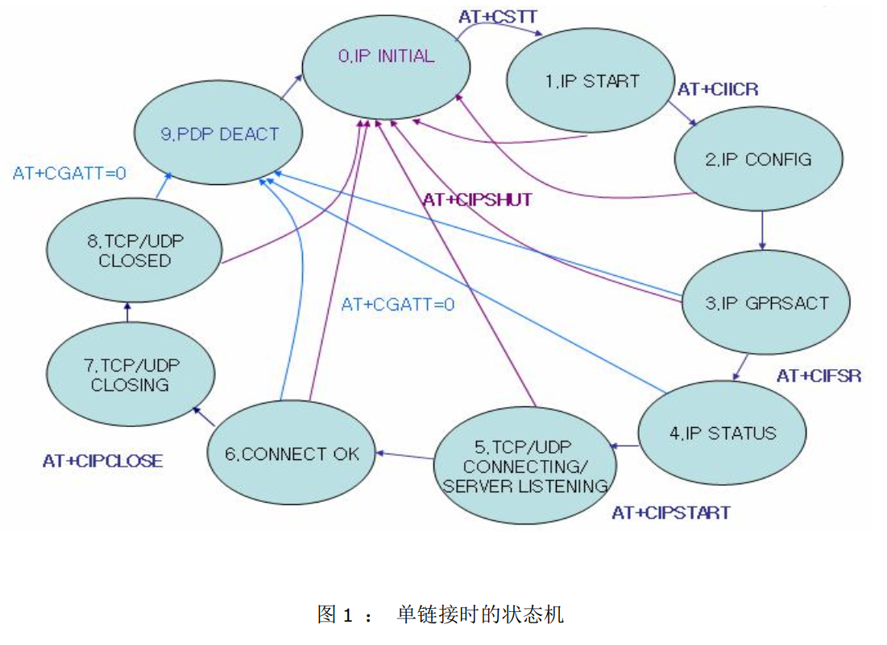

### 7.3 多链接状态机

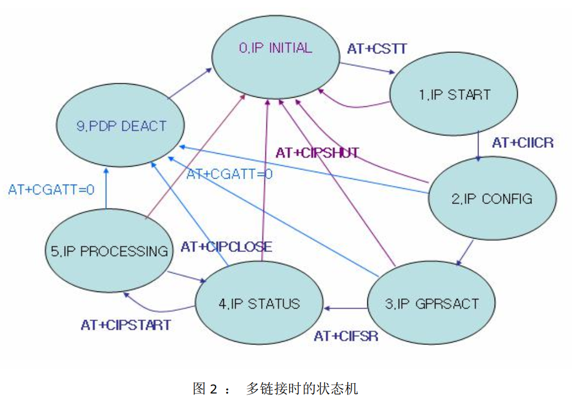

关于单连接状态机的几点说明：

1.输入 AT+CIICR， 会马上进入 IP CONFIG 状态， 当返回 OK 后， 会进入到 IP GPRSACT 状态；

2.输入 AT+CIPSTART 后， 会立马进入 IP/UDP CONNECTING 状态， 如果后续模块上报 CONNECT OK 这个 URC，表明连接服务器成功， 此时进入 CONNECT OK 状态；

3.输入 AT+CIPCLOSE 后， 立马进入 TCP/UDP CLOSING 状态， 此时如果模块上报 CLOSE OK， 则表明关闭与服务器的连接成功， 此时模块进入 TCP/UDP CLOSED 状态；

4.如果模块上报 +PDP DEACT 这个 URC， 则标志着模块释放 PDP 上下文， 并进入了 PDP DEACT 状态；

5.在 IP GPRSACT， IP STATUS， CONNECT OK 以及 TCP/UDP CLOSED 状态下， 输入 AT+CGATT=0， 则也可以使模块释放上下文， 进入 PDP DEACT 状态；

6.模块进入 PDP DEACT 状态， 仍需要输入 AT+CIPSHUT， 进入 IP INITIAL 状态；

7.模块在各个状态下均可以输入 AT+CIPSHUT， 进入 IP INITIAL 状态。

## 八、参考资料

### 8.1 **合宙 Air780E 模组资料中心**

[https://docs.openluat.com/air780e/](https://docs.openluat.com/air780e/)

### 8**.2 Air780E AT TCP 快速入门教程**

[https://docs.openluat.com/air780e/at/quick_start/tcp/tcp/](https://docs.openluat.com/air780e/at/quick_start/tcp/tcp/)

## 九、使用到的工具

[https://docs.openluat.com/air_tools/](https://docs.openluat.com/air_tools/)

## 十、常见问题 Q&A

### 10.1 问：开发板发送 AT 指令无任何响应？

a.确保模组已经开机；

b.开发板有两个 USB 端口，确保 Micro USB 接入开发板标识 USB 的端口上；

c.电脑 USB 驱动是否安装正确；

d.串口助手是否选择了正确 AT 指令端口；

e.检查串口助手参数是否设置正确，如波特率，停止位，奇偶校验，停止位，新行发送等；

f.确保模组固件为标准 AT 固件。

### 10.2  问：模组 AT 指令测试正常，但无法建立 TCP 链接？

a.检查模组建立 TCP 链接前是否已经获取到 IP 地址，通过指令 AT+CIFSR 查看；

b.检查 TCP 参数是否正确，如指令 AT+CIPSTART="TCP",XXX,YYY, “xxx”表示 TCP 连接 IP 地址"YYY"为端口号，同时需要确保发送建立 TCP 连接前服务器对应的端口处于打开状态。

### 10.3 问：重试多次 PDP 激活失败，UDP 应用一直连接失败，怎么解决？

a.使用 RESET 引脚复位模块

b.极端情况下，直接给模块断电，再上电，POWER KEY

## 给读者的话

> 本篇文章由 `Murphy`开发；
>
> 本篇文章描述的内容，如果有错误、细节缺失、细节不清晰或者其他任何问题，总之就是无法解决您遇到的问题；
>
> 请登录[合宙技术交流论坛](https://chat.openluat.com/)，点击
> [文档找错赢奖金-Air780E-AT-软件指南-应用实例-TCP](https://chat.openluat.com/#/page/matter?125=1847188442048495618&126=%E6%96%87%E6%A1%A3%E6%89%BE%E9%94%99%E8%B5%A2%E5%A5%96%E9%87%91-Air780E-AT-%E8%BD%AF%E4%BB%B6%E6%8C%87%E5%8D%97-%E5%BA%94%E7%94%A8%E5%AE%9E%E4%BE%8B-TCP&askid=1847188442048495618)；
>
> 用截图标注+文字描述的方式跟帖回复，记录清楚您发现的问题；
>
> 我们会迅速核实并且修改文档；
>
> 同时也会为您累计找错积分，您还可能赢取月度找错奖金！
