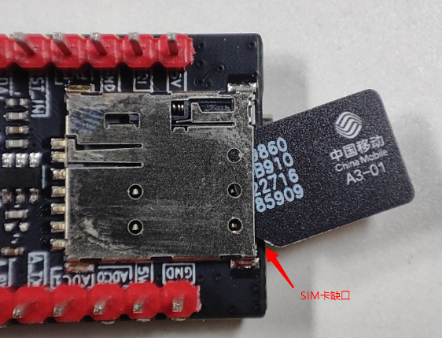
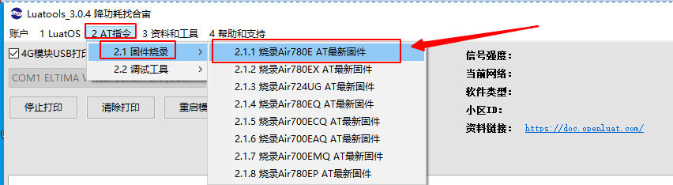

## 一、AT 命令概述

AT 命令是一种古老的使用方式，从有线通信就开始使用了。

距离到 2024 年的今天， 已经有超过 40 年的使用历史。

AT 命令的使用场景是，把 4G 模组当做一个黑盒配件，设备必须有一个主控 CPU。

设备的主控 CPU， 通过串口，（也可以是 SPI 或者 USB，但是 99% 的场景都是通过串口），发送一个 "AT"字符串开头的指令， 像 4G 模组请求各种服务。

4G 模组完成服务后， 回复一个字符串，向主控 CPU 做应答。

通过这样一系列的发送请求，应答的交互方式， 使设备具备了通信能力。

AT 命令发展到今天， 功能日趋完善。

厂家的 4G 模组的 AT 指令至少具备如下完善的功能：

1. 基本的网络查询指令 信号强度查询，运营商查询，SIM 卡状态查询，IMEI 查询，注册网络状态查询，等等；
2. 各种通信协议的支持 TCP/UDP 协议，HTTP 协议，FTP 协议，MQTT 协议，等等；
3. 模组内部资源的使用文件系统的存入，删除，查询，等等。

尽管 AT 使用起来很便利，但是 AT 指令方式依然有几个明显的缺点：

1. 运行效率低 只能是两个物理 CPU 通过串口这样的介质做异步通信， 沟通效率很低，如果要做高效的业务和通信的整合动作的话， 代价更大。
2. 需要一个额外的主控 CPU；
3. 对于复杂度不高的物联网设备，虽然 4G 模组本身的运算资源和存储资源已经过剩， 但是为了使用 AT 指令，依然需要一个额外的主控 CPU。
4. 为了节约成本，主控 CPU 往往会选择一个资源不太大的型号，通常无法运行高级语言， 所以往往要用 C 语言开发业务逻辑。
5. 这需要研发团队熟悉主控 CPU 的开发架构，仍然是一个不小的学习成本。
6. 而 4G 模组因为资源足够大， 大多数 4G 模组已经支持脚本开发应用了，
7. 所以省掉设备主控 CPU，直接用 4G 模组开发应用， 研发成本更低。

尽管 AT 指令有这些缺点， 但是由于 AT 指令有庞大的用户群， 基于使用的惯性， AT 指令在今天仍然有非常大的使用比例。

## 二、演示功能概述

本文教你怎么使用 AT 命令，通过几个简单的步骤，就可以让合宙 4G 模组与 UDP 服务器通讯。

1. 使用 UDP 服务器
2. 4G 模组插卡开机后，使用 AT 指令完成 UDP 链接建立，数据发送，数据接收以及链接关闭操作

## 三、准备硬件环境

工欲善其事，必先利其器。在正式介绍本功能示例之前，需要先准备好以下硬件环境。

### 3.1 Air780E 开发板

本文使用 Air780E 核心板，如下图所示：


点击链接购买：[Air780E 核心板淘宝购买链接](https://item.taobao.com/item.htm?id=693774140934&pisk=f1eiwOqL25l1_HYiV6D1ize3wN5d5FMjRrpxkx3VT2uIHCCskWm4kysffAEqor4KRRIskGT0ooqi_coq7DWE000qbVr2mmzKQjNtkV3mnoalvaBRelZshA7RyTFdpD4xQco2_VS2Tcnvc89h5lZshq-pu_FUfEDVVdOmgrkET0ir3mkq_MDEmmM2QjJaY2uI0UGAoNueWRjiw4YTC-_opNr-zluaXleFpfR_X2fhTJVn94W--KJ4KcqQreCDEs3zNVh-DyWpIxqEmyc8savgoor7gX2D7GUzmW4jBJS2_4PTWjestFRZqA0iaRlwjdkIgW2nBR7XNkEn7bDL96_tMA4gN4GNOwa0xVU4IX8G4iReapZyhDSYLIOj_DinyhbSB2IHjbEhxMA51foIXaIhxItMPKJlyMjHNEGZAcQR.&spm=a1z10.5-c-s.w4002-24045920841.33.639f1fd1YrS4b6&skuId=5098266470883) ；

此核心板的详细使用说明参考：[Air780E 产品手册](https://docs.openluat.com/air780e/product/) 中的 << 开发板 Core_Air780E 使用说明 VX.X.X.pdf>>，写这篇文章时最新版本的使用说明为：[开发板 Core_Air780E 使用说明 V1.0.5.pdf](https://cdn.openluat-luatcommunity.openluat.com/attachment/20240419155721583_%E5%BC%80%E5%8F%91%E6%9D%BFCore_Air780E%E4%BD%BF%E7%94%A8%E8%AF%B4%E6%98%8EV1.0.5.pdf) ；核心板使用过程中遇到任何问题，可以直接参考这份使用说明 pdf 文档。

### 3.2 SIM 卡

准备一张可以上网的 SIM 卡，可以是物联网卡，也可以是自己的手机卡；

注意：SIM 卡不能欠费，可以正常上网！！！

### 3.3 PC 电脑

准备一台电脑；

注意：电脑有 USB 口，并且可以正常上网！！！

### 3.4 数据通信线

准备一根数据线，此数据线的作用是，连接 Air780E 开发板和 PC 电脑，通过 AT 命令完成业务逻辑的控制和交互；

有两种数据线可以使用，二选一即可；

第一种数据线是 USB 数据线（连接 Air780E 开板的一段是 Type-C 接口），一般来说这种数据线如下图所示：


普通的手机 USB 数据线一般都可以直接使用；

第二种数据线是 USB 转 TTL 串口线，一般来说这种数据线如下图所示：


在本教程中，使用的是第一种 USB 数据线。

### 3.5 组装硬件环境

按照 SIM 卡槽上的插入方向，插入 SIM 卡，注意不要插反！

如下图所示，将 SIM 卡用力推入卡槽，听到咔嚓声音后即可。




USB 数据线，连接电脑和 Air780E 开发板，如下图所示：


## 四、准备软件环境

工欲善其事，必先利其器。在正式介绍本功能示例之前，需要先准备好以下软件环境。

### 4.1 Luatools 工具

要想烧录 AT 固件到 4G 模组中，需要用到合宙的强大的调试工具：Luatools；

详细使用说明参考：[Luatools 工具使用说明](https://docs.openluat.com/Luatools/) 。

### 4.2 AT 固件

4G 模组中必须烧录正确的 AT 固件才能支持 AT 命令功能；

通过 Luatools 可以烧录 AT 固件；

有两种方式可以获取到 Air780E 模组的最新 AT 固件，二选一即可；

第一种方式是通过 Luatools 获取，如下图所示，可以直接选中最新版本的 AT 固件：



第二种方式是访问：[Air780E 固件版本](https://docs.openluat.com/air780e/at/firmware/) ，找到最新版本的固件即可。

### 4.3 合宙 合宙 UDP/UDP web 测试服务器

为了方便测试，合宙提供了免费的不可商用的 [合宙 UDP/UDP web 测试服务器](https://netlab.luatos.com)；

### 4.4 PC 端串口工具

在量产的项目硬件设计中，一般都是由主控 MCU 通过 UART 给 4G 模组发送命令实现具体的业务逻辑；

在本教程中，为了测试方便，没有使用主控 MCU；

而是使用了 PC 电脑上的一个串口工具 LLCOM 给 4G 模组发送命令来实现演示功能；

LLCOM 的下载链接：[LLCOM](https://llcom.papapoi.com/index.html) ，详细使用说明可以直接参考下载网站。

## 五、使用方法举例

### 5.1 确认开发板正常开机并联网正常

本次教程所用固件版本是 v1169，通过 luatools 烧录过固件后可以通过打印来判断设备情况，具体参考下图：


### 5.2 UDP 相关指令

[点击连接查看合宙 4G 模组 TCPIP 相关命令](https://docs.openluat.com/air780e/at/app/at_command/#tcpip)

### 5.3 打开测试服务器

在本文中用合宙 UDP/UDP web 测试服务器来演示整个过程。

点击右侧连接进入工具：[https://netlab.luatos.com](https://netlab.luatos.com)，浏览器中出现如下界面：


点击右上角“打开 UDP”，在 WEB 页面左上角会显示当前可用于连接的 UDP 服务器 IP 地址和端口号


如下图标记处：待测试的 IP 地址为:112.125.89.8： 端口号为:44482


注意：读者进行测试时 IP 和端口会随机分配，测试中我们替换成对应的 IP 和端口号即可。

## 六、UDP 通信实例

### 6.1 UDP 非透传应用 1:模块做为客户端，单链接，数据发送和数据接收

下面演示及普通连接流程，并进行 UDP 通讯操作。

查看流程时需要注意指令后面注释的内容，有助于理解指令具体作用

```
AT+CIPMUX=0         //设置为单链接模式

OK

AT+CIPQSEND=1        //设置为快发模式

OK

AT+CSTT               //启动任务，设置APN模块注册网络后会从网络自动获取<apn>并激活一个PDP上下文(此<apn>可以通过AT+CGDCONT?来查询)，所以直接输入AT+CSTT即可，模块内部会按照自动获取的<apn>来设置CSTT的APN
                
OK  

AT+CIICR             //激活移动场景，获取IP地址

OK  

AT+CIFSR            //查询分配的IP地址

10.83.172.111        //   此处IP随机   

AT+CIPSTART="UDP","112.125.89.8",45214 //建立UDP链接，其中:"UDP"为链接的协议类型，“112.125.89.8"为对端服务器的IP地址45214 为对端服务器的UDP端口号

OK

CONNECT OK        //如果链接成功，会有如此URC上报

AT+CIPSEND        //发送数据
>                 //等待发送的内容
234567890<CTRL-Z>//当出现">"后，输入待发送的数据:0123456789。<CTRL-Z>用来发送数据，发送16进制数0x1A即等同于发送<CTRL-Z>。

DATA ACCEPT:10    //成功将数据发送到模块
```

执行到此处，服务器成功接收到字符串“1234567890”


如下图，在 WEB 工具输入框输入字符“123456789”，点击发送按钮，模组成功接收字符“123456789”


```
AT+CIPCLOSE        //关闭UDP链接

CLOSE OK            //关闭成功

AT+CIPSTATUS        //查询下链接状态

OK
STATE: TCP CLOSED

AT+CIPSHUT        //关闭移动场景

SHUT OK

AT+CIFSR        //查询当前的模块IP

+CME ERROR: 3   //IP地址已经没有了
```

指令以上执行如下图所示：


### 6.2 UDP 透传应用 1：模块做为客户端，单链接，数据发送和数据接收

```
AT+CIPMODE=1                //设置TCPIP应用为透明传输模式

OK

AT+CIPQSEND=1                //设置为快发模式

OK

AT+CSTT                       //激活移动场景，获取IP地址

OK

AT+CIFSR                        //查询分配的IP地址

10.83.172.111                    //此处IP随机

AT+CIPSTART="UDP","112.125.89.8",45214    //建立UDP链接，其中:"UDP"为链接的协议类型,“112.125.89.8"为对端服务器的IP地址45214 为对端服务器的UDP端口号

OK

CONNECT                          //如果链接成功，会有如此URC上报
                                    //透传开始，在这里输入数据并传送，此时也可以接收服务器传来的数据,发送的字符内容都原样的会直接发送到服务器（“+++”字符除外）
```

此时发送字符“123456789”和“abcdefg”都直接发送到的服务器，如下图


哪怕是 AT 指令也会原样发送到服务器如：“AT+CSTT”


服务器下发的内容也会原样的发送到模组，如下图：


如果需要关闭连接，需要退出透传模式，使用“+++”字符串可以让模组退出透传模式，注意"+++"后不能够带有回车和其他字符。

```
+++                //推出透传模式，注意末尾不加回车
OK
```

指令执行实例如下图：


退出透传模式后我们可以正常发送 AT 指令，关闭连接，指令序列如下：

```
AT+CIPCLOSE        //关闭TCP链接

CLOSE OK            //关闭成功

AT+CIPSHUT            //关闭移动场景

SHUT OK               //关闭成功
```

指令执行实例截图如下：


当传输中有协议栈错误发生时，会转入 AT 命令状态并上报该错误码，指令如下：

```
UDP ERROR:xx            //当传输中有协议栈错误发生时，会转入AT命令状态并上报该错误码

AT+CIPSHUT                //发生这种情况时，+CIPSHUT关闭连接。如果没有错误发生，则+++返回AT命令状态，再+CIPSHUT关闭连接

SHUT OK
```

## 七、总结

### 7.1 模块上电初始化以及 **TCPIP **流程。


### 7.2 单链接状态机

当输入 TCPIP 相关命令以后， 模块的状态也会发生相应的迁移。 查询状态的命令是 AT+CIPSTATUS


### 7.3 多链接状态机


关于单连接状态机的几点说明：

1.输入 AT+CIICR， 会马上进入 IP CONFIG 状态， 当返回 OK 后， 会进入到 IP GPRSACT 状态；

2.输入 AT+CIPSTART 后， 会立马进入 IP/UDP CONNECTING 状态， 如果后续模块上报 CONNECT OK 这个 URC，表明连接服务器成功， 此时进入 CONNECT OK 状态；

3.输入 AT+CIPCLOSE 后， 立马进入 TCP/UDP CLOSING 状态， 此时如果模块上报 CLOSE OK， 则表明关闭与服务器的连接成功， 此时模块进入 TCP/UDP CLOSED 状态；

4.如果模块上报 +PDP DEACT 这个 URC， 则标志着模块释放 PDP 上下文， 并进入了 PDP DEACT 状态；

5.在 IP GPRSACT， IP STATUS， CONNECT OK 以及 TCP/UDP CLOSED 状态下， 输入 AT+CGATT=0， 则也可以使模块释放上下文， 进入 PDP DEACT 状态；

6.模块进入 PDP DEACT 状态， 仍需要输入 AT+CIPSHUT， 进入 IP INITIAL 状态；

7.模块在各个状态下均可以输入 AT+CIPSHUT， 进入 IP INITIAL 状态。

## 八、参考资料

**8.1 合宙 Air780E 模组资料中心**

[https://docs.openluat.com/air780e/](https://docs.openluat.com/air780e/)

**8.2 Air780E AT TCP 快速入门教程**

[https://docs.openluat.com/air780e/at/quick_start/tcp/tcp/](https://docs.openluat.com/air780e/at/quick_start/tcp/tcp/)

## 九、使用到的工具

[https://docs.openluat.com/air_tools/](https://docs.openluat.com/air_tools/)

## 十、常见问题 Q&A

### 10.1  问：开发板发送 AT 指令无任何响应？

a.确保模组已经开机；

b.开发板有两个 USB 端口，确保 Micro USB 接入开发板标识 USB 的端口上；

c.电脑 USB 驱动是否安装正确；

d.串口助手是否选择了正确 AT 指令端口；

e.检查串口助手参数是否设置正确，如波特率，停止位，奇偶校验，停止位，新行发送等；

f.确保模组固件为标准 AT 固件。

### 10.2  问：模组 AT 指令测试正常，但无法建立 UDP 链接？

a.检查模组建立 UDP 链接前是否已经获取到 IP 地址，通过指令 AT+CIFSR 查看；

b.检查 UDP 参数是否正确，如指令 AT+CIPSTART="UDP",XXX,YYY, “xxx”表示 UDP 连接 IP 地址"YYY"为端口号，同时需要确保发送建立 UDP 连接前服务器对应的端口处于打开状态。

### 10.3 问：重试多次 PDP 激活失败，UDP 应用一直连接失败，怎么解决？

a.使用 RESET 引脚复位模块

b.极端情况下，直接给模块断电，再上电，POWER KEY 引脚拉低开机

## 给读者的话

> 本篇文章由 `Murphy`开发；
>
> 本篇文章描述的内容，如果有错误、细节缺失、细节不清晰或者其他任何问题，总之就是无法解决您遇到的问题；
>
> 请登录[合宙技术交流论坛](https://chat.openluat.com/)，点击[文档找错赢奖金-Air780E-AT-软件指南-应用实例-UDP](https://chat.openluat.com/#/page/matter?125=1847188717089980418&126=%E6%96%87%E6%A1%A3%E6%89%BE%E9%94%99%E8%B5%A2%E5%A5%96%E9%87%91-Air780E-AT-%E8%BD%AF%E4%BB%B6%E6%8C%87%E5%8D%97-%E5%BA%94%E7%94%A8%E5%AE%9E%E4%BE%8B-UDP&askid=1847188717089980418)；
>
> 用截图标注+文字描述的方式跟帖回复，记录清楚您发现的问题；
>
> 我们会迅速核实并且修改文档；
>
> 同时也会为您累计找错积分，您还可能赢取月度找错奖金！
