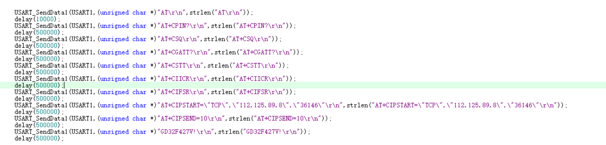

## 主控MCU端发送AT命令给4G模组后，不等AT命令的应答，只靠延时来处理，可以吗？

有的用户直接按照以下方式处理AT交互

这种处理方式，主控MCU发送AT命令给4G模组后，只靠延时来判断执行结果，这种方式是非常不可靠；

一般来说，正常的处理方式为：MCU发送每条AT命令给4G模组后，可以设置一个最长等待应答的时间，如果在这个时间内返回了应答，直接解析应答结果即可；如果超时没有返回应答，根据自己的项目设计，选择合适的方式，重启4G模组和MCU整个系统即可。
