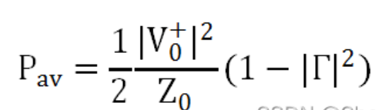
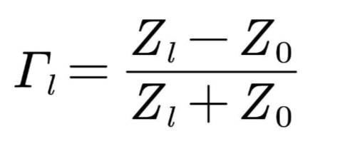
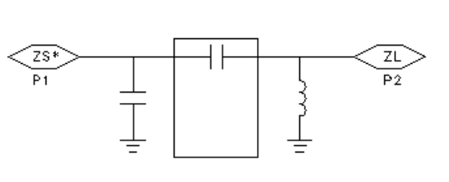
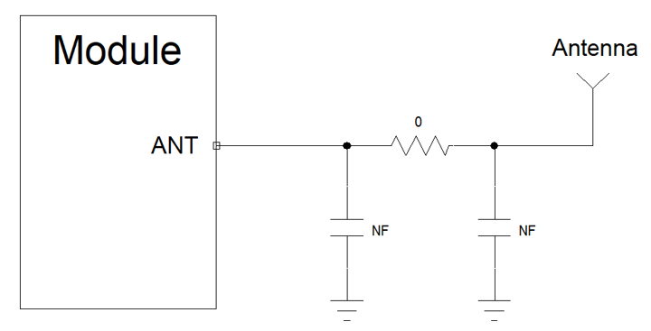
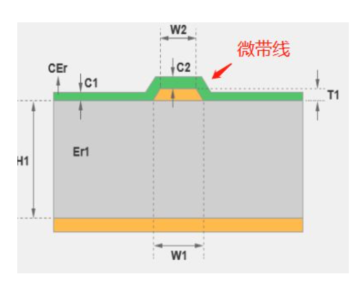
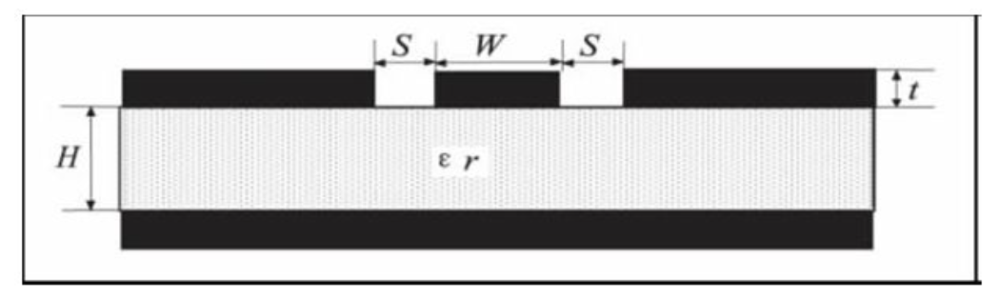
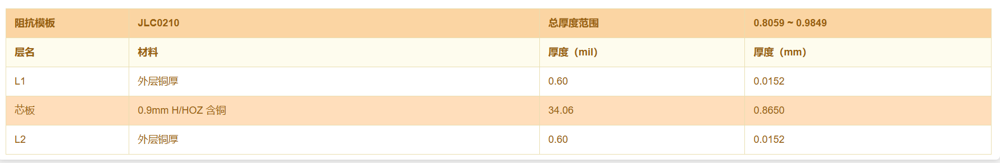
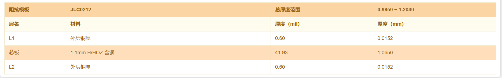
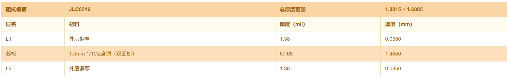
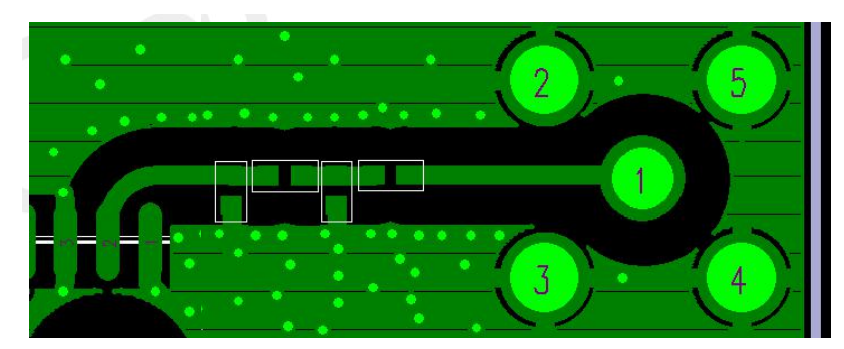

# Air780E 天线传输线设计指导 laolu

### 背景概述

Air780E 模块属于 Cat.1 bis R13 架构，天线架构精简为单天线架构，去掉了分集接收天线，因此 Air780E 模块只需要一根天线。

本文主要讨论 Air780E 模块天线管脚到 4G 天线之间的电路设计和走线规则。

> [!TIP]
> 知识点：
> Cat.1 bis 相对于 Cat.1 的区别是，后者为两根天线(一根主天线，一根分集天线)，设计和应用上更简单，更符合低速物联网的实际应用场景。

### 天线的阻抗控制和匹配

由于 Air780E 射频天线传输的信号频率区间从 824MHz 到 2655MHz 不等(对应于 Air780 所支持频段 FDD:B1/3/5/8 和 TDD:B34/38/39/40/41 的频率空间)，属于高速模拟信号，因此对于 Air780E 模块的天线电路设计，主要目的是保证射频信号无损的从模块天线管脚传输至 4G 天线，也就是关注于模块和 4G 天线的射频 PCB 传输线以及匹配电路。

整个射频传输链路如下所示：

4G 模块---->PCB 传输线-----> 天线匹配---->PCB 传输线----> 射频连接器----> 同轴传输线---->4G 天线

> [!TIP]
> 说明：
> 有些产品可能不需要“射频连接器”和“同轴传输线”，本文仅以需要“射频连接器”和“同轴传输线”的情况进行说明；

**阻抗控制:**

根据传输线理论，负载端的传输功率为:



其中 Γ 为反射系数；Z0 为传输线特征阻抗；V0 为传输电压。

由此可见

- 当反射系数为 0，即负载匹配时候，传送到负载的功率最大
- 当反射系数为 1，即负载失配时候，传送到负载的功率为 0。

因此，为了保证尽可能保证射频功率无损的传到 4G 天线，则必须保证 PCB 传输线的反射系数尽量接近 0，

而反射系数为：



其中 Γ 为反射系数；Z0 为传输线特征阻抗；Zl 负载端特征阻抗。

- 负载阻抗 ZL = Z0，根据反射系数的公式，分子为 0，所以，反射系数为 0。表示无反射。
- 当负载开路的时候，即负载阻抗无穷大，分子分母上的 Z0 可以忽略不计，所以，反射系数为 1。

对于射频系统的行业规范，射频器件输出阻抗和输入阻抗均是按照 50 欧姆特征阻抗来设计，因此，在我们设计 PCB 传输线时也要将传输线特征阻抗控制在 50 欧姆附近才能保证反射系数最小。

**匹配网络:**

由于模块射频管脚输出阻抗和 4G 天输入阻抗由于各种原因，无法完全做到精确 50 欧姆特征阻抗，总是会有容抗的成分，因此就需要增加匹配网络来调整信源和负载为纯组性，即负载阻抗与信源阻抗满足共轭匹配时，能够时负载得到最大功率。

通常在 4G 模块天线端预留 Π 型匹配网络，以便在 4G 天线调试时能够给与足够的匹配调整空间。



### 天线传输线的参考设计

模块天线电路的参考设计如下，虽然整个电路原理设计并不复杂，但天线走线的 PCB 设计非常重要，直接影响整个系统的射频指标性能。



注意：

- 连接到模块 RF 天线焊盘的 RF 走线必须使用微带线或者其他类型的 RF 走线，阻抗必须控制在 50 欧姆左右；
- 在靠近天线的地方预留 Π 型匹配电路，两颗电容默认不贴片，电阻默认贴 0 欧姆，待天线厂调试好天线以后再贴上实际调试的匹配电路；
- Π 型匹配电路靠近天线放置；

### 推荐的 PCB 堆叠和线宽方案

一般情况下，射频信号线的阻抗由材料的介电常数、走线宽度(W)、对地间隙(S)、以及参考地平面的高度(H)决定，因此天线走线需要做 50 欧姆特征阻抗控制，需要对本文前面所述的几个参数做精确控制；

PCB 特性阻抗的控制通常采用微带线与共面波导两种方式。

**微带线：**

微带线是一根带状导线，指只有一边存在参考平面的传输线，顶部和侧边都曝置于空气中(也可上敷涂覆层)，位于绝缘常数 Er 线路板的表面之上，以电源或接地层为参考。如下图所示：



> [!TIP]
> 注意：
> 通常在 PCB 设计时会在表面大范围覆铜，如果采用微带线做阻抗控制，要注意射频走线要与周围覆铜的地保持 3 倍线宽以上，避免周围的地对阻抗的影响。

**共面波导：**

共面波导是将两个平行的导体与一个介质隔离开来，它们位于同一平面内，而电场则穿过介质。相对于微带线和带状线，共面波导的特点是**结构简单**、**宽带**、**低损耗**、易于与其他微波元器件进行集成等优点，适用于集成电路中高频段的传输。



共面波导需要精确控制射频走线与周围地铜箔的距离，相对微带线来说控制难度相对较高。

**微带线与共面波导的选择：**

虽然微带线和共面波导模型理论上都能做到传输线的 50 欧姆阻抗控制，但是在实际的设计中还要考虑阻抗控制后的线宽能否具备实际可操作，例如，在用 2 层 PCB 板，1.2mm 板厚情况下用微带线模型算出的 50 欧姆理论线宽为 77mil， 这个线宽在实际设计中根本无法设计，即不具备可操作性；同样的用共面波导模型，在距离两边地铜箔 4mil 距离情况下，线宽仅 13.8mil 就能达到 50 欧姆阻抗，显然，这种情况下共面波导模型更符合实际设计要求。

**常用的 PCB 50 欧姆阻抗控制堆叠方案：**

2 层板 1.0mm 板厚：共面波导 阻抗线到铜箔距离 5mil，线宽 17.56mil；



2 层板 1.2mm 板厚：共面波导 阻抗线到铜箔距离 5mil，线宽 19.21mil；



2 层板 1.6mm 板厚：共面波导 阻抗线到铜箔距离 5mil，线宽 19.81mil；



### 天线传输线设计规则

在射频天线接口的电路设计中，为了确保射频信号的良好性能与可靠性，建议遵循以下设计原则：

1. 传输线整段走线都要进行 50 欧姆阻抗控制；
2. 与射频引脚相邻的地引脚不做热焊盘，要与地充分接触；
3. 射频引脚到射频连接器之间的距离应尽量短，同时避免直角走线，建议走线夹角保持为 135°；
4. 建立连接器件的封装时，信号脚需与地保持距离；
5. 射频信号线参考的地平面应完整；在信号线和参考地周边增加一定量的地孔可以帮助提升射频性能；
6. 射频信号线必须远离干扰源，避免和相邻层的任何信号线交叉或平行；



```
                                                       微带线阻抗控制模型的走线示例
```

### 你一定要听的几句忠告

1. 天线设计，是 4G 模组应用中最容易踩坑的地方，这也是所谓的行业内专业人员和行业外非专业人员最大的经验差别；
2. 天线设计的差，信号质量就差，在基站信号好的地方体验不出来差别，最多就是功耗大一点(信号越差，发射功率越大，电流就越大，耗电量就越多)，但在基站信号不那么好的地方，就是能联网和不能联网的区别，体验一个天上一个地下；
3. 如果使用的是外置天线，比如棒状天线，这时只需要内部 PCB 走线就可以，本文已经做了详细描述和提醒；
   如果使用的是内置天线，天线的性能不仅与内部 PCB 走线有关系，也与外壳的材质、天线在外壳内的空间以及天线周边的器件干扰等等都有关系，需要找专业的天线厂进行评估，尤其是在设计之初就要同天线厂进行沟通，以免后续生米做成熟饭造成无法挽回的损失；
4. Air780E 也支持 WiFi Scan，跟 4G 共用天线，不需要单独针对 WiFi Scan 功能进行天线调试；
5. 虽然本文讲了很多关于天线方面的专业知识，但是对于大多数用户来说是不需要自己深刻掌握，只需要知道天线常识的来龙去脉就可以了，大多数时候只需要找专业的天线厂帮忙搞定即可；
