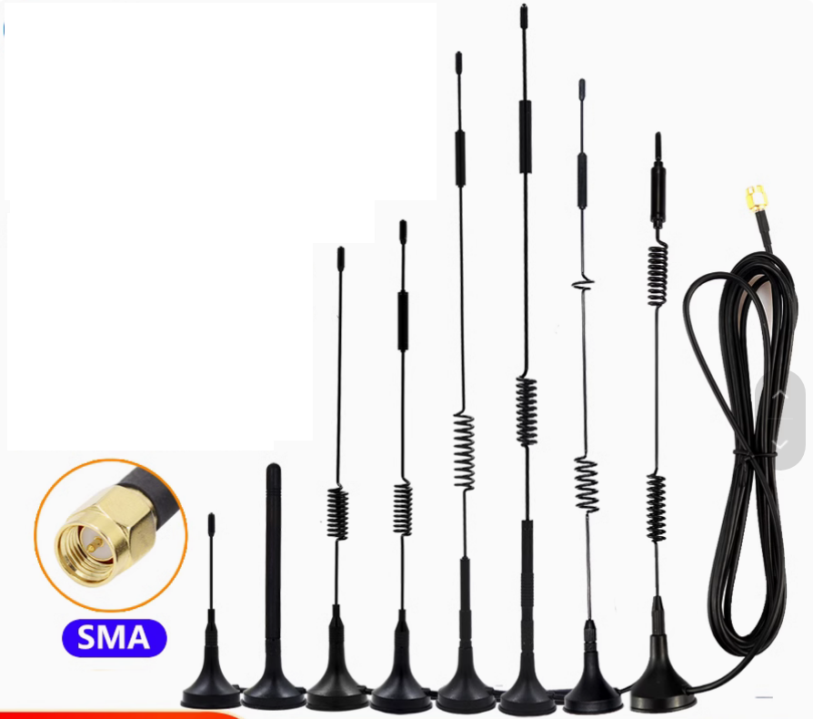
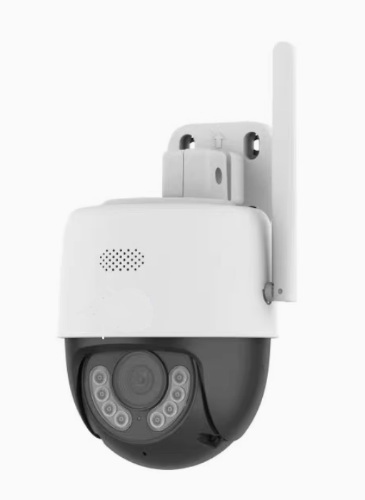
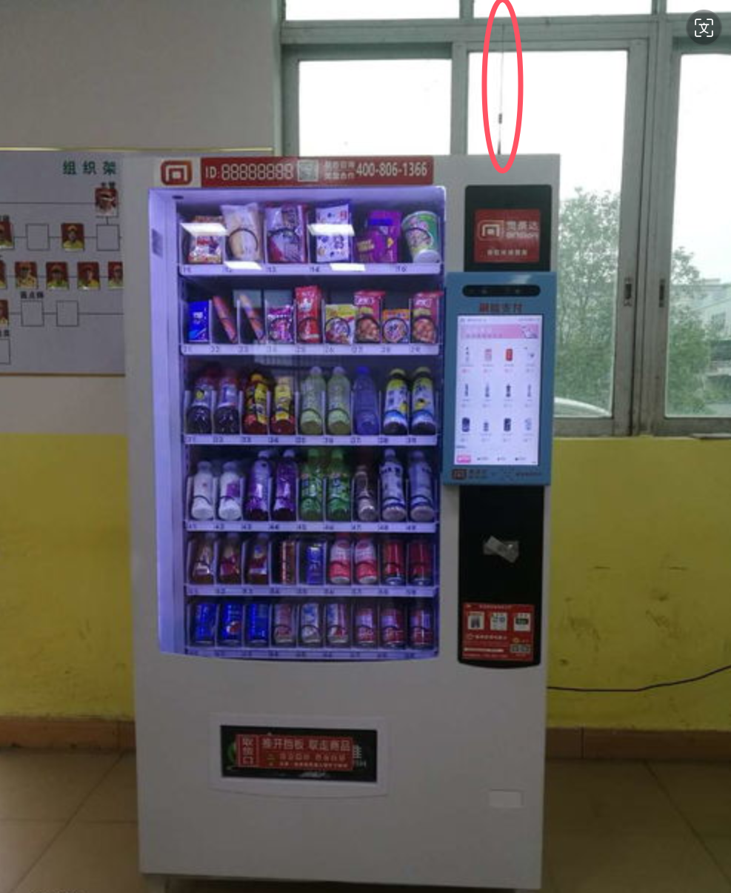
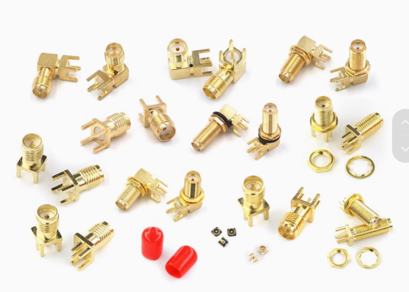
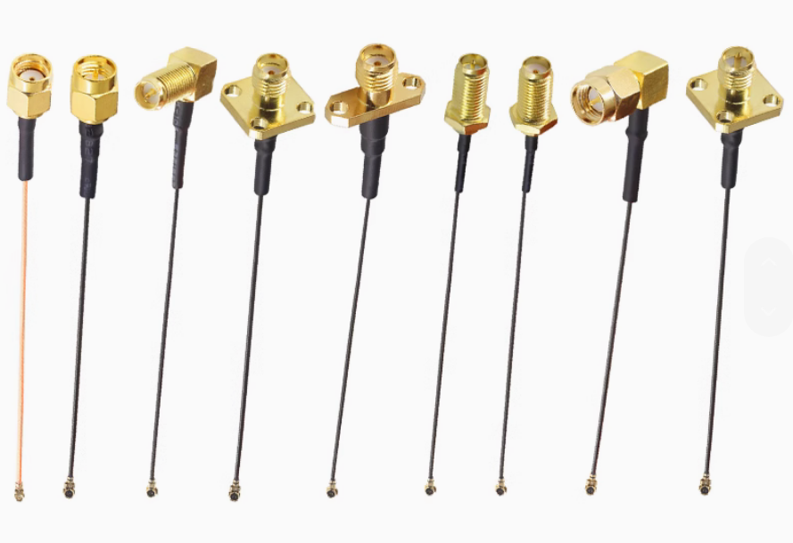
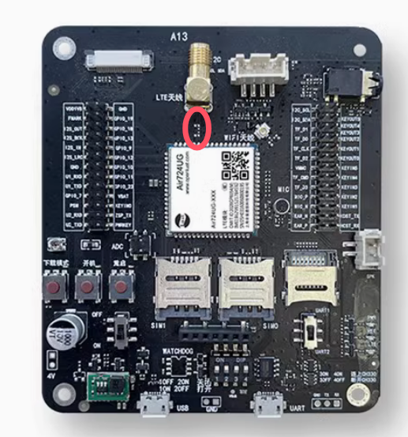
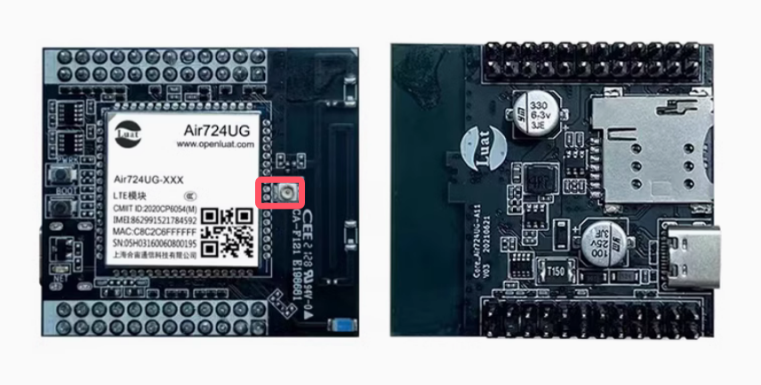
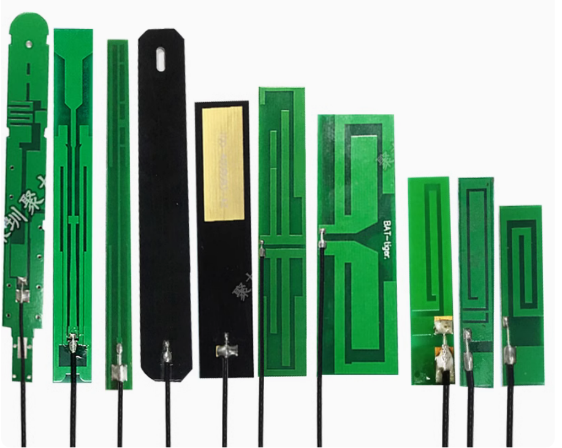
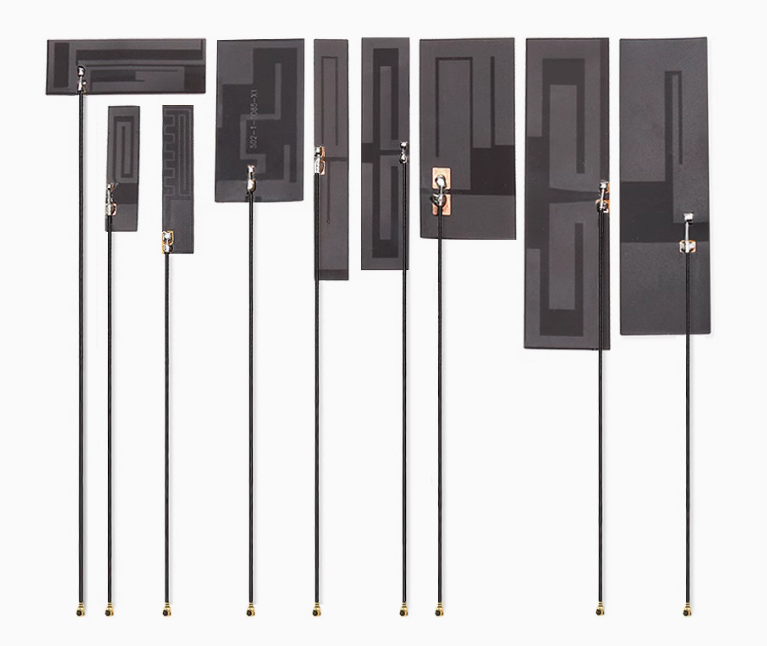
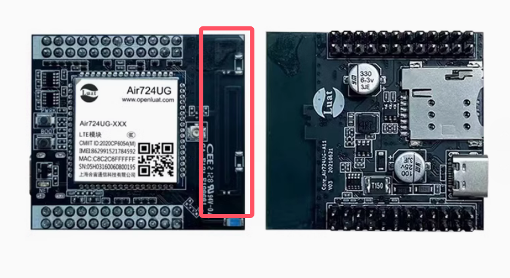

# 合宙 | 关于蜂窝模组天线的一些大白话常识

蜂窝模组这个产品形态存在的最大意义，从产业链分工上来说，是提升社会效率，毕竟让每个需要蜂窝通信的公司自建一个团队重复造轮子，既不经济，也不聪明，就像做衣服的绝大部份公司也没必要自己做拉链一样；

蜂窝模组产品本身最大的特点之一，就是标准化，无论软件的标准化(知道 AT 这玩意一般会被叫做"标准 AT 指令"了吧？)，还是硬件的标准化，包括封装、接口、协议等等，记住，这是所有模组这个产品形态的最大特点；

因为，只有有了标准化，才有可能尽可能的提升不同行业之间隔行如隔山的技术鸿沟，非标的东西是很难大规模在不同行业间普及使用的；

但有一个特例，很难做到标准化，或者说，只能做到部分标准化，这个特例，就是天线；

经常会有客户问我，你家卖天线吗？

我明白，他潜在的意思是：我用过很多种天线，但好像效果都不太好，你家的天线我也想试试看；

天线的问题，我们分类来看。

第一种情况，使用在外壳外面；

这种情况下的天线，一般要么是棒状形式，要么是吸盘形式；

这两种形式的天线，一般也可以认为是标准天线，因为只要符合使用条件，就可以买来直接用；

棒装天线一般长这样；

很显然，因为长的像个棒子，所以叫做棒状天线，就是这么朴实无华；

吸盘天线一般长这样；

 

吸盘，吸，是指磁吸的意思；盘，是指磁吸物的形状是圆的；

很显然，吸盘天线一般都是用在铁质外壳的产品上，而且，外壳通常也会比较大，所以需要延长线连接主板和天线；

(如果是塑料壳，有时也会选择"延长线 + 棒状天线"的形式，不再单独描述)

这两种天线，有什么特点呢？

1，正如前面说的，当你的天线使用场景是在外壳外面，这个时候你就可以根据自己产品所选用模组的频段来选择相应的标准天线即可，主板离外壳近的，就选棒状天线，主板离外壳远的，就选吸盘天线；

补充一个知识点：

国内 4G 蜂窝模组，全频段就这些：

FDD：B1 B3 B5 B8；

TDD：B34 B38 B39 B40 B41；

一般品牌的 4G 棒状天线或吸盘天线都会把这些频段全部调试覆盖全，大多数情况下都可以放心选择；

(前几年 4G Cat.1 刚出来时，蜂窝模组正处于 4G 对 2G 的换代之际，不排除有不负责任的天线厂家拿 2G 库存当 4G 卖，当下这个时候想必这些 2G 天线的库存应该也早就处理完了吧... ...)

使用棒状天线的示例：

使用吸盘天线的示例：

2，无论棒状天线，还是吸盘天线，几乎都有一个共同的特点，那就是用 SMA 接头；

SMA 接头需要注意几点：

1）如果是直接焊接在 PCB 板子上，一要注意 SMA 接头的方向是朝上还是与 PCB 平行，二是看 SMA 自身需要用公头还是母头；

2）如果是通过射频同轴线从 PCB 连接到外壳处，同样也需要注意 SMA 固定方式和 SMA 公母头的选择；

3，无论 SMA 接头直接焊接在板子上，还是通过 IPEX 接头，或者是通过焊接，天线在 PCB 上的走线，也就是从模组引出来到 SMA 或 IPEX 接头或焊接点的这一段，都需要注意做好保护，远离干扰，并做好 50Ω 阻抗匹配，这是非常关键的一点！

如果这一点做不好，其它所有的努力都是白费！

使用 SMA 的示例：

使用 IPEX 的示例：

4，无论棒状天线还是吸盘天线，一般情况下都是"弹簧天线"的变种，只是突破了外壳的限制，做成了不同的形状，包裹了不同的天线外壳；但不要小看这一点，正是因为脱离了产品外壳的限制，所以他们才能够做到标准化；

第二种情况，使用在外壳里面；

就蜂窝模组物联网常见场景而言，大家常遇到的问题无非是三种：

PCB 天线、FPC 天线、PCB 板载天线；

(手机上常用的一些天线形式，比如说 LSD 镭雕天线，不再今天的讨论范围)

PCB 天线长这样：

顾名思义，用 PCB 走线画出来的天线，所以叫 PCB 天线；

FPC 天线长这样：

相较于 PCB 天线是通过 PCB 走线而成，FPC 天线则是通过 FPC 走线而成；

而且，大多数情况下，FPC 一般可以直接粘贴在数量外壳上，非常容易固定；

PCB 板载天线长这样：

直接将天线走在了主板 PCB 上，"拿来就能用"，不用自己再调试，也不用再去花钱单独购买；

这三种天线形式，有一个共同的问题，那就是做成终端产品后就必然要加上外壳，那么必然也就会遇到天线空间、周边干扰以及外壳材质等等各种各样的限制，没有办法不做针对性个性化的调试，那么也就必然无法标准化；

虽然，大多数情况下这样用也没出现过问题，你知道为什么吗？

因为中国的网络基建实在太好了，好到大多数情况下都可以容忍你的天线信号有点烂也不影响使用；

但是，当你设备所在地方的信号质量没那么好的时候，如果你的天线性能不佳，那么问题就会暴露了。

(如果你不信中国的网络基建有多好，那么你可以到海外试试？当地的网络质量分分钟教你如何做人。)

说了这么多，是想提醒大家：

当你的天线是用在塑料外壳内的时候，尤其是当你的内部空间紧凑、PCB 布局紧张、干扰源较多(LCD 屏、电源等)，请一定优先找天线厂家做针对性的调试，否则，天线性能做的差，一切都白费；

我们常说的通信性能，更多的是指弱信号下的射频性能，而弱信号下的射频性能，更多取决于天线的性能！

最后问大家一个问题：

你碰到过"铁壳 + 内部天线"的反常识设计吗？

希望我的读者朋友们都不会犯这样的错误。
