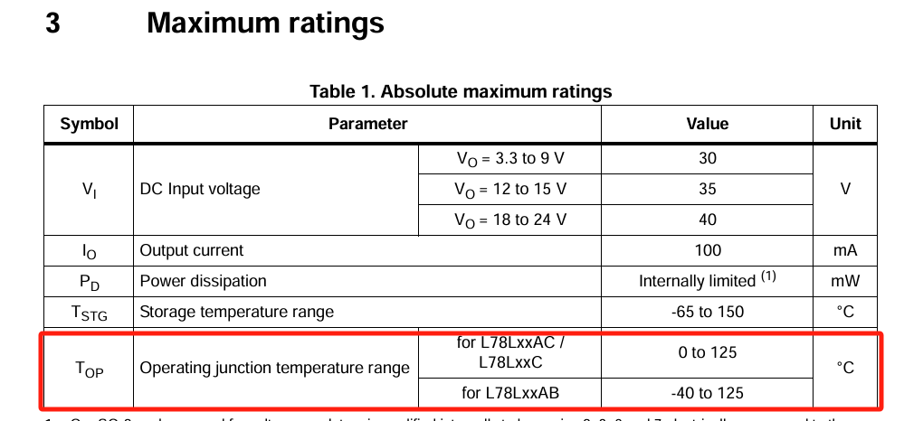
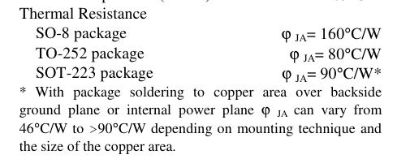
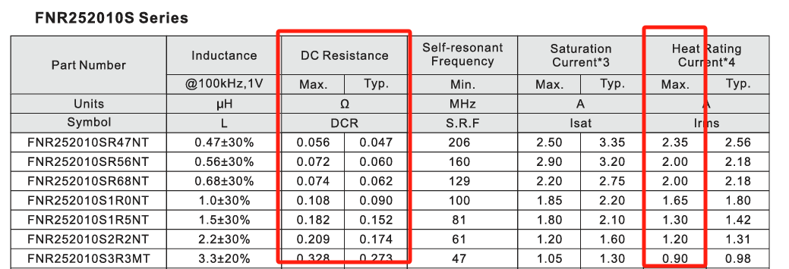
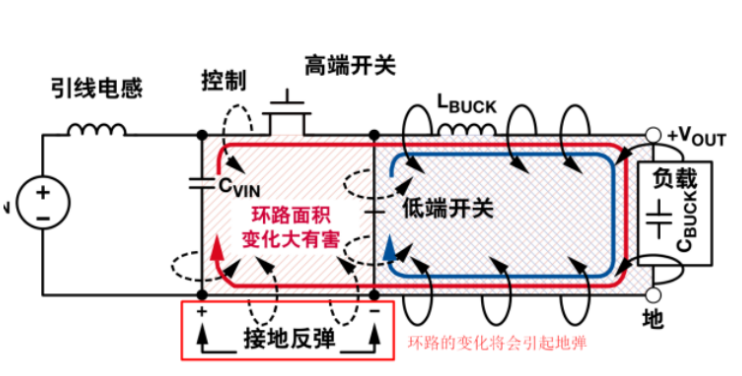
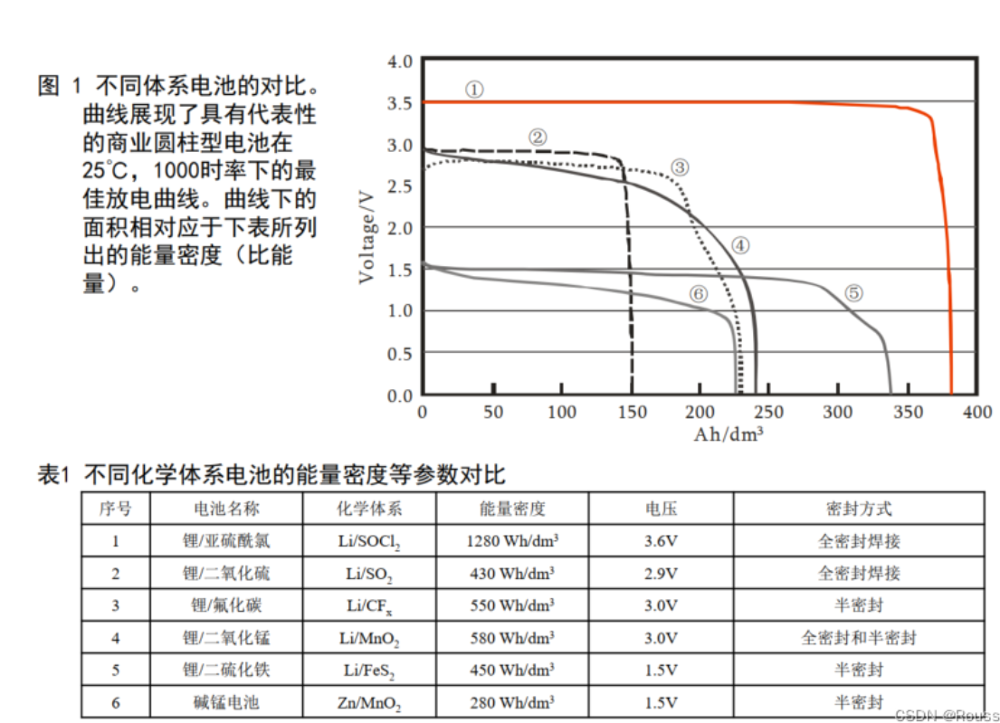
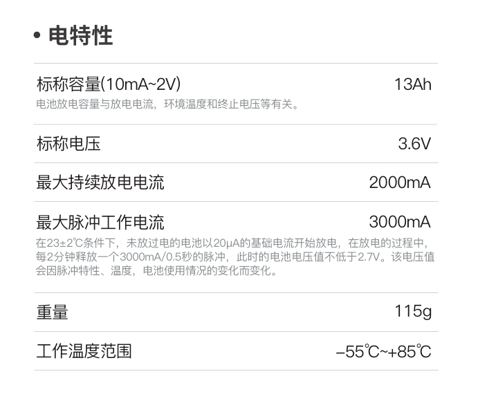
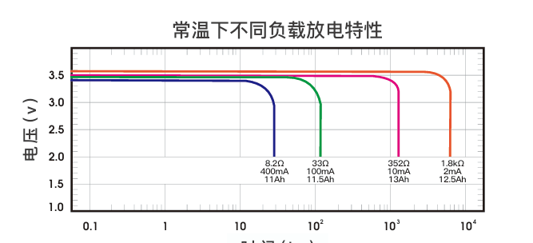
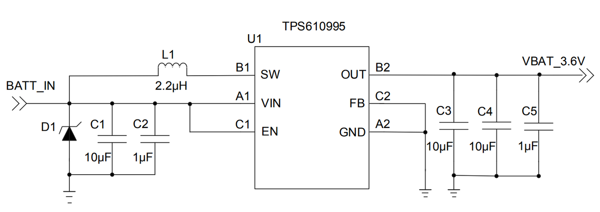
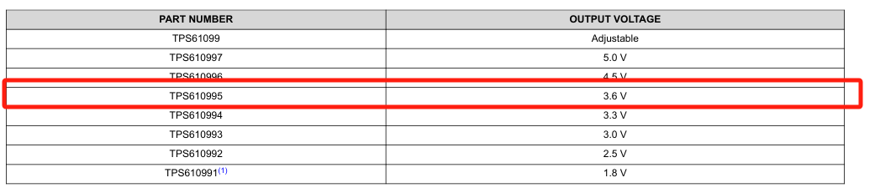
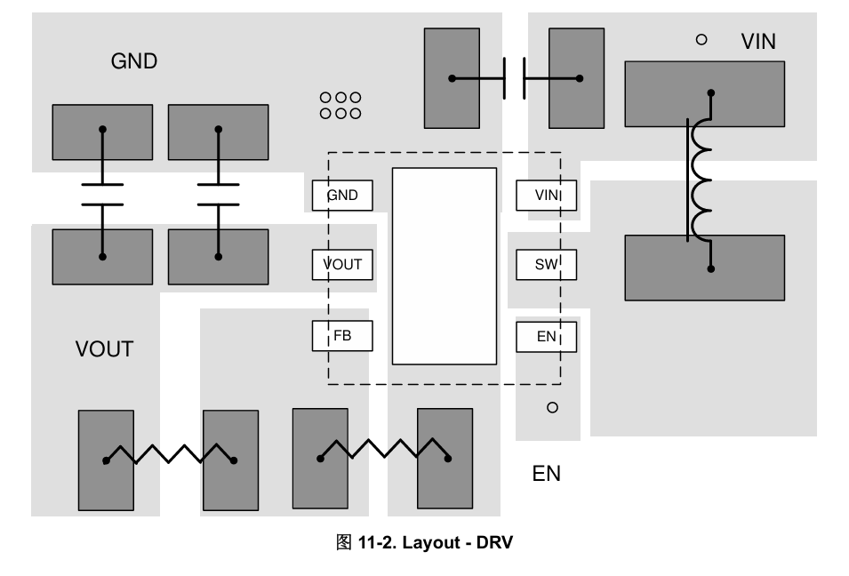

# 常见供电电路

常见的物联网应用场景下对Air780E的供电方式有如下三种：

### 一. LDO供电方式

使用LDO电源芯片线性降压的供电方案，原理简单，电路，走线要求都相对较低，而且输出电源干扰小，稳定，对射频，天线等影响较小。

但是由于Cat.1系统的特色性，对LDO的选型要求较高。如下是一般LDO的电源参考设计

 对于LDO电源的设计与选型有几点注意事项：

- **输入电压和输出电压压差尽量小**。由于LDO常用的是MOS半导通的降压特性，输入电压和输出电压差会加在LDO两端，会导致LDO承受耗散功率，造成发热和能量损失。而Cat.1的工作特性，在射频工作时，最大平均电流(FDD最大发射功率情况下）会达到600~700mA,使得LDO承受的耗散功率尤为严重。为了最小化电压差，建议LDO输出电压设置为接近4.2V，而输入电压建议不要超过5V，否则不建议采用LDO电源方案。
- **LDO器件封装选择。**

不少人选择LDO器件，只看器件的最大输出电流是否满足模块的要求电流，这种做法是错误的。LDO选型最重要的参数是热阻ϕ JA，表示芯片内部热结点到周围环境的热阻。通常芯片内部的结温的计算公式为：

其中： Tj为芯片结温；Rϕ JA 为热阻；TA为室温；PD为LDO芯片的耗散功率；

对于芯片结温Tj，通常规格书会给出当前芯片的最大允许的工作温度，比如如下：

也就是计算出来的LDO结温度不能超过125°C。而通常Rϕ JA 热阻与LDO的封装形式高度相关，具体可以查阅相关LDO芯片规格书，如下：

 例如：从上图规格书中我们可以得知SO-8封装的热阻为160°C/W，按照780E最大平均功率700mA, LDO压差1V计算，室温25°下，SO-8封装的LDO结温为0.7x1x160+25 = 137 °C  就高于了规格书要求的125的最大工作结温，所以SO-8的封装不满足Cat.1应用要求。

所以通常推荐选择封装为TO-252,SOT-223等这些带大面积散热PAD的封装，同时在PCB布局的时候要在空间允许的情况下尽量增加散热PAD的铺铜面积以及尽量多的过孔导热到PCB对面层增加散热面积。

- **LDO布局远离热敏感器件。**Cat.1模块供电LDO由于是比较大的热源，在热敏感的功能区域要尤其注意要远离，比如GPS，晶体振荡器，热敏感传感器。
- **LDO的输出电容的选择**。LDO输出电容容值不是越大越好，不合适的容值会导致输出震荡，计算公式相对复杂，这里不再赘述，感兴趣可以查阅反馈回路设计相关资料。若实际使用中遇到LDO输出震荡问题，调整输出电容即可，一般来说，只要按照LDO规格书推荐的输出电容值就可以。注意靠近LDO输出管脚放置。
- **推荐的LDO选型。**LDO选型不限于如下型号。
  - MIC29302WU   TO-263-5
  - LM317D2T-TR   TO-263-2
  - LM317DCYR   SOT-223-3

### 二 .DCDC供电方式

DC to DC开关电源的供电方式是Cat.1模块常用的方式，有其输出电流高，输入电压范围广，而且功耗相对LDO要低，发热小，同时不需如LDO的大面积散热覆铜。但是比较致命的缺点是容易对射频部分和天线部分造成传导或耦合干扰，从而影响模块的接受性能。但是这个问题是可以通过合理的DCDC电源设计以及PCB布局走线来优化解决。

如下是DCDC参考设计示例：

上图是以杰华特的JW5359M 开关电源举例，讲解各个部分的功能电路：

- C1和C25构成输入电容，其中C1大电容为可选，主要作用是放置于电源连接器附近，用于消除电源插拔时的尖峰电压；C25 22uf要靠近开关电源的电源输入管脚放置。C25电容选型除了耐压要满足输入电压要求外，还要选用低ESR的电容，建议用陶瓷MLCC电容。
- C16为自举电容，用于在DCDC内部下管关闭后能够迅速将上管栅极的电压提高至上管导通，在选型时要注意C16的耐压要大于输入电压。
- L2为功率电感，电感的感值范围可以由芯片规格书中公式进行计算得出，这里不做赘述。功率电感的选型除了关注感值外还需注意下面的几个参数：
  - 

  - 饱和电流（Isat），也就是导致功率电感磁饱和时的最大电流。功率电感进入磁饱和后，此时电流的增大不再转换为磁通量的增加，即立刻失去了电感的特性，导致短路大电流。电感的饱和电流一定要大于DCDC输出的**最大峰值电流。注意，最大峰值电流并不等于输出电流。**而是等于输出电流加上最大纹波电流**，**最大纹波电流可以按照输出电流的50%来估算。比如DCDC的最大输出电流为1A，则最大纹波电流为0.5A，于是最大峰值电流为1.5A，因此选择功率电感的饱和电流要大于1.5A。
  - 温升电流（Irms），功率电感的饱和电流不是固定不变的，通常会随着温度的升高而饱和电流降低。通常Irms是指电感温度在40度时的饱和电流。所以温升电流（Irms）通常会小于额定的饱和电流（Isat）。所以在做电感选型时主要Irms也要高于DCDC的最大峰值电流。
  - 等效直流阻抗(DCR), 也就是功率电感的内阻，主要影响电感的发热，较大的内阻会使得功率电感温度更容易升高，从而降低功率电感的感值和饱和电流。通常功率电感的内阻通常与封装大小直接相关，相同感值下封装更大的电感往往内阻较小。
- 反馈网络（R21,R22,C19)。R21,R22分压构成调整输出电压的反馈，这里不做过多阐述。注意，C19作为前馈电容主要作用是加快DCDC系统的瞬态响应，能够让DCDC在系统负载突然变化时，能够更快的响应，使得输出迅速稳定。通常前馈电容是可选的，但是对于Cat.1系统来说，由于射频脉冲式的工作形式，导致Cat.1系统对供电的瞬态响应要求高，因此前馈电容建议加上。前馈电容的值选择建议对于DCDC芯片规格书推荐值，由于前馈电容会影响DCDC反馈环路的相位，不合适的值会影响环路稳定性，从而引起震荡。
- C34 输出电容。输出电容比较重要，与功率电感一起，影响着DCDC的纹波电压大小。输出电容的计算方法在DCDC芯片规格书里描述得很详细，不做赘述。需要注意的是输出电容要选择ESR较小的MLCC陶瓷电容或者钽电容，且靠近DCDC输出放置。

 **DCDC开关电源的布局要求：**

 DCDC开关电源的布局很重要，对Cat.1射频灵敏度有很大的影响。如下是典型的布局较差的DCDC输出波形：

 上图波形能看到两种周期性的波形：呈现三角形，幅度相对较小的电源纹波；和尖峰脉冲幅值较大的低弹噪声。

- 电源纹波：是由开关电源的开关特性和功率电感输出电容充放电共同作用的结果，只要纹波电压幅值不大，基本不会对系统产生影响。如上图纹波电压峰峰值在20mv左右，相对较小属于正常范围。调节功率电感值和输出电容值以及开关频率均可以优化纹波电压。
- 地弹噪声：由于脉冲时间短频率高而且幅值较大，其高频分量通过电源传到到射频部分很容易对射频造成干扰，造成灵敏度恶化。所以地弹噪声是我们要消除的最大敌人。地弹噪声产生的原因是由于DCDC开关电源在工作时上管和下管分别交替打开而造成的电流环路变化而造成的磁通量变换，从而就会在电流环路上产生感应电动势也就是尖峰电压如下图，所以观察上图波形，可以看到地弹噪声都是出现在上下管切换的时刻。所以地**弹噪声想要通过调节电容和电感值去优化噪声是不可达到的**。

 输入电容和输出电容与DCDC芯片共同构成电流回路，也就是两者回路面积越大，产生的磁通量变化越大，也就是产生地弹噪声越大。因此想要尽可能的最小化噪声，就要在输出电容和输入电容的办法上做文章。

​    **DCDC电源布局示例：**

上图输入电容和输出电容直接放置在输入输出管脚的近端，同时电容地管脚直接就近连接到芯片的地管脚，从而整个输入输出电流环路面积最小。

DCDC布局建议：

1. 优先布局输入输出电容，首先将输入输出电容靠近芯片放置，再考虑其他部分的布局。
2. 输入输出电容的地管脚和DCDC芯片地管脚直接的回路连接，要尽量在表层连接，最好有一定宽度的覆铜。不建议通过过孔通过其他层连接，效果较差。
3. 芯片SW管脚与电感连接的走线尽量短，以减小对外的辐射。
4. 其他的一些通用的设计规则不再赘述。

总之，由于地弹噪声一旦发生，在已经成型的PCB上就很通过常规的硬件整改来定位问题和改善。因此在设计的时候就要特别关注DCDC开关电路的布局和走线。

### 三 .锂电池供电以及充电方式

通过直接用锂电池给模块供电的方式适合运用在便携式物联网的场景，锂电池供电让身边正常工作，充电进行补能。

锂电池的放电特性具有较高的瞬态放电能力而且内阻较低，对于Cat.1系统是比较理想的供电方式，而且Air780E模块的供电电压范围3.3V~4.3V是完全按照锂电池的放电特性来设计。下图是由电池直接给模块供电的参考设计。

- C49 220uF是补能电容，由于锂电池的低内阻和高放电能力，加上本身应用与便携式产品，空间尺寸优先。因此本不需要较大的电容，但是考虑到实际PCB电源走线长度以及电池连接器接触阻抗和电池引线长度等会引入额外的不确定的阻抗，因此会建议酌情加上220uf电容，建议选用低ESR的钽电容。
- C50 C51 C52 构成旁路电容滤波组，不同容值的电容会有不同的协振动点，组合起来能够增加滤波的高频带宽，比单一滤波电容有低的高频阻抗。
- TVS1作为电源端的ESD保护器件。建议在设计时要加上，会显著降低售后不良率。参考选型：PTVSHC3D4V5BH 芯导 ；GESDBL4V5Y1 格瑞宝；

**充电电路**：

 对于锂电池的充电有两种方式：线性充电和开关充电，他们的工作原理图类似与LDO和DCDC开关电源的原理。对于500mA以下的充电电流优选线性充电的方式，成本低，电路简单，干扰较小；对于1A以上的充电电流优先选择开关充电的充电方式；在500mA~1A之前，根据产品的空间尺寸，散热情况选择合适的充电方式。

 下图以线性充电方式为例介绍具体参考设计：

 **设计注意事项**：

- D2和C18构成输入电源端的保护网络，靠近输入端放置。若是5V USB进行充电的化C1容值不宜太大，否则容易触发电脑USB的供电短路保护。如果是直流电源供电，C18建议采用100UF以上的电解电容，电源浪涌保护。
- 充电芯片CHRG管脚为充电指示管脚，通常为开漏输出，需要VBUS输入电源上拉，同时可以通过二极管做隔离同时连接到主控MCU GPIO管脚做充电状态判断，如果采用Air780E做主控的open 二次开发方式，需要连接到带有中断的GPIO。
- 充电芯片PROG管脚用于配置恒压充电下的充电电流，由R5电阻的阻值进行设置，具体参考实际的芯片规格书。建议加上Q4 NPN作为充电控制管脚，可以通过MCU或者Air780E GPIO进行控制，注意Q4的口控制管脚要用VBUS上拉，同时分压到IO电平对应的电压，达到充电芯片默认开启状态。
- 部分锂电池会有温度NTC管脚，用来检测电池电压，这里可以用VDD_EXT做分压，通过ADC检测电池温度，方便做电池安全检测。注意R30的值要根据具体的电池NTC电阻规格来计算，建议分压后的值落在0~1.2V的ADC有效量程之中。

 **充电路径管理**：

  由于锂电池的充电特性，在频繁充放电的情况下会导致锂电池寿命下降，因此在外电长供电的应用场景下（比如4G网络摄像头，无线固话，常供电的电瓶车定位器等）建议做充电路径管理，即当外电供电时会切断电池与模块的供电连接，直接用外部电源给模块供电。（上图线性充电参考设计的TP4056就没有路径管理功能，这种情况下，不能在电池不在的情况下用充电口直接给模块供电）。

### 四 .不可充电锂亚/锂猛电池供电方式
在需要超长待机（以年计算），且不可拆卸的场景（如表计类应用)。这类应用往往需要待机甚至长至10年。这时普通的可充电锂聚合物电池由于自放电率高的问题，无法适用于超长待机的场景。这时就需要用到不可充电的锂亚/锂猛电池。

- 锂亚硫酰氯(Li/SOCl2)电池 ：能量最高的一种电池，不可充电，比能量可达590W·h/kg和1100（瓦时每立方分米）。锂亚电池在其90%以上的容量上都能保持3.6V左右的放电电压，在功率型锂亚电池瞬时放电能力达到大于1A，放低曲线如下图。能够满足于Cat.1通信模块的供电要求。所以对于使用功率型锂亚电池只需直接给Air780E模块供电即可，无需做升压设计。

- 锂二氧化锰电池：能量密度对比锂亚电池要小一些，但是由于其成本低的特点，被广泛应用。锂锰电池工作电压在2.5V~3.0V左右，顺时放低能力在1A左右。由于工作电压较低，因此需要外接升压电路才能给Cat.1通信模块供电。

- 升压参考方案
  对于升压方案的选择，低静态功耗是核心，才能满足超长待机的应用要求。这里推荐TI 的 TPS610995升压芯片（固定3.6V输出版本）。TPS61099x 器件是一款具有 1µA 超低静态电流的同步升压转换器。该器件专为由碱性电池、镍氢充电电池、 锂锰电池或锂离子充电电池供电的产品而设计，能够在轻载条件下高效运行，这对延长电池使用寿命至关重要。如下是参考设计。

  

 注意：TPS610995要选择固定升压版本，可以省掉外部的反馈分压电阻，能够最小化反馈分压上的静态电流。

  

 对于布局layout注意事项，同样要遵循输入输出电容的最小路径原则。参考布局如下：

  

### 总结

文章描述的三种Cat.1模块系统常用的供电方案，其中各有优劣，需要根据具体实际场景进行选择和设计。
