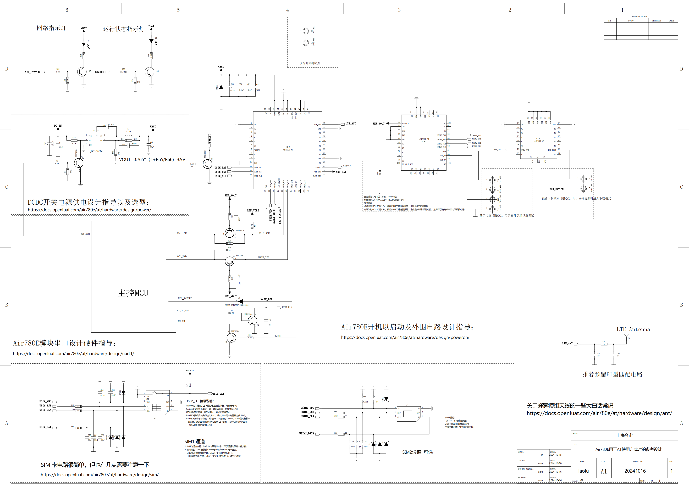

# Air780E用于AT指令使用方式时的参考设计

非pdf版本的参考设计，请挪步到Air780E之“产品手册”中去下载；

Air780E资料共三个分类：

1，产品手册，Air780E产品资料的公用部分，比如硬件手册、参考设计、PCB封装等；

2，AT资料，Air780E用于AT指令开发方式时的相关资料；

3，LuatOS资料，Air780E用于LuatOS二次开发方式时的相关资料；