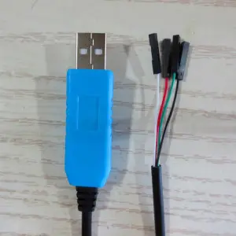
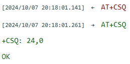
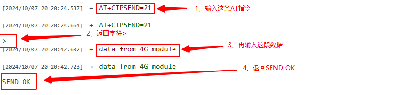

# Air780E AT TCP 快速入门教程

# 一、AT 命令概述

AT 命令是一种古老的使用方式，从有线通信就开始使用了。

距离到 2024 年的今天， 已经有超过 40 年的使用历史。

AT 命令的使用场景是，把 4G 模组当做一个黑盒配件，设备必须有一个主控 CPU。

设备的主控 CPU， 通过串口，（也可以是 SPI 或者 USB，但是 99% 的场景都是通过串口），发送一个 "AT"字符串开头的指令， 像 4G 模组请求各种服务。

4G 模组完成服务后， 回复一个字符串，向主控 CPU 做应答。

通过这样一系列的发送请求，应答的交互方式， 使设备具备了通信能力。

AT 命令发展到今天， 功能日趋完善。

厂家的 4G 模组的 AT 指令至少具备如下完善的功能：

1. 基本的网络查询指令 信号强度查询，运营商查询，SIM 卡状态查询，IMEI 查询，注册网络状态查询，等等；
2. 各种通信协议的支持 TCP/UDP 协议， HTTP 协议，SSL 协议，FTP 协议，MQTT 协议，等等；
3. 模组内部资源的使用 电话本，文件系统的存入，删除，查询，等等。

尽管 AT 使用起来很便利，但是 AT 指令方式依然有几个明显的缺点：

1. 运行效率低 只能是两个物理 CPU 通过串口这样的介质做异步通信， 沟通效率很低，如果要做高效的业务和通信的整合动作的话， 代价更大。
2. 需要一个额外的主控 CPU；

   1. 对于复杂度不高的物联网设备，虽然 4G 模组本身的运算资源和存储资源已经过剩， 但是为了使用 AT 指令，依然需要一个额外的主控 CPU。
   2. 为了节约成本，主控 CPU 往往会选择一个资源不太大的型号，通常无法运行高级语言， 所以往往要用 C 语言开发业务逻辑。
   3. 这需要研发团队熟悉主控 CPU 的开发架构，仍然是一个不小的学习成本。
   4. 而 4G 模组因为资源足够大， 大多数 4G 模组已经支持脚本开发应用了，
   5. 所以省掉设备主控 CPU，直接用 4G 模组开发应用， 研发成本更低。

尽管 AT 指令有这些缺点， 但是由于 AT 指令有庞大的用户群， 基于使用的惯性， AT 指令在今天仍然有非常大的使用比例。

# 二、本教程实现的功能概述

本文教你怎么使用 AT 命令，通过几个简单的步骤，就可以让合宙 4G 模组连接上一个 TCP 服务器，并且模组和服务器之间实现数据的双向传输！

本教程实现的功能定义是：

1. 通过网页端启动一个 TCP 服务器；
2. 4G 模组插卡开机后，连接上 TCP 服务器；
3. 4G 模组向 TCP 服务器发送 `data from 4G module`，服务器可以收到数据并且在网页端显示；
4. TCP 服务器网页端向 4G 模组发送 `data from tcp server`，4G 模组可以收到数据并且通过串口输出显示；

# 三、准备硬件环境

工欲善其事，必先利其器。在正式介绍本功能示例之前，需要先准备好以下硬件环境。

## 3.1 Air780E 开发板

准备一块开发板，有两种开发板可以使用，二选一即可；

第一种开发板是 Air780E 核心板，如下图所示：


点击链接购买：[Air780E 核心板淘宝购买链接](https://item.taobao.com/item.htm?id=693774140934&pisk=f1eiwOqL25l1_HYiV6D1ize3wN5d5FMjRrpxkx3VT2uIHCCskWm4kysffAEqor4KRRIskGT0ooqi_coq7DWE000qbVr2mmzKQjNtkV3mnoalvaBRelZshA7RyTFdpD4xQco2_VS2Tcnvc89h5lZshq-pu_FUfEDVVdOmgrkET0ir3mkq_MDEmmM2QjJaY2uI0UGAoNueWRjiw4YTC-_opNr-zluaXleFpfR_X2fhTJVn94W--KJ4KcqQreCDEs3zNVh-DyWpIxqEmyc8savgoor7gX2D7GUzmW4jBJS2_4PTWjestFRZqA0iaRlwjdkIgW2nBR7XNkEn7bDL96_tMA4gN4GNOwa0xVU4IX8G4iReapZyhDSYLIOj_DinyhbSB2IHjbEhxMA51foIXaIhxItMPKJlyMjHNEGZAcQR.&spm=a1z10.5-c-s.w4002-24045920841.33.639f1fd1YrS4b6&skuId=5098266470883) ；

此核心板的详细使用说明参考：[Air780E 产品手册](https://docs.openluat.com/air780e/product/) 中的 << 开发板 Core_Air780E 使用说明 VX.X.X.pdf>>，写这篇文章时最新版本的使用说明为：[开发板 Core_Air780E 使用说明 V1.0.5.pdf](https://cdn.openluat-luatcommunity.openluat.com/attachment/20240419155721583_%E5%BC%80%E5%8F%91%E6%9D%BFCore_Air780E%E4%BD%BF%E7%94%A8%E8%AF%B4%E6%98%8EV1.0.5.pdf) ；核心板使用过程中遇到任何问题，可以直接参考这份使用说明 pdf 文档。

第二种开发板是 Air780E 低功耗验证板，如下图所示：


点击链接购买：[Air780E 低功耗验证板淘宝购买链接](https://item.taobao.com/item.htm?id=724722276597&pisk=fDkqNlGOsKpVRM8fOryaYfTXvzeYhJLQoAa_jcmgcr4m5owajzoHDrO9MVlrS4FboEdYjOunylsjmSfurkEVns2gizcrkDVj7cKYjP0i7PGXNpixDReMRVJBdmdqGyxxutXcrhqQvPj9-TzZDReM7jctEonx-RQoXlPM48qaxO2gsR2k4lZ_mR40samujz4MuKF2ZFS8aemLrfZhF_hf0baPI9SL0SmWpzXMgYqq4PoD6OXiUoPqCo-xqmPjsDFKh2pNe-iEZ8qZBHfa7Wlih8DDrpV8sfug2bLN_ylicXH7NGfm4Az4txVPYTmoDl0g_bLFdoyjaWkqMhQom2aqt-n1YEizTbPLq7jNigyOWubjzAhVS1P02uzB43RpbhS6iNACU1CTZJEzRnZf61F0uO1qL95O67484ytbc&spm=a1z10.5-c-s.w4002-24045920841.23.639f1fd1YrS4b6&skuId=5208106143672) ；

此低功耗验证板的详细使用说明参考：[Air780E 产品手册](https://docs.openluat.com/air780e/product/) 中的 << 开发板 EVB-Air780E-IO 使用说明 VX.X.X.pdf>>，写这篇文章时最新版本的使用说明为：[开发板 EVB-Air780E-IO 使用说明 V1.2.0.pdf](https://cdn.openluat-luatcommunity.openluat.com/attachment/20231009103600243_%E5%BC%80%E5%8F%91%E6%9D%BFEVB-Air780E-IO%E4%BD%BF%E7%94%A8%E8%AF%B4%E6%98%8EV1.2.0.pdf) ；低功耗验证板使用过程中遇到任何问题，可以直接参考这份使用说明 pdf 文档。

在本教程中，使用的是第一种 Air780E 核心板。

## 3.2 SIM 卡

准备一张可以上网的 SIM 卡，可以是物联网卡，也可以是自己的手机卡；

注意：SIM 卡不能欠费，可以正常上网！！！

## 3.3 PC 电脑

准备一台电脑；

注意：电脑有 USB 口，并且可以正常上网！！！

## 3.4 数据通信线

准备一根数据线，此数据线的作用是，连接 Air780E 开发板和 PC 电脑，通过 AT 命令完成业务逻辑的控制和交互；

有两种数据线可以使用，二选一即可；

第一种数据线是 USB 数据线（连接 Air780E 开板的一段是 Type-C 接口），一般来说这种数据线如下图所示：


普通的手机 USB 数据线一般都可以直接使用；

第二种数据线是 USB 转 TTL 串口线，一般来说这种数据线如下图所示：



在本教程中，使用的是第一种 USB 数据线。

## 3.5 组装硬件环境

按照 SIM 卡槽上的插入方向，插入 SIM 卡，注意不要插反！

如下图所示，将 SIM 卡用力推入卡槽，听到咔嚓声音后即可。


USB 数据线，连接电脑和 Air780E 开发板，如下图所示：


# 四、准备软件环境

工欲善其事，必先利其器。在正式介绍本功能示例之前，需要先准备好以下软件环境。

## 4.1 Luatools 工具

要想烧录 AT 固件到 4G 模组中，需要用到合宙的强大的调试工具：Luatools；

详细使用说明参考：[Luatools 工具使用说明](https://docs.openluat.com/Luatools/) 。

## 4.2 AT 固件

4G 模组中必须烧录正确的 AT 固件才能支持 AT 命令功能；

通过 Luatools 可以烧录 AT 固件；

有两种方式可以获取到 Air780E 模组的最新 AT 固件，二选一即可；

第一种方式是通过 Luatools 获取，如下图所示，可以直接选中最新版本的 AT 固件：


第二种方式是访问：[Air780E 固件版本](https://docs.openluat.com/air780e/at/firmware/) ，找到最新版本的固件即可。

## 4.3 合宙 TCP/UDP web 测试工具

为了方便测试，合宙提供了免费的不可商用的 TCP/UDP web 测试工具；

详细使用说明参考：[合宙 TCP/UDP web 测试工具使用说明](https://docs.openluat.com/TCPUDP_Test/) 。

## 4.4 PC 端串口工具

在量产的项目硬件设计中，一般都是由主控 MCU 通过 UART 给 4G 模组发送命令实现具体的业务逻辑；

在本教程中，为了测试方便，没有使用主控 MCU；

而是使用了 PC 电脑上的一个串口工具 LLCOM 给 4G 模组发送命令来实现演示功能；

LLCOM 的下载链接：[LLCOM](https://llcom.papapoi.com/index.html) ，详细使用说明可以直接参考下载网站。

# 五、开发板开机，确认固件正确

## 5.1 开发板开机

打开 Luatools 工具，用来监控 Air780E 的运行状态；

长按开发板上的 POW 按键 1 到 2 秒，绿灯开始闪烁，可以初步判断开发板已经正常开机；

此时打开电脑设备管理器中的端口，如果出现下图中的三个端口，则可以确定已经正常开机：


## 5.2 如何判断开发板中运行的是正确的 AT 固件

此时再观察 Luatools 的主界面，如果有以下典型的日志信息，则表示 Air780E 模组中为 AT 版本的固件，是本教程期望的固件：


## 5.3 如何给开发板中烧录正确的 AT 固件

如果 Luatools 显示不是 AT 固件，则需要手动烧录正确的 AT 固件，烧录方法如下：

1、Luatools 选择正确的 AT 固件版本文件，如下图所示，编写本教程时，最新版本为 V1165；你实际烧录时，和这个版本号不一定一致，没有关系，直接使用 Luatools 默认识别的版本文件即可。


2、Air780E 开发板进入 BOOT 模式，分为以下两种情况：

```
（1）如果开发板处于开机状态，则长按BOOT按键，然后短按一下RST按键会进入BOOT模式；

（2）如果开发板处于关机状态，则长按BOOT按键，然后长按POW按键会进入BOOT模式；

 可以通过观察电脑设备管理器中的端口，如果出现下图中的一个端口，则表示进入了BOOT模式；
```

3、点击 Luatools 工具上的下载按钮即可


4、下载完成后，Air780E 开发板会自动重启，Luatools 的监控界面如下图所示：


# 六、打开 LLCOM 和 WEB 测试工具

## 6.1 打开 LLCOM 并且配置正确

此时需要关闭 Luatools 工具，因为 Luatools 会占用 AT 命令端口！！！

打开 LLCOM 工具后，按照下图提示进行配置并且验证


## 6.2 打开 WEB 测试工具，启动一个 TCP 服务器

访问 [WEB 测试工具](https://netlab.luatos.com/) ，启动一个 TCP 服务器，如下图所示：


# 七、AT 命令控制实现具体的业务逻辑

## 7.1 查询 SIM 卡状态

每隔 1 秒发送 AT+CPIN?查询 SIM 卡状态，直到收到 +CPIN: READY 表示正常识别的 SIM 卡；

如果模组主动上报 SIM REMOVED 或者查询返回 +CME ERROR: 10，表示没有检测到 SIM 卡；

如果 10s 内没有仍然没有识别到 SIM 卡，建议重启模块，如果重启后问题依旧，需要检查卡是否有插好，或者排查板子的硬件连接。

正常如下图所示：


## 7.2 查询模组信号强度

每隔 1 秒发送 AT+CSQ 查询信号强度，直到信号强度正常；

一般来说，信号强度 18 以上才能稳定通讯；

11-17 存在断网的可能；

10 以下基本连接不上；

正常如下图所示：



## 7.3 查询网络注册情况

每隔 1 秒发送 AT+CGATT?查询是否成功注册网络，直到收到 +CGATT: 1；

值为 1 表示注册成功，正常情况下注册时间不会超过两分钟，如果超过两分钟没有注册可以重启开发板再试下；

值为 0 表示没有注册成功；

正常如下图所示：


## 7.4 激活数据网络

AT+CSTT 命令表示配置数据网络；

AT+CIICR 表示激活数据网络；

AT+CIFSR 表示查询是否激活成功，如果返回一个 ip 地址，表示激活成功；

正常如下图所示：


## 7.5 连接 TCP 服务器

使用 AT+CIPSTART 命令连接 WEB 测试工具启动的 TCP 服务器，返回 CONNECT OK 表示连接成功；

正常如下图所示：


## 7.6 4G 模组发送数据给 TCP 服务器

AT+CIPSEND 命令可以发送指定长度的数据给服务器；

本示例中，要发送 `data from 4G module` 数据给服务器，这段数据有 19 个字符，但是因为 LLCOM 工具上勾选了发送回车换行选项，所有在这 19 个字符后面会紧跟着回车和换行两个字符，所以一共要发送 21 个字符给服务器；

正常如下图所示：



此时再观察下 WEB 测试工具网页，可以看到已经收到了模组发送的数据，如下图所示：


## 7.6 TCP 服务器发送数据给 4G 模组

在 WEB 测试工具网页端，输入 `data from tcp server`，然后点击发送按钮，如下图所示：


此时观察 LLCOM，可以看到 4G 模组收到了数据，如下图所示：


