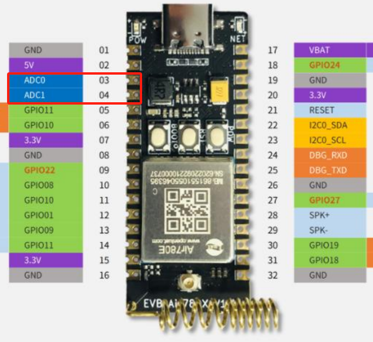
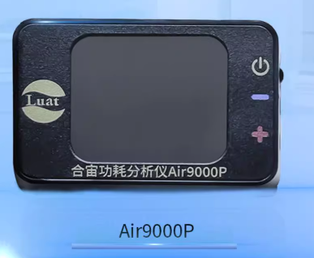
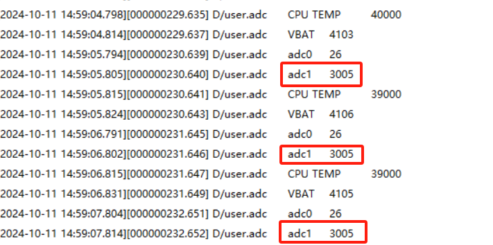
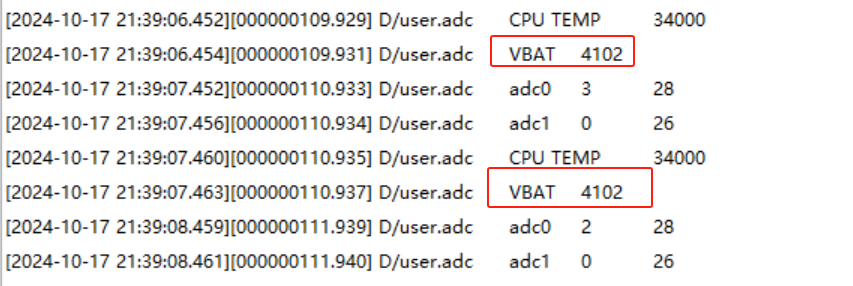
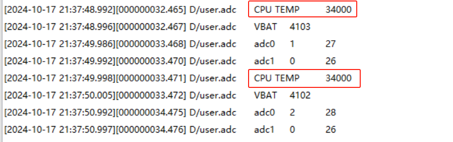

## 一、模数转换(ADC)概述

### 1.1 ADC 简介

ADC 通常指模拟/数字转换器，是指将连续变量的模拟信号转换为离散的数字信号的器件。
合宙 Cat.1 模块 ADC 接口主要用来检测模拟电压信号量，用于电池电压检测，温湿度检测，TDS 检测等应用。

### 1.2 ADC 接口介绍

根据 [Air780E 产品手册](https://docs.openluat.com/air780e/product/)内《 Air780E_硬件设计手册_V1.3.3.pdf 》可知：

1. Air780E 内部 ADC 接口精度为 12bits 外部直流分压为 0-3.4V
2. Air780E 内部具有 2 个 ADC 接口，ADC0 -- AIO3     ADC1 -- AIO4
3. 两个特殊通道, CPU 内部温度 Temp -- adc.CH_CPU   主供电脚电压 VBAT -- adc.CH_VBAT

注意事项：
设置分压(adc.setRange)要在 adc.open 之前设置，否则无效!!
Air780E 内部具有 2 个 ADC 接口，ADC0 和 ADC1，如下图红框所示：



### 1.3 输入电压的范围

Air780E 关闭分压后，量程范围 0~1.1V
注意：外接输入电压切记不可超过量程，否则有烧毁风险！！！

> adc.setRange(adc.ADC_RANGE_1_2) -- air780E 关闭 ADC0,1 分压电阻，范围 0~1.1V
> adc.setRange(adc.ADC_RANGE_3_8) -- air780E 开启 ADC0,1 分压电阻，范围 0~3.2V

## 二、演示功能概述

本章节演示了 Air780E 内部 2 个 ADC 接口，以及 2 个特殊通道：CPU 内部温度 Temp -- adc.CH_CPU   主供电脚电压 VBAT -- adc.CH_VBAT 的使用教程

1. 通过 adc.get()读取 ADC 的外部输入模拟电压
2. 通过 adc.get(adc.CH_VBAT)读取供电电压
3. 通过 adc.get(adc.CH_CPU)读取 CPU 温度

## 三、准备硬件环境

### 3.1 开发板准备

使用 Air780E 核心板，如下图所示：


淘宝购买链接：[Air780E 核心板淘宝购买链接](https://item.taobao.com/item.htm?id=693774140934&pisk=f1eiwOqL25l1_HYiV6D1ize3wN5d5FMjRrpxkx3VT2uIHCCskWm4kysffAEqor4KRRIskGT0ooqi_coq7DWE000qbVr2mmzKQjNtkV3mnoalvaBRelZshA7RyTFdpD4xQco2_VS2Tcnvc89h5lZshq-pu_FUfEDVVdOmgrkET0ir3mkq_MDEmmM2QjJaY2uI0UGAoNueWRjiw4YTC-_opNr-zluaXleFpfR_X2fhTJVn94W--KJ4KcqQreCDEs3zNVh-DyWpIxqEmyc8savgoor7gX2D7GUzmW4jBJS2_4PTWjestFRZqA0iaRlwjdkIgW2nBR7XNkEn7bDL96_tMA4gN4GNOwa0xVU4IX8G4iReapZyhDSYLIOj_DinyhbSB2IHjbEhxMA51foIXaIhxItMPKJlyMjHNEGZAcQR.&spm=a1z10.5-c-s.w4002-24045920841.33.639f1fd1YrS4b6&skuId=5098266470883) ；

此核心板的详细使用说明参考：[Air780E 产品手册](https://docs.openluat.com/air780e/product/) 中的 << 开发板 Core_Air780E 使用说明 VX.X.X.pdf>>，写这篇文章时最新版本的使用说明为：<< 开发板 Core_Air780E 使用说明 V1.0.5.pdf>> ；核心板使用过程中遇到任何问题，可以直接参考这份使用说明 pdf 文档。

### 3.2 数据通信线

USB 转 typeC 数据线一根

### 3.3 PC 电脑

WINDOWS 系统，其他暂无特别要求

### 3.4 直流稳压电源

合宙功耗分析仪 Air9000P，淘宝购买链接：[Air9000P 淘宝购买链接](https://item.taobao.com/item.htm?id=820017234108&pisk=fZtD-X9JpE7XT4Vcd4jjSKL432u8cSs1uCEO6GCZz_55Xr3f6UXw6QMshipNsCARNCbsh1CNsCpwkYnKvK9ffGRi9DnLx3qMOCXV7OorQ9XF_EWBTxpffGlMuFtPhKOF04S5INkl4OXUbG7NguklBOCNbs7aaLWNa18R2J2WgWt-nwC3MeN3z0g9J6JVgKpv4XQ4lKfkPUKPnKCX3VZab3XcohBmhLJckFJCRndIjusvKUSPIhMUS1bH7nIy0boFPN8M_TTSsPfH7KLB2aeauLxGiw-VrJqyUK6w_NYStkBcDUbHmEM_aKRdieSXBJcvEwYlRT7zIrSrMzzUVpr1UAKz5P_VFTfLnXsAwY2cJLDoEygfuT6x9YDu5P_VFTfKEY4Q1ZW5HXC..&spm=a1z10.1-c-s.w4004-24087196161.6.255c1170QukeFS&skuId=5695681155123) ；



## 四、准备软件环境

### 4.1 下载调试工具

使用说明参考：[Luatools 下载和详细使用](https://docs.openluat.com/Luatools/)

### 4.2 源码及固件

1. 底层 core 下载地址：[LuatOS 固件版本下载地址](https://docs.openluat.com/air780e/luatos/firmware/)本 demo 使用的固件是 core_V1112 压缩包内的 LuatOS-SoC_V1112_EC618_FULL.soc

2. 本教程使用的 demo：[https://gitee.com/openLuat/LuatOS-Air780E/tree/master/demo/adc](https://gitee.com/openLuat/LuatOS-Air780E/tree/master/demo/adc)

3. 源码和固件已打包，如下所示：
   > 注：压缩包中 core 文件夹存放固件，code 文件夹存放 demo

[右键点我,另存为,下载完整压缩文件包](file/adc.zip){:target="_blank"}

## 五、模数转换(ADC)软硬件资料

### 5.1 API 接口介绍

本教程使用 api 接口为：[adc - 模数转换 - LuatOS 文档](https://wiki.luatos.com/api/adc.html?highlight=adc)

### 5.2 Air780E 烧录说明

将 Air780E 通过通过 usb 数据线连接电脑，如下图所示：

> 注：
> 1、按住下载模式按键（boot 键）不放，同时再长按开机键开机，这时开发板会进入下载模式，Luatools 下载进度条会开始跑，这时可以松开 boot 按键。直到工具提示下载完成。
> 2、如果，未能成功进入下载模式，而是进入正常开机模式，这时可以按住 boot 键，再短按复位按键，让开发板重启，重新进入下载模式。


如何判断有没有进入下载模式:可以通过 PC 端的设备管理器中虚拟出来的 USB 端口数量来判断

**正常开机模式：**


**下载模式：**


## 六、代码示例介绍

### 6.1 读取 adc 外部输入模拟电压

#### 6.1.1 代码介绍

adc.open()开启 ADC 后，通过 adc.get(1)获取 ADC1 的输入模拟电压值

```lua
adc.setRange(adc.ADC_RANGE_3_8) -- 启用分压
if adc.open(1) then
    log.info("adc", adc.get(1)) --单位为mv
end
```

#### 6.1.2 运行结果展示

> 可以将 adc0/adc1 外接稳压电源供电，注意供电不可超过量程！（本示例启用分压后量程 0~3.2V)
> 本示例将 adc1 输入 3V,查看 luatools 的 log 如下(返回值单位为 mV):

本示例中直流稳压电源使用合宙 Air9000P，淘宝购买链接：[Air9000P 淘宝购买链接](https://item.taobao.com/item.htm?id=820017234108&pisk=fZtD-X9JpE7XT4Vcd4jjSKL432u8cSs1uCEO6GCZz_55Xr3f6UXw6QMshipNsCARNCbsh1CNsCpwkYnKvK9ffGRi9DnLx3qMOCXV7OorQ9XF_EWBTxpffGlMuFtPhKOF04S5INkl4OXUbG7NguklBOCNbs7aaLWNa18R2J2WgWt-nwC3MeN3z0g9J6JVgKpv4XQ4lKfkPUKPnKCX3VZab3XcohBmhLJckFJCRndIjusvKUSPIhMUS1bH7nIy0boFPN8M_TTSsPfH7KLB2aeauLxGiw-VrJqyUK6w_NYStkBcDUbHmEM_aKRdieSXBJcvEwYlRT7zIrSrMzzUVpr1UAKz5P_VFTfLnXsAwY2cJLDoEygfuT6x9YDu5P_VFTfKEY4Q1ZW5HXC..&spm=a1z10.1-c-s.w4004-24087196161.6.255c1170QukeFS&skuId=5695681155123)




### 6.2 读取供电电压

#### 6.2.1 代码介绍

```lua
-- 读取VBAT供电电压, 单位为mV
adc.open(adc.CH_VBAT)
local vbat = adc.get(adc.CH_VBAT)
adc.close(adc.CH_VBAT)
```

#### 6.2.2 运行结果展示

通过下图可以看到，VBAT 端供电电压为 4.1V



### 6.3 读取 CPU 温度

#### 6.3.1 代码介绍

```lua
-- 读取CPU温度, 单位为0.001摄氏度, 是内部温度, 非环境温度
adc.open(adc.CH_CPU)
local temp = adc.get(adc.CH_CPU)
adc.close(adc.CH_CPU)
```

#### 6.3.2 运行结果展示

通过下图可以看到，模组 CPU 温度为 34 摄氏度



## 七、总结

本教程简单举例了如何读取 adc 输入电压、读取供电电压、读取 CPU 温度，除此之外，adc 可以将各种连续变化的模拟信号（如温度、湿度、压力、电压、电流等）转换为离散的数字信号，本模块内部 ADC 精度 12bits,对许多应用已经足够，如温湿度传感器、压力传感器、音频信号处理等，然而对于需要更高精度的应用，可以外挂更高精度的 ADC,如 16 位，24 位等。使用过程中需注意量程范围，不可超出量程。

## 扩展

## 常见问题

1. 为什么 ADC 输入 3V，读取模拟电压只有 1.1V？
   > 未启用分压时，量程最高只能到达 1.1V，若想测量 3V，需启用分压。

2. ADC 测量电压来回跳变，为什么？
   > 看外部输入电压是否与模块共地，保持参考电压一致。

3. adc.read()和 adc.get()要用哪一个？
   > adc.read()返回两个值，一个原始值,一般没用,可以直接抛弃；另一个是从原始值换算得出的实际值，通常单位是 mV。（仅作了解，不建议使用）
   > adc.get()返回的就是计算值，通常单位是 mV，推荐使用这个接口来获取电压值。

## 给读者的话

> 本篇文章由`王世豪`开发；
>
> 本篇文章描述的内容，如果有错误、细节缺失、细节不清晰或者其他任何问题，总之就是无法解决您遇到的问题；
>
> 请登录[合宙技术交流论坛](https://chat.openluat.com/)，点击[文档找错赢奖金-Air780E-LuatOS-软件指南-硬件驱动-ADC](https://chat.openluat.com/#/page/matter?125=1847178504106541057&126=%E6%96%87%E6%A1%A3%E6%89%BE%E9%94%99%E8%B5%A2%E5%A5%96%E9%87%91-Air780E-LuatOS-%E8%BD%AF%E4%BB%B6%E6%8C%87%E5%8D%97-%E7%A1%AC%E4%BB%B6%E9%A9%B1%E5%8A%A8-ADC&askid=1847178504106541057)
>
> 用截图标注+文字描述的方式跟帖回复，记录清楚您发现的问题；
>
> 我们会迅速核实并且修改文档；
>
> 同时也会为您累计找错积分，您还可能赢取月度找错奖金！
