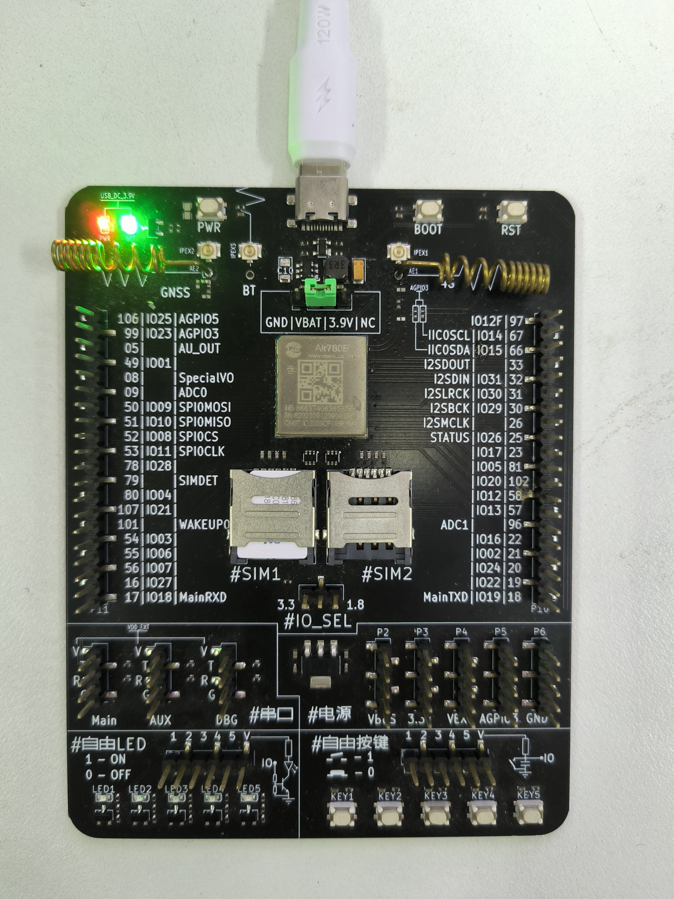
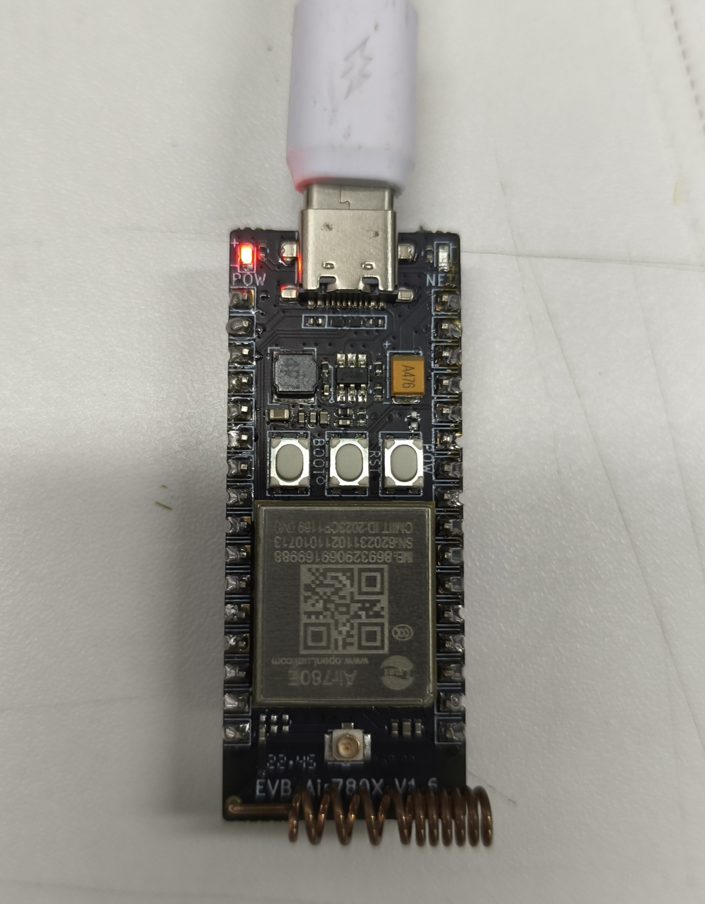

# 硬件准备

1、780E全IO开发板一套，包括天线、数据线和SIM卡。

我们的780E开发板有两种，一种是低功耗验证板，一种是核心板。

他们只有在验证低功耗的时候有区别，其他的没什么区别。

如果使用的是低功耗验证板：

[合宙780E低功耗验证板购买链接](https://item.taobao.com/item.htm?id=724722276597)

[780E低功耗验证板使用说明](https://cdn.openluat-luatcommunity.openluat.com/attachment/20231009103600243_%E5%BC%80%E5%8F%91%E6%9D%BFEVB-Air780E-IO%E4%BD%BF%E7%94%A8%E8%AF%B4%E6%98%8EV1.2.0.pdf)

[780E开发板软硬件资料](https://doc.openluat.com/wiki/21?wiki_page_id=6036)

如果您使用的是780E核心板:

[780E核心板购买链接](https://item.taobao.com/item.htm?spm=a21xtw.29178619.product_shelf.4.568f1170SrSiYY&id=693774140934&pisk=f87wm1a5SPUaI5s14LT2aNqLdM89WUe7_Z9XisfD1dvMCZ6ViQdxmxxmjp4HGpgb6FZvutJFHdt6SZSKu_CA55Lb6FC9kE27FzTV61LYAQh4AZ8HKId0lVvMiCvgYvy7Fzaq8kekr8sXVa4HWpM1-UESUSKzE_phcsyH1QeflpumzbdwjGaJKq2f-C5eh1Vxoqbe_h7b5zlqZhscw3Q1Grup5_SH-I7YZmJ24ib6-N23rHKcmgtVAAV1Et5hHF_3icvlfOThSglmo68NjndwYAyeENChyexQr75hJO1O8sG0oB6WK1QMuzVJ7FvM8BQbpVvVxib6XEHg3KQFtNjV4JHvthX5kGkm0hApTLNUTja5ghUPA9KiDmKHyBJ71CimmYKWTLNT1mnvxCReF5gl.)

[780E核心板开发板使用说明](https://cdn.openluat-luatcommunity.openluat.com/attachment/20240419155721583_%E5%BC%80%E5%8F%91%E6%9D%BFCore_Air780E%E4%BD%BF%E7%94%A8%E8%AF%B4%E6%98%8EV1.0.5.pdf)

[780E开发板软硬件资料](https://doc.openluat.com/wiki/21?wiki_page_id=6036)

