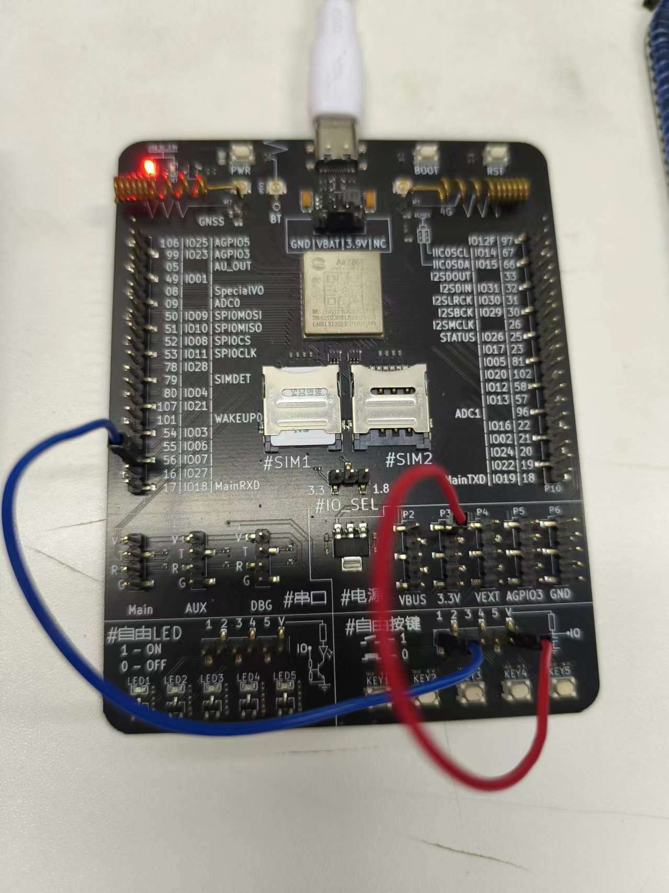

# 输入模式

## 输入模式简介

GPIO的输入模式是指将GPIO配置为接收外部信号的模式。

## 输入模式示例

### 测试demo

[输入模式测试demo](https://gitee.com/openLuat/LuatOS/tree/master/demo/gpio/gpio_irq)

```lua

-- Luatools需要PROJECT和VERSION这两个信息
PROJECT = "gpio2demo"
VERSION = "1.0.0"

log.info("main", PROJECT, VERSION)

-- sys库是标配
_G.sys = require("sys")

if wdt then
    --添加硬狗防止程序卡死，在支持的设备上启用这个功能
    wdt.init(9000)--初始化watchdog设置为9s
    sys.timerLoopStart(wdt.feed, 3000)--3s喂一次狗
end

--配置gpio7为输入模式，上拉，并会触发中断
--请根据实际需求更改gpio编号和上下拉
local gpio_pin = 7
-- 按键防抖函数
gpio.debounce(gpio_pin, 100)
gpio.setup(gpio_pin, function()
    log.info("gpio", "PA10")
end, gpio.PULLUP)

-- 用户代码已结束---------------------------------------------
-- 结尾总是这一句
sys.run()
-- sys.run()之后后面不要加任何语句!!!!!

```
### 硬件连接

如果使用的是全IO板，可以用自带的自由按键。如果是核心板，需要准备一个按键和两个杜邦线。也可以用一个杜邦线短接GND。



### 示例效果展示

每按下一次按键，日志中会打印一次gpio PA10


