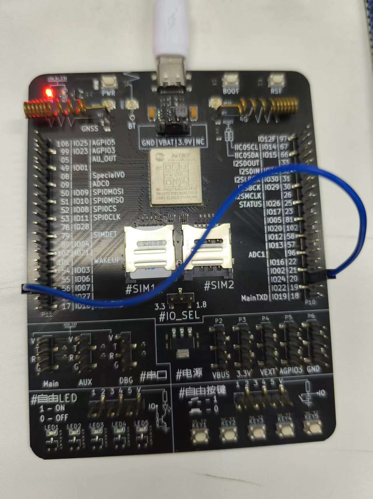
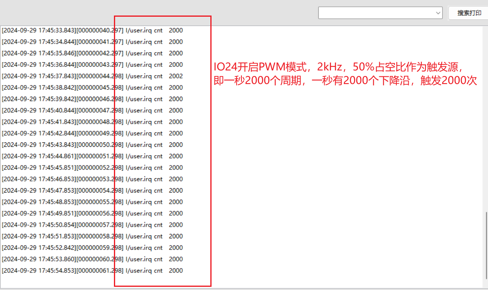

# 中断模式

## 中断简介：

        当GPIO检测到电平变化且满足触发条件时，触发中断，CPU就会暂停当前任务，执行中断回调函数中的内容，当中断回调函数中的内容执行完毕时，再继续执行之前没有执行完的任务。
        除了中断回调方式，还有中断计数模式。中断计数模式时，中断时不回调

## 实现方式

        gpio.set()函数中介绍，当传入的第二个参数是回调函数或gpio.count时，代表中断功能。然后通过设置第三个参数和第四个参数，来确定中断触发的方式。

#### gpio.setup(pin, mode, pull, irq, alt)

设置管脚功能

**参数**

| 传入值类型 | 解释 |
|:----:|:----:|
| int        | pin gpio编号,必须是数值|
| any        | mode 输入输出模式： 数字0/1代表输出模式 nil代表输入模式 function代表中断模式，如果填gpio.count，则为中断计数功能，中断时不回调 |
| int        | pull 上拉下拉模式, 可以是上拉模式 gpio.PULLUP 或下拉模式 gpio.PULLDOWN, 或者开漏模式 0. 需要根据实际硬件选用 |
| int        | irq 中断触发模式,默认gpio.BOTH。中断触发模式 上升沿gpio.RISING 下降沿gpio.FALLING 上升和下降都触发gpio.BOTH |
| int        | alt 复用选项，目前只有EC618平台需要这个参数，有些GPIO可以复用到不同引脚上，可以选择复用选项（0或者4）从而复用到对应的引脚上 |

**返回值**

| 返回值类型 | 解释 |
|:----:|:----:|
| any        | 输出模式返回设置电平的闭包, 输入模式和中断模式返回获取电平的闭包 |

## gpio.count(pin)

获取gpio中断数量，并清空累计值

**参数**

| 传入值类型  | 解释                      |
| ---------- | ------------------------- |
| int        | gpio号, 0~127, 与硬件相关 |

**返回值**

| 返回值类型  | 解释                                  |
| ---------- | ------------------------- |
| int        | 返回从上次获取中断数量后到当前的中断计数 |

## demo示例

此demo实现了检测中断触发次数。

硬件上我们需要找到IO24（PWM通道1），然后将IO7与IO24连接起来：




源demo地址：[gpio_count_irq](https://gitee.com/openLuat/LuatOS/blob/master/demo/gpio/gpio_count_irq/main.lua)

demo内容如下

```lua

-- LuaTools需要PROJECT和VERSION这两个信息
PROJECT = "gpio2demo"
VERSION = "1.0.0"

log.info("main", PROJECT, VERSION)

-- sys库是标配
_G.sys = require("sys")

if wdt then
    --添加硬狗防止程序卡死，在支持的设备上启用这个功能
    wdt.init(9000)--初始化watchdog设置为9s
    sys.timerLoopStart(wdt.feed, 3000)--3s喂一次狗
end

--配置gpio7为输入模式，下拉，并会触发中断
--请根据实际需求更改gpio编号和上下拉
local gpio_pin = 7
gpio.setup(gpio_pin, gpio.count, gpio.PULLUP, gpio.FALLING)
pwm.open(1,2000,50) --2k 50%占空比作为触发源
-- 用户代码已结束---------------------------------------------
-- 结尾总是这一句
sys.taskInit(function()
    while true do
        sys.wait(999)
        log.info("irq cnt", gpio.count(gpio_pin))
    end
end)
sys.run()
-- sys.run()之后后面不要加任何语句!!!!!

```
## 效果展示

每秒获取一次中断触发次数。

